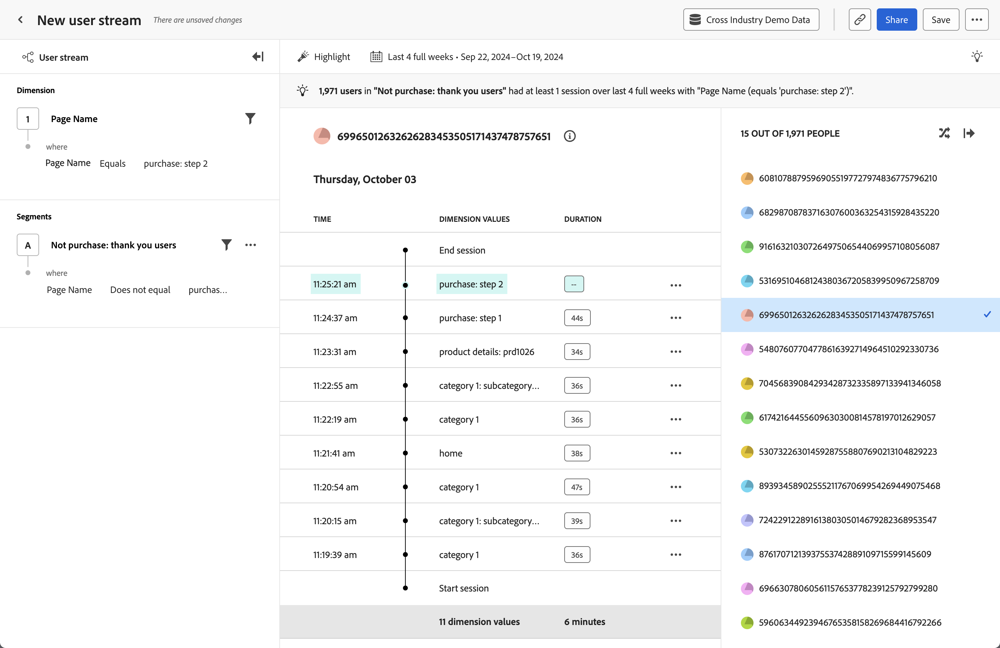

# Análisis de [!UICONTROL escala de tiempo]

El análisis  **[!UICONTROL Cronología]** le permite observar los eventos de sesión a nivel de usuario a lo largo del tiempo para encontrar patrones de experiencia y contar mejores historias de usuario. El carril izquierdo le permite filtrar el flujo por valores de propiedad y segmentos. El carril derecho le permite seleccionar de una lista aleatoria de usuarios que coincidan con los criterios de filtro. El área central muestra el flujo del usuario seleccionado por sesión, que incluye la marca de tiempo, los valores de propiedad y la duración. La duración no está disponible para el último evento de una sesión determinada.

>[!NOTE]
>
>El análisis [!UICONTROL Timeline] requiere que el componente estándar **[!UICONTROL ID de persona]** esté disponible en la [vista de datos](/help/data-views/component-reference.md#optional). El administrador del Customer Journey Analytics administra la inclusión del ID de persona en una vista de datos, lo que proporciona a su organización un control de privacidad completo sobre quién puede acceder a estos datos.
> Si una vista de datos no tiene agregado el componente [!UICONTROL ID de persona], se mostrará el siguiente mensaje:
>
>* **Administradores**: *La propiedad PersonID es necesaria para este análisis. Agregue el ID de persona a la vista de datos.*
>* **No administradores**: *La propiedad PersonID es necesaria para este análisis. Trabaje con el administrador del Customer Journey Analytics para agregar el ID de persona a la vista de datos.*

>[!VIDEO](https://video.tv.adobe.com/v/3427810/?learn=on)

## Casos prácticos

Los casos de uso de este análisis incluyen:

* **Exploración de fricción**: Si encuentra una caída pronunciada en el análisis [Análisis de canal](funnel.md), puede crear un segmento de esos usuarios y aplicar el segmento en este análisis para investigar posibles causas.
* **Comportamiento del error**: Si los usuarios encuentran un error en el producto, puede explorar qué hacían antes o después de ver ese error.
* **Validación de recopilación de datos**: los administradores de datos pueden filtrar este análisis a su propio ID de persona para validar que la implementación de su organización funcione según lo esperado.

## Interfaz

Consulte [Interfaz](../overview.md#interface) para obtener una descripción general de la interfaz de análisis guiado. Las siguientes configuraciones son específicas de este análisis:

### Carril de consulta

El carril de consulta permite configurar los siguientes componentes:

* **[!UICONTROL Dimension]**: Dimensión para la que desea ver valores de flujo continuo. El flujo en el centro muestra los valores de la dimensión seleccionada. También puede aplicar filtros para reducir el flujo a datos más relevantes. Los operadores válidos para el filtro incluyen [!UICONTROL Es igual a], [!UICONTROL No es igual a], [!UICONTROL Comienza con], [!UICONTROL Finaliza con], [!UICONTROL Contiene], [!UICONTROL No contiene], [!UICONTROL Existe] y [!UICONTROL No existe].
* **[!UICONTROL Segmentos]**: El segmento que desea analizar. El segmento seleccionado filtra los datos para centrarse únicamente en las personas que coinciden con los criterios del segmento. Si desea reducir el análisis a un ID de persona específico, puede filtrar a ese ID de persona en el panel derecho. Se admite un segmento para este análisis.

### Ajustes del gráfico

El análisis [!UICONTROL Cronología] ofrece la siguiente configuración de gráfico, que se puede ajustar en el menú situado encima del gráfico:

* **[!UICONTROL Mostrar como]**: muestra los valores de propiedad deseados.
   * [!UICONTROL Mostrar todo]: mostrar todos los valores de propiedad en una sesión.
   * [!UICONTROL Resaltar]: resalta visualmente los valores de propiedad en una sesión que coinciden con los filtros de consulta.
   * [!UICONTROL Solo vista]: mostrar solo los valores de propiedad en una sesión que coincidan con los filtros de consulta.

### Intervalo de fechas

El intervalo de fechas deseado para el análisis. Esta configuración consta de dos componentes:

* **[!UICONTROL Intervalo]**: La granularidad de fecha por la que desea ver datos de tendencia. Esta configuración no afecta a los análisis sin tendencias, como Cronología.
* **[!UICONTROL Fecha]**: La fecha de inicio y finalización. Los ajustes preestablecidos de intervalo de fechas móviles y los intervalos personalizados guardados anteriormente están disponibles para su comodidad, o puede utilizar el selector de calendario para elegir un intervalo de fechas fijo.

## Ejemplo

Consulte a continuación un ejemplo del análisis.

