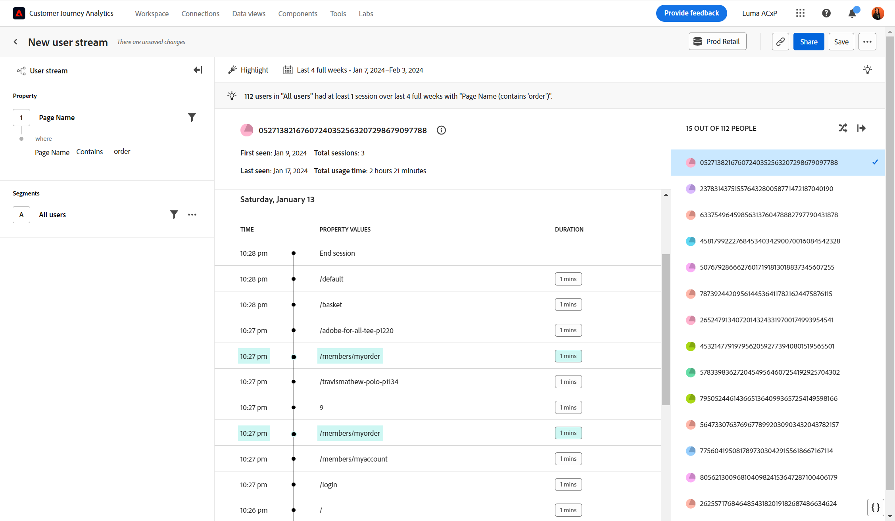

# [!UICONTROL Cronología] vista

El **[!UICONTROL Cronología]** La vista de permite observar eventos de sesión de nivel de usuario a lo largo del tiempo para encontrar patrones de experiencia y contar mejores historias de usuario. El carril izquierdo le permite filtrar el flujo por valores de propiedad y segmentos. El carril derecho le permite seleccionar de una lista aleatoria de usuarios que coincidan con los criterios de filtro. El área central muestra el flujo del usuario seleccionado por sesión, que incluye la marca de tiempo, los valores de propiedad y la duración. La duración no está disponible para el último evento de una sesión determinada.

{style="border:1px solid gray"}

>[!NOTE]
>
>La vista Cronología requiere que la variable **[!UICONTROL ID de persona]** componente estándar debe estar disponible en el [vista de datos](/help/data-views/component-reference.md#optional). El administrador del Customer Journey Analytics administra la inclusión del ID de persona en una vista de datos, lo que proporciona a su organización un control de privacidad completo sobre quién puede acceder a estos datos.

Si una vista de datos no tiene [!UICONTROL ID de persona] componente añadido, se muestra el siguiente mensaje:

* **Administradores**: *La propiedad PersonID es necesaria para este análisis. Añada un ID de persona a la vista de datos.*
* **No administradores**: *La propiedad PersonID es necesaria para este análisis. Póngase en contacto con el administrador del Customer Journey Analytics para agregar el ID de persona a la vista de datos.*

## Casos prácticos

Los casos de uso para este tipo de vista incluyen:

* **Exploración por fricción**: Si encuentra una caída pronunciada en el [Fricción](friction.md) , puede crear un segmento de esos usuarios y aplicarlo en esta vista para investigar posibles causas.
* **Comportamiento del error**: Si los usuarios encuentran un error de producto, puede explorar qué estaban haciendo antes o después de ver ese error.
* **Validación de recopilación de datos**: los administradores de datos pueden filtrar esta vista con su propio ID de persona para validar que la implementación de su organización funciona según lo esperado.

## Carril de consulta

El carril de consulta permite configurar los siguientes componentes:

* **[!UICONTROL Propiedad]**: propiedad para la que desea ver los valores de flujo. La secuencia en el centro muestra los valores de la propiedad seleccionada. También puede aplicar filtros para reducir el flujo a datos más relevantes. Los operadores válidos para el filtro incluyen [!UICONTROL Igual a], [!UICONTROL No es igual a], [!UICONTROL Comienza por], [!UICONTROL Finaliza con], [!UICONTROL Contains], [!UICONTROL Does not contain], [!UICONTROL Existe], y [!UICONTROL No existe].
* **[!UICONTROL Segmentos]**: El segmento que desea analizar. El segmento seleccionado filtra los datos para centrarse únicamente en las personas que coinciden con los criterios del segmento. Si desea reducir la vista a un ID de persona específico, puede filtrar a ese ID de persona aquí. Se admite un segmento para esta vista.

## Ajustes del gráfico

El [!UICONTROL Cronología] La vista ofrece la siguiente configuración de gráfico, que se puede ajustar en el menú situado encima del gráfico:

* **[!UICONTROL Mostrar como]**: Muestra los valores de propiedad deseados.
   * [!UICONTROL Mostrar todo]: muestra todos los valores de propiedad en una sesión.
   * [!UICONTROL Resaltar]: resalta visualmente los valores de propiedad en una sesión que coinciden con los filtros de consulta.
   * [!UICONTROL Solo vista]: Mostrar solo los valores de propiedad en una sesión que coincidan con los filtros de consulta.

## Intervalo de fechas

El intervalo de fechas deseado para el análisis. Esta configuración consta de dos componentes:

* **[!UICONTROL Intervalo]**: La granularidad de fecha por la que desea ver los datos de tendencia. Esta configuración no afecta a las vistas sin tendencias, como Cronología.
* **[!UICONTROL Fecha]**: la fecha de inicio y finalización. Los ajustes preestablecidos de intervalo de fechas móviles y los intervalos personalizados guardados anteriormente están disponibles para su comodidad, o puede utilizar el selector de calendario para elegir un intervalo de fechas fijo.
