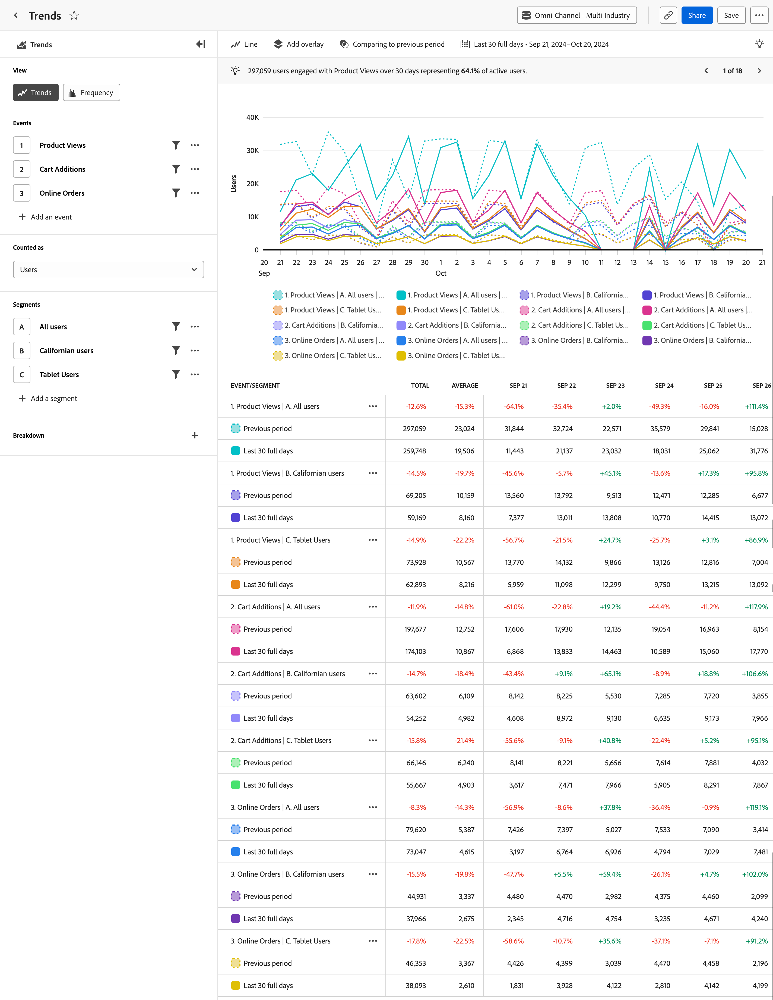

# Análisis de [!UICONTROL tendencias] {#trends}

<!-- markdownlint-disable MD034 -->

>[!CONTEXTUALHELP]
>id="workspace_guidedanalysis_trends_button"
>title="Tendencias"
>abstract="Mida la participación del usuario a lo largo del tiempo."

<!-- markdownlint-enable MD034 -->

El análisis  **[!UICONTROL Tendencias]** proporciona información valiosa sobre el rendimiento del producto o el comportamiento de los usuarios a lo largo del tiempo. El eje horizontal de este informe es un intervalo de tiempo, mientras que el eje vertical mide los eventos deseados.

>[!VIDEO](https://video.tv.adobe.com/v/3421666/?quality=12&learn=on)

## Casos prácticos

Los casos de uso de este análisis incluyen:

* **Evaluar el rendimiento del producto**: las tendencias permiten evaluar el rendimiento general del producto durante un período determinado. Al analizar métricas como la participación del usuario, la adopción o las tasas de conversión, puede identificar si el rendimiento del producto mejora, se estanca o disminuye.
* **Adopción de funciones**: las tendencias le permiten comprender cómo adoptan los usuarios las nuevas características o actualizaciones que usted publique. Puede determinar qué funciones son populares y qué funciones requieren mejora. Esta información le permite tomar decisiones basadas en datos sobre qué funciones debe priorizar los esfuerzos de desarrollo.
* **Comportamiento del usuario**: las tendencias pueden proporcionar una perspectiva del comportamiento del usuario a lo largo del tiempo. Al examinar las acciones específicas que realizan los usuarios, puede identificar patrones en los que estos podrían abandonar. Puede combinar información de este análisis con [Canal](funnel.md) para obtener aún más información sobre el comportamiento.
* **Pruebas A/B y experimentación**: si ejecuta pruebas A/B en su producto, puede usar Tendencias para medir qué pruebas son las más exitosas a lo largo del tiempo.

## Interfaz

Consulte [Interfaz](../overview.md#interface) para obtener información general sobre la interfaz de análisis guiado. Las siguientes configuraciones son específicas de este análisis:

### Carril de consulta

El carril de consulta permite configurar los siguientes componentes:

* **[!UICONTROL Vista]**: cambie entre este análisis y [Frecuencia](frequency.md).
* **[!UICONTROL Eventos]**: los eventos o las métricas que desea medir. Cada selección se representa como una serie de gráficos y una fila de la tabla. Los eventos y las métricas no se pueden combinar en la consulta. Una vez que haya realizado la primera selección, las selecciones de consulta restantes deben ser del mismo tipo. Puede incluir hasta cinco selecciones.
* **[!UICONTROL Contabilizado como]**: método de contabilización que desea aplicar a los eventos seleccionados. <ul><li>Las **[!UICONTROL opciones]** incluyen [!UICONTROL Usuarios], [!UICONTROL Eventos], [!UICONTROL Sesiones], [!UICONTROL Porcentaje de usuarios], [!UICONTROL Eventos por sesión] y [!UICONTROL Eventos por usuario].</li><li>[!BADGE B2B edition]{type=Informative url="https://experienceleague.adobe.com/en/docs/analytics-platform/using/cja-overview/cja-b2b/cja-b2b-edition" newtab=true tooltip="Customer Journey Analytics B2B edition"} Hay **[!UICONTROL opciones B2B]** adicionales disponibles para Customer Journey Analytics B2B edition: [!UICONTROL Cuentas globales], [!UICONTROL Cuentas], [!UICONTROL Grupos de compras], [!UICONTROL Oportunidades], [!UICONTROL Porcentaje de cuentas globales], [!UICONTROL Porcentaje de cuentas], [!UICONTROL Porcentaje de grupos de compras], [!UICONTROL Porcentaje de oportunidades], [!UICONTROL Eventos por global cuenta], [!UICONTROL Eventos por cuenta], [!UICONTROL Eventos por grupo comprador] y [!UICONTROL Eventos por oportunidad].</li></ul>Las opciones de Contabilizado como solo son aplicables a las consultas de evento y se eliminan para las consultas de métricas.
* **[!UICONTROL Segmentos]**: los segmentos que desea medir. Cada segmento seleccionado duplica el número de series de gráficos y filas de tabla. Puede incluir hasta cinco autores.
* **[!UICONTROL Propiedad de desglose]**: desglosa la serie de gráficos y las filas de tabla según los valores de la propiedad seleccionada. Se admite una sola propiedad de desglose. Los 20 valores principales aparecen en la tabla y se pueden ver hasta 10 valores en el gráfico. Puede ocultar o exponer una fila del gráfico alternando el icono .

### Configuración del gráfico

El análisis de [!UICONTROL Tendencias] ofrece la siguiente configuración de gráfico, que se puede ajustar en el menú situado encima del gráfico:

* **[!UICONTROL Tipo de gráfico]**: el tipo de visualización que desea utilizar. Las opciones incluyen Línea, Barra, Barra apilada y Área apilada.

### Superposiciones

Añada datos adicionales al gráfico. Cuando hay más de una serie visible en el gráfico, las superposiciones solo aparecen al pasar el puntero por encima.

* **[!UICONTROL Detección de anomalías]**: ejecuta [detección de anomalías](/help/analysis-workspace/c-anomaly-detection/anomaly-detection.md) en el análisis de tendencias. Los periféricos aparecen como puntos sobre los que puede pasar el puntero por encima para obtener más información.
* **[!UICONTROL Superposición de línea de tendencia]**: añade una línea de tendencia al gráfico, lo que ayuda a mostrar un patrón más claro en los datos.
   * [!UICONTROL Lineal]: crea una línea de regresión recta. Ideal para datos lineales simples que aumentan o disminuyen a una velocidad constante. Ecuación: `y = a + b * x`
   * [!UICONTROL Logarítmico]: crea una línea de regresión curva. Ideal para datos que aumentan o disminuyen rápidamente y luego se vuelven más nivelados. Ecuación: `y = a + b * log(x)`
   * [!UICONTROL Promedio móvil]: crea una línea de tendencia suave basada en un conjunto de promedios. Un promedio móvil utiliza una cantidad determinada de puntos de datos (definidos por su selección), los promedia y utiliza el promedio como punto de la línea. Algunos ejemplos son un promedio móvil de siete días o un promedio móvil de cuatro semanas. Las opciones de promedio móvil disponibles dependen del intervalo y el intervalo de fechas seleccionados.

### Comparación del tiempo

{{apply-time-comparison}}

### Intervalo de fechas

El intervalo de fechas deseado para el análisis. Esta configuración consta de dos componentes:

* **[!UICONTROL Intervalo]**: la granularidad de la fecha por la que desea ver los datos de tendencias. Las opciones válidas incluyen Por hora, Diario, Semanal, Mensual y Trimestral. El mismo intervalo de fechas puede tener diferentes intervalos que afectan al número de puntos de datos del gráfico y al número de columnas de la tabla. Por ejemplo, si se ve un análisis que abarca tres días con granularidad diaria, solo se mostrarían tres puntos de datos, mientras que un análisis que abarca tres días con granularidad horaria, mostraría 72 puntos de datos.
* **[!UICONTROL Fecha]**: la fecha de inicio y finalización. Los ajustes preestablecidos de intervalo de fechas móviles y los intervalos personalizados guardados anteriormente están disponibles para su comodidad, o puede utilizar el selector de calendario para elegir un intervalo de fechas fijo.

<!--

## Example

See below for an example of the analysis.

-->