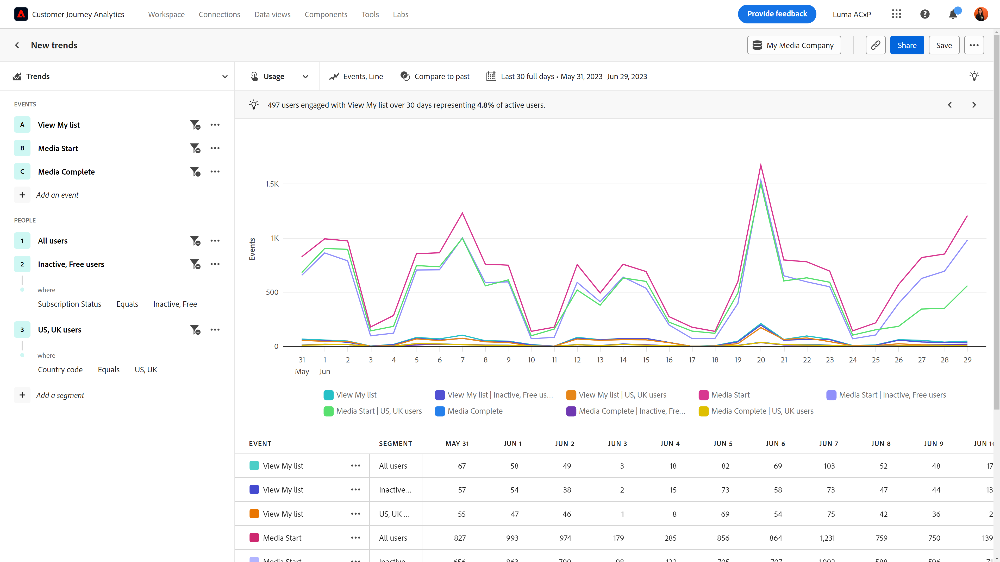
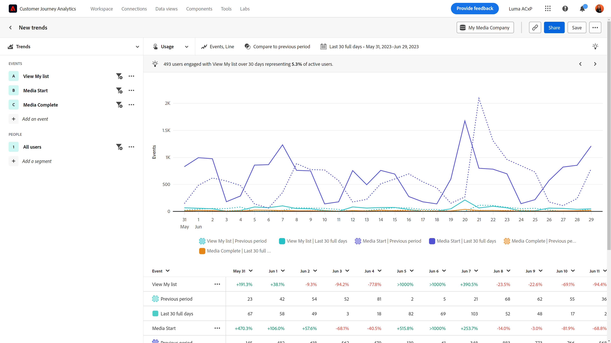

# Uso

{{release-limited-testing}}

El **Uso** La vista de proporciona una valiosa perspectiva del rendimiento del producto o del comportamiento de los usuarios a lo largo del tiempo. El eje horizontal de este informe es un intervalo de tiempo, mientras que el eje vertical mide los eventos deseados. Los casos de uso para este tipo de vista incluyen:

* **Evaluar el rendimiento del producto**: las tendencias permiten evaluar el rendimiento general del producto durante un periodo determinado. Al analizar métricas como la participación del usuario, la adopción o las tasas de conversión, puede identificar si el rendimiento del producto mejora, se estanca o disminuye.
* **Adopción de funciones**: las tendencias le permiten comprender cómo adoptan los usuarios las nuevas funciones o actualizaciones que usted publique. Puede determinar qué funciones son populares y qué funciones requieren mejora. Esta información le permite tomar decisiones basadas en datos sobre qué funciones priorizar los esfuerzos de desarrollo.
* **Comportamiento del usuario**: las tendencias pueden proporcionar una perspectiva del comportamiento del usuario a lo largo del tiempo. Al examinar las acciones específicas que realizan los usuarios, puede identificar patrones en los que estos pueden abandonarlos. Puede combinar perspectivas de esta vista con [Fricción](friction.md) para obtener aún más información sobre el comportamiento.
* **Pruebas y experimentación A/B**: si ejecuta pruebas A/B en su producto, puede utilizar Tendencias para medir qué pruebas son las más exitosas con el paso del tiempo.

## Carril de consulta

El carril de consulta permite configurar los siguientes componentes:

* **Eventos**: los eventos que desea medir. Cada evento seleccionado se representa como una línea de color o como un conjunto de barras, según el tipo de gráfico. Se agrega a la tabla una fila que representa el evento de tendencias. Se pueden incluir hasta cinco eventos.
* **People**: Los segmentos que desea medir. Cada segmento seleccionado duplica el número de líneas del gráfico y las filas de la tabla. Se pueden incluir hasta cinco segmentos.

## Ajustes del gráfico

La vista Uso ofrece la siguiente configuración de gráfico, que se puede ajustar en el menú situado encima del gráfico:

* **Métrica**: La métrica que desea medir. Las opciones incluyen Eventos, Sesiones, Usuarios, Eventos por sesión y Eventos por usuario.
* **Tipo de gráfico**: el tipo de visualización que desea utilizar. Las opciones incluyen Línea, Barra, Barra apilada y Área apilada.

## Aplicar comparación de tiempo

{{apply-time-comparison}}

## Intervalo de fechas

El intervalo de fechas deseado para el análisis. Esta configuración consta de dos componentes:

* **Intervalo**: La granularidad de fecha por la que desea ver los datos de tendencias. Las opciones válidas incluyen Por hora, Diario, Semanal, Mensual y Trimestral. El mismo intervalo de fechas puede tener diferentes intervalos que afectan al número de puntos de datos del gráfico y al número de columnas de la tabla. Por ejemplo, si se ve un análisis que abarca tres días con granularidad diaria, solo se mostrarían tres puntos de datos, mientras que un análisis que abarca tres días con granularidad horaria, mostraría 72 puntos de datos.
* **Fecha**: la fecha de inicio y finalización. Los ajustes preestablecidos de intervalo de fechas móviles y los intervalos personalizados guardados anteriormente están disponibles para su comodidad, o puede utilizar el selector de calendario para elegir un intervalo de fechas fijo.
