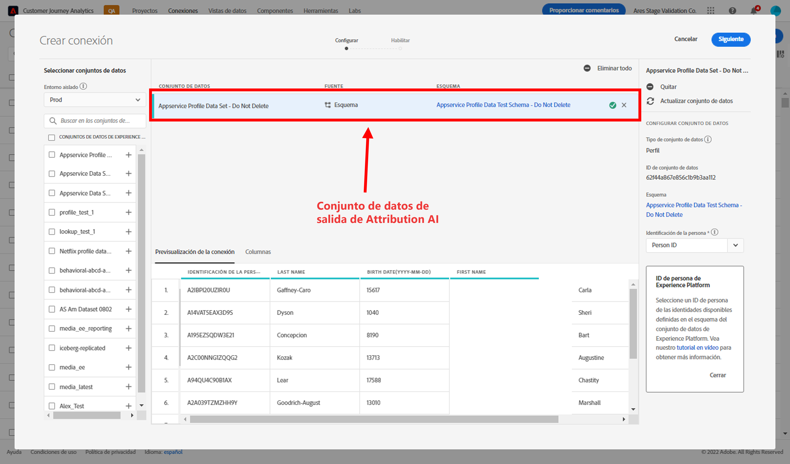

# Integración de la inteligencia artificial aplicada a la atribución con CJA

[Inteligencia artificial aplicada a la atribución](https://experienceleague.adobe.com/docs/experience-platform/intelligent-services/attribution-ai/overview.html?lang=es), como parte de Adobe Experience Platform Intelligent Services, es un servicio de atribución algorítmica de varios canales que calcula la influencia y el impacto incremental de las interacciones de los clientes con los resultados especificados. Con Inteligencia artificial aplicada a la atribución, los especialistas en marketing pueden medir y optimizar el gasto en marketing y publicidad al comprender el impacto de cada interacción individual con los clientes en cada fase de los recorridos de los clientes.

La inteligencia artificial aplicada a la atribución se integra con Customer Journey Analytics (CJA) hasta el punto que la inteligencia artificial aplicada a la atribución ejecuta modelos con puntos de contacto de marketing de los clientes y fuentes de datos de conversión. A continuación, CJA importa la salida de esos modelos como un conjunto de datos o se puede integrar con el resto de los conjuntos de datos de CJA. Los conjuntos de datos habilitados para Attribution AI se pueden aprovechar en las vistas de datos y los informes en CJA.

Inteligencia artificial aplicada a la atribución admite 3 esquemas de Experience Platform: Evento de experiencia, Adobe Analytics y Evento de experiencia del consumidor.

Inteligencia artificial aplicada a la atribución admite dos categorías de puntuaciones: algorítmica y basada en reglas.

## Puntuaciones algorítmicas

Las puntuaciones algorítmicas incluyen puntuaciones incrementales e influenciadas.

* Las **[!UICONTROL puntuaciones] influenciadas** dividen el 100 % del crédito de conversión entre los canales de marketing.
* Las **[!UICONTROL puntuaciones] incrementales** tienen en cuenta en primer lugar una línea de base de conversión que habría alcanzado incluso sin marketing. Esta línea de base depende de las observaciones de IA sobre patrones, estacionalidad, etc., debido al reconocimiento de marca, la lealtad y el boca a boca existente. El crédito restante se divide entre los canales de marketing.

## Puntuaciones basadas en reglas

Las puntuaciones basadas en reglas incluyen

* **[!UICONTROL Primer contacto]**: otorga un 100 % de crédito al punto de contacto que se ve por primera vez en la ventana retrospectiva de atribución.
* **[!UICONTROL Último contacto]**: otorga un 100 % de crédito al punto de contacto que se produce más recientemente antes de la conversión.
* **[!UICONTROL Lineal]**: otorga el mismo crédito a cada punto de contacto que se visualice y que conduzca a una conversión.
* **[!UICONTROL En forma de U]**: otorga un 40 % de crédito a la primera interacción, un 40 % de crédito a la última interacción y divide el 20 % restante entre los puntos de contacto intermedios. Para las conversiones con un solo punto de contacto, se otorga un 100% de crédito. Para las conversiones con dos puntos de contacto, se otorga un 50% de crédito a ambos.
* **[!UICONTROL Declive temporal]**: sigue un declive exponencial con un parámetro de semivida personalizado, en el que el valor predeterminado es de 7 días. El valor de cada canal depende de la cantidad de tiempo que transcurra entre el inicio del punto de contacto y la conversión final. La fórmula utilizada para determinar el crédito es `2^(-t/halflife)`, donde `t` es la cantidad de tiempo entre un punto de contacto y una conversión. A continuación, todos los puntos de contacto se normalizan al 100%.

## Flujo de trabajo

Algunos de los pasos se realizan en Adobe Experience Platform antes de trabajar con la salida en CJA. El resultado consiste en un conjunto de datos en el que se ha aplicado un modelo de inteligencia artificial aplicada a la atribución.

### Paso 1: Crear una instancia de inteligencia artificial aplicada a la atribución

En Experience Platform, cree una instancia de Inteligencia artificial aplicada a la atribución seleccionando y asignando datos, definiendo eventos y formando los datos, como se describe [aquí](https://experienceleague.adobe.com/docs/experience-platform/intelligent-services/attribution-ai/user-guide.html?lang=es).

### Paso 2: Configurar una conexión de CJA en conjuntos de datos de inteligencia artificial aplicada a la atribución

En CJA, ahora puede [crear una o más conexiones](/help/connections/create-connection.md) a conjuntos de datos de Experience Platform que se han instrumentado para la inteligencia artificial aplicada a la atribución. Estos conjuntos de datos aparecen con el prefijo “Puntuaciones de inteligencia artificial aplicada a la atribución”, como se muestra a continuación:

### Paso 3: Crear vistas de datos en función de estas conexiones

En CJA, [cree una o más vistas de datos](/help/data-views/create-dataview.md) que contengan los campos XDM de inteligencia artificial aplicada a la atribución.

Estos son los campos de esquema de XDM para los puntos de contacto:

Y estos son los campos de esquema de XDM para la conversión:

### Paso 4: Informar sobre los datos de inteligencia artificial aplicada a la atribución en el espacio de trabajo de CJA

En un proyecto del Espacio de trabajo de CJA, puede extraer métricas como, por ejemplo, “Pedidos de AAI” y dimensiones como “Nombre de la campaña de AAI” o “Canal de marketing de AAI”.

El resultado de puntuación en bruto en AAI tiene un esquema anidado, en el que la ruta a los campos puede ser lo suficientemente larga como para ocupar la mayoría de los espacios en tablas o visualizaciones. Para mayor concisión, el [!UICONTROL Nombre para mostrar] se genera automáticamente y se aprovecha en CJA siguiendo las siguientes reglas:

* Todos los campos tienen un prefijo “AAI”
* Para campos de punto de contacto:
   * Para los campos que forman parte de la puntuación XDM, aparecen en CJA como `AAI T {field name}`
   * Para los campos que se incluyen como columna passThrough, aparecerán en CJA como `AAI T PT {field name}`
* Para los campos de conversión:
   * Para los campos que forman parte de la puntuación XDM, aparecerán en CJA como `AAI C {field name}`
   * Para los campos que se incluyen como columna passThrough, aparecerán en CJA como `AAI C PT {field name}`

**Pedidos con puntuaciones influenciadas e incrementales**

Aquí vemos un proyecto del Espacio de trabajo con datos de AAI que muestra pedidos con puntuaciones influenciadas e incrementales. Desglóselo hasta cualquier dimensión para comprender la atribución por: campaña, grupo de productos, segmento de usuarios, ubicación geográfica, etc.

**Rendimiento de marketing**

Compare y contraste la atribución de puntos de contacto entre diferentes modelos de atribución:

**Interacción con el canal**

Comprenda la interacción con el canal para ver qué canal se puede utilizar de manera más eficaz con otros canales mediante un diagrama de Venn:

**Rutas principales a la conversión**

Esta tabla muestra las rutas principales a la conversión (desduplicadas) para ayudarle a diseñar y optimizar los puntos de contacto:

**Tiempo de espera para la conversión**

Aquí, vemos el tiempo de espera para la conversión cuando un punto de contacto está en mix. Ayuda a optimizar el tiempo de espera:

## Diferencias entre las capacidades de atribución de Attribution AI y CJA

La siguiente tabla muestra algunas de las diferencias en la funcionalidad:

| Funcionalidad | Inteligencia artificial aplicada a la atribución | Atribución de CJA |
| --- | --- | --- |
| ¿La atribución incremental? | Sí | No |
| Permite a los usuarios ajustar el modelo | Sí | Sí |
| Hace atribución entre canales (Nota: AAI no utiliza los mismos datos enlazados que CJA). | Sí | Sí |
| Incluye puntuaciones influenciadas | Sí | Sí |
| Modelado ML | Sí | Sí |
| Modelos de atribución basados en regiones | Sí | Sí |
| Puede configurar los puntos de contacto de marketing del modelo | Sí | No |

{style="table-layout:auto"}
