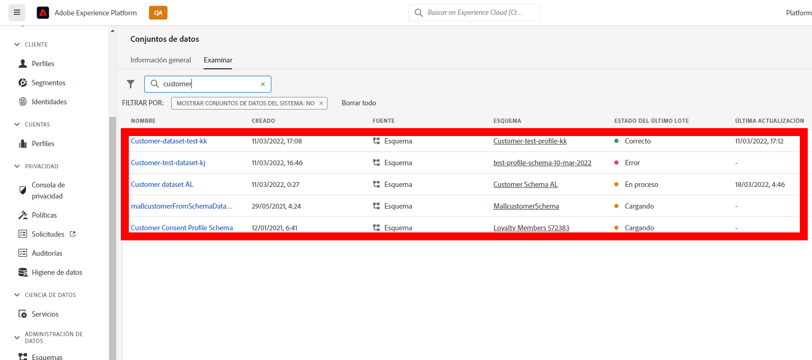
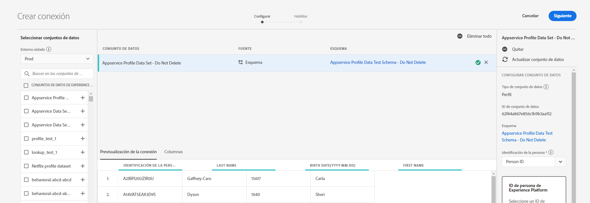
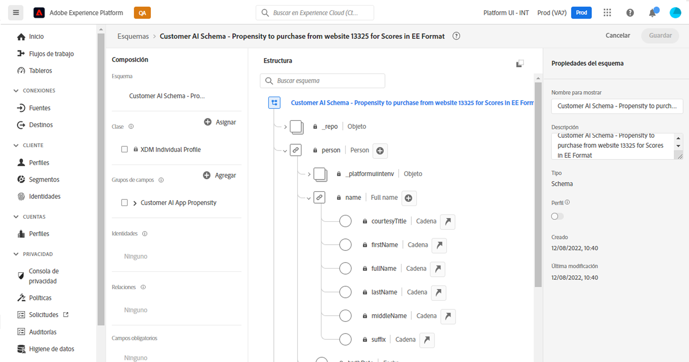
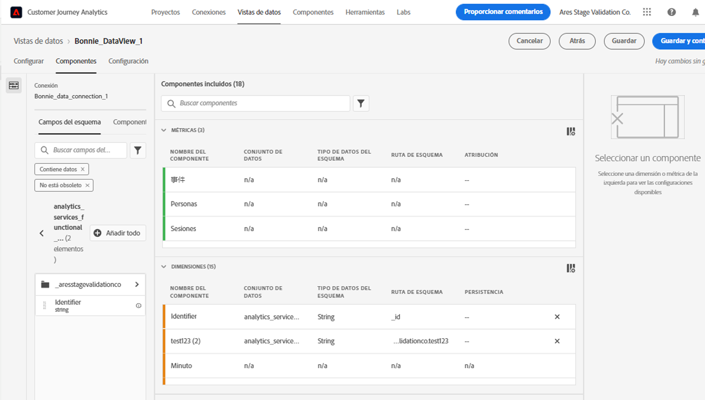
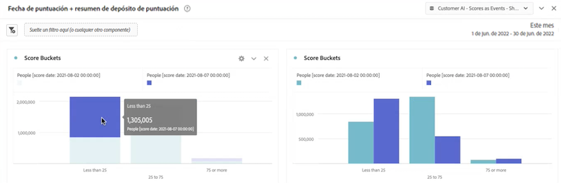
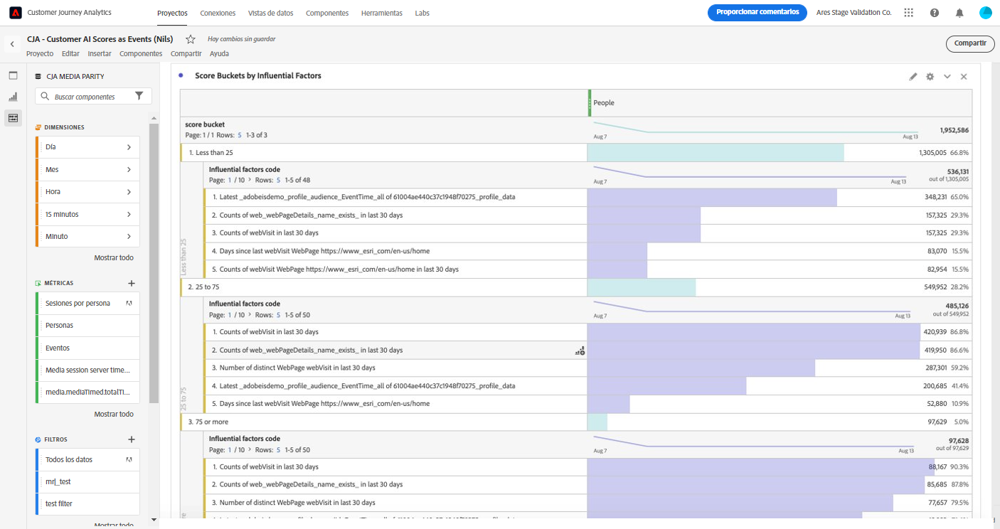
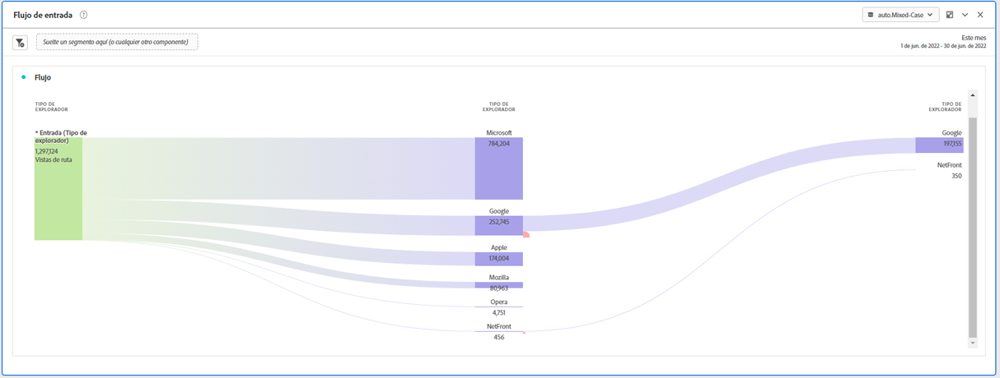
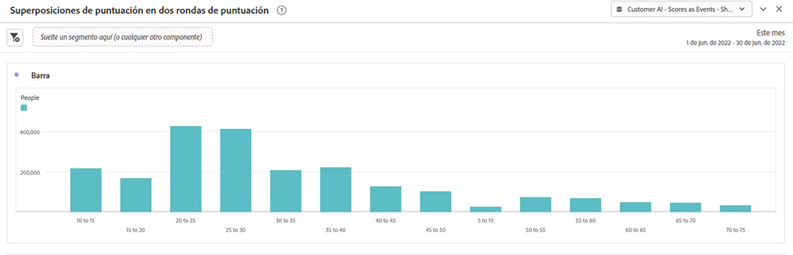
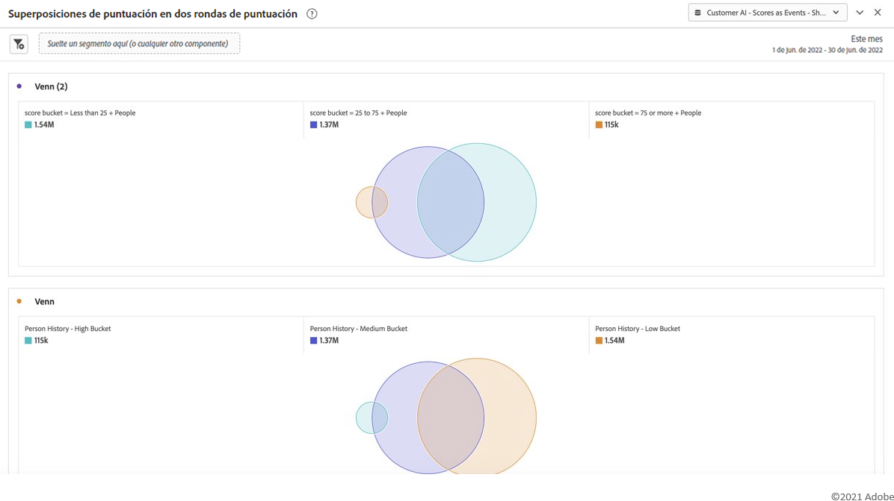

# Integración de datos de Customer AI con CJA

>[!NOTE]
>
>Esta funcionalidad se encuentra actualmente en [pruebas limitadas](/help/release-notes/releases.md) y no está disponible de forma general.

La [inteligencia artificial aplicada al cliente](https://experienceleague.adobe.com/docs/experience-platform/intelligent-services/customer-ai/overview.html?lang=es), como parte de los servicios inteligentes de Adobe Experience Platform, proporciona a los expertos en marketing la capacidad de generar predicciones sobre clientes a nivel individual.

Con la ayuda de factores influyentes, la inteligencia artificial aplicada al cliente puede indicarle qué es lo más probable que haga un cliente y por qué. Además, los expertos en marketing pueden beneficiarse de las predicciones y perspectivas de la inteligencia artificial aplicada al cliente para personalizar las experiencias de los clientes y ofrecerles las ofertas y los mensajes más adecuados.

La inteligencia artificial aplicada al cliente se basa en datos de comportamiento individuales y en datos de perfil para la puntuación de tendencia. La inteligencia artificial aplicada al cliente es flexible, ya que puede incorporar varias fuentes de datos, como Adobe Analytics, Adobe Audience Manager, datos de evento de experiencias del consumidor y datos de evento de experiencias. Si utiliza el conector de la fuente Experience Platform para introducir datos de Adobe Audience Manager y Adobe Analytics, el modelo recoge automáticamente los tipos de evento estándar para entrenar y puntuar el modelo. Si introduce su propio conjunto de datos de evento de experiencias sin tipos de evento estándar, los campos relevantes deberán asignarse como eventos personalizados o atributos de perfil si desea usarlos en el modelo. Esto se puede hacer en el paso de configuración de la inteligencia artificial aplicada al cliente en Experience Platform. &#x200B;

La inteligencia artificial aplicada al cliente se integra con Customer Journey Analytics (CJA) en el sentido que los conjuntos de datos habilitados para inteligencia artificial aplicada al cliente se pueden aprovechar en las vistas de datos y los informes de CJA. Con esta integración, puede

* **Rastrear puntuaciones de tendencia para un segmento de usuarios a lo largo del tiempo**. Ejemplo de caso de uso: ¿Cuál es la probabilidad de que un cliente del hotel compre un billete de show en la sala de conciertos del hotel?
* **Analizar qué eventos o atributos de éxito están asociados con puntuaciones de tendencia**. &#x200B;Ejemplo de caso de uso: quiero comprender los atributos o los eventos de éxito asociados con las puntuaciones de tendencia.
* **Seguir el flujo de entrada para la tendencia del cliente sobre diferentes ejecuciones de puntuación**. Ejemplo de caso de uso: Me gustaría entender a las personas que inicialmente eran usuarios de baja propensión y, con el tiempo, se convirtieron en usuarios de alta propensión. &#x200B;
* **Observar la distribución de la tendencia**. Caso de uso: Me gustaría entender la distribución de las puntuaciones de tendencia a que pueda ser más precisa con mis segmentos. &#x200B;Ejemplo: un minorista quiere hacer una promoción específica de 50 dólares de descuento en un producto. Es posible que solo quiera hacer una promoción muy limitada debido al presupuesto, etc. Analiza los datos y decide segmentar solo los clientes principales con una puntuación del 80 % o más.
* **Observar la tendencia a realizar una acción para una cohorte en particular a lo largo del tiempo**. Caso de uso: Me gustaría rastrear una cohorte específica a lo largo del tiempo. Esto es similar al primero, pero puede rastrear una cohorte específica a lo largo del tiempo.&#x200B; Ejemplo de hospitalidad: un experto en marketing puede rastrear su nivel bronce frente a su nivel plata, o su nivel plata frente a su nivel oro a lo largo del tiempo. A continuación, puede ver la tendencia de cada cohorte a reservar el hotel a lo largo del tiempo. &#x200B;

Algunos de los pasos se realizan en Adobe Experience Platform antes de trabajar con la salida en CJA.

## Paso 1: Configurar una instancia de inteligencia artificial aplicada al cliente

Una vez que haya preparado los datos y haya establecido todas sus credenciales y esquemas, comience por seguir la guía de [Configuración de una instancia de inteligencia artificial aplicada al cliente](https://experienceleague.adobe.com/docs/experience-platform/intelligent-services/customer-ai/user-guide/configure.html?lang=es) en Adobe Experience Platform.

## Paso 2: Configurar una conexión de CJA a los conjuntos de datos de inteligencia artificial aplicada al cliente

En CJA, ahora puede [crear una o más conexiones](/help/connections/create-connection.md) a conjuntos de datos de Experience Platform instrumentados para la inteligencia artificial aplicada al cliente. Cada predicción, como «Probabilidad de actualizar la cuenta», equivale a un conjunto de datos. Estos conjuntos de datos aparecen con el prefijo «Puntuaciones de inteligencia artificial aplicada al cliente en formato EE - nombre_de_la_aplicación».

>[!IMPORTANT]
>
>Cada instancia de inteligencia artificial aplicada al cliente tiene dos conjuntos de datos de salida si se activa la opción para habilitar puntuaciones para CJA durante la configuración en el paso 1. Aparece un conjunto de datos de salida en formato XDM de perfil y uno en formato XDM de evento de experiencia.

A continuación se muestra un ejemplo de esquema de XDM que CJA traería como parte de un conjunto de datos existente o nuevo:

(Tenga en cuenta que el ejemplo es un conjunto de datos de perfil; el mismo conjunto de objetos de esquema formaría parte de un conjunto de datos de evento de experiencia que CJA obtendría. El conjunto de datos de evento de experiencia incluiría marcas de tiempo como fecha de la puntuación). Todos los clientes puntuados en este modelo tendrían una puntuación, una scoreDate, etc. asociadas a ellos.

## Paso 3: Crear vistas de datos en función de estas conexiones

En CJA, ahora puede continuar con la [creación de vistas de datos](/help/data-views/create-dataview.md) con las dimensiones (como puntuación, fecha de puntuación, probabilidad, etc.) y métricas que se han incluido como parte de la conexión que ha establecido.

## Paso 4: Informar sobre puntuaciones de CAI en e Workspace

En CJA Workspace, ahora puede crear un nuevo proyecto y recibir visualizaciones.

### Puntuaciones de tendencia

A continuación, se muestra un ejemplo de un proyecto de Workspace con datos de CAI que ofrece puntuaciones de tendencia de un segmento de usuarios a lo largo del tiempo, en un gráfico de barras apiladas:

### Tabla con códigos de motivo

Esta es una tabla que muestra los códigos de motivo por los que un segmento tiene una tendencia alta o baja.

### Flujo de entrada para la tendencia del cliente

Este diagrama de flujo muestra el flujo de entrada de la tendencia del cliente en distintas ejecuciones de puntuación:

### Distribución de las puntuaciones de tendencia

Este gráfico de barras muestra la distribución de las puntuaciones de tendencia:

### Superposiciones de tendencias

Este diagrama de Venn muestra las superposiciones de tendencias en diferentes ejecuciones de puntuación:

