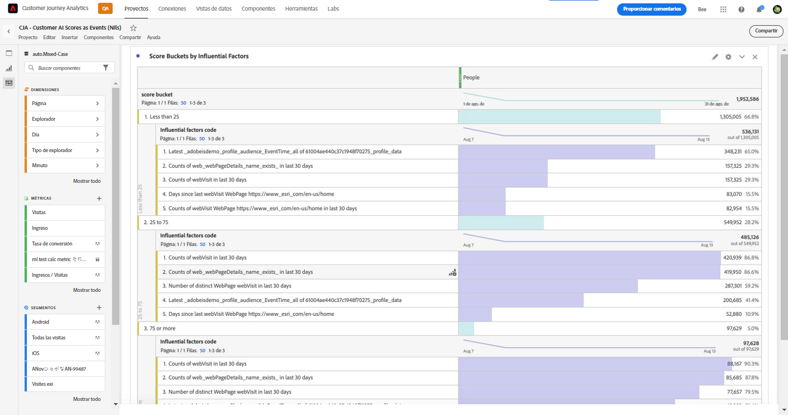

# Integración de Customer AI con CJA

>[!NOTE]
>
>Esta funcionalidad se lanzará el 25 de mayo de 2022.

[Customer AI](https://experienceleague.adobe.com/docs/experience-platform/intelligent-services/customer-ai/overview.html?lang=en), como parte de Adobe Experience Platform Intelligent Services, proporciona a los especialistas en marketing la capacidad de generar predicciones de clientes a nivel individual.

Con la ayuda de factores influyentes, la Customer AI puede indicarle qué es lo más probable que haga un cliente y por qué. Además, los especialistas en marketing pueden beneficiarse de las predicciones y perspectivas de Customer AI para personalizar las experiencias de los clientes al ofrecer las ofertas y los mensajes más adecuados.

La AI del cliente se basa en datos de comportamiento individuales y en datos de perfil para la puntuación de tendencia. La AI del cliente es flexible, ya que puede incorporar varias fuentes de datos, incluidas Adobe Analytics, Adobe Audience Manager, datos de Evento de experiencias del consumidor y datos de Evento de experiencias. Si utiliza el conector de datos de AEP para incorporar datos de Adobe Audience Manager y Adobe Analytics, el modelo recoge automáticamente los tipos de eventos estándar para entrenar y puntuar el modelo. Si introduce su propio conjunto de datos de Evento de experiencia sin tipos de evento estándar, cualquier campo relevante deberá asignarse como eventos personalizados o atributos de perfil si desea usarlo en el modelo. Esto se puede hacer en el paso de configuración de Customer AI . &#x200B;

Customer AI se integra con Customer Journey Analytics (CJA) en la medida en que los conjuntos de datos habilitados para Customer AI se pueden aprovechar en las vistas de datos y los informes en CJA. Con esta integración, puede

* **Rastrear puntuaciones de tendencia para un segmento de usuarios a lo largo del tiempo**. Ejemplo de caso de uso: ¿Cuál es la probabilidad de que un cliente del hotel compre un billete de show en el recinto de conciertos del hotel?
* **Analizar qué eventos o atributos de éxito están asociados con puntuaciones de tendencia**. &#x200B;Ejemplo de caso de uso: Quiero comprender los atributos o los eventos de éxito asociados con las puntuaciones de tendencia.
* **Siga el flujo de entrada para la propensión del cliente sobre diferentes ejecuciones de puntuación.**. Ejemplo de caso de uso: Me gustaría entender a las personas que inicialmente eran usuarios de baja propensión y, con el tiempo, se convirtieron en usuarios de alta propensión &#x200B;
* **Observe la distribución de la propensión**. Caso de uso: Me gustaría entender la distribución de las puntuaciones de tendencia a que pueda ser más precisa con mis segmentos. &#x200B;Ejemplo: un minorista quiere ejecutar una promoción específica por 50 dólares de descuento en un producto.  Es posible que solo deseen ejecutar una promoción muy limitada debido al presupuesto, etc. Analizan los datos y deciden segmentar solo el principal 80 % o más de &#x200B; de sus clientes.
* **Observe la propensión a realizar una acción para una cohorte en particular a lo largo del tiempo**. Caso de uso: Me gustaría rastrear una cohorte específica a lo largo del tiempo. Esto es similar al primero, pero puede rastrear una cohorte específica a lo largo del tiempo. &#x200B; Ejemplo de hospitalidad: Un especialista en mercadotecnia puede rastrear su nivel de bronce frente a su nivel de plata, o su nivel de plata frente a su nivel de oro a lo largo del tiempo. Luego pueden ver la propensión de cada cohorte a reservar el hotel a lo largo del tiempo. &#x200B;

## Flujo de trabajo

Algunos de los pasos se realizan en Adobe Experience Platform antes de trabajar con la salida en CJA.

### Paso 1: Configuración de una instancia de Customer AI

Una vez que haya preparado los datos y haya establecido todas sus credenciales y esquemas, comience por seguir la [Configuración de una instancia de AI del cliente](https://experienceleague.adobe.com/docs/experience-platform/intelligent-services/customer-ai/user-guide/configure.html?lang=en) guía.

### Paso 2: Configuración de una conexión CJA a conjuntos de datos de Customer AI

En CJA, ahora puede [crear una o más conexiones](/help/connections/create-connection.md) a conjuntos de datos de Experience Platform instrumentados para Customer AI. Cada predicción, como &quot;Probabilidad de actualizar cuenta&quot;, equivale a un conjunto de datos. Estos conjuntos de datos aparecen con el prefijo &quot;Puntuaciones de AI del cliente&quot;, como se muestra a continuación:

Este es un ejemplo de esquema XDM que CJA traería como parte de un conjunto de datos existente o nuevo:

(Tenga en cuenta que el ejemplo es un conjunto de datos de perfil; el mismo conjunto de objetos de esquema formaría parte de un conjunto de datos de Experience Event que CJA obtendría. El conjunto de datos de Evento de experiencia incluiría marcas de hora como fecha de puntuación). Todos los clientes puntuados en este modelo tendrían una puntuación, una scoreDate, etc. asociados a ellos.

### Paso 3: Crear vistas de datos en función de estas conexiones

En CJA, ahora puede continuar con [crear vistas de datos](/help/data-views/create-dataview.md) con las dimensiones (como puntuación, fecha de puntuación, probabilidad, etc.) y métricas que se incluyeron como parte de la conexión que ha establecido.

### Paso 4: Informar sobre puntuaciones de IC en Workspace

En CJA Workspace, ahora puede crear un nuevo proyecto y extraer visualizaciones.

A continuación, se muestra un ejemplo de un proyecto de Workspace con datos de IC que tendencia las puntuaciones de tendencia de un segmento de usuarios a lo largo del tiempo, en &#x200B; gráfico de barras apiladas:

Esta es una tabla que muestra los códigos de motivo por los que un segmento tiene &#x200B; de alta o baja tendencia:

Este diagrama de flujo muestra el flujo de entrada de la propensión del cliente sobre distintas ejecuciones de puntuación &#x200B;:

Este gráfico de barras muestra la distribución de las puntuaciones de tendencia &#x200B;:

Este diagrama de Venn muestra la propensión a superponerse en diferentes ejecuciones de puntuación:

