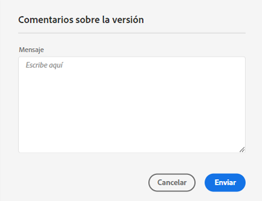
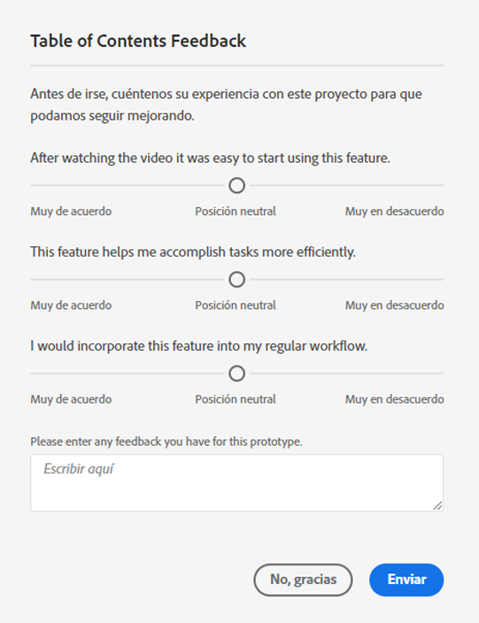

# Guía del usuario de [!UICONTROL Labs]

>[!NOTE]
>
>Esta funcionalidad se encuentra actualmente en [pruebas limitadas](/help/release-notes/releases.md).

[!UICONTROL Labs] permite crear prototipos en las primeras etapas del diseño de manera más rápida. Es una combinación de herramientas y procesos que aceleran el desarrollo de manera transparente, siempre pensando en el cliente. Permite que los usuarios se involucren con tecnologías emergentes, descubran perspectivas valiosas e influyan en el desarrollo de funciones y prioridades futuras. Puede utilizar Labs para obtener acceso anticipado a las innovaciones de Customer Journey Analytics (CJA) y para evaluar las próximas funciones en el contexto de sus propios casos de uso y datos empresariales.

## Requisitos

[!UICONTROL Labs] se activa automáticamente para todos los administradores. Los demás integrantes del equipo deben ponerse en contacto con los administradores de sus productos y solicitar acceso.

Si aún no lo ha hecho, lea y firme los formularios correspondientes del Acuerdo de no divulgación y los Términos y condiciones.

## Acceso al portal de [!UICONTROL Labs]

Para acceder a [!UICONTROL Labs]:

1. Si todavía no tiene acceso a [!UICONTROL Workspace] y [!UICONTROL Labs], solicite los permisos necesarios al administrador.

1. En CJA, haga clic en la **[!UICONTROL Labs]** pestaña .

## Evaluación de un prototipo

Para iniciar y evaluar un prototipo:

1. En la pantalla de [!UICONTROL Labs], haga clic en el botón **[!UICONTROL Iniciar]** del prototipo que desee ver. Cuando se inicie el prototipo, verá su nombre en la parte superior izquierda del entorno de prototipo.

   añadir captura de pantalla aquí

1. Vea un vídeo que resalta el prototipo haciendo clic en **[!UICONTROL Ver vídeo]** en la parte superior derecha de la pantalla. Haga clic en **[!UICONTROL Cerrar]** cuando finalice el vídeo.

   añadir captura de pantalla aquí

1. Trabaje con el prototipo. Al trabajar en el entorno de prototipos:

* Los proyectos creados dentro del entorno de prototipo no se pueden guardar ni compartir.

* En un prototipo, puede evaluar los datos con cualquier dimensión, métrica, segmento y visualización a los que tenga acceso en Workspace.

* Los cambios que realice dentro de un prototipo no afectarán a la recopilación ni al procesamiento de datos.

* Los cambios realizados mediante la creación o modificación de segmentos, métricas calculadas y alertas se conservan fuera del entorno de prototipo.

## Escribir comentarios

1. Haga clic en **[!UICONTROL Enviar comentarios]** para proporcionar comentarios en el cuadro de mensaje en cualquier momento mientras trabaja con el prototipo.

   

1. Haga clic en **[!UICONTROL Enviar]** para enviar sus comentarios.

1. Para probar un prototipo diferente o salir del entorno de prototipo, haga clic en **[!UICONTROL Dejar prototipo]** en la parte superior derecha de la pantalla y complete la encuesta breve del prototipo. Cualquier cambio realizado en un proyecto prototipo se pierde al salir del entorno de prototipos.

   

1. Haga clic en **[!UICONTROL Enviar]** para volver al portal principal de vistas previas.

## prototipos de CJA Labs

* Generador de perspectiva en lenguaje natural: Proporciona un resumen en lenguaje natural de cualquier dato que esté analizando en una tabla improvisada.
* Recomendador de visualización: Recomienda visualizaciones que se emparejen bien con los datos.

## Información adicional

* Algunos prototipos dentro de [!UICONTROL Labs] se convierten en características Customer Journey Analytics, es posible que otras no. Los comentarios ayudan a tomar decisiones, así que revise los prototipos e informe a Adobe de lo que opina acerca de ellos.
* Labs está disponible para todos los SKU.
