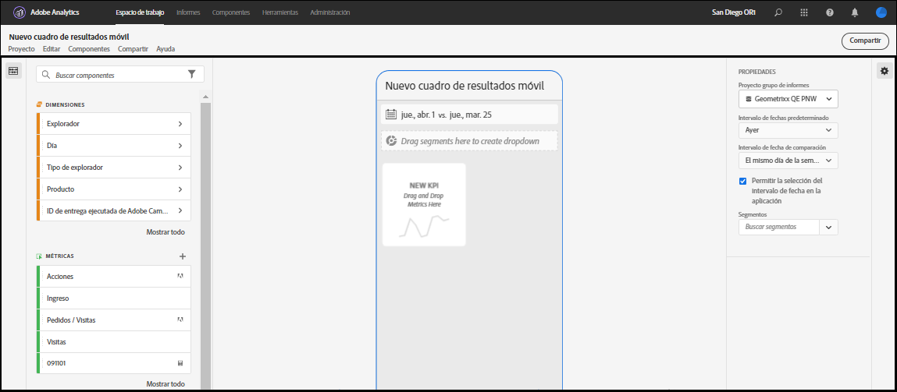
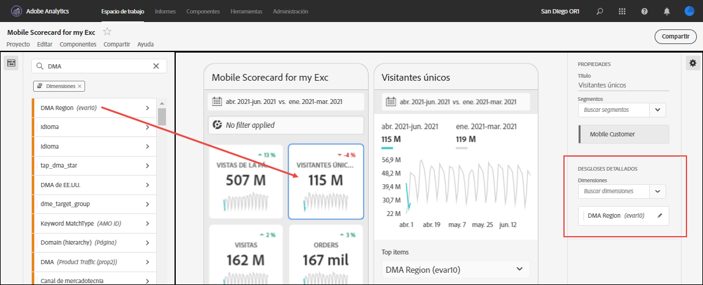
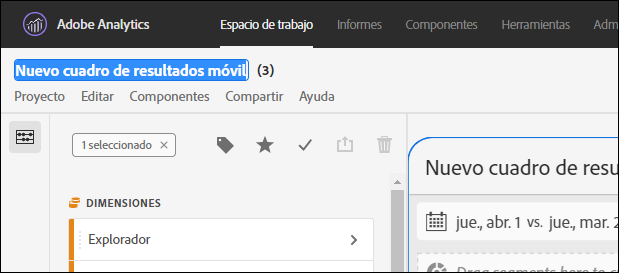
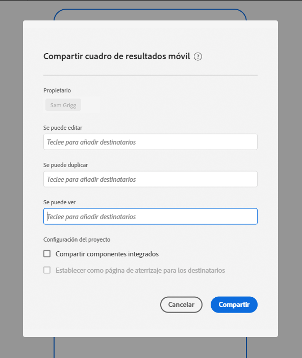

# Crear un informe de valoración

La siguiente información enseña a los depuradores de datos de Adobe Analytics sobre cómo configurar y presentar paneles para los usuarios ejecutivos. Para empezar, puede ver el vídeo del Generador de informes de valoración de paneles de Adobe Analytics:

>[!VIDEO](https://video.tv.adobe.com/v/34544)

>[!NOTE]
>Las capturas de pantalla del informe de valoración de esta página se tomaron de la interfaz de usuario de Adobe Analytics, no de CJA. Las IU son casi idénticas.

Un informe de valoración de Adobe Analytics muestra visualizaciones de datos clave para los usuarios ejecutivos en un diseño en mosaico, como se muestra a continuación:

Como gestor de este informe de valoración, puede utilizar el Generador de informes de valoración para configurar qué mosaicos aparecen en el informe de valoración para su consumidor ejecutivo. También puede configurar cómo se pueden ajustar las vistas detalladas o los desgloses una vez tocados los mosaicos. La interfaz del Generador de informes de valoración se muestra a continuación:

Para crear el informe de valoración, debe hacer lo siguiente:

1. Acceda a la plantilla [!UICONTROL informe de valoración móvil en blanco].
2. Configure el informe de valoración con datos y guárdelo.

## Acceda a la plantilla [!UICONTROL informe de valoración móvil en blanco]

Puede acceder a la plantilla [!UICONTROL informe de valoración móvil en blanco] creando un nuevo proyecto o desde el menú Herramientas.

### Creación de un nuevo proyecto

1. Abra Adobe Analytics y haga clic en la ficha **[!UICONTROL Espacio de trabajo]**.
1. Haga clic en **[!UICONTROL Crear proyecto]** y seleccione la plantilla de proyecto **[!UICONTROL informe de valoración móvil en blanco]**.
1. Haga clic en **[!UICONTROL Crear]**.

### Menú Herramientas

1. En el menú **[!UICONTROL Herramientas]**, seleccione **[!UICONTROL Paneles de Analytics (aplicación móvil)]**.
1. En la pantalla siguiente, haga clic en **[!UICONTROL Crear nuevo informe de valoración]**.

## Configurar el informe de valoración con datos y guardarlo

Para implementar la plantilla del informe de valoración:

1. En **[!UICONTROL Propiedades]** (en el carril derecho), especifique un **[!UICONTROL grupo de informes de proyecto]** cuyos datos quiera utilizar.

   

1. Para añadir un nuevo mosaico al informe de valoración, arrastre una métrica desde el panel izquierdo y suéltela en la zona **[!UICONTROL Arrastrar y soltar métricas aquí]**. También puede insertar una métrica entre dos mosaicos del mismo modo.

   

1. Desde cada mosaico puede acceder a una vista detallada que muestra información adicional sobre la métrica, como los elementos principales de una lista de dimensiones relacionadas.

## Agregar dimensiones o métricas

Para agregar una dimensión relacionada a una métrica, arrastre una dimensión desde el panel izquierdo y suéltela en un mosaico.

Por ejemplo, puede agregar dimensiones adecuadas (como **[!DNL Marketing Channel]**, en este ejemplo) a la métrica **[!UICONTROL Visitantes únicos]** arrastrándolas y soltándolas en el mosaico. Los desgloses de Dimension aparecen en la sección [!UICONTROL Profundizar en] (desglose) de las **[!UICONTROL Propiedades]** específicas del mosaico. Puede agregar varias dimensiones a cada mosaico.

## Aplicar segmentos

Para aplicar segmentos a mosaicos individuales, arrastre un segmento desde el panel izquierdo y suéltelo directamente sobre el mosaico.

Si desea aplicar el segmento a todos los mosaicos del informe de valoración, suelte el mosaico encima del informe de valoración. O bien, también puede aplicar segmentos seleccionando segmentos en el menú de filtro debajo de los intervalos de fechas. Puede [configurar y aplicar filtros para sus informes de valoración](https://experienceleague.adobe.com/docs/analytics-learn/tutorials/analysis-workspace/using-panels/using-drop-down-filters.html?lang=es) del mismo modo que lo haría en Adobe Analytics Workspace.

## Agregar intervalos de fechas

Añada y quite combinaciones de intervalos de fechas que se puedan seleccionar en el cuadro de resultados seleccionando la lista desplegable de intervalo de fechas.

Cada nuevo cuadro de resultados comienza con 6 combinaciones de intervalo de fechas que se centran en los datos de hoy y ayer. Puede quitar intervalos de fechas innecesarios haciendo clic en la x o puede editar cada combinación de intervalos de fechas haciendo clic en el lápiz.

Para crear o cambiar una fecha principal, utilice la lista desplegable para seleccionar entre intervalos de fechas disponibles o arrastre y suelte un componente de fecha del carril derecho en la zona de colocación.

Para crear una fecha de comparación, puede seleccionar entre cómodos preconjuntos para comparaciones de tiempo comunes en el menú desplegable. También puede arrastrar y soltar un componente de fecha desde el carril derecho.

Si el intervalo de fechas que desea aún no se ha creado, puede crear uno nuevo haciendo clic en el icono de calendario.

Esto le llevará al generador de intervalos de fechas, donde puede crear y guardar un nuevo componente de intervalo de fechas.

## Aplicar visualizaciones

Los paneles de Analytics ofrecen cuatro visualizaciones que le ofrecen una buena perspectiva de los elementos y las métricas de dimensión. Cambie a una visualización diferente cambiando el [!UICONTROL tipo de gráfico] de las [!UICONTROL Propiedades] de un mosaico. Seleccione el mosaico derecho y cambie el tipo de gráfico.

O bien, haga clic en el icono [!UICONTROL Visualizaciones] en el carril izquierdo y arrastre y suelte la visualización derecha en el mosaico:

### [!UICONTROL Número de resumen]

Utilice la visualización Número de resumen para resaltar un número elevado que es importante en un proyecto.

### [!UICONTROL Anillo]

Al igual que un gráfico circular, esta visualización muestra los datos como partes o segmentos de un todo. Utilice un gráfico de anillo para comparar porcentajes de un total. Por ejemplo, supongamos que desea ver qué plataforma de publicidad contribuyó al número total de visitantes únicos:

### [!UICONTROL Líneas]

La visualización de línea representa las métricas con una línea para mostrar cómo cambian los valores con el paso del tiempo. Un gráfico de líneas muestra las dimensiones a lo largo del tiempo, pero funciona con cualquier visualización. En este ejemplo está visualizando la dimensión de categoría del producto.

### [!UICONTROL Barra horizontal]

Esta visualización muestra las barras horizontales que representan los distintos valores de una o varias métricas. Por ejemplo, para ver fácilmente cuáles son sus productos principales, utilice [!UICONTROL Barra horizontal] para la visualización que prefiera.

### Quitar elemento de dimensión [!UICONTROL No especificado]

Si desea eliminar los elementos de dimensión [!UICONTROL No especificados] de los datos, haga lo siguiente:

1. Seleccione el mosaico correcto.
1. En el carril derecho, en **[!UICONTROL Drill ins]**, seleccione la flecha derecha junto al elemento de dimensión cuyos elementos **[!UICONTROL No especificados]** desea eliminar.

   

1. Haga clic en el icono junto a **[!UICONTROL No especificado]** para eliminar los datos no especificados de los informes. (También puede eliminar cualquier otro elemento de dimensión).

## Ver y configurar propiedades de mosaico

Al hacer clic en un mosaico en el Generador de informes de valoración, el carril derecho muestra las propiedades y características asociadas con dicho mosaico. En este carril puede dar un nuevo **[!UICONTROL Título]** al mosaico o, si lo desea, configurarlo especificando componentes en lugar de tener que arrastrarlos y soltarlos desde el carril izquierdo.

## Ver detalles (desgloses)

Al hacer clic en los mosaicos, una ventana emergente dinámica muestra cómo el usuario ejecutivo de la aplicación ve la vista Exploración en profundidad (Desglose). Puede desglosar dimensiones y elementos de dimensión para desglosar los datos según sus necesidades específicas. Si no se ha aplicado ninguna dimensión al mosaico, la dimensión de desglose será **hora** o **días**, según el intervalo de fecha predeterminado.

Los desgloses refinan el análisis, desglosando literalmente las dimensiones por otras métricas y dimensiones, como en este ejemplo de venta minorista:

* Métrica Visitantes únicos desglosada por plataforma de publicidad (AMO ID)
* Visitas desglosadas por categoría de producto (comercial)
* Ingresos totales desglosados por nombre del producto

Cada dimensión agregada al mosaico se mostrará en una lista desplegable de la vista detallada de la aplicación. El usuario ejecutivo puede elegir entre las opciones que se muestran en la lista desplegable.

## Eliminación de componentes

Del mismo modo, para eliminar un componente que se aplique a todo el cuadro de resultados, haga clic en cualquier lugar del informe de valoración fuera de los mosaicos y, a continuación, quítelo haciendo clic en la **x** que aparece al pasar el ratón sobre el componente, como se muestra a continuación para el segmento **Primeras visitas**:

## Especificar el nombre de un informe de valoración

Para asignar un nombre al informe de valoración, haga clic en el área de nombres de la parte superior izquierda de la pantalla y escriba el nuevo nombre.

## Compartir un informe de valoración

Para compartir el informe de valoración con un usuario ejecutivo:

1. Haga clic en el menú **[!UICONTROL Compartir]** y seleccione **[!UICONTROL Compartir informe de valoración]**.

1. En el formulario **[!UICONTROL Compartir informe de valoración móvil]**, rellene los campos con:

   * Proporcionar el nombre del informe de valoración
   * Proporcionar una descripción del informe de valoración
   * Añada las etiquetas relevantes
   * Especificación de los destinatarios para el informe de valoración

1. Haga clic en **[!UICONTROL Compartir]**.

Una vez que haya compartido un informe de valoración, los destinatarios podrán acceder a él en sus paneles de Analytics. Si realiza cambios posteriores en el informe de valoración en el Generador de informes de valoración, estos se actualizarán automáticamente en el informe compartido. Los usuarios ejecutivos verán los cambios después de actualizar el informe de valoración en su aplicación.

Si agrega nuevos componentes al informe de valoración, es posible que desee volver a compartirlo (marque la opción **[!UICONTROL Compartir componentes incrustados]**) para asegurarse de que los usuarios ejecutivos tengan acceso a estos cambios.
