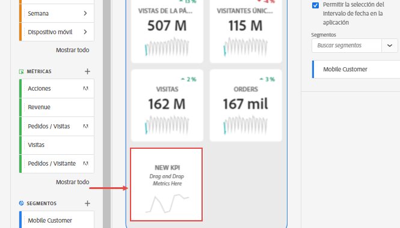
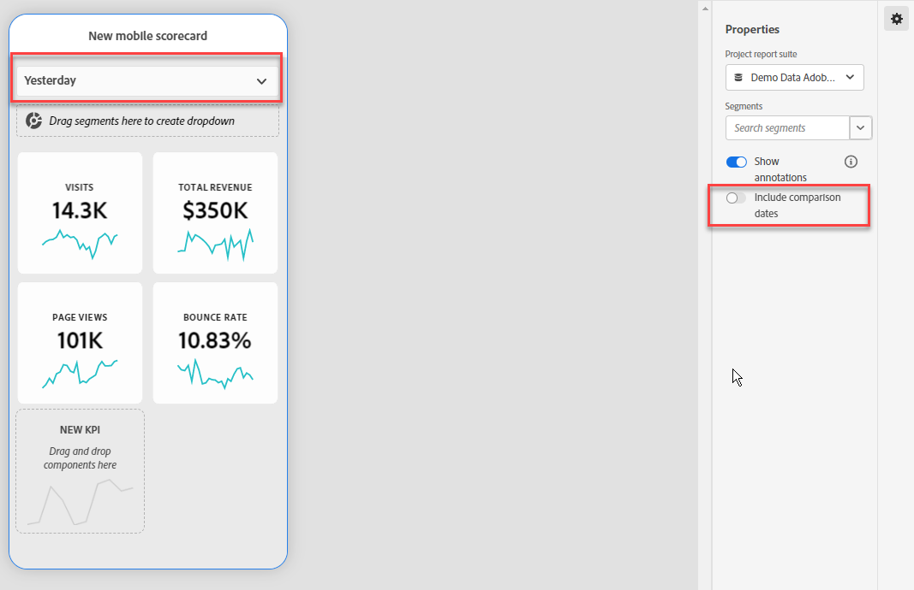
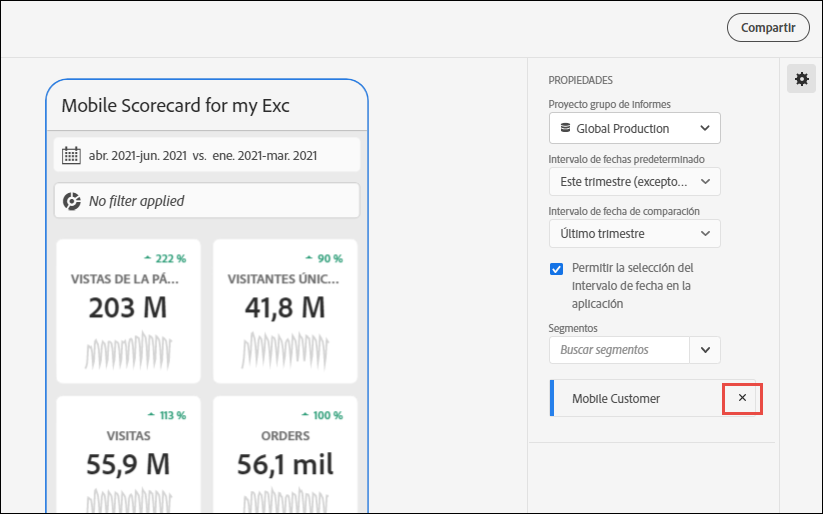

# Creación de un cuadro de resultados móvil

La siguiente información enseña a los depuradores de datos de Adobe Analytics sobre cómo configurar y presentar paneles para los usuarios ejecutivos. Para empezar, puede ver el vídeo del Generador de cuadros de resultados de los paneles de Adobe Analytics:

>[!VIDEO](https://video.tv.adobe.com/v/343458)

>[!NOTE]
>Las capturas de pantalla del cuadro de resultados de esta página se tomaron en la IU de Adobe Analytics, no de CJA. Las IU son casi idénticas.

Un cuadro de resultados de Adobe Analytics muestra visualizaciones de datos clave para los usuarios ejecutivos en un diseño en mosaico, tal y como se muestra a continuación:

Como gestor de datos del cuadro de resultados, puede utilizar el Generador del cuadro de resultados para configurar los mosaicos que aparecerán en el cuadro de resultados de su consumidor ejecutivo. También puede configurar cómo se pueden ajustar las vistas detalladas o los desgloses cuando se pulsen los mosaicos. La interfaz del Generador de informes de valoración se muestra a continuación:

Para crear un cuadro de resultados, deberá hacer lo siguiente:

1. Acceda a la plantilla [!UICONTROL informe de valoración móvil en blanco].
2. Configure el cuadro de resultados con datos y guárdelo.

## Acceda a la plantilla [!UICONTROL informe de valoración móvil en blanco] {#template}

Puede acceder a la plantilla del [!UICONTROL cuadro de resultados móvil en blanco] al crear un nuevo proyecto o desde el menú Herramientas.

### Creación de un nuevo proyecto {#create}

1. Abra Adobe Analytics y haga clic en la ficha **[!UICONTROL Espacio de trabajo]**.
1. Haga clic en **[!UICONTROL Crear nuevo proyecto]** y seleccione la plantilla de proyecto **[!UICONTROL Informe de valoración móvil en blanco]**.
1. Haga clic en **[!UICONTROL Crear]**.

### Menú Herramientas

1. En el menú **[!UICONTROL Herramientas]**, seleccione **[!UICONTROL Paneles de Analytics (aplicación móvil)]**.
1. En la pantalla siguiente, haga clic en **[!UICONTROL Crear nuevo informe de valoración]**.

## Configure el informe de valoración con datos y guárdelo {#configure}

Para implementar la plantilla del informe de valoración:

1. En **[!UICONTROL Propiedades]** (en el carril derecho), especifique un **[!UICONTROL grupo de informes de proyecto]** cuyos datos quiera utilizar. Los grupos de informes son vistas de datos en CJA.

   

1. Para añadir un nuevo mosaico al informe de valoración, arrastre una métrica desde el panel izquierdo y suéltela en la zona **[!UICONTROL Arrastrar y soltar métricas aquí]**. También puede insertar una métrica entre dos mosaicos del mismo modo.

   

1. Desde cada mosaico puede acceder a una vista detallada que muestra información adicional sobre la métrica, como los elementos principales de una lista de dimensiones relacionadas.

## Adición de dimensiones o métricas {#dimsmetrics}

Para agregar una dimensión relacionada a una métrica, arrastre una dimensión desde el panel izquierdo y suéltela en un mosaico.

Por ejemplo, puede añadir dimensiones adecuadas (como **[!DNL Marketing Channel]**, en este ejemplo) a la métrica **[!UICONTROL Visitantes únicos]** arrastrándolas y soltándolas en el mosaico. Los desgloses de dimensiones aparecen en la sección [!UICONTROL Profundizar en] (desglose) de las **[!UICONTROL Propiedades]** específicas del mosaico. Puede agregar varias dimensiones a cada mosaico.

## Aplicar filtros {#filters}

Para aplicar filtros a mosaicos individuales, arrastre un filtro (los segmentos son filtros en CJA) desde el panel izquierdo y suéltelo directamente sobre el mosaico.

Si desea aplicar el filtro a todos los mosaicos del cuadro de resultados, suelte el mosaico encima del cuadro de resultados. O bien, también puede aplicar filtros seleccionando filtros en el menú de filtro debajo de los intervalos de fechas. Puede [configurar y aplicar filtros para sus informes de valoración](https://experienceleague.adobe.com/docs/analytics-learn/tutorials/analysis-workspace/using-panels/using-drop-down-filters.html?lang=es) del mismo modo que lo haría en Adobe Analytics Workspace.

## Adición de intervalos de fechas {#dates}

Añada y quite combinaciones de intervalos de fechas que se puedan seleccionar en el cuadro de resultados seleccionando la lista desplegable de intervalo de fechas.

Cada nuevo cuadro de resultados comienza con 6 combinaciones de intervalo de fechas que se centran en los datos de hoy y ayer. Puede quitar intervalos de fechas innecesarios haciendo clic en la x o puede editar cada combinación de intervalos de fechas haciendo clic en el lápiz.

Para crear o cambiar una fecha principal, utilice la lista desplegable para seleccionar entre intervalos de fechas disponibles o arrastre y suelte un componente de fecha del carril derecho en la zona de colocación.

Para crear una fecha de comparación, puede seleccionar entre cómodos preconjuntos para comparaciones de tiempo comunes en el menú desplegable. También puede arrastrar y soltar un componente de fecha desde el carril derecho.

Si el intervalo de fechas que desea aún no se ha creado, puede crear uno nuevo haciendo clic en el icono de calendario.

Esto le llevará al generador de intervalos de fechas, donde puede crear y guardar un nuevo componente de intervalo de fechas.

### Mostrar u ocultar intervalos de fechas de comparación {#show-comparison-dates}

Para incluir intervalos de fechas de comparación, cambie la configuración de **Incluir fechas de comparación**.

La configuración está *activa* de forma predeterminada. Cambie a *desactivado* si no desea ver las fechas de comparación.

## Aplicación de visualizaciones {#viz}

Los paneles de Analytics ofrecen cuatro visualizaciones que le proporcionan buenos conocimientos de los elementos y las métricas de dimensión. Cambie a una visualización diferente al variar el [!UICONTROL tipo de gráfico] de las [!UICONTROL propiedades] de un mosaico. Seleccione el mosaico derecho y cambie el tipo de gráfico.

O bien, haga clic en el botón [!UICONTROL Visualizaciones] en el carril izquierdo y arrastre y suelte la visualización derecha en el mosaico:

### [!UICONTROL Número de resumen]

Utilice la visualización Número de resumen para resaltar un número elevado que es importante en un proyecto.

### [!UICONTROL Anillo]

Similar a un gráfico circular, esta visualización muestra los datos como partes o filtros de un todo. Utilice un gráfico de anillo para comparar porcentajes de un total. Por ejemplo, supongamos que desea ver qué plataforma de publicidad contribuyó al número total de visitantes únicos:

### [!UICONTROL Líneas]

La visualización de línea representa las métricas con una línea para mostrar cómo cambian los valores con el paso del tiempo. Un gráfico de líneas muestra las dimensiones a lo largo del tiempo, pero funciona con cualquier visualización. En este ejemplo se visualiza la dimensión de la categoría del producto.

### [!UICONTROL Barra horizontal]

Esta visualización muestra las barras horizontales que representan los distintos valores de una o varias métricas. Por ejemplo, para ver fácilmente cuáles son sus productos principales, utilice las [!UICONTROL Barras horizontales] para su visualización preferida.

### Eliminar elemento de dimensión [!UICONTROL no especificado]

Si desea quitar elementos de dimensión [!UICONTROL No especificados] de los datos, haga lo siguiente:

1. Seleccione el mosaico correcto.
1. En el carril derecho, debajo de **[!UICONTROL Profundizar en]**, seleccione la flecha derecha junto al elemento de dimensión cuyos elementos **[!UICONTROL No especificados]** desea eliminar.

   

1. Haga clic en el icono situado junto a **[!UICONTROL No especificado]** para eliminar los datos no especificados de los informes. También puede eliminar cualquier otro elemento de dimensión.

## Vista y configuración de propiedades de mosaico {#tiles}

Al hacer clic en un mosaico en el Generador de cuadros de resultados, el carril derecho muestra las propiedades y características asociadas a dicho mosaico y su dispositiva de detalle. En este carril, puede proporcionar un nuevo **Título** para el mosaico y, alternativamente, configurar el mosaico aplicando filtros. Los segmentos son filtros en CJA.

## Ver diapositivas de detalles {#view-detail-slides}

Cuando hace clic en un mosaico, la ventana emergente dinámica le muestra cómo aparece la diapositiva de detalle para el usuario ejecutivo en la aplicación. Puede agregar dimensiones para desglosar los datos según sus necesidades específicas. Si no se ha aplicado ninguna dimensión, la dimensión de desglose será **hora** o **días**, según el intervalo de fecha predeterminado.

Los desgloses afinan el análisis al desglosar las métricas por elementos de dimensión como los siguientes:

* Métrica Visitantes únicos desglosada por plataforma de publicidad (AMO ID)
* Visitas desglosadas por categoría de producto (venta minorista)
* Ingresos totales desglosados por nombre del producto

Cada dimensión agregada al mosaico se mostrará en una lista desplegable de la vista detallada de la aplicación. El usuario ejecutivo puede elegir entre las opciones que se muestran en la lista desplegable.

## Personalización de diapositivas de detalle {#customize-detail-slide}

Las diapositivas de detalles personalizadas le permiten centrarse aún más en la información que comparte con su audiencia.

>[!VIDEO](https://video.tv.adobe.com/v/3410002)

Puede modificar el diseño de cada diapositiva de detalle y añadir texto para explicar mejor lo que el usuario final puede ver en los datos. También puede cambiar el tipo de gráfico mediante el menú desplegable.

### Cambio del diseño de la diapositiva

Cambie el diseño de la diapositiva para centrarse en la información más importante. Por ejemplo, puede cambiar el diseño para mostrar solo un gráfico o una tabla. Para cambiar el diseño de la diapositiva, seleccione uno de los formatos prediseñados.

También puede cambiar el diseño de la diapositiva arrastrando y soltando los componentes de visualización del carril izquierdo al lienzo. Cada diapositiva de detalle solo puede admitir dos visualizaciones a la vez.

### Adición de texto descriptivo a una diapositiva

Puede agregar texto para proporcionar información significativa acerca de lo que contienen los gráficos o matices sobre los datos.

Para agregar texto a una diapositiva de detalles, seleccione un diseño que muestre el símbolo `T` o arrastre y suelte el componente de visualización Texto desde el carril izquierdo. El editor de texto se abrirá automáticamente al agregar una nueva visualización de texto o al elegir un diseño de diapositiva con texto. El editor de texto proporciona todas las opciones estándar para dar formato al texto. Puede aplicar estilos de texto como párrafo, encabezados y subencabezados, y aplicar negrita y cursiva. Puede justificar el texto, agregar listas con números y viñetas y agregar vínculos. Cuando haya terminado de editar, seleccione el botón minimizar en la esquina superior derecha del editor de texto para cerrarlo. Para editar el texto que ya añadió, seleccione el icono de lápiz para abrir de nuevo el editor de texto.

## Eliminación de componentes {#remove}

Del mismo modo, para eliminar un componente que se aplique a todo el cuadro de resultados, haga clic en cualquier lugar del cuadro de resultados de los mosaicos y, a continuación, elimínelo haciendo clic en la **x** que aparece al pasar el ratón sobre el componente, como se muestra a continuación para el filtro **Visitas por primera vez**:

## Vista previa del cuadro de resultados {#preview}

Puede obtener una vista previa del aspecto y el funcionamiento del cuadro de resultados una vez que se publique en la aplicación de paneles de Analytics.

1. Haga clic en **[!UICONTROL Vista previa]** en la esquina superior derecha de la pantalla.

   

1. Para ver el aspecto que tendrá el cuadro de resultados en distintos dispositivos, seleccione un dispositivo del menú desplegable [!UICONTROL Vista previa del dispositivo].

   

1. Para interactuar con la vista previa, puede hacer lo siguiente:

   * Haga clic con el botón izquierdo para simular los toques en la pantalla del teléfono.

   * Utilice la función de desplazamiento del equipo para simular el desplazamiento por la pantalla del teléfono con el dedo.

   * Haga clic y mantenga presionado para simular el efecto del dedo en la pantalla del teléfono. Esto resulta útil para interactuar con las visualizaciones en la vista detallada.

## Nombrar un cuadro de resultados {#name}

Para asignar un nombre al informe de valoración, haga clic en el área de nombres de la parte superior izquierda de la pantalla y escriba el nuevo nombre.

## Uso compartido de un cuadro de resultados {#share}

Para compartir el informe de valoración con un usuario ejecutivo:

1. Haga clic en el menú **[!UICONTROL Compartir]** y seleccione **[!UICONTROL Compartir informe de valoración]**.

1. En el formulario **[!UICONTROL Compartir informe de valoración móvil]**, rellene los campos con:

   * Proporción del nombre del cuadro de resultados
   * Proporción de la descripción del cuadro de resultados
   * Añada las etiquetas relevantes
   * Especificación de los destinatarios del cuadro de resultados

1. Haga clic en **[!UICONTROL Compartir]**.

Una vez que haya compartido un cuadro de resultados, los destinatarios podrán acceder a él en sus paneles de Analytics. Si realiza cambios posteriores en el cuadro de resultados mediante el Generador de informes de valoración, estos se aplicarán automáticamente al informe compartido. Los usuarios ejecutivos verán los cambios después de actualizar el informe de valoración en su aplicación.

Si actualiza el cuadro de resultados con nuevos componentes, es posible que desee volver a compartirlo (marque la opción **[!UICONTROL Compartir componentes incrustados]**) para asegurarse de que los usuarios ejecutivos tengan acceso a estos cambios.
