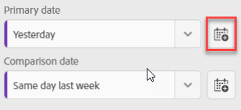

# Guía del gestor de datos para paneles de Analytics

La siguiente información enseña a los depuradores de datos de Adobe Analytics sobre cómo configurar y presentar paneles para los usuarios ejecutivos. Para ver un vídeo donde se muestra esta información, consulte el vídeo del Generador de informes de valoración de paneles de Analytics:

>[!VIDEO](https://video.tv.adobe.com/v/34544)

## Primeros pasos

Los paneles de Adobe Analytics proporcionan información en cualquier momento y lugar en función de los datos de Customer Journey Analytics. La aplicación permite que los usuarios accedan mediante dispositivos móviles a cuadros de resultados intuitivos que se crean y se comparten desde la IU de Customer Journey Analytics para escritorio. Los informes de valoración son un conjunto de métricas clave y de otros componentes que se presentan en un diseño en mosaico que se pueden pulsar para obtener desgloses e informes de tendencias más detallados. Puede adaptar los informes de valoración en función de cuáles sean los datos más importantes para usted. Los paneles de Analytics son compatibles con los sistemas operativos iOS y Android.

## Más información sobre esta guía

Esta guía está diseñada para ayudar a los gestores de datos de Customer Journey Analytics a configurar cuadros de resultados para sus usuarios ejecutivos en los paneles. Los gestores de datos pueden ser administradores de la organización o personas con otras funciones. Son responsables de la configuración de los informes de valoración de la aplicación, lo que permite a los usuarios ejecutivos ver de forma rápida y sencilla en sus propios dispositivo móviles un amplio conjunto de datos de resumen importantes. Aunque los usuarios ejecutivos son los usuarios finales de los paneles de Analytics, esta guía ayudará a los gestores de datos a configurar la aplicación de forma eficaz para estos usuarios.

## Glosario de términos

En la siguiente tabla se describen los términos para comprender la audiencia, las funciones y el funcionamiento de los paneles de Analytics.

| Término | Definición |
|--- |--- |
| Consumidor | Ejecutivo que ve datos y métricas clave de Customer Journey Analytics en un dispositivo móvil |
| Gestor de datos | Experto que busca y distribuye datos de Customer Journey Analytics y que configura los cuadros de resultados que verá el consumidor |
| Gestión de datos | Acto de crear o editar un informe de valoración móvil que contenga métricas, dimensiones y otros componentes relevantes para el cliente |
| Informe de valoración | Vista de paneles que contiene uno o más mosaicos |
| Mosaico | Representación de una métrica en una vista del informe de valoración |
| Desglose | Una vista secundaria a la que se puede acceder pulsando un mosaico del informe de valoración. Esta vista ofrece más información sobre la métrica que aparece en el mosaico y, opcionalmente, sobre dimensiones de desglose adicionales |
| Intervalo de fechas | El intervalo de fecha principal para la creación de informes de los paneles |
| Intervalo de fecha de comparación | Intervalo de fecha que se compara con el intervalo de fecha principal |

## Creación de un informe de valoración para los usuarios ejecutivos

Un informe de valoración muestra visualizaciones de datos clave para los usuarios ejecutivos en un diseño en mosaico, tal y como se muestra a continuación:

Como gestor, puede utilizar el Generador de informes de valoración para configurar los mosaicos que aparecerán en el informe de valoración de su consumidor. También puede configurar cómo se pueden ajustar las vistas detalladas o los desgloses cuando se pulsen los mosaicos. La interfaz del Generador de informes de valoración se muestra a continuación:

Para crear un informe de valoración, deberá hacer lo siguiente:

1. Acceda a la plantilla [!UICONTROL informe de valoración móvil en blanco].
2. Configure el informe de valoración con datos y guárdelo.

### Acceda a la plantilla [!UICONTROL informe de valoración móvil en blanco]

Puede tener acceso a la plantilla [!UICONTROL informe de valoración móvil en blanco] de una de las siguientes formas:

**Creación de un nuevo proyecto**

1. Abra Customer Journey Analytics y haga clic en **Proyectos**.
2. Haga clic en el botón **[!UICONTROL Crear nuevo proyecto]** y seleccione la plantilla de proyecto **[!UICONTROL informe de valoración móvil en blanco]**.
3. Haga clic en el botón **[!UICONTROL Crear]**.

**Agregar un proyecto**

En la pantalla **[!UICONTROL Proyectos]**, en la ficha **[!UICONTROL Componentes]**, haga clic en el botón **[!UICONTROL Agregar]** y seleccione **[!UICONTROL informe de valoración móvil]**.

**O**

En el menú **[!UICONTROL Herramientas]**, seleccione **[!UICONTROL Paneles de Analytics (aplicación móvil)]**. En la pantalla siguiente, haga clic en el botón **[!UICONTROL Crear nuevo informe de valoración]**.

### Configure el informe de valoración con datos y guárdelo

Para implementar la plantilla del informe de valoración:

1. En **[!UICONTROL Propiedades]** (en el carril derecho), especifique una **[!UICONTROL Vista de datos de proyecto]**, cuyos datos quiera utilizar.

   

2. Para añadir un nuevo mosaico al informe de valoración, arrastre una métrica desde el panel izquierdo y suéltela en la zona **[!UICONTROL Arrastrar y soltar métricas aquí]**. También puede insertar una métrica entre dos mosaicos del mismo modo.

   

   *Desde cada mosaico puede acceder a una vista detallada que muestra información adicional sobre la métrica, como los elementos principales de una lista de dimensiones relacionadas.*

3. Para agregar una dimensión relacionada a una métrica, arrastre una dimensión desde el panel izquierdo y suéltela en un mosaico. Por ejemplo, puede añadir dimensiones pertinentes (como **[!DNL DMA Region]**, en este ejemplo) a la métrica **[!UICONTROL Visitantes únicos]** arrastrándolas y soltándolas en el mosaico; las dimensiones que agregue aparecerán en la sección de desglose de las **[!UICONTROL Propiedades]** específicas del mosaico. Puede agregar varias dimensiones a cada mosaico.

   

   Al hacer clic en un mosaico en el Generador de informes de valoración, el carril derecho muestra las propiedades y características asociadas con dicho mosaico. En este carril puede dar un nuevo **[!UICONTROL Título]** al mosaico o, si lo desea, configurarlo especificando componentes en lugar de tener que arrastrarlos y soltarlos desde el carril izquierdo.

   

   Además, si hace clic en un mosaico, una ventana emergente dinámica le mostrará cómo verá la vista Desglose el usuario ejecutivo de la aplicación. Si no se ha aplicado ninguna dimensión al mosaico, la dimensión de desglose será **hora** o **días**, según el intervalo de fecha predeterminado.

   

   Cada dimensión agregada al mosaico se mostrará en una lista desplegable de la vista detallada de la aplicación. El usuario ejecutivo puede elegir entre las opciones que se muestran en la lista desplegable.

4. Para aplicar filtros a mosaicos individuales, arrastre un filtro desde el panel izquierdo y suéltelo directamente sobre el mosaico. Si desea aplicar el filtro a todos los mosaicos del cuadro de resultados, suelte el mosaico encima del cuadro de resultados. O bien, también puede aplicar filtros seleccionando filtros en el menú de filtro debajo de los intervalos de fechas. Puede [configurar y aplicar filtros para sus informes de valoración](https://experienceleague.adobe.com/docs/analytics-learn/tutorials/analysis-workspace/using-panels/using-drop-down-filters.html?lang=es) del mismo modo que lo haría en Adobe Analytics Workspace.

   

5. Del mismo modo, para eliminar un componente que se aplique a todo el cuadro de resultados, haga clic en cualquier lugar del cuadro de resultados de los mosaicos y, a continuación, elimínelo haciendo clic en la **x** que aparece al pasar el ratón sobre el componente, como se muestra a continuación para el filtro **Visitas por primera vez**:

   

6. Agregue y elimine combinaciones de intervalo de fechas que se puedan seleccionar en su cuadro de resultados seleccionando la lista desplegable de intervalo de fechas.

   

   Cada nuevo cuadro de resultados comienza con 6 combinaciones de intervalo de fechas que se centran en los datos de hoy y ayer. Puede eliminar los intervalos de fechas innecesarios haciendo clic en la x, o bien puede editar cada combinación de intervalo de fechas haciendo clic en el lápiz.

   

   Para crear o cambiar una fecha principal, utilice la lista desplegable para seleccionar entre intervalos de fechas disponibles, o bien arrastre y suelte un componente de fecha del carril derecho en la zona de colocación.

   

   Para crear una fecha de comparación, puede seleccionar entre cómodos ajustes preestablecidos para realizar comparaciones de tiempo comunes en el menú desplegable. También puede arrastrar y soltar un componente de fecha desde el carril derecho.

   

   Si el intervalo de fechas que desea aún no se ha creado, puede crear uno nuevo haciendo clic en el icono de calendario.

   

7. Esto le llevará al generador de intervalos de fechas, donde podrá crear y guardar un nuevo componente de intervalo de fechas. Para asignar un nombre al informe de valoración, haga clic en el área de nombres de la parte superior izquierda de la pantalla y escriba el nuevo nombre.

   

## Uso compartido del informe de valoración

Para compartir el informe de valoración con un usuario ejecutivo:

1. Haga clic en el menú **[!UICONTROL Compartir]** y seleccione **[!UICONTROL Compartir informe de valoración]**.

2. En el formulario **[!UICONTROL Compartir informe de valoración móvil]**, rellene los campos con:

   * Proporcione el nombre al informe de valoración
   * Proporcione una descripción del informe de valoración
   * Añada las etiquetas relevantes
   * Especificación de los destinatarios del informe de valoración

3. Haga clic en **[!UICONTROL Compartir]**.

Una vez que haya compartido un informe de valoración, los destinatarios podrán acceder a él en sus paneles de Analytics. Si realiza cambios posteriores en el informe de valoración mediante el Generador de informes de valoración, estos se aplicarán automáticamente al informe compartido. Los usuarios ejecutivos verán los cambios después de actualizar el informe de valoración en su aplicación.

Si agrega nuevos componentes al informe de valoración, es posible que desee volver a compartirlo (marque la opción **[!UICONTROL Compartir componentes incrustados]**) para asegurarse de que los usuarios ejecutivos tengan acceso a estos cambios.

## Configure usuarios ejecutivos con la aplicación

En algunos casos, puede que los usuarios ejecutivos necesiten asistencia adicional para acceder a la aplicación y utilizarla. Esta sección presenta información que le ayudará a proporcionar esa asistencia.

### Ayudar a los usuarios ejecutivos a acceder a la aplicación

Para ayudar a los usuarios ejecutivos a acceder en la aplicación a los informes de valoración que ha creado, asegúrese de que:

* El requisito mínimo del sistema operativo móvil de sus dispositivos sea iOS versión 10 o posterior, o Android versión 4.4 (KitKat) o posterior
* Tengan unas credenciales de inicio de sesión válidas para Adobe Analytics
* Haya creado y compartido correctamente los informes de valoración móviles de los usuarios
* Tengan acceso a Analysis Workspace y a la vista de datos en la que se basa el cuadro de resultados
* Los usuarios tengan acceso a los componentes que se incluyen en el informe de valoración. Tenga en cuenta que, al compartir los informes de valoración, puede seleccionar la opción **[!UICONTROL Compartir los componentes incrustados]**.

### Ayudar a los usuarios ejecutivos de la aplicación

Para ayudar a los usuarios ejecutivos:

1. Ayúdeles a descargar e instalar la aplicación. Siga los siguientes pasos para ampliar el acceso a los usuarios ejecutivos, en función de si utilizan un dispositivo iOS o Android.

   **Para usuarios ejecutivos con iOS:**

   * Haga clic en el siguiente vínculo (también está disponible en Analytics en **[!UICONTROL Herramientas]** > **[!UICONTROL Paneles de Analytics (aplicación móvil)]**) y siga las indicaciones para descargar, instalar y abrir la aplicación:

      [Vínculo de iOS](https://apple.co/2zXq0aN)
   **Para usuarios ejecutivos con Android:**

   * Haga clic en el siguiente vínculo (también está disponible en Analytics en **[!UICONTROL Herramientas]** > **[!UICONTROL Paneles de Analytics (aplicación móvil)]**) y siga las indicaciones para descargar, instalar y abrir la aplicación:

      [Vínculo de Android](https://bit.ly/2LM38Oo)
   Una vez descargada e instalada, los usuarios ejecutivos pueden iniciar sesión en la aplicación con sus credenciales de Adobe Analytics; la aplicación es compatible con Adobe ID y con Enterprise/Federated ID.

   

2. Ayudar a los usuarios a acceder al informe de valoración que ha creado. Después de que los usuarios ejecutivos inicien sesión en la aplicación, aparecerá la pantalla **[!UICONTROL Elegir una empresa]**. En esta pantalla se muestran las empresas de inicio de sesión a las que pertenece el usuario ejecutivo. Para ayudarles a acceder al informe de valoración:

   * Pulse el nombre de la empresa de inicio de sesión o de la organización de Experience Cloud con la que acceder al informe de valoración que ha compartido. A continuación, la lista de informes de valoración muestra todos los informes de valoración que se han compartido con el usuario ejecutivo y a los que este tiene acceso a través de las credenciales de la empresa.
   * Ayude al usuario ejecutivo a ordenar esta lista por **[!UICONTROL Últimas modificaciones]**, si procede.
   * Pulse el nombre de un informe de valoración para verlo.

   

   Si el usuario ejecutivo inicia sesión y ve un mensaje que indica que no se ha compartido nada:

   * Es posible que el usuario ejecutivo haya seleccionado una instancia incorrecta de Analytics

   * Es posible que el informe de valoración no se haya compartido con el usuario ejecutivo

      

   * Compruebe que el usuario ejecutivo puede iniciar sesión en la instancia correcta de Analytics y que se ha compartido el informe de valoración.

3. Explique al usuario ejecutivo cómo aparecen los mosaicos en los cuadros de resultados que comparte (el primer cuadro de resultados a continuación se establece en modo oscuro; consulte **[!UICONTROL Preferences]** si cree que el usuario ejecutivo prefiere esta opción de visualización):

   

   

   Información adicional sobre los mosaicos:

   * La granularidad de los minigráficos depende de la longitud del intervalo de fecha:
      * Si se selecciona un día se muestra una tendencia horaria
      * Si se selecciona más de un día y menos de un año, se muestra una tendencia diaria
      * Si se selecciona un año o más se muestra una tendencia semanal
   * La fórmula de la variación del valor porcentual es el total de la métrica (intervalo de fecha actual) – el total de la métrica (intervalo de fecha de comparación) / el total de la métrica (intervalo de fecha de comparación).
   * Puede arrastrar la pantalla hacia abajo para actualizar el informe de valoración.

4. Pulse un mosaico para mostrar el funcionamiento de un desglose detallado del mosaico.

   

   * Pulse cualquier punto de un minigráfico para ver los datos asociados a ese punto en la línea.

   * Se incluye una tabla para mostrar los datos de las dimensiones agregadas al mosaico. Pulse en la flecha hacia abajo para seleccionar dimensiones. Si no se ha agregado ninguna dimensión al mosaico, la tabla muestra los datos del gráfico.

5. Para cambiar los intervalos de fechas del cuadro de resultados, pulse el encabezado Fecha y seleccione la combinación de intervalo de fechas principal y de comparación que desee ver.

   

6. Para dejar comentarios sobre esta aplicación:

   1. Pulse el icono de configuración en la parte superior derecha de la pantalla de la aplicación.
   2. En la pantalla **[!UICONTROL Configuración]**, pulse la opción **[!UICONTROL Comentarios]**.
   3. Pulse para ver las opciones que existen para dejar comentarios.

      

7. Para cambiar las preferencias, pulse la opción **[!UICONTROL Preferencias]** que se muestra arriba. En las preferencias, puede activar el inicio de sesión biométrico o puede establecer el modo oscuro de la aplicación, tal y como se muestra a continuación:

   

**Para informar de un error**:

Pulse la opción y selecciona la subcategoría del error. En el formulario para informar de un error, escriba su dirección de correo electrónico en el campo superior y una descripción del error en el campo inferior. Al mensaje se adjunta automáticamente una captura de pantalla de la información de su cuenta, pero puede eliminarla si lo desea tocando la **X** de la imagen adjunta. También tiene la opción de grabar la pantalla, agregar más capturas de pantalla o adjuntar archivos. Para enviar el informe, pulse el icono del avión de papel en la parte superior derecha del formulario.

**Para sugerir una mejora**:

Pulse la opción y elija una subcategoría para la sugerencia. En el formulario de sugerencias, escriba su dirección de correo electrónico en el campo superior y una descripción del error en el campo inferior. Al mensaje se adjunta automáticamente una captura de pantalla de la información de su cuenta, pero puede eliminarla si lo desea tocando la **X** de la imagen adjunta. También tiene la opción de grabar la pantalla, agregar más capturas de pantalla o adjuntar archivos. Para enviar la sugerencia, pulse el icono del avión de papel en la parte superior derecha del formulario.

**Para hacer una pregunta**:

Pulse la opción y escriba su dirección de correo electrónico en el campo superior y su pregunta en el campo inferior. Al mensaje se adjunta automáticamente una captura de pantalla, pero puede eliminarla si lo desea tocando la **X** de la imagen adjunta. También tiene la opción de grabar la pantalla, agregar más capturas de pantalla o adjuntar archivos. Para enviar la pregunta, pulse el icono del avión de papel en la parte superior derecha del formulario.

>[!IMPORTANT]
>
>Desde octubre de 2020, Adobe está implementando gradualmente una serie de mejoras para optimizar el rendimiento de la aplicación Paneles de Adobe Analytics. Estas mejoras se centran en el almacenamiento en caché de datos históricos de Analytics que se utilizan para rellenar informes de valoración con fechas (excluido el día actual). Estos datos se almacenarán en caché durante un máximo de 24 horas en una cuenta segura de almacenamiento público en la nube de Microsoft Azure. Póngase en contacto con el CSM si desea excluirse de estas funciones de mejora de rendimiento.
