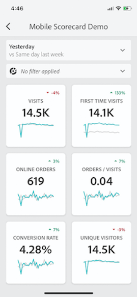
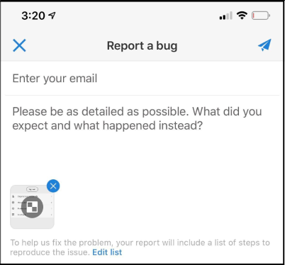

# Paneles de Analytics: guía de inicio rápido del usuario ejecutivo

La siguiente información proporciona a los usuarios ejecutivos información sobre las prácticas recomendadas para utilizar y ver paneles de Analytics. Para ver un vídeo que muestra esta información, consulte [Experiencia en la aplicación sobre paneles de Analytics](https://youtu.be/QXqQ_PkArbA).

## Primeros pasos

Los paneles de Analytics proporcionan datos de Customer Journey Analytics en cualquier momento y lugar.  La aplicación permite que los usuarios accedan mediante dispositivos móviles a informes de valoración intuitivos. Los informes de valoración son un conjunto de métricas clave y de otros componentes que se presentan en un diseño en mosaico. Los mosaicos se pueden pulsar para obtener desgloses e informes de tendencias más detallados. Los paneles son compatibles con los sistemas operativos iOS y Android.

## Más información sobre esta guía

Esta guía está diseñada para ayudar a los usuarios ejecutivos a leer e interpretar los informes de valoración de los paneles de Analytics. La aplicación permite a los usuarios ejecutivos ver de forma rápida y sencilla en sus propios dispositivo móviles un amplio conjunto de datos de resumen importantes.

## Glosario de términos

| Término | Definición |
|--- |--- |
| Consumidor | Ejecutivo que ve datos y métricas clave de Customer Journey Analytics en un dispositivo móvil |
| Gestor de datos | Experto que busca y distribuye datos de Customer Journey Analytics y que configura los cuadros de resultados que verá el consumidor |
| Gestión de datos | Acto de crear o editar un informe de valoración móvil que contenga métricas, dimensiones y otros componentes relevantes para el cliente |
| Informe de valoración | Vista de paneles que contiene uno o más mosaicos |
| Mosaico | Representación de una métrica en una vista del informe de valoración |
| Desglose | Una vista secundaria a la que se puede acceder pulsando un mosaico del informe de valoración. Esta vista ofrece más información sobre la métrica que aparece en el mosaico y, opcionalmente, sobre dimensiones de desglose adicionales |
| Intervalo de fechas | El intervalo de fecha principal para la creación de informes de los paneles |
| Intervalo de fecha de comparación | Intervalo de fecha que se compara con el intervalo de fecha principal |

## Configuración de los paneles en el dispositivo

Para utilizar los paneles de forma eficiente, necesitará que el gestor de datos del informe de valoración le ayude a configurarla. En esta sección se proporciona información para ayudarle a configurar la aplicación con la ayuda de su gestor de datos.

### Obtener acceso

Para acceder a los informes de valoración de los paneles, compruebe que:

* Tiene credenciales de inicio de sesión válidas para Customer Journey Analytics
* El gestor de datos ha creado correctamente los informes de valoración móviles y los ha compartido con usted

### Descarga e instalación de paneles

Para descargar e instalar la aplicación, siga los pasos que correspondan al sistema operativo de su dispositivo.

**Para usuarios ejecutivos con iOS:**

Haga clic en el siguiente vínculo (también está disponible en Customer Journey Analytics, en **[!UICONTROL Herramientas]** > **[!UICONTROL Paneles de Analytics (aplicación móvil)]**) y siga las indicaciones para descargar, instalar y abrir la aplicación:

[Vínculo de iOS](https://apple.co/2zXq0aN)

**Para usuarios ejecutivos con Android:**

Haga clic en el siguiente vínculo (también está disponible en Customer Journey Analytics, en **[!UICONTROL Herramientas]** > **[!UICONTROL Paneles de Analytics (aplicación móvil)]**) y siga las indicaciones para descargar, instalar y abrir la aplicación:

[Vínculo de Android](https://bit.ly/2LM38Oo)

Una vez descargada e instalada, los usuarios ejecutivos pueden iniciar sesión en la aplicación con sus credenciales de Adobe Analytics.

## Usar los paneles

Para usar los paneles:

1. Inicie sesión en la aplicación. La pantalla de inicio de sesión aparecerá al iniciar los paneles. Siga las indicaciones y use sus credenciales de Adobe Analytics. La aplicación es compatible con Adobe ID y con Enterprise ID/Federated ID.

   

2. Seleccione una empresa. Después de iniciar sesión en los paneles, aparecerá la pantalla **[!UICONTROL Elegir una empresa]**. En esta pantalla se muestran las empresas de inicio de sesión a las que pertenece. Pulse el nombre de la empresa asociada con el informe de valoración compartido con usted.

3. A continuación, la lista informes de valoración mostrará todos los informes de valoración que se han compartido con usted. Pulse el informe de valoración que desee ver.

   

   Si inicia sesión y ve un mensaje que indica que no se ha compartido nada, compruebe lo siguiente con su gestor de datos:

   * Puede iniciar sesión en la instancia correcta de Analytics
   * El informe de valoración se ha compartido con usted

   

4. Examine cómo aparecen los mosaicos en el informe de valoración (el primer informe de valoración se muestra en modo oscuro; consulte **[!UICONTROL Preferencias]** para obtener más información).

   

   Información adicional sobre los mosaicos:

   * La granularidad de los minigráficos depende de la longitud del intervalo de fecha:

      * Si se selecciona un día se muestra una tendencia horaria
      * Si se selecciona más de un día y menos de un año, se muestra una tendencia diaria
      * Si se selecciona un año o más se muestra una tendencia semanal
   * La fórmula de la variación del valor porcentual es el total de la métrica (intervalo de fecha actual) – el total de la métrica (intervalo de fecha de comparación) / el total de la métrica (intervalo de fecha de comparación).

   * Puede arrastrar la pantalla hacia abajo para actualizar el informe de valoración.

   El siguiente informe de valoración de ejemplo se muestra en modo normal:

   

5. Pulse un mosaico para ver el funcionamiento de un desglose detallado del mosaico.

   

6. Cambiar los intervalos de fecha del informe de valoración:

   

   * También puede cambiar los intervalos de fechas del mismo modo en la vista Desglosar que se muestra arriba.

   * Según el intervalo que pulse (**Día**, **Semana**, **Mes** o **Año**), verá dos opciones para los intervalos de fechas: o el intervalo de tiempo actual o el inmediatamente anterior. Pulse una de estas dos opciones para seleccionar el primer rango. En la lista **[!UICONTROL COMPARAR CON]**, pulse una de las opciones que se muestran para comparar los datos de este periodo de tiempo con el primer intervalo de fecha seleccionado. Pulse **[!UICONTROL Listo]** en la parte superior derecha de la pantalla. El campo **[!UICONTROL Intervalos de fecha]** y los mosaicos del informe de valoración se actualizarán con los nuevos datos de comparación de los nuevos rangos seleccionados.

7. Para aplicar un filtro a su cuadro de resultados, pulse la lista desplegable de filtros y seleccione un filtro que haya configurado el depurador. Los [filtros](https://experienceleague.adobe.com/docs/analytics-learn/tutorials/analysis-workspace/using-panels/using-drop-down-filters.html?lang=es) de la aplicación funcionan del mismo modo que en Analytics Workspace.

   

8. Obtener actualizaciones del informe de valoración. Si un informe de valoración no incluye todas las métricas o desgloses que le interesen, contacte con el equipo de Analytics para actualizar el informe de valoración. Una vez hecho, puede arrastrar el informe de valoración hacia abajo para actualizarlo, lo cual hará que se carguen los datos agregados recientemente.

9. Para dejar comentarios sobre esta aplicación:

   1. Pulse el icono de configuración en la parte superior derecha de la pantalla de la aplicación.
   2. En la pantalla **[!UICONTROL Configuración]**, pulse la opción **[!UICONTROL Comentarios]**.
   3. Pulse para ver las opciones que existen para dejar comentarios.

      

10. Para cambiar las preferencias, pulse la opción **[!UICONTROL Preferencias]** que se muestra arriba. En las preferencias, puede activar el inicio de sesión biométrico o puede establecer el modo oscuro de la aplicación, tal y como se muestra a continuación:

   

**Para informar de un error**:

Pulse la opción y selecciona la subcategoría del error. En el formulario para informar de un error, escriba su dirección de correo electrónico en el campo superior y una descripción del error en el campo inferior. Al mensaje se adjunta automáticamente una captura de pantalla de la información de su cuenta, pero puede eliminarla si lo desea tocando la **X** de la imagen adjunta. También tiene la opción de grabar la pantalla, agregar más capturas de pantalla o adjuntar archivos. Para enviar el informe, pulse el icono del avión de papel en la parte superior derecha del formulario.

**Para sugerir una mejora**:

Pulse la opción y elija una subcategoría para la sugerencia. En el formulario de sugerencias, escriba su dirección de correo electrónico en el campo superior y una descripción del error en el campo inferior. Al mensaje se adjunta automáticamente una captura de pantalla de la información de su cuenta, pero puede eliminarla si lo desea tocando la **X** de la imagen adjunta. También tiene la opción de grabar la pantalla, agregar más capturas de pantalla o adjuntar archivos. Para enviar la sugerencia, pulse el icono del avión de papel en la parte superior derecha del formulario.

**Para hacer una pregunta**:

Pulse la opción y escriba su dirección de correo electrónico en el campo superior y su pregunta en el campo inferior. Al mensaje se adjunta automáticamente una captura de pantalla, pero puede eliminarla si lo desea tocando la **X** de la imagen adjunta. También tiene la opción de grabar la pantalla, agregar más capturas de pantalla o adjuntar archivos. Para enviar la pregunta, pulse el icono del avión de papel en la parte superior derecha del formulario.
