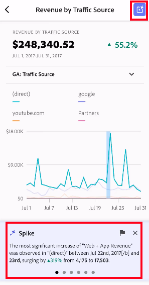
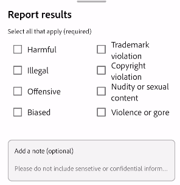

# Administrar cuadros de resultados

En este tema se enseña a los depuradores de datos de Customer Journey Analytics cómo ver y administrar elementos de cuadro de resultados.

## Vista y configuración de propiedades de mosaico {#tiles}

Al hacer clic en un mosaico en el Creador de cuadros de resultados, el carril derecho muestra las propiedades y características asociadas a dicho mosaico y su diapositiva de detalle. En este carril, puede proporcionar un nuevo **Título** para el mosaico y, alternativamente, configurar el mosaico aplicando segmentos.

## Ver diapositivas de detalles {#view-detail-slides}

Cuando hace clic en un mosaico, la ventana emergente dinámica le muestra cómo aparece la diapositiva de detalle para el usuario ejecutivo en la aplicación. Puede agregar dimensiones para desglosar los datos según sus necesidades específicas. Si no se ha aplicado ninguna dimensión, la dimensión de desglose será **hora** o **días**, según el intervalo de fecha predeterminado.

Los desgloses afinan el análisis al desglosar las métricas por elementos de dimensión como los siguientes:

* Métrica Visitantes únicos desglosada por plataforma de publicidad (AMO ID)
* Visitas desglosadas por categoría de producto (venta minorista)
* Ingresos totales desglosados por nombre del producto

Cada dimensión agregada al mosaico se mostrará en un menú desplegable de la vista detallada de la aplicación. El usuario ejecutivo puede elegir entre las opciones que se muestran en el menú desplegable.

## Personalización de diapositivas de detalle {#customize-detail-slide}

Las diapositivas de detalles personalizadas le permiten centrarse aún más en la información que comparte con su público.

>[!BEGINSHADEBOX]

Consulte  [Vistas detalladas personalizadas](https://video.tv.adobe.com/v/3410002?quality=12&learn=on){target="_blank"} para ver un vídeo de demostración.

>[!ENDSHADEBOX]

Puede modificar el diseño de cada diapositiva de detalle y añadir texto para explicar mejor lo que el usuario final puede ver en los datos. También puede cambiar el tipo de gráfico mediante el menú desplegable.

### Cambio del diseño de la diapositiva

Cambie el diseño de la diapositiva para centrarse en la información más importante. Por ejemplo, puede cambiar el diseño para mostrar solo un gráfico o una tabla. Para cambiar el diseño de la diapositiva, seleccione uno de los formatos prediseñados.

También puede cambiar el diseño de la diapositiva arrastrando y soltando los componentes de visualización del carril izquierdo al lienzo. Cada diapositiva de detalle solo puede admitir dos visualizaciones a la vez.

### Adición de texto descriptivo a una diapositiva

Puede agregar texto para proporcionar información significativa acerca de lo que contienen los gráficos o matices sobre los datos.

Para agregar texto a una diapositiva de detalles, seleccione un diseño que muestre el símbolo `T` o arrastre y suelte el componente de visualización Texto desde el carril izquierdo. El editor de texto se abrirá automáticamente al agregar una nueva visualización de texto o al elegir un diseño de diapositiva con texto. El editor de texto proporciona todas las opciones estándar para dar formato al texto. Puede aplicar estilos de texto como párrafo, encabezados y subencabezados, y aplicar negrita y cursiva. Puede justificar el texto, agregar listas con números y viñetas y agregar vínculos. Cuando haya terminado de editar, seleccione el botón minimizar en la esquina superior derecha del editor de texto para cerrarlo. Para editar el texto que ya añadió, seleccione el icono de lápiz para abrir de nuevo el editor de texto.

## Eliminación de componentes {#remove}

Del mismo modo, para eliminar un componente que se aplica a todo el cuadro de resultados, haga clic en cualquier lugar del cuadro de resultados fuera de los mosaicos y, a continuación, elimínelo haciendo clic en la **x** que aparece al pasar el puntero por encima del componente, como se muestra a continuación para el filtro **Visitas por primera vez**:

## Creación de historias de datos {#create-data-story}

Una historia basada en datos es una colección de puntos de datos de apoyo, contexto empresarial y métricas relacionadas creada en torno a un tema o métrica central.

Por ejemplo, si se centra en el tráfico web, la métrica más importante pueden ser las visitas, pero también puede estar interesado en nuevos visitantes, visitantes únicos y puede que quiera ver los datos desglosados por cada página web o por el tipo de dispositivo desde el que proviene el tráfico. Las historias basadas en datos en proyectos de cuadros de resultados móviles le permiten poner sus métricas más importantes en primer plano y, al mismo tiempo, contar toda la historia que hay detrás con múltiples diapositivas detalladas.

Vea el vídeo para obtener más información acerca de la creación de historias basadas en datos en los proyectos de cuadro de resultados móviles en Analysis Workspace.

>[!BEGINSHADEBOX]

Vea  [Historias de datos para proyectos de cuadros de resultados móviles](https://video.tv.adobe.com/v/3416392/?quality=12&learn=on){target="_blank"} para ver un vídeo de demostración.

>[!ENDSHADEBOX]

**Para crear una historia basada en datos** {#data-story-create}

Cree su historia basada en datos al agregar varias diapositivas de detalles a un mosaico.

1. Comience con un proyecto de cuadro de resultados móvil.
1. Seleccione un mosaico desde el que desee crear una historia.
   
   {width=".50%"}
1. Agregue diapositivas para generar la historia basada en datos. La primera diapositiva se genera de forma predeterminada.
Para agregar nuevas diapositivas, pase el puntero por encima de una o haga clic en ella y, a continuación, seleccione una de las opciones disponibles:
   * Pulse el signo + para crear una nueva diapositiva.
   * Pulse el icono de duplicado para duplicar la diapositiva existente.
1. Si crea una diapositiva en blanco, arrastre y suelte los componentes desde el carril izquierdo o elija un diseño para llenarla automáticamente con los datos del mosaico.
   
Para eliminar una diapositiva, pulse el icono de papelera.

### Personalización de una historia basada en datos {#customize-data-story}

Las historias basadas en datos le permiten personalizar todos los elementos para que pueda compartir la información que desee y excluir lo que no necesite. Puede personalizar mosaicos y diapositivas individuales para añadir segmentos, mostrar desgloses, cambiar el diseño y modificar las visualizaciones.

**Para personalizar mosaicos**

1. Toque un mosaico. El mosaico seleccionado se resalta en azul y el panel derecho muestra las propiedades.
1. Cambie el título, el tipo de gráfico y otras opciones del mosaico.
1. Arrastre un componente al mosaico.
   
Cuando arrastra y suelta un componente como una visualización en un mosaico, este se aplica a todas las diapositivas de historias basada en datos.
1. Para aplicar un cambio solo al título, mantenga pulsada la tecla Mayús.
   

>[!NOTE]
>Las diapositivas heredan componentes del mosaico, pero los mosaicos no heredan componentes de las diapositivas.

**Para personalizar las diapositivas individuales**

Puede cambiar la visualización de diapositivas individuales en una historia basada en datos. Por ejemplo, puede cambiar una barra horizontal por un gráfico de anillos para una diapositiva específica. También puede cambiar el diseño. Consulte [los detalles de personalización de diapositivas](#customize-detail-slide).

### Vista previa de una historia basada en datos {#preview-data-story}

Después de crear una historia basada en datos, use el botón **Vista previa** para verla e interactuar con ella como si fuera un usuario de la aplicación. Para obtener información acerca de la vista previa de la historia basada en datos, consulte [Vista previa del cuadro de resultados](#preview)

### Navegación entre mosaicos y diapositivas {#navigate-tiles-slides}

La barra de navegación muestra iconos que representan lo que hay en cada diapositiva. Si hay muchas, la barra de navegación facilita el desplazamiento a una diapositiva específica.

Para moverse entre los mosaicos y las diapositivas, pulse la barra de navegación.

{width="45%"}

También puede navegar hacia atrás y hacia adelante utilizando las flechas del teclado o seleccionando un componente y manteniéndolo a la izquierda o a la derecha de la pantalla para desplazarse.

## Vista previa de los cuadros de resultados {#preview}

Puede obtener una vista previa del aspecto y el funcionamiento del cuadro de resultados una vez que se publique en la aplicación de paneles de Analytics.

1. Haga clic en **[!UICONTROL Vista previa]** en la esquina superior derecha de la pantalla.

   

1. Para ver el aspecto que tendrá el cuadro de resultados en distintos dispositivos, seleccione un dispositivo del menú desplegable [!UICONTROL Vista previa del dispositivo].

   

1. Para interactuar con la vista previa, puede hacer lo siguiente:

   * Haga clic con el botón izquierdo para simular los toques en la pantalla del teléfono.

   * Utilice la función de desplazamiento del equipo para simular el desplazamiento por la pantalla del teléfono con el dedo.

   * Haga clic y mantenga presionado para simular el efecto del dedo en la pantalla del teléfono. Esto resulta útil para interactuar con las visualizaciones en la vista detallada.

## Uso compartido de cuadros de resultados {#share}

Para compartir el cuadro de resultados con un usuario ejecutivo:

1. Haga clic en el menú **[!UICONTROL Compartir]** y seleccione **[!UICONTROL Compartir informe de valoración]**.

1. En el formulario **[!UICONTROL Compartir cuadro de resultados móvil]**, complete los campos mediante los elementos siguientes:

   * Proporción del nombre del cuadro de resultados
   * Proporción de la descripción del cuadro de resultados
   * Añada las etiquetas relevantes
   * Especificación de los destinatarios del cuadro de resultados

1. Haga clic en **[!UICONTROL Compartir]**.

Una vez que haya compartido un cuadro de resultados, los destinatarios podrán acceder a él en sus paneles de Analytics. Si realiza cambios posteriores en el cuadro de resultados del creador de cuadros de resultados, se actualizarán automáticamente en el cuadro de resultados compartido. Los usuarios ejecutivos verán los cambios después de actualizar el cuadro de resultados en su aplicación.

Si actualiza el cuadro de resultados con nuevos componentes, es posible que desee volver a compartirlo (marque la opción **[!UICONTROL Compartir componentes incrustados]**) para asegurarse de que los usuarios ejecutivos tengan acceso a estos cambios.

### Uso compartido de cuadros de resultados mediante un vínculo que se puede compartir

El uso de un vínculo que se puede compartir facilita el uso compartido de un cuadro de resultados en una aplicación de correo electrónico, documento o mensaje de texto. El vínculo que se puede compartir permite a los destinatarios abrir el cuadro de resultados en su escritorio o en la aplicación móvil de los paneles de control. Los vínculos profundos compartibles facilitan aún más el uso compartido de proyectos y aumentan participación con las partes interesadas.

Para compartir un cuadro de resultados mediante un vínculo que se puede compartir

1. Haga clic en el menú **[!UICONTROL Compartir]** y seleccione **[!UICONTROL Compartir informe de valoración]**.

   

1. Copie el vínculo y péguelo en un correo electrónico, documento o aplicación de mensajería instantánea.

   Cuando un destinatario utiliza una aplicación de escritorio o un explorador para abrir el vínculo, el proyecto del cuadro de resultados móvil se abrirá en Workspace.

   Cuando un destinatario abre el vínculo en un dispositivo móvil, el cuadro de resultados se abrirá directamente en la aplicación de paneles de Adobe Analytics.

   Si un destinatario no ha descargado la aplicación móvil, se le redirigirá a la lista de aplicaciones de la tienda App Store o Google Play donde pueda descargarla.

## Eliminar elemento de dimensión [!UICONTROL no especificado] {#remove-dims}

Si desea quitar elementos de dimensión [!UICONTROL No especificados] de los datos, haga lo siguiente:

1. Seleccione el mosaico correcto.
1. En el carril derecho, debajo de **[!UICONTROL Profundizar en]**, seleccione la flecha derecha junto al elemento de dimensión cuyos elementos **[!UICONTROL No especificados]** desea eliminar.

   

1. Haga clic en el icono situado junto a **[!UICONTROL No especificado]** para eliminar los datos no especificados de los informes. También puede eliminar cualquier otro elemento de dimensión.

## Ver subtítulos inteligentes en cuadros de resultados {#captions}

Los subtítulos inteligentes pueden ayudar a los no analistas a dar mejor sentido a sus datos sin la ayuda de los analistas. Los subtítulos inteligentes utilizan aprendizaje automático avanzado e IA generativa para proporcionar información valiosa en lenguaje natural para las visualizaciones.

Estos subtítulos recogen perspectivas estadísticas clave en los datos y las expresan en lenguaje natural, ayudando así a los no analistas a desarrollar su conocimiento de los datos.

Los subtítulos inteligentes están disponibles para todas las visualizaciones de la aplicación móvil, como Línea, Anillo, Gráfico de barras y Número de resumen.

Para ver subtítulos inteligentes en un cuadro de resultados móvil:

1. En un cuadro de resultados, haga clic en un mosaico. Por ejemplo, en este cuadro de resultados, haga clic en el gráfico de líneas de la parte inferior.

   

1. Pulse el icono azul en la parte superior derecha para generar los subtítulos. Los subtítulos aparecerán debajo del gráfico de líneas.

   

1. Deslice a la derecha para ver todos los subtítulos inteligentes.

   Los subtítulos inteligentes pueden señalar a picos de datos, anomalías, tendencias, caídas, correlaciones y otros fenómenos.

1. Pulse la bandera negra dentro de un pie de ilustración para informar de un problema, como contenido dañino o ilegal.

   

1. Haga clic en la X para salir del cuadro de diálogo **[!UICONTROL Resultados del informe]**.
