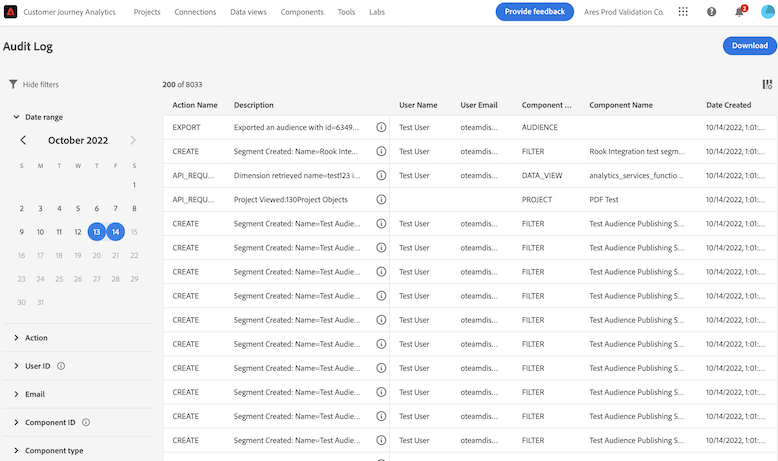
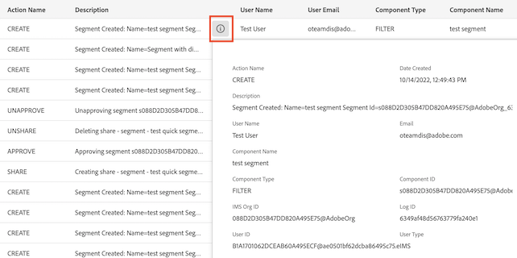
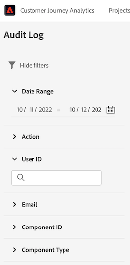

# Registros de auditoría

Para aumentar la transparencia y la visibilidad de las actividades realizadas en el sistema, el Customer Journey Analytics (CJA) le permite auditar la actividad del usuario en varios servicios y capacidades en forma de “registros de auditoría”. Estos registros forman una pista de auditoría que puede ser útil en la resolución de problemas y ayudar a su empresa a cumplir de manera eficaz con las políticas de administración de datos corporativos y los requisitos regulatorios, como la Ley de Portabilidad y Responsabilidad del Seguro de Salud (HIPAA, Health Insurance Portability and Accountability Act).

En un sentido estricto, un registro de auditoría informa de **quién** realizó **qué** acción y **cuándo** lo hizo. Cada acción registrada contiene metadatos que indican el tipo de acción, la fecha y la hora, el ID de correo electrónico del usuario que realizó la acción y los atributos adicionales relevantes de ese tipo de acción.

Este tema cubre los registros de auditoría en CJA, como su visualización y administración en la interfaz de usuario.

## Acceso a los registros de auditoría

Cuando la función está habilitada para su organización, los registros de auditoría se recopilan automáticamente a medida que se produce la actividad. No es necesario habilitar manualmente la recopilación de registros.

Para ver y exportar los registros de auditoría, se debe contar con el permiso de control **[!UICONTROL Acceso a registros de auditoría]** en la consola de Adobe. Para obtener información sobre cómo administrar permisos individuales para funciones de CJA, consulte la [documentación de control de acceso](/help/getting-started/cja-access-control.md).

## Vista del registro de auditoría en la IU

En CJA, vaya a **[!UICONTROL Herramientas]** > **[!UICONTROL Registros de auditoría]**.

El registro de auditoría correspondiente al día de hoy y al día de ayer se muestra de forma predeterminada.

Para seleccionar qué columnas están visibles, vaya al selector de columnas ubicado en la parte superior derecha.

## Visualización de información sobre entradas de registro individuales

Haga doble clic en el botón de información (i) junto a una descripción.

Se muestran los siguientes elementos:

| Elemento | Descripción |
| --- | --- |
| Nombre de la acción | Esta es la lista de las posibles acciones: <ul><li>API_Request</li><li>Aprobar</li><li>Crear</li><li>Editar</li><li>Exportar</li><li>Login_failed</li><li>Login_successful</li><li>Cerrar sesión</li><li>Org_change</li><li>Actualizar</li><li>Compartir</li><li>Transferir</li><li>Desaprobar</li><li>Dejar de compartir</li></ul> |
| Descripción | Resumen de la acción, tipo de componente (con ID) y otros valores. |
| Nombre de usuario | El usuario que realiza la acción. |
| Tipo de componente | Los tipos de componentes posibles incluyen: <ul><li>Anotación</li><li>Audiencia</li><li>Métrica calculada</li><li>Conexión</li><li>Data_Group</li><li>Data_View</li><li>Feature_Access</li><li>Filtro</li><li>IMS_Org</li><li>Móvil</li><li>Proyecto</li><li>Informe</li><li>Scheduled_Project</li><li>Usuario</li><li>User_Group</li></ul> |
| ID de organización IMS | ID único que se proporciona a la instancia de un usuario que inicia sesión por primera vez en Adobe Experience Cloud. Debe tener el formato siguiente: xxx@AdobeOrg. |
| ID de usuario | ID único que identifica al usuario que realizó esta acción. |
| Fecha de creación | Cuando se realizó esta acción. |
| Correo electrónico | El correo electrónico del usuario que realiza la acción. |
| ID de componente | ID único que identifica el componente sobre el que se realiza una acción. |
| ID de registro | ID único que identifica esta entrada de registro. |
| Tipo de usuario | Los tipos posibles son: IMS, OKTA |

### Filtrar registros de auditoría

Seleccione el icono de canal () para mostrar una lista de controles de filtro y ayudar a reducir los resultados. Solo se muestran los últimos 1000 registros, independientemente de los distintos filtros seleccionados.

Los siguientes filtros están disponibles para eventos de auditoría en la interfaz de usuario:

| Filtro | Descripción |
| --- | --- |
| [!UICONTROL Intervalo de fecha] | Filtre en un intervalo distinto seleccionando una fecha diferente o un intervalo de fechas arrastrando el cursor sobre varias fechas. De forma predeterminada, se seleccionan las fechas de hoy y de ayer. |
| [!UICONTROL Acción] | Filtre con una o más de las siguientes acciones: <ul><li>API_Request</li><li>Aprobar</li><li>Crear</li><li>Editar</li><li>Exportar</li><li>Login_failed</li><li>Login_success</li><li>Cerrar sesión</li><li>Org_change</li><li>Actualizar</li><li>Compartir</li><li>Transferir</li><li>Desaprobar</li><li>Dejar de compartir</li></ul> |
| [!UICONTROL ID de usuario] | Filtrar por un usuario específico con el ID. El ID de usuario se puede encontrar seleccionando el botón de información (i) junto al nombre de usuario. |
| [!UICONTROL Correo electrónico] | Filtre por la dirección de correo electrónico de un usuario específico. El correo electrónico se puede encontrar seleccionando el botón de información (i) junto a un nombre de usuario. |
| [!UICONTROL ID de componente] | Filtre por un ID de componente específico. El ID de componente se puede encontrar seleccionando el botón de información (i) para un componente deseado. |
| [!UICONTROL Tipo de componente] | Filtrar por uno o varios tipos de componente: <ul><li>Anotación</li><li>Audiencia</li><li>Métrica calculada</li><li>Conexión</li><li>Data_Group</li><li>Data_View</li><li>Feature_Access</li><li>Filtro</li><li>IMS_Org</li><li>Móvil</li><li>Proyecto</li><li>Informe</li><li>Scheduled_Project</li><li>Usuario</li><li>User_Group</li></ul> |

{style=&quot;table-layout:auto&quot;}

## Tipos de eventos capturados por los registros de auditoría

La siguiente tabla indica qué acciones sobre qué tipo de componentes se registran en los registros de auditoría:

| Tipo de componente | Acciones |
| --- | --- |
| [!UICONTROL Anotación] | <ul><li>Crear</li><li>Eliminar</li><li>Editar</li></ul> |
| [!UICONTROL Audiencia] | <ul><li>API_Request</li><li>Crear</li><li>Eliminar</li><li>Editar</li><li>Exportar</li><li>Actualizar</li></ul> |
| [!UICONTROL Métrica calculada] | <ul><li>API_Request</li><li>Crear</li><li>Eliminar</li><li>Editar</li></ul> |
| [!UICONTROL Conexión] | <ul><li>API_Request</li><li>Crear</li><li>Eliminar</li><li>Editar</li></ul> |
| [!UICONTROL Vista de datos] | <ul><li>API_Request</li><li>Crear</li><li>Eliminar</li><li>Editar</li></ul> |
| [!UICONTROL Intervalo de fecha] | <ul><li>API_Request</li><li>Crear</li><li>Eliminar</li><li>Editar</li></ul> |
| [!UICONTROL Filtro] | <ul><li>API_Request</li><li>Crear</li><li>Eliminar</li><li>Editar</li></ul> |
| [!UICONTROL IMS Org] | <ul><li>API_Request</li><li>Crear</li><li>Eliminar</li><li>Editar</li></ul> |
| [!UICONTROL Proyecto] | <ul><li>API_Request</li><li>Crear</li><li>Eliminar</li><li>Editar</li></ul> |
| [!UICONTROL Informe] | <ul><li>API_Request</li></ul> |
| [!UICONTROL Proyecto programado] | <ul><li>API_Request</li><li>Crear</li><li>Eliminar</li><li>Editar</li></ul> |
| [!UICONTROL Usuario] | <ul><li>API_Request</li><li>Crear</li><li>Eliminar</li><li>Editar</li></ul> |
| [!UICONTROL Grupo de usuarios] | <ul><li>API_Request</li><li>Crear</li><li>Eliminar</li><li>Editar</li></ul> |

{style=&quot;table-layout:auto&quot;}

## Descargar registros de auditoría

Puede descargar registros de auditoría en los formatos CSV o JSON. Los filtros aplicados o las columnas seleccionadas se reflejan en los archivos descargados.

1. Haga clic en **[!UICONTROL Descargar]** en la parte superior derecha de la pantalla.
1. Especifique el formato.
1. Haga clic en **[!UICONTROL Descargar]** de nuevo.

## Administrar registros de auditoría en la API

Todas las acciones que puede realizar en la interfaz de usuario también se pueden realizar mediante llamadas a la API. Para obtener más información, consulte el [documento de la API de CJA](https://developer.adobe.com/cja-apis/docs/api/#tag/Audit-Logs).