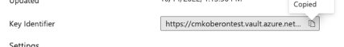

# Claves gestionadas por el cliente

Customer Journey Analytics (CJA) proporciona la opción para [Healthcare Shield](https://www.adobe.com/trust/compliance/hipaa-ready.html) y los clientes de Privacy &amp; Security Shield para utilizar una clave gestionada por el cliente de Azure (CMK) que se aplicará a sus datos de CJA.  Tenga en cuenta que este proceso es independiente de la [configuración de Adobe Experience Platform CMK](https://experienceleague.adobe.com/docs/experience-platform/landing/governance-privacy-security/customer-managed-keys.html?lang=es).

>[!NOTE]
>
>Actualmente, las claves gestionadas por el cliente solo están disponibles para las organizaciones que han adquirido el complemento [Healthcare Shield or Privacy &amp; Security Shield](https://experienceleague.adobe.com/docs/blueprints-learn/architecture/vertical-blueprints/healthcare-vertical.html%3Flang%3Den).

## Configuración de CMK para CJA

Siga estos pasos para configurar CMK para CJA:

1. Asegúrese de que tiene derecho a Adobe CJA CMK comprobando con su equipo de cuenta de Adobe.
1. Asegúrese de que, en Azure, es un administrador con una función de privilegio, como administrador de aplicaciones, administrador de aplicaciones de nube o administrador global. [Obtenga más información en Microsoft](https://learn.microsoft.com/es-es/azure/active-directory/roles/permissions-reference)
1. Cree un nuevo Azure Key Vault para utilizarlo solo con CJA. [Obtenga más información en Microsoft](https://learn.microsoft.com/es-es/azure/key-vault/general/)
1. Conceda acceso a la aplicación de Adobe Azure a su clave en el almacén de claves. Este es el ID de aplicación de Adobe: 251e3919-1940-4296-bb8b-6b9a5e8a4805. [Obtenga más información en Microsoft](https://learn.microsoft.com/es-es/azure/storage/common/customer-managed-keys-configure-cross-tenant-existing-account?toc=%2Fazure%2Fstorage%2Fblobs%2Ftoc.json&amp;tabs=powershell-preview%2Cazure-portal#the-customer-grants-the-service-providers-app-access-to-the-key-in-the-key-vault)
1. Cree un ticket del Servicio de atención al cliente de Adobe solicitando la configuración de CMK. Incluya el URI de Azure en su ticket. El URI se puede encontrar en el campo **Identificador de clave** de la clave de Azure.

   

1. El Servicio de atención al cliente de Adobe confirmará la finalización de la aplicación CMK en sus datos de CJA.

Todos los datos que utiliza Platform se cifran en tránsito y en reposo para mantener sus datos seguros, con o sin CMK. Para saber más sobre el cifrado de Adobe Experience Platform, haga clic en [más información](https://experienceleague.adobe.com/docs/experience-platform/landing/governance-privacy-security/encryption.html?lang=es).
