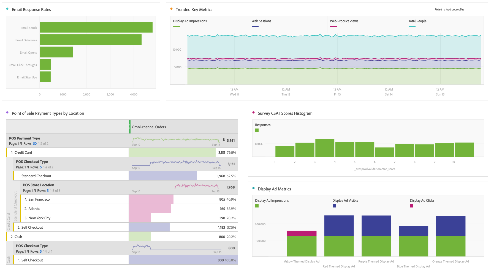

# Realizar análisis básico

Después de crear conexiones y vistas de datos, analice los datos que ha introducido con la potencia y flexibilidad de Espacio de trabajo de Análisis. No dude en experimentar y arrastrar dimensiones y métricas, configuración de atribución de cambiares dimensión y métricas, nombres prácticos, huso horario, configuración de sesión, etc.

A continuación se muestra un ejemplo de visualizaciones básicas en Workspace. Por ejemplo, puede

* Cree un informe de clasificación de las fuentes de datos que muestran la mayor cantidad de eventos, sesiones y personas.

* Cree un informe de tendencias de los ingresos en línea frente a los ingresos en el almacén que compare las dos fuentes de datos con el paso del tiempo.

* más ejemplos aquí

