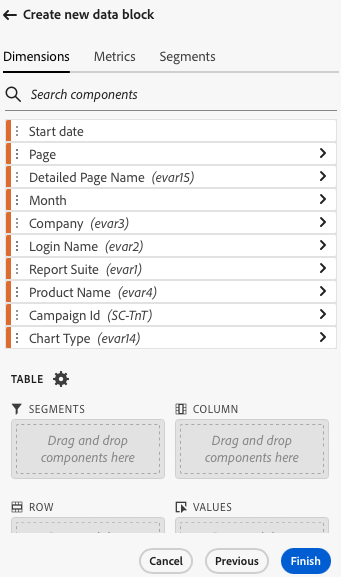
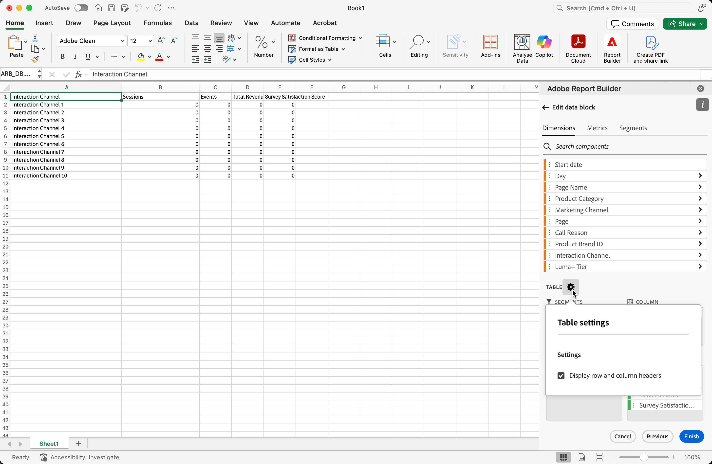
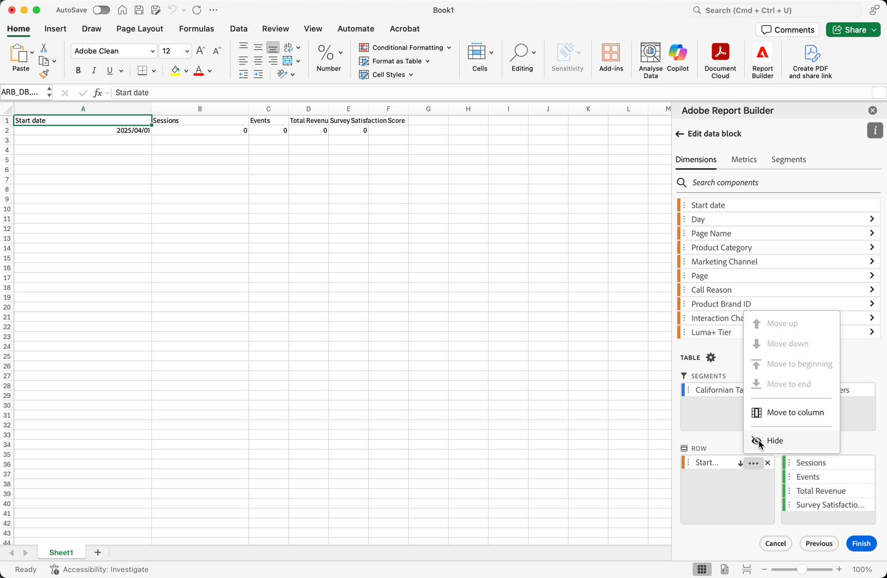

# Creación de un bloque de datos

Un *bloque de datos* es la tabla de datos creada por una sola solicitud de datos. Un libro de Report Builder puede contener varios bloques de datos. Cuando cree un bloque de datos, primero configúrelo y, a continuación, genérelo.

## Configuración del bloque de datos

Configure los parámetros iniciales del bloque de datos para la ubicación del bloque de datos, las vistas de datos y un intervalo de fechas.

1. Seleccione  **[!UICONTROL Crear]**.

   {zoomable="yes"}

1. Configure las variables **[!UICONTROL Ubicación del bloque de datos]**.

   La opción de ubicación del bloque de datos define la ubicación de la hoja de cálculo en la que Report Builder agrega los datos a la hoja de cálculo.

   Para especificar la ubicación del bloque de datos, seleccione una sola celda en la hoja de cálculo o escriba una dirección de celda, como `a3`, `\\\$a3`, `a\\\$3` o `sheet1!a2`. La celda especificada se convierte en la esquina superior izquierda del bloque de datos cuando se recuperan los datos.

   Use  para elegir una ubicación de bloque de datos de la celda seleccionada actualmente en la hoja.

1. Elija las **[!UICONTROL Vistas de datos]**.

   La opción Vistas de datos permite elegir una vista de datos de un menú desplegable o hacer referencia a una vista de datos desde una ubicación de celda.

   Seleccione  para crear una vista de datos desde una celda.

1. Configure las variables **[!UICONTROL Intervalo de fechas]**.

   La opción **[!UICONTROL Intervalo de fechas]** le permite elegir un intervalo de fechas. Los intervalos de fechas pueden ser fijos o móviles.

   Seleccione **[!UICONTROL Calendario]** para elegir un intervalo de datos con  o ingrese un intervalo de fechas manualmente. Opcionalmente, puede elegir un ajuste preestablecido del menú desplegable **[!UICONTROL _Buscar ajustes preestablecidos_]**.

   Seleccione **[!UICONTROL Desde la celda]** para definir los datos de inicio y fin basados en una celda de la hoja actual.

   Para obtener información acerca de las opciones de intervalo de fechas, vea [Seleccionar un intervalo de fechas](select-date-range.md).

1. Seleccione **[!UICONTROL Siguiente]**.

   

   Después de configurar el bloque de datos, puede seleccionar dimensiones, métricas y segmentos para crear el bloque de datos. Las fichas **[!UICONTROL Dimensiones]**, **[!UICONTROL Métricas]** y **[!UICONTROL Segmentos]** se muestran encima del panel **[!UICONTROL Tabla]**.

## Generación del bloque de datos

Para generar el bloque de datos, seleccione los componentes del informe y, a continuación, personalice el diseño.

1. Agregue los componentes **[!UICONTROL Dimensiones]**, **[!UICONTROL Métricas]** y **[!UICONTROL Segmentos]**.

   Desplácese por las listas de componentes o use el campo  **[!UICONTROL _Buscar componentes_]** para localizar componentes. Arrastre y suelte los componentes en el panel [!UICONTROL Tabla] o seleccione un nombre de componente en la lista para agregar el componente al panel [!UICONTROL Tabla].

   Seleccione un componente para añadir el componente a una sección predeterminada de la tabla.

   - Los componentes de Dimension se agregan a la sección  **[!UICONTROL Row]** o a la sección  **[!UICONTROL Column]** si ya tiene una dimensión en las columnas.
   - Los componentes de fecha se han agregado a la sección  **[!UICONTROL Column]**.
   - Los componentes del segmento se han agregado a la sección  **[!UICONTROL Segmentos]**.
   - Los componentes de métricas se han agregado a la sección  **[!UICONTROL Valores]**.

1. Organice los elementos del panel Tabla para personalizar el diseño del bloque de datos.

   Arrastre y suelte los componentes de cada lista en el panel Tabla para reordenar los componentes o seleccione  y seleccione ,  Mover abajo y más para mover los componentes de una lista.

   Cuando se añaden componentes a la tabla, se muestra una vista previa del bloque de datos en la ubicación del bloque de datos en la hoja de cálculo. El diseño de la vista previa del bloque de datos se actualiza automáticamente a medida que se añaden, mueven o eliminan elementos de la tabla.

   

1. Si lo desea, establezca la **[!UICONTROL fecha de inicio]** como dimensión para identificar la fecha de inicio del bloque de datos. Añadir los datos de inicio como dimensión es útil si tiene un informe programado con regularidad que tiene un intervalo de fechas móvil. O si tiene un intervalo de fechas no convencional y necesita ser explícito sobre la fecha de inicio.

   

1. Si lo desea, puede mostrar u ocultar los encabezados de fila y columna. Para ello, haga lo siguiente:

   1. Seleccione el icono **[!UICONTROL Tabla]** configuración.

      

   1. Marque o desmarque la opción para **[!UICONTROL mostrar encabezados de fila y columna]**. Los encabezados se muestran de forma predeterminada.

1. De forma opcional, también puede ocultar o mostrar etiquetas de dimensión y encabezados de métrica. Para ello, haga lo siguiente:

   1. Seleccione  en la etiqueta de dimensión o en el encabezado de columna para mostrar el menú contextual.

      

   1. Seleccione  **[!UICONTROL Hide]** o  **[!UICONTROL Show]** para alternar la etiqueta de dimensión o el encabezado de columna. Todas las etiquetas se muestran de forma predeterminada.

1. Seleccione **[!UICONTROL Finalizar]** para finalizar la configuración del bloque de datos.

1. Se muestra un mensaje de procesamiento **[!UICONTROL #BUSY]** mientras se recuperan los datos del análisis.

   

1. Report Builder recupera los datos y muestra el bloque de datos completado en la hoja de cálculo.

   

>[!MORELIKETHIS]
>
>[Seleccionar una vista de datos](select-data-view.md)
>[Seleccione un intervalo de fecha](select-date-range.md)
>[Filtrar dimensiones](filter-dimensions.md)
>[Trabajar con segmentos](work-with-filters.md)
>
