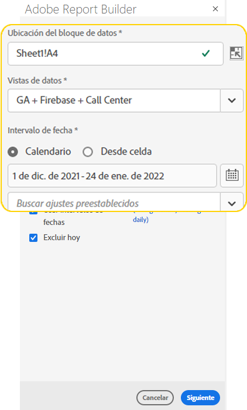
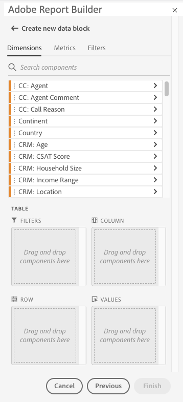
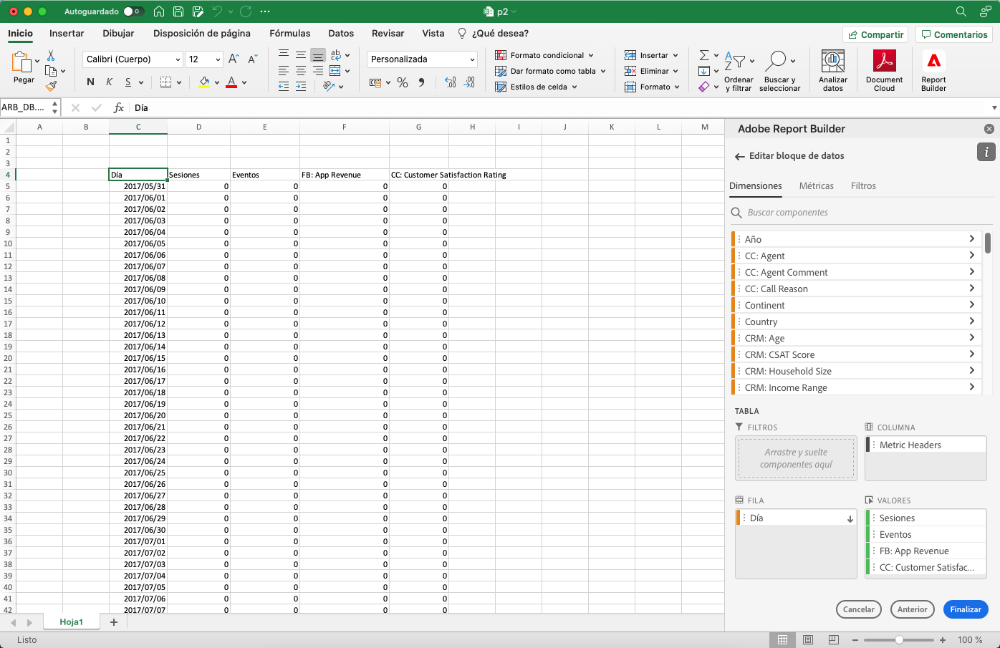
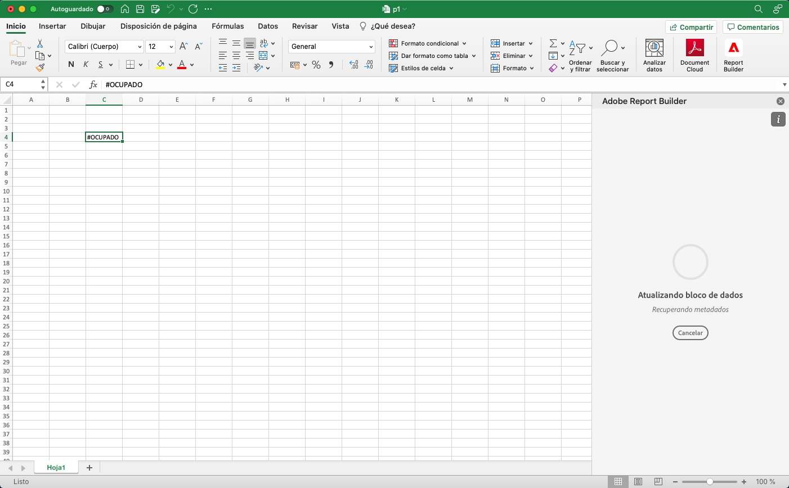
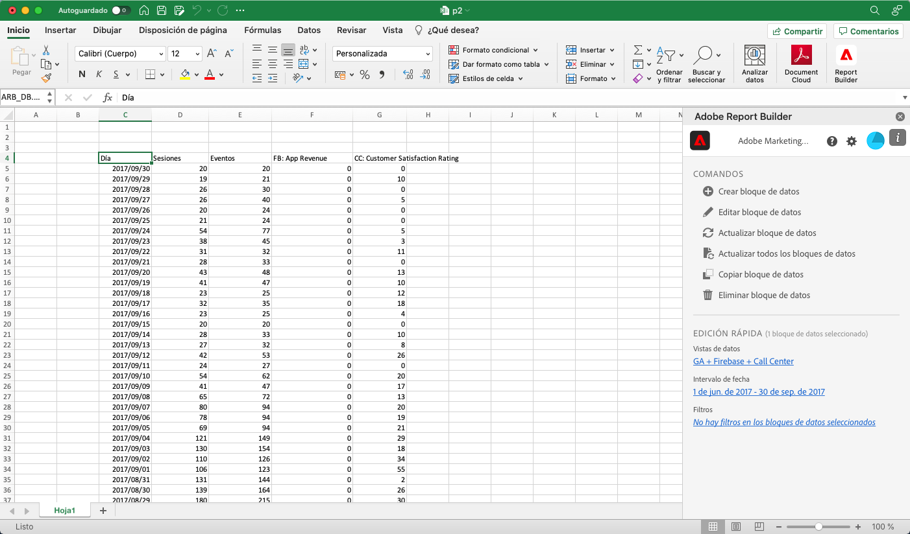

# Creación de un bloque de datos

Un *bloque de datos* es la tabla de datos creada por una sola solicitud de datos. Un libro de Report Builder puede contener varios bloques de datos. Cuando cree un bloque de datos, primero configúrelo y, a continuación, genérelo.

## Configuración del bloque de datos

Configure los parámetros iniciales del bloque de datos para la ubicación del bloque de datos, las vistas de datos y un intervalo de fechas.

1. Haga clic en **Crear bloque de datos**.

   

1. Configure las variables **Ubicación del bloque de datos**.

   La opción de ubicación del bloque de datos define la ubicación de la hoja de cálculo donde Report Builder añade los datos a la hoja de cálculo.

   Para especificar la ubicación del bloque de datos, seleccione una sola celda en la hoja de cálculo o introduzca una dirección de celda como a3, \\\$a3, a\\\$3 o sheet1!a2. La celda especificada será la esquina superior izquierda del bloque de datos cuando se recuperen los datos.

1. Elija las **Vistas de datos**.

   La opción Vistas de datos permite elegir una vista de datos de un menú desplegable o hacer referencia a una vista de datos desde una ubicación de celda.

1. Configure las variables **Intervalo de fechas**.

   La opción Intervalo de fechas permite elegir un intervalo de fechas. Los intervalos de fechas pueden ser fijos o móviles. Para obtener información sobre las opciones de rango de datos, consulte [Seleccionar un intervalo de fecha](select-date-range.md).

1. Haga clic en **Siguiente**.

   

   Después de configurar el bloque de datos, puede seleccionar dimensiones, métricas y filtros para crear el bloque de datos. Las pestañas Dimensión, Métricas y Filtros se muestran encima del panel Generador de tablas.
<!--
    
  -->

## Generación del bloque de datos

Para generar el bloque de datos, seleccione los componentes del informe y, a continuación, personalice el diseño.

1. Añada dimensiones, métricas y filtros.

   Desplácese por las listas de componentes o utilice el campo **búsqueda** para localizar componentes. Arrastre y suelte los componentes en el panel Tabla o haga doble clic en un nombre de componente de la lista para añadirlo automáticamente al panel Tabla.

   Haga doble clic en un componente para añadirlo a una sección predeterminada de la tabla.

   - Los componentes de Dimensión se añaden a la sección Fila o a la sección Columna si ya tiene una dimensión en las columnas.
   - Los componentes de fecha se añaden a la sección Columna.
   - Los componentes de filtro se añaden a la sección Filtros.

1. Organice los elementos del panel Tabla para personalizar el diseño del bloque de datos.

   Arrastre y suelte los componentes en el panel Tabla para reordenarlos o haga clic con el botón derecho en el nombre de un componente y seleccione en el menú de opciones.

   Cuando se añaden componentes a la tabla, se muestra una vista previa del bloque de datos en la ubicación del bloque de datos en la hoja de cálculo. El diseño de la vista previa del bloque de datos se actualiza automáticamente a medida que se añaden, mueven o eliminan elementos de la tabla.

   

1. Haga clic en **Finalizar**.

   Se muestra un mensaje de procesamiento mientras se recuperan los datos de los análisis.

   

   Report Builder recupera los datos y muestra el bloque de datos completado en la hoja de cálculo.

   
