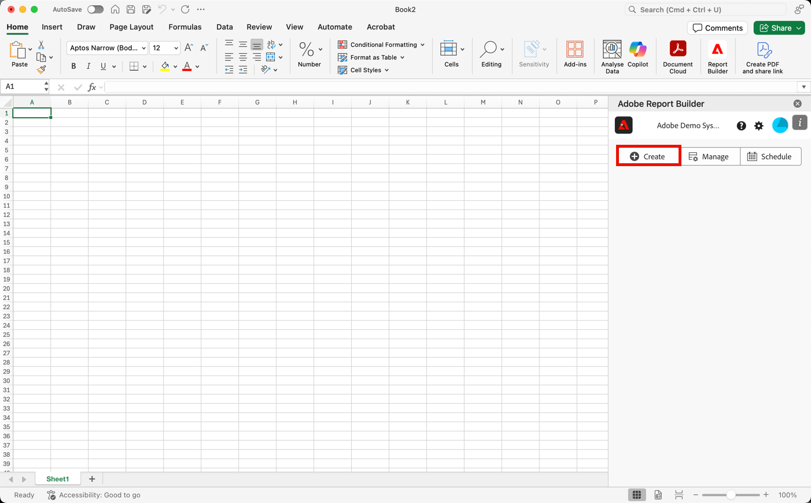

# Creación de un bloque de datos

Un *bloque de datos* es la tabla de datos creada por una sola solicitud de datos. Un libro de Report Builder puede contener varios bloques de datos. Cuando cree un bloque de datos, primero configúrelo y, a continuación, genérelo.

## Configuración del bloque de datos

Configure los parámetros iniciales del bloque de datos para la ubicación del bloque de datos, las vistas de datos y un intervalo de fechas.

1. Seleccione  **[!UICONTROL Crear]**.

   

1. Configure las variables **[!UICONTROL Ubicación del bloque de datos]**.

   La opción de ubicación del bloque de datos define la ubicación de la hoja de cálculo donde Report Builder añade los datos a la hoja de cálculo.

   Para especificar la ubicación del bloque de datos, seleccione una sola celda en la hoja de cálculo o escriba una dirección de celda como `a3`, `\\\$a3`, `a\\\$3` o `sheet1!a2`. La celda especificada será la esquina superior izquierda del bloque de datos cuando se recuperen los datos.

   Use  para elegir una ubicación de bloque de datos de la celda seleccionada actualmente en la hoja.

1. Elija las **[!UICONTROL Vistas de datos]**.

   La opción Vistas de datos permite elegir una vista de datos de un menú desplegable o hacer referencia a una vista de datos desde una ubicación de celda.

   Seleccione  para crear una vista de datos desde una celda.

1. Configure las variables **[!UICONTROL Intervalo de fechas]**.

   La opción Intervalo de fechas permite elegir un intervalo de fechas. Los intervalos de fechas pueden ser fijos o móviles. Para obtener información acerca de las opciones de intervalo de fechas, vea [Seleccionar un intervalo de fechas](select-date-range.md).

   Seleccione **[!UICONTROL Calendario]** para elegir un intervalo de datos con  o ingrese un intervalo de fechas manualmente. Si lo desea, puede elegir un ajuste preestablecido en el menú desplegable Buscar ajustes preestablecidos.

   Seleccione **[!UICONTROL Desde celda]** para definir los datos iniciales y finales basados en una celda de la hoja actual.

1. Seleccione **Siguiente**.

   

   Después de configurar el bloque de datos, puede seleccionar dimensiones, métricas y segmentos para crear el bloque de datos. Las pestañas Dimensión, Métricas y Segmentos se muestran encima del panel Generador de tablas.

## Generación del bloque de datos

Para generar el bloque de datos, seleccione los componentes del informe y, a continuación, personalice el diseño.

1. Añada dimensiones, métricas y segmentos.

   Desplácese por las listas de componentes o utilice el campo **búsqueda** para localizar componentes. Arrastre y suelte los componentes en el panel Tabla o haga doble clic en un nombre de componente de la lista para añadirlo automáticamente al panel Tabla.

   Haga doble clic en un componente para añadirlo a una sección predeterminada de la tabla.

   - Los componentes de Dimensión se añaden a la sección Fila o a la sección Columna si ya tiene una dimensión en las columnas.
   - Los componentes de fecha se añaden a la sección Columna.
   - Los componentes del segmento se añaden a la sección Segmentos.

### Fecha de inicio as a Dimension

Establezca la Fecha de inicio como una dimensión para identificar claramente la fecha de inicio del bloque de datos. Esto resulta útil si tiene un informe programado regularmente que tiene un intervalo de fechas móvil o si tiene un intervalo de fechas no convencional y necesita no mencionar la fecha de inicio.

1. Organice los elementos del panel Tabla para personalizar el diseño del bloque de datos.

   Arrastre y suelte los componentes en el panel Tabla para reordenarlos o haga clic con el botón derecho en el nombre de un componente y seleccione en el menú de opciones.

   Cuando se añaden componentes a la tabla, se muestra una vista previa del bloque de datos en la ubicación del bloque de datos en la hoja de cálculo. El diseño de la vista previa del bloque de datos se actualiza automáticamente a medida que se añaden, mueven o eliminan elementos de la tabla.

   

### Mostrar u ocultar encabezados de fila y columna

1. Seleccione el icono **[!UICONTROL Tabla]** configuración.

   

1. Marque o desmarque la opción Mostrar encabezados de fila y columna. Los encabezados se muestran de forma predeterminada.

### Ocultar o mostrar etiquetas de dimensión y encabezados de métrica

Seleccione el icono de puntos suspensivos en las dimensiones o en los encabezados de columna para mostrar la configuración.

1. Seleccione  **[!UICONTROL Hide]** o  **[!UICONTROL Show]** para alternar las etiquetas de dimensión o los encabezados de columna. Todas las etiquetas se muestran de forma predeterminada.

1. Seleccione **[!UICONTROL Finalizar]**.

Se muestra un mensaje de procesamiento mientras se recuperan los datos de los análisis.

Report Builder recupera los datos y muestra el bloque de datos completado en la hoja de cálculo.

