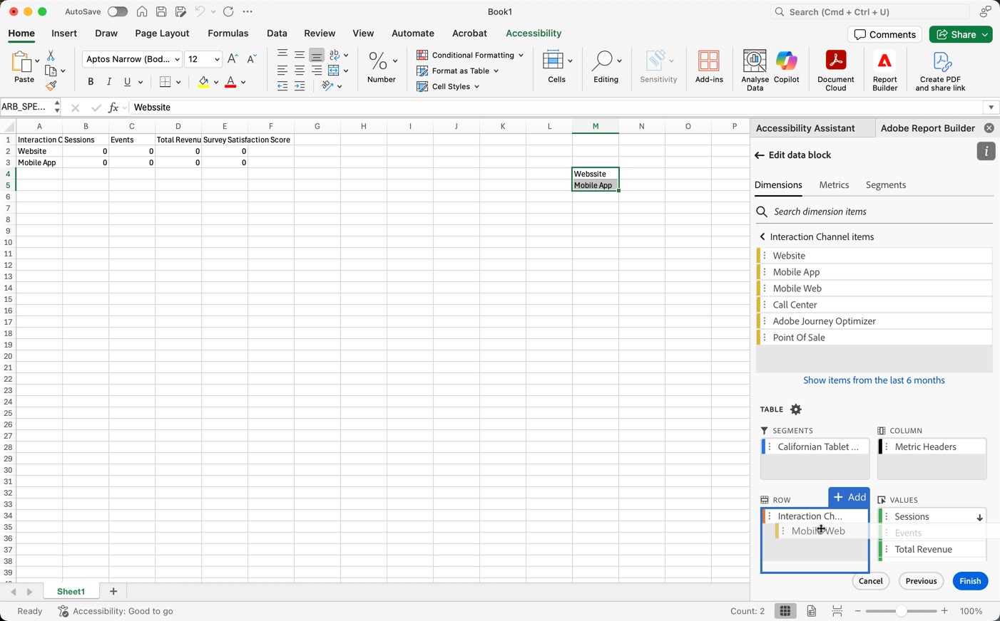

# Filtrar dimensiones

De forma predeterminada, cada elemento de dimensión de la tabla devuelve los 10 elementos principales para esa dimensión.

Para cambiar los elementos de dimensión devueltos para cada dimensión:

1. Seleccione una celda en el bloque de datos.

1. Seleccione  **[!UICONTROL Editar bloque de datos]** en el panel **[!UICONTROL Comandos]**.

1. Seleccione **[!UICONTROL Siguiente]** para mostrar la ficha **[!UICONTROL Dimensiones]**.

1. Seleccione  junto al nombre de un componente en la tabla.

   {zoomable="yes"}

1. Seleccione **[!UICONTROL Filtrar dimensión]** en el menú emergente para mostrar el panel **[!UICONTROL Filtrar dimensión]**.

1. Seleccione **Más popular** o **Específico** como **[!UICONTROL Tipo]**.

   {zoomable="yes"}

1. Seleccione las opciones adecuadas en función del [tipo de filtro](#filter-type) elegido.

1. Seleccione **[!UICONTROL Aplicar]** para agregar el filtro.

1. Report Builder muestra una notificación para confirmar el filtro añadido.

Para mostrar los filtros aplicados, pase el puntero por encima de una dimensión. Las dimensiones con filtros aplicados muestran un icono de filtro  junto al nombre de la dimensión.

## Cambio del filtro y el orden

Aparece  o  junto a la métrica utilizada para filtrar y ordenar el bloque de datos. La dirección de la flecha indica si la métrica se ordena en orden ascendente o descendente.

Para cambiar el criterio de ordenación:

- Seleccione  o  junto a la métrica para alternar el criterio de ordenación.

Para cambiar la métrica utilizada para filtrar y ordenar el bloque de datos:

1. Pase el puntero por encima del componente de métrica deseado en el Generador de tablas para ver las opciones adicionales.

2. Seleccione  para la métrica preferida.

   {zoomable="yes"}

## Tipo de filtro

Existen dos maneras de filtrar los elementos de dimensión: [Más popular](#most-popular) y [Específico](#specific-filtering)

### **[!UICONTROL El más popular]**

La opción **[!UICONTROL Más popular]** le permite filtrar dinámicamente elementos de dimensión en función de los valores de las métricas. El más popular devuelve los elementos de dimensión de mayor clasificación en función de los valores de las métricas. De forma predeterminada, se muestran los 10 primeros elementos de dimensión, ordenados por la primera métrica añadida al bloque de datos.

{zoomable="yes"}

#### Opciones de página y filas

Utilice los campos **[!UICONTROL Página]** y **[!UICONTROL Filas]** para dividir los datos en grupos secuenciales o páginas. Esta función le permite extraer en el informe valores de fila clasificados que no sean los valores más altos. Y es especialmente útil para extraer datos que superen el límite de 50 000 filas.

El valor predeterminado de la página es `1` y de las filas es `10`. Estos valores predeterminados implican que cada página tiene 10 filas de datos. La página 1 devuelve los 10 elementos principales, la página 2 devuelve los 10 elementos siguientes, etc.

En la tabla siguiente se muestran ejemplos de valores de página, fila y el resultado.

| Página | Fila | Output |
|------|--------|----------------------|
| 1 | 10 | Primeros 10 elementos |
| 2 | 10 | Elementos 11 a 20 |
| 1 | 100 | Primeros 100 elementos |
| 2 | 100 | Elementos 101 a 200 |
| 2 | 50 000 | Elementos 50 001 a 100 000 |

En la tabla siguiente se muestran los valores mínimo y máximo de página y filas.

|       | Valores mínimos | Valores máximos |
|-------|---------------:|---------------:|
| Página de inicio | 1 | 50 millones |
| Número de filas | 1 | 50 000 |

#### Incluir “Sin valor”

En Customer Journey Analytics, algunas dimensiones recopilan una entrada *Sin valor*. La configuración **[!UICONTROL Incluir &quot;Sin valor&quot;]** le permite excluir estos valores de los informes. Por ejemplo, puede crear una clasificación como la de Nombre del producto basada en la clave SKU del producto. Si no se ha configurado un SKU de producto específico con su clasificación de nombre de producto específica, su valor de nombre de producto se establece en *Ningún valor*.

**[!UICONTROL Incluir &quot;Sin valor&quot;]** está seleccionado de forma predeterminada. Anule la selección de esta opción para excluir las entradas sin valor.

#### Filtrado por criterios

Puede filtrar los elementos de dimensión en función de si se cumplen todos los criterios o alguno.

Para definir criterios de filtrado:

1. Seleccione un operador en el menú desplegable del operador. De forma predeterminada **[!UICONTROL Contiene la frase]** seleccionada

   {zoomable="yes"}

1. Introduzca un término de búsqueda.

1. Seleccione  **[!UICONTROL Agregar fila]** para confirmar la selección y agregar otro elemento de criterio.

1. Seleccione  para quitar un elemento de criterio.

Puede incluir hasta 10 elementos de criterio.

### **[!UICONTROL específico]**

La opción **[!UICONTROL Specific]** le permite crear una lista fija de elementos de dimensión para cada dimensión. Utilice el tipo de filtro **[!UICONTROL Específico]** para especificar los elementos de dimensión exactos que se incluirán en el filtro. Puede seleccionar elementos de una lista o de un rango de celdas.

{zoomable="yes"}

#### De la lista

1. Seleccione la opción **[!UICONTROL De la lista]** para buscar y seleccionar elementos de dimensión.

   Al seleccionar la opción **De la lista**, la lista **[!UICONTROL Elementos de Dimension]** se rellena con elementos de dimensión ordenados por número de eventos.

   {zoomable="yes"}

1. Escriba un término de búsqueda en  **[!UICONTROL _Agregar elemento_]** para buscar en la lista.

1. Para buscar un elemento no incluido en los últimos 90 días de datos, seleccione **[!UICONTROL Mostrar elementos de los últimos 6 meses]** para ampliar la búsqueda. Después de cargar los datos de los últimos 6 meses, Report Builder actualiza el vínculo a **[!UICONTROL Mostrar elementos de los últimos 18 meses]**.

1. Para eliminar un elemento de la lista **[!UICONTROL Elementos seleccionados]**, seleccione .

1. Para mover un elemento en la lista **[!UICONTROL Elementos seleccionados]**, arrastre y suelte el elemento o seleccione  para mostrar el menú contextual y seleccione entre las opciones de movimiento.

1. Seleccione **[!UICONTROL Aplicar]**.

Report Builder actualiza la lista para mostrar el filtro específico que ha aplicado.

#### Desde el rango de celdas

Seleccione la opción **Desde el rango de celdas** para elegir un rango de celdas que contenga la lista de elementos de dimensiones que desea que coincidan.

{zoomable="yes"}

Cuando seleccione un rango de celdas, tenga en cuenta las restricciones siguientes:

- El rango debe tener al menos una celda.
- El rango no puede tener más de 50 000 celdas.
- El rango debe estar en una sola fila o columna sin interrupciones.

La selección puede contener celdas vacías o con valores que no coinciden con un elemento de dimensión específico.

### Filtrado rápido de una dimensión

Para filtrar una dimensión para la que actualmente no se aplica ningún filtro:

1. Seleccione  para una dimensión. Por ejemplo, **[!UICONTROL canal de interacción]**.

1. Seleccione dos veces elementos de dimensión para agregarlos al filtro. También puede seleccionar uno o más elementos de dimensión y arrastrar y soltar la selección en la sección  **[!UICONTROL Row]**.

   {zoomable="yes"}

