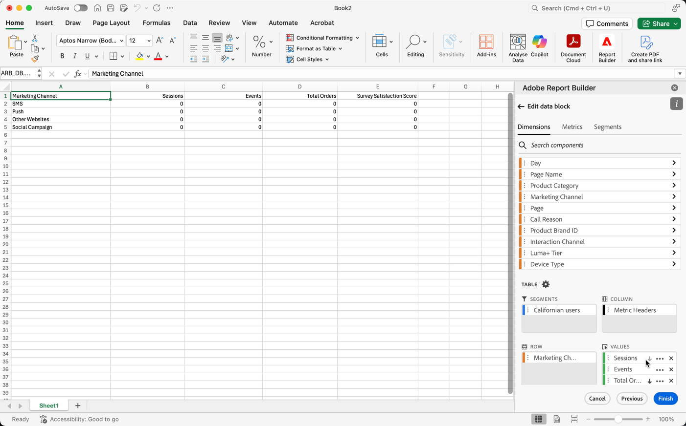

# Filtrar dimensiones

De forma predeterminada, cada elemento de dimensión de la tabla devuelve los 10 elementos principales para esa dimensión.

Para cambiar los elementos de dimensión devueltos para cada dimensión

1. Seleccione un bloque de datos y haga clic en Editar bloque de datos en el panel COMANDOS.

1. Haga clic en Siguiente para mostrar la pestaña Dimensiones.

1. Haga clic en el icono **...** junto al nombre de un componente en la tabla.

   

1. Seleccione **Dimensión del filtro** en el menú emergente para mostrar el panel **Dimensión del filtro**.

1. Seleccione **El más popular** o **Específico**.

   

1. Seleccione las opciones adecuadas en función del tipo de filtro elegido.

1. Haga clic en **Aplicar** para añadir el filtro.

   Report Builder muestra una notificación para confirmar el filtro añadido.

Para mostrar los filtros aplicados, pase el ratón sobre una dimensión. Las dimensiones con filtros aplicados muestran un icono de filtro a la derecha del nombre de la dimensión.

## Tipo de filtro

Existen dos formas de filtrar los elementos de dimensión: el más popular y específico.

## Más popular

La opción el más popular le permite filtrar dinámicamente los elementos de dimensión en función de los valores de las métricas. El filtrado por el más popular devuelve los elementos de dimensión de mayor clasificación en función de los valores de las métricas. De forma predeterminada, se muestran los 10 primeros elementos de dimensión, ordenados por la primera métrica añadida al bloque de datos.

### Opciones de página y filas

Utilice los campos **Página** y **Filas** para dividir los datos en grupos secuenciales o páginas. Esto le permite extraer en el informe valores de fila clasificados que no sean los valores más altos. Esta función es especialmente útil para extraer datos que superen el límite de 50 000 filas.

#### Valores predeterminados de página y filas

- Página = 1
- Filas = 10

La configuración predeterminada Página y Filas identifica que cada página tiene 10 filas de datos. La página 1 devuelve los 10 elementos principales, la página 2 devuelve los 10 elementos siguientes, etc.

En la tabla siguiente se muestran ejemplos de valores de página, fila y el resultado.

| Página | Fila | Output |
|------|--------|----------------------|
| 1 | 10 | Primeros 10 elementos |
| 2 | 10 | Elementos 11 a 20 |
| 1 | 100 | Primeros 100 elementos |
| 2 | 100 | Elementos 101 a 200 |
| 2 | 50 000 | Elementos 50 001 a 100 000 |

#### Valores mínimos y máximos

- Página de inicio: mín. = 1, máx.: 50 millones
- Número de filas: mín. = 1, máx.: 50 000

### Incluir “Sin valor”

En Customer Journey Analytics, algunas dimensiones recopilan una entrada “sin valor”. Este filtro le permite excluir estos valores de los informes. Por ejemplo, puede crear una clasificación como la de Nombre del producto basada en la clave SKU del producto. Si no se ha configurado un SKU de producto específico con su clasificación de nombre de producto específica, su valor de nombre de producto se establece en “sin valor”.

Incluir “**Sin valor**” está seleccionado de forma predeterminada. Anule la selección de esta opción para excluir las entradas sin valor.

### Filtrado por criterios

Puede filtrar los elementos de dimensión en función de si se cumplen todos los criterios o alguno.

Definición de criterios de filtrado

1. Seleccione un operador en la lista desplegable.

   

1. Escriba un valor en el campo de búsqueda.

1. Haga clic en Agregar fila para confirmar la selección y añadir otro elemento de criterio.

1. Haga clic en el icono Eliminar para quitar un elemento de criterio.

   Puede incluir hasta 10 elementos de criterio.

### Cambio del filtro y el orden

Aparece una flecha junto a la métrica utilizada para filtrar y ordenar el bloque de datos. La dirección de la flecha indica si la métrica se ordena de mayor a menor o menor a mayor.

Para cambiar la dirección del orden, haga clic en la flecha situada junto a la métrica. 

Para cambiar la métrica utilizada para filtrar y ordenar el bloque de datos,

1. Pase el ratón sobre el componente de métrica deseado en el Generador de tablas para ver las opciones adicionales.

2. Haga clic en la flecha de la métrica preferida. 

   

## Filtro específico

La opción Específico permite crear una lista fija de elementos de dimensión para cada dimensión. Utilice el tipo de filtro **Específico** para especificar los elementos de dimensión exactos que se incluirán en el filtro. Puede seleccionar elementos de una lista o de un rango de celdas.

### De la lista

1. Seleccione la opción **De la lista** para buscar y seleccionar elementos de dimensión.

   Al seleccionar la variable **De la lista**, la lista se rellena con elementos de dimensión con la mayoría de eventos primero.

   

   La lista **Elementos disponibles** se ordena de elementos de dimensión con la mayor cantidad de eventos a aquellos con la menor cantidad.

1. Escriba un término de búsqueda en el campo **Añadir elemento** para buscar en la lista.

1. Para buscar un elemento no incluido en los últimos 90 días de datos, haga clic en **Mostrar los elementos de los últimos 6 meses** para ampliar la búsqueda.

   

   Después de cargar los datos de los últimos seis meses, Report Builder actualiza el vínculo a **Mostrar artículos de los últimos 18 meses**.

1. Seleccionar un elemento de dimensión.

   Los elementos de dimensión seleccionados se añaden automáticamente a la lista **Elementos seleccionados**.

   

   Para quitar un elemento de la lista, haga clic en el icono eliminar.

   Para mover un elemento en la lista, arrastre y suelte el elemento o haga clic en ... para mostrar el menú de mover.

   

1. Haga clic en **Aplicar**

   Report Builder actualiza la lista para mostrar el filtro específico que ha aplicado.

### Desde el rango de celdas

Seleccione la opción **Desde el rango de celdas** para elegir un rango de celdas que contenga la lista de elementos de dimensiones que desea que coincidan.

Cuando seleccione un rango de celdas, tenga en cuenta las restricciones siguientes:

- El rango debe tener al menos una celda.
- El rango no puede tener más de 50 000 celdas.
- El rango debe estar en una sola fila o columna sin interrupciones.

La selección puede contener celdas vacías o con valores que no coinciden con un elemento de dimensión específico.

### Desde la pestaña Dimensiones del Generador de tablas

En la pestaña **Dimensiones**, haga clic en el icono de cheurón situado junto al nombre de una dimensión para ver la lista de elementos que contiene.

Puede arrastrar y soltar elementos en la **Tabla** o hacer doble clic en un nombre de elemento para añadirlo al Generador de **tablas**.
