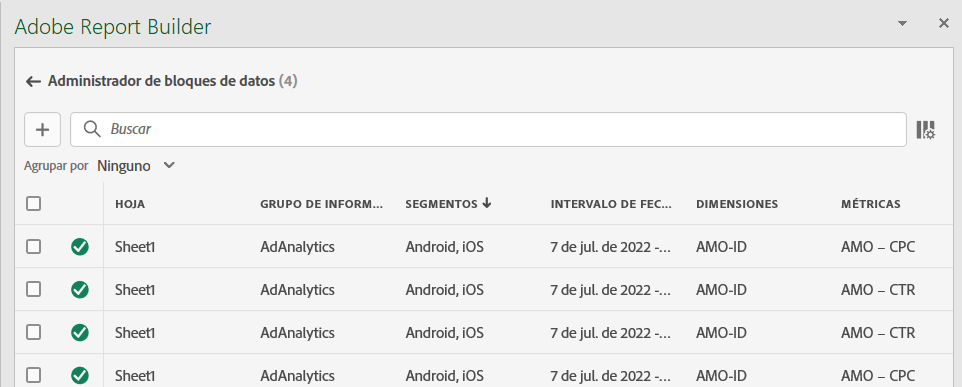
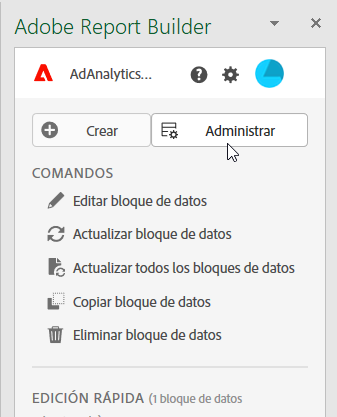
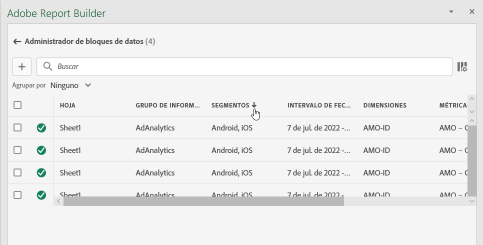
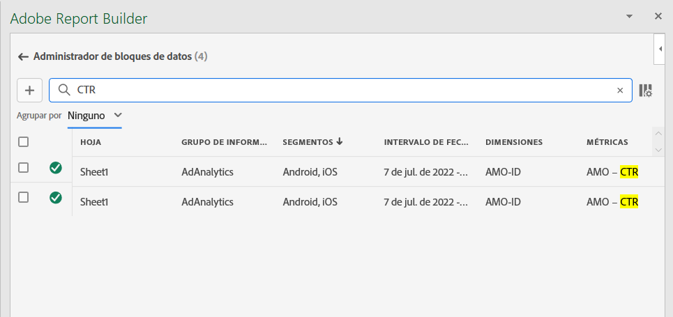
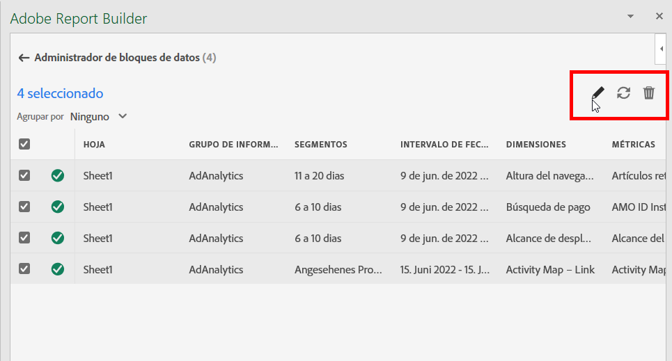
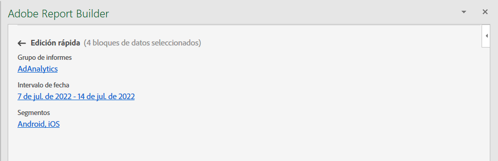
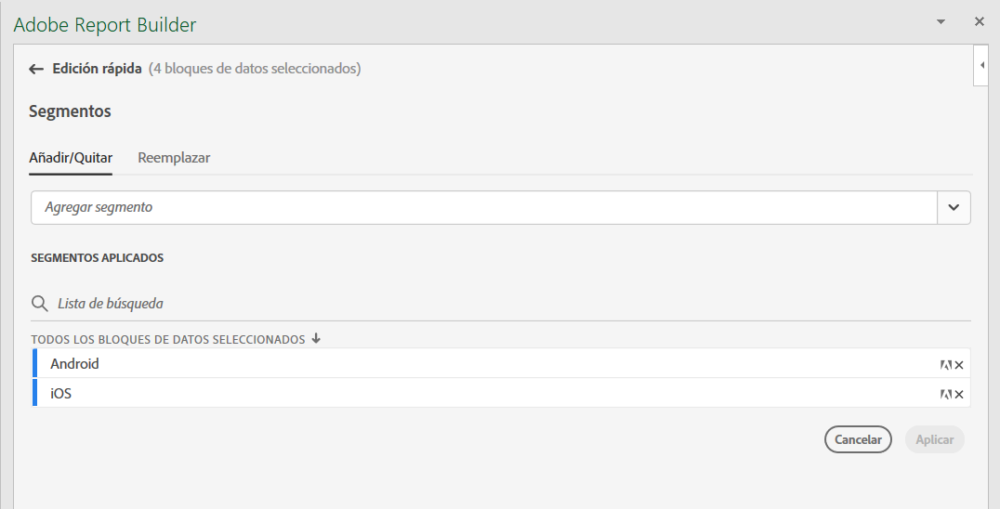
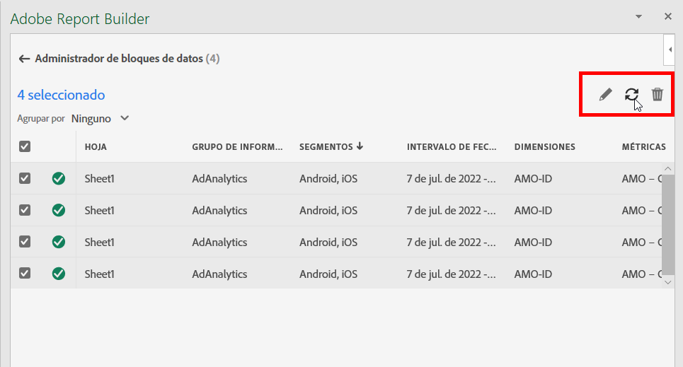
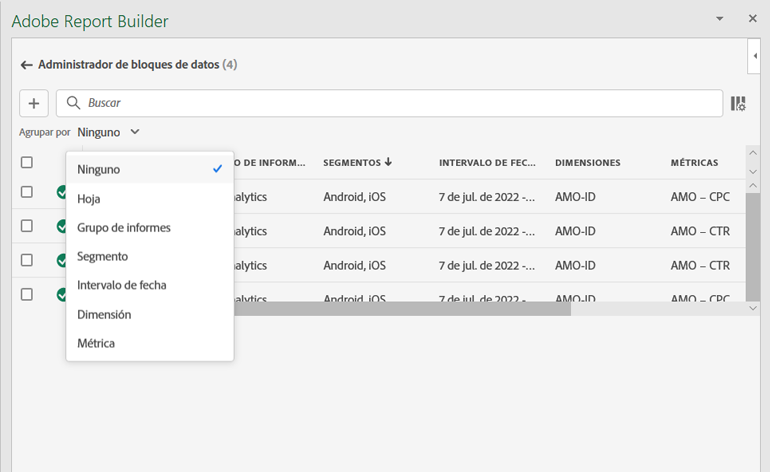
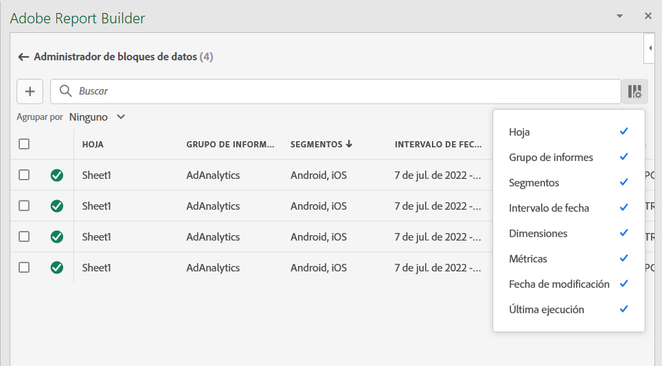

# Administrar bloques de datos en el Report Builder

Puede ver y administrar todos los bloques de datos de un libro mediante el Administrador de bloques de datos. El Administrador de bloques de datos proporciona funciones de búsqueda, filtro y clasificación que le permiten localizar rápidamente bloques de datos específicos. Después de seleccionar uno o más bloques de datos, puede editar, eliminar o actualizar los bloques de datos seleccionados.

## Ver bloques de datos

Haga clic en **Administrar** para ver una lista de todos los bloques de datos de un libro.

El Administrador de bloques de datos enumera todos los bloques de datos presentes en un libro. 

## Ordenar la lista Bloques de datos

Puede ordenar la lista de bloqueados de datos por una columna mostrada. Por ejemplo, puede ordenar la lista de bloqueados de datos por grupos de informes, filtros, intervalo de fechas y otras variables.

Para ordenar la lista de bloqueados de datos, haga clic en un encabezado de columna.

## Búsqueda en la Lista de bloqueados de datos

Utilice el campo Search para localizar cualquier cosa en la tabla de bloques de datos. Por ejemplo, puede buscar métricas contenidas en los bloques de datos o en el grupo de informes. También puede buscar fechas que aparezcan en las columnas de intervalo de fechas, fecha de modificación o fecha de última ejecución.

## Editar bloques de datos

Puede editar la vista de datos, el intervalo de fechas o los filtros aplicados a uno o varios bloques de datos.

Por ejemplo, puede reemplazar un filtro existente con un nuevo filtro en uno o más bloques de datos.

1. Seleccione los bloques de datos que desea actualizar.

Puede seleccionar la casilla de verificación de nivel superior para seleccionar todos los bloques de datos o puede seleccionar bloques de datos individuales.

1. Haga clic en el icono de edición para mostrar la ventana de edición rápida.

1. Seleccione un vínculo de filtro para actualizar vistas de datos, intervalos de fechas o filtros.

## Actualizar bloques de datos

Haga clic en el icono de actualización para actualizar los bloques de datos de la lista.

Para comprobar si se actualiza un bloque de datos, consulte el icono de estado de actualización. Una marca de verificación en un círculo verde  indica que la actualización del bloque de datos se ha realizado correctamente. Un bloque de datos que no se haya podido actualizar mostrará un icono de advertencia .  Esto facilita la identificación si algún bloque de datos tiene errores.

## Eliminar un bloque de datos

Haga clic en el icono de la papelera para eliminar un bloque de datos seleccionado.

## Bloques de datos de grupo

Haga clic en los títulos de las columnas para agrupar bloques de datos o seleccione un nombre de columna de la columna **Agrupar por** *Nombre* lista.

## Modificación de la vista Administrador de bloques de datos

Puede modificar qué columnas están visibles en la ventana Administrador de bloques de datos .

Haga clic en la lista de columnas  para seleccionar qué columnas aparecen en el Administrador de bloques de datos. Seleccione un nombre de columna para mostrar la columna. Anule la selección del nombre de columna para quitar la columna de la vista.

