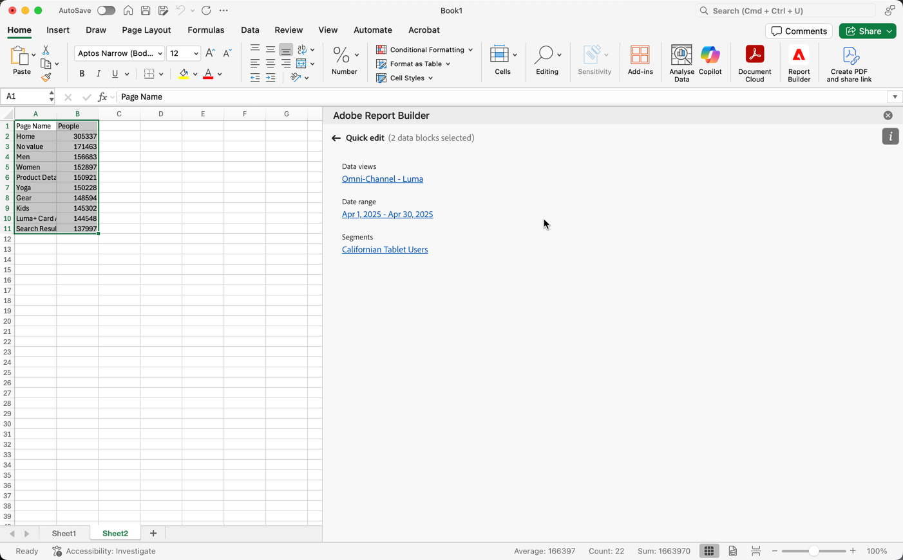

# Administrar bloques de datos en Report Builder

Puede ver y administrar todos los bloques de datos de un libro mediante el Administrador de bloques de datos. El Administrador de bloques de datos proporciona capacidades de búsqueda, filtro y ordenación que le permiten localizar rápidamente bloques de datos concretos. Después de seleccionar uno o más bloques de datos, puede editar, eliminar o actualizar los bloques de datos seleccionados.

## Ver bloques de datos

Haga clic en **Administrar** para ver una lista de todos los bloques de datos de un libro.

El Administrador de bloques de datos muestra todos los bloques de datos presentes en un libro. 

## Ordenar la lista de bloques de datos

Puede ordenar la lista de bloques de datos por una columna mostrada. Por ejemplo, puede ordenar la lista de bloqueados de datos por vistas de datos, filtros, intervalo de fechas y otras variables.

Para ordenar la lista de bloques de datos, haga clic en un encabezado de columna.

## Buscar en la lista de bloques de datos

Utilice el campo Buscar para localizar cualquier contenido en la tabla de bloques de datos. Por ejemplo, puede buscar métricas contenidas en los bloques de datos o en la vista de datos. También puede buscar fechas que aparezcan en las columnas de intervalo de fechas, fecha de modificación o fecha de última ejecución.

## Editar bloques de datos

Puede editar la vista de datos, el intervalo de fechas o los filtros aplicados a uno o varios bloques de datos.

Por ejemplo, puede reemplazar un filtro existente con un nuevo filtro en uno o más bloques de datos.

1. Seleccione los bloques de datos que desea actualizar. Puede seleccionar la casilla de verificación de nivel superior para seleccionar todos los bloques de datos o puede seleccionar bloques de datos individuales.

   

1. Haga clic en el icono de edición para mostrar la ventana de edición rápida.

   

1. Seleccione un vínculo de filtro para actualizar vistas de datos, intervalos de fechas o filtros.

   

## Actualizar bloques de datos

Haga clic en el icono de actualización para actualizar los bloques de datos de la lista.

Para comprobar si un bloque de datos se ha actualizado, consulte el icono de estado de la actualización. Una marca de verificación en un círculo verde  indica que la actualización del bloque de datos se ha realizado correctamente. Un bloque de datos que no se haya podido actualizar mostrará un icono de advertencia .  Esto facilita la identificación si algún bloque de datos contiene errores.

## Eliminar un bloque de datos

Haga clic en el icono de la papelera para eliminar un bloque de datos seleccionado.

## Agrupar bloques de datos

Puede agrupar bloques de datos mediante el menú desplegable **Agrupar por** o bien puede hacer clic en un título de columna. Para ordenar los bloques de datos por columna, haga clic en el título de la columna. Para agrupar bloques de datos por grupos, seleccione un nombre de grupo en el menú desplegable **Agrupar por**. Por ejemplo, la captura de pantalla siguiente muestra bloques de datos agrupados por hoja. Muestra los bloques de datos agrupados por Hoja1 y Hoja2.  Esto resulta útil, por ejemplo, en el caso de uso de reemplazo de filtros. Si se han aplicado varios filtros a cada bloque de datos, resulta útil crear un grupo que contenga todos los bloques de datos que desea reemplazar. A continuación, puede seleccionarlos y editarlos fácilmente de una vez.

## Modificar la vista del Administrador de bloques de datos

Puede modificar qué columnas están visibles en la ventana Administrador de bloques de datos.

Haga clic en el icono   de la lista de columnas para seleccionar qué columnas aparecen en el Administrador de bloques de datos. Seleccione un nombre de columna para mostrar la columna. Anule la selección del nombre de columna para quitar la columna de la vista.

