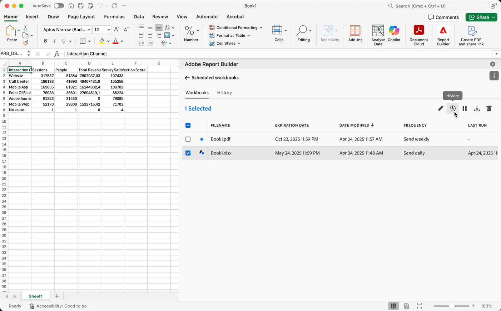

# Administrar libros de trabajo programados

Puede programar un libro para compartirlo por correo electrónico o exportarlo a un destino de nube, tal como se describe en los siguientes artículos:

* [Programar libros compartiéndolos por correo electrónico](/help/report-builder/schedule-reportbuilder.md)

* [Programar libros para exportarlos a destinos en la nube](/help/report-builder/report-builder-export.md)

Las secciones siguientes describen cómo administrar libros después de programarlos:

## Ver y administrar libros programados

Puede ver y administrar todos los libros programados en la ficha **[!UICONTROL Libros]**.

1. Seleccione **[!UICONTROL Horario]** en Report Builder Hub

1. Seleccione la ficha **[!UICONTROL Libros]**. Verá una lista de todos los libros programados.

   {zoomable="yes"}

   Puede pasar el ratón sobre el icono para ver el estado de un libro programado.

   Use  para buscar libros programados específicos.
Use  para definir qué columnas mostrar.

1. Seleccione uno o varios libros.

   {zoomable="yes"}

   Las opciones disponibles son las siguientes:

   | Opción | Descripción |
   |---|---|
   |  | Editar la programación de un libro seleccionado. |
   |  | Muestra el historial de los libros seleccionados. |
   |  | Pausar la programación de los libros seleccionados. |
   |  | Reanudar la programación de los libros seleccionados. |
   |  | Descargue el libro seleccionado en un nuevo libro. |
   |  | Eliminar la programación de los libros seleccionados. |

## Historial y estado de los libros programados

Puede ver el historial y el estado de los libros programados en la ficha **[!UICONTROL Historial]**.

1. Seleccione **[!UICONTROL Horario]** en Report Builder Hub.

1. Seleccione la ficha **[!UICONTROL Historial]**. Verá una lista de todos los libros programados.

   {zoomable="yes"}

   Use  para buscar libros específicos en la lista.
Use  para definir qué columnas mostrar.

   La ficha **[!UICONTROL Historial]** le permite revisar el estado de cada tarea programada. Una fila independiente documenta el cambio de estado de cada tarea programada.

   * Un  indica que el libro se envió correctamente.
   * Un  indica que se produjo un error.

También puede seleccionar  para uno o más libros seleccionados en la ficha **[!UICONTROL Libros]**. Esta acción muestra la ficha **[!UICONTROL Historial]** con una lista filtrada por su selección. Seleccione  para quitar un filtro.
