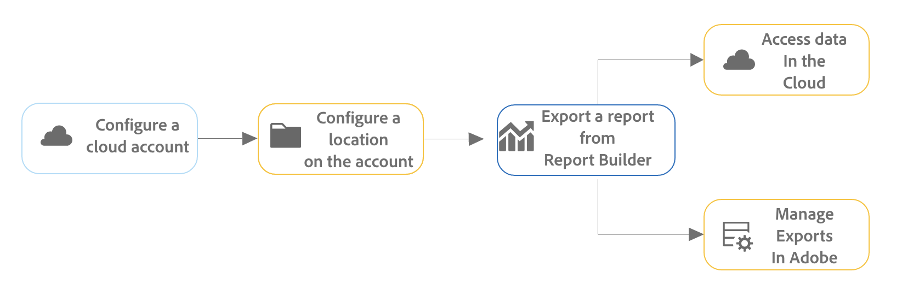

# Programar libros exportándolos a destinos en la nube

Puede exportar libros de Customer Journey Analytics desde Report Builder a proveedores de la nube como Google, Azure y Amazon.

[Entre las ventajas de exportar informes desde Report Builder a la nube](#advantages-of-exporting-to-the-cloud) se incluye la posibilidad de usar informes en herramientas de terceros o combinarlos con datos externos.

Antes de exportar libros desde Report Builder a un destino de nube, asegúrese de que los bloques de datos, el entorno y los permisos cumplan los [requisitos de exportación](#export-requirements).

## Comprensión del proceso de exportación

Utilice el siguiente proceso al exportar libros de Report Builder a la nube:

1. [Configure una cuenta en la nube](/help/components/exports/cloud-export-accounts.md)

1. [Configure una ubicación en la cuenta](/help/components/exports/cloud-export-locations.md)

1. [Exportación de un informe desde Report Builder](#export-a-report-from-report-builder)

1. Acceda a los datos de su cuenta de la nube y [administre exportaciones en Adobe](/help/components/exports/manage-exports.md)

## Exportación de un informe desde Report Builder {#export-from-report-builder}

>[!NOTE]
>
>Antes de exportar los datos como se describe en esta sección, obtenga más información acerca de [el proceso de exportación](#understand-the-export-process) en la sección anterior.

Para exportar informes desde Report Builder:

1. Si aún no lo ha hecho, configure una cuenta y una ubicación de exportación, tal como se describe en [Configuración de cuentas de exportación en la nube](/help/components/exports/cloud-export-accounts.md).

1. En la hoja de cálculo de Excel que contiene los datos que desea exportar, abra el panel derecho de **[!UICONTROL Adobe Report Builder]**.

1. Seleccione [!UICONTROL **Horario**].

<!-- add screenshot -->

1. En la ficha **[!UICONTROL Libros]**, seleccione el icono de signo + para crear una nueva programación

   

   O bien

   Para exportar el libro según una programación que ya haya creado, selecciónela en la lista de programaciones y, a continuación, seleccione **[!UICONTROL Enviar según lo programado]**.

1. En el panel derecho de [!UICONTROL **Adobe Report Builder**], especifique la siguiente información para continuar creando una nueva programación:

   | Nombre de campo | Función |
   |---------|----------|
   | **[!UICONTROL Archivo]** | Muestra el archivo de libro seleccionado actualmente para la exportación. Seleccione el icono del libro  junto al nombre de archivo para elegir el libro actual si aún no está seleccionado. |
   | **[!UICONTROL Nombre de archivo]** <!--should be File name --> | Permite cambiar el nombre del archivo antes de exportar el libro.
El nombre de archivo del libro es el nombre predeterminado del libro
 |
   | **[!UICONTROL Tipo de archivo]** | Elija el tipo de archivo para el archivo exportado. Puede elegir Excel, PDF o CSV. 
Cuando seleccione **[!UICONTROL CSV]**, tenga en cuenta que el libro de trabajo programado se enviará como archivo adjunto ZIP. Algunas administraciones de correo electrónico corporativas pueden bloquear el correo electrónico con archivos adjuntos ZIP. Verá una advertencia en consecuencia.
 |
   | **[!UICONTROL Anexar marca de tiempo al nombre de archivo]** | Seleccione esta opción para anexar una marca de tiempo al nombre del archivo e identificar la fecha en la que se actualizó el libro. Una marca de tiempo es útil para ver qué versión de un libro se envió en una fecha específica. Al seleccionarlo, puede elegir entre: |
   | **[!UICONTROL Vista previa de nombre de archivo]** <!--should be File name preview --> | Muestra una vista previa del aspecto que tendrá el nombre de archivo después de la exportación. |
   | **[!UICONTROL Proteger el libro con contraseña]** | Especifique una contraseña para proteger el archivo exportado de modo que solo las personas con la contraseña puedan acceder a él. 
Las contraseñas deben tener al menos 8 caracteres y contener al menos 1 número y 1 carácter especial (como `!`,`@`,`#` y `$`).
 |
   | **[!UICONTROL Correo electrónico]** | Seleccione esta opción para enviar el archivo a una dirección de correo electrónico específica. Para obtener más información, vea [Programar libros compartiéndolos por correo electrónico](/help/report-builder/schedule-reportbuilder.md). |
   | **[!UICONTROL Otros envíos]** | Seleccione esta opción para enviar el archivo a una cuenta de la nube y, a continuación, utilice los menús desplegables de **[!UICONTROL Cuenta]** y **[!UICONTROL Ubicación]** que se describen a continuación para seleccionar la cuenta y la ubicación. |
   | **[!UICONTROL Cuenta]** | Seleccione la cuenta de exportación a la nube a la que desea enviar los datos. 
O bien, si aún no ha configurado una cuenta en la nube que desee utilizar, puede configurar una nueva cuenta:<ol><li>Seleccione [!UICONTROL **Añadir cuenta**] y, a continuación, especifique la siguiente información:<ul><li>[!UICONTROL **Nombre de la cuenta de ubicación**]: especifique un nombre para la cuenta de ubicación. Este nombre aparece al crear una ubicación  </li><li>[!UICONTROL **Descripción de la ubicación de la cuenta**]: proporcione una breve descripción de la cuenta para diferenciarla de otras cuentas del mismo tipo de cuenta.</li><li>**[!UICONTROL Poner la cuenta a disposición de todos los usuarios de su organización]**: seleccione esta opción para permitir que otros usuarios de su organización utilicen la cuenta. Tenga en cuenta lo siguiente al compartir cuentas:<ul><li>Las cuentas que comparta no se pueden dejar de compartir.</li><li>Solo el propietario de la cuenta puede editar las cuentas compartidas.</li><li>Cualquiera puede crear una ubicación para la cuenta compartida.</li></ul></li><li>[!UICONTROL **Tipo de cuenta**]: seleccione el tipo de cuenta de nube a la que está exportando. Los tipos de cuenta disponibles son Amazon S3 Role ARN, Google Cloud Platform, Azure SAS y Azure RBAC.</li></ul><li>Para finalizar la configuración de la cuenta, continúe con el vínculo siguiente que corresponde al [!UICONTROL **tipo de cuenta**] que ha seleccionado:<ul><li>[ARN de la función Amazon S3](/help/components/exports/cloud-export-accounts.md#amazon-s3-role-arn)</li><li>[Google Cloud Platform](/help/components/exports/cloud-export-accounts.md#google-cloud-platform)</li><li>[Azure SAS](/help/components/exports/cloud-export-accounts.md#azure-sas)</li><li>[Azure RBAC](/help/components/exports/cloud-export-accounts.md#azure-rbac)</li></ul></ol> |
   | **[!UICONTROL Ubicación]** | Seleccione la ubicación de la cuenta a la que desea enviar los datos de exportación.
O bien, si aún no ha configurado la ubicación que desea utilizar en la cuenta seleccionada, puede configurar una nueva ubicación:<ol><li>Seleccione [!UICONTROL **Añadir ubicación**] y, a continuación, especifique la siguiente información: <ul><li>[!UICONTROL **Nombre**]: nombre de la ubicación.</li><li>[!UICONTROL **Descripción**]: proporcione una breve descripción de la ubicación para diferenciarla de otras ubicaciones del mismo tipo de ubicación.</li><li>**[!UICONTROL Poner la ubicación a disposición de todos los usuarios de su organización]**: seleccione esta opción para permitir que otros usuarios de su organización utilicen la ubicación. Tenga en cuenta lo siguiente al compartir cuentas:<ul><li>Las ubicaciones que comparte no se pueden dejar de compartir.</li><li>Solo el propietario de la cuenta puede editar las ubicaciones compartidas.</li><li>Las ubicaciones solo se pueden compartir si también se comparte la cuenta a la que está asociada la ubicación.</li></ul></li><li>[!UICONTROL **Ubicación de la cuenta**]: seleccione la cuenta en la que desea crear la ubicación.</li></ul><li>Para finalizar la configuración de la ubicación, continúe con el vínculo de abajo que corresponde al tipo de cuenta que seleccionó en el campo [!UICONTROL **Cuenta de ubicación**]:<ul><li>[ARN de la función Amazon S3](/help/components/exports/cloud-export-locations.md#amazon-s3-role-arn)</li><li>[Google Cloud Platform](/help/components/exports/cloud-export-locations.md#google-cloud-platform)</li><li>[Azure SAS](/help/components/exports/cloud-export-locations.md#azure-sas)</li><li>[Azure RBAC](/help/components/exports/cloud-export-locations.md#azure-rbac)</li></ul> |
   | **[!UICONTROL Mostrar opciones de horario]** | Seleccione esta opción para ver opciones adicionales para programar la exportación. Deje esta opción sin seleccionar si desea enviar la exportación solo una vez. Cuando esta opción no está seleccionada, la exportación se inicia inmediatamente. |
   | **[!UICONTROL A partir de]** | El día y la hora de inicio de la exportación programada. 
Esta opción solo está disponible cuando se elige una frecuencia de exportación programada.
 |
   | **[!UICONTROL Finaliza el]** | El día y la hora de caducidad de la exportación programada. La exportación programada ya no se ejecuta después de la fecha y hora establecidas. 
Esta opción solo está disponible cuando se elige una frecuencia de exportación programada.
 |
   | **[!UICONTROL Frecuencia]** | Puede establecer que la frecuencia sea horaria, diaria, semanal, mensual o anual en un día específico. Por ejemplo, puede configurar una programación para enviar el libro de trabajo el primer domingo por la noche del mes, de modo que los destinatarios tengan el correo electrónico en su bandeja de entrada a primera hora del lunes por la mañana. |

   {style="table-layout:auto"}

1. Seleccione [!UICONTROL **Enviar según lo programado**] para exportar el libro.

   Los datos se envían a la cuenta en la nube especificada con la frecuencia especificada.

1. (Opcional) Una vez creada la exportación, tanto si decide enviarla ahora como en una programación definida, puede verla y administrarla en la [página Exportaciones](/help/components/exports/manage-exports.md) y verla en los [Registros de exportación](/help/components/exports/manage-export-logs.md).

## Administración de exportaciones

Una vez exportados los datos desde Analysis Workspace, puede editar, volver a exportar, duplicar, etiquetar o eliminar las exportaciones existentes, tal como se describe en [Administración de exportaciones](/help/components/exports/manage-exports.md).

## Ventajas de exportar a la nube {#advantages}

Exportar los datos de Customer Journey Analytics a la nube le permite:

* Exporte a una ubicación compartida, como Google Cloud Platform, Microsoft Azure y Amazon S3.

* Almacenar grandes cantidades de datos históricos.

  Este tipo de datos se puede utilizar para detectar tendencias a largo plazo con el fin de obtener inteligencia empresarial y, en última instancia, obtener una mejor toma de decisiones empresariales.

* Incluir métricas calculadas en los datos de Customer Journey Analytics exportados.

* Estructurar la salida de datos como valores concatenados.

* Exportar de una sola vez o según una programación.

* Exporte archivos en formato Excel, PDF o CSV.

* Exporte bloques de datos que incluyan varias dimensiones.

## Requisitos de exportación {#export-requirements}

### Requisitos mínimos

Asegúrese de que los bloques de datos, el entorno y los permisos cumplan los siguientes requisitos:

* **Bloques de datos:** Todos los bloques de datos deben incluir al menos un componente en una columna, fila o valor.

* **Entorno:** asegúrese de que las [direcciones IP](/help/technotes/ip-addresses.md) y los [dominios](/help/technotes/domains.md) utilizados por Customer Journey Analytics tengan permiso para pasar a través del firewall de su organización.

