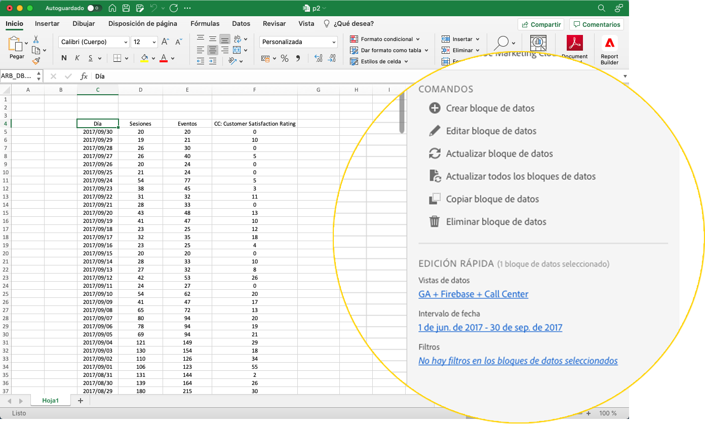
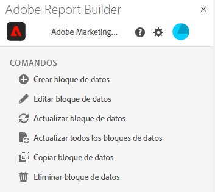
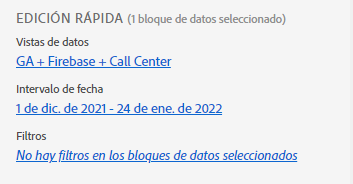
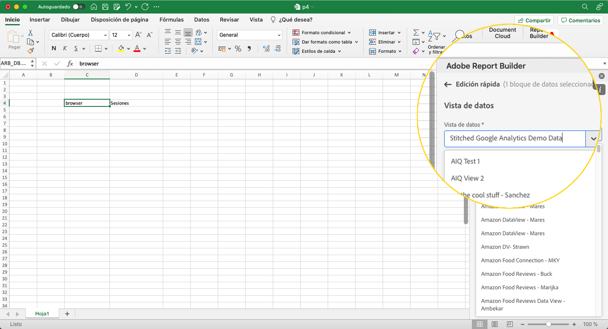

# Report Builder Hub

Utilice Report Builder hub para crear, actualizar o eliminar bloques de datos.

Report Builder hub contiene los paneles COMANDOS y EDICIÓN RÁPIDA.



## Panel COMANDOS

Utilice el panel COMANDOS para acceder a comandos compatibles con las celdas seleccionadas o con una acción anterior.



### Comandos

| Comandos mostrados | Disponible cuando... | Finalidad |
|------|------------------|--------|
| Creación del bloque de datos | Se seleccionan una o más celdas en el libro. | Se utiliza para crear un bloque de datos |
| Edición del bloque de datos | El rango de celdas o celdas seleccionados forman parte de un solo bloque de datos. | Se utiliza para editar un bloque de datos. |
| Actualización del bloque de datos | La selección contiene al menos un bloque de datos. El comando solo actualizará los bloques de datos de la selección. | Se utiliza para actualizar uno o más bloques de datos. |
| Actualización de todos los bloques de datos | El libro contiene uno o más bloques de datos. | Se utiliza para actualizar TODOS los bloques de datos del libro |
| Copia del bloque de datos | La celda o el rango de celdas seleccionado forma parte de uno o más bloques de datos. | Se utiliza para copiar un bloque de datos. |
| Eliminación del bloque de datos | El rango de celdas o celdas seleccionados forman parte de un solo bloque de datos. | Se utiliza para eliminar un bloque de datos. |

## Panel EDICIÓN RÁPIDA

Cuando se seleccionan uno o varios bloques de datos en una hoja de cálculo, Report Builder muestra el panel EDICIÓN RÁPIDA. Puede utilizar el panel EDICIÓN RÁPIDA para cambiar parámetros en un solo bloque de datos o para cambiar parámetros en varios bloques de datos al mismo tiempo.



Los cambios realizados con las secciones Edición rápida se aplican a todos los bloques de datos seleccionados.

### Vistas de datos

Los bloques de datos extraen datos de una vista seleccionada. Si se seleccionan varios bloques de datos en una hoja de cálculo y no se extraen datos de la misma vista, el vínculo **Vistas de datos** se muestra como *Múltiple*.

Al cambiar la vista de datos, todos los bloques de datos de la selección adoptan la nueva vista de datos. Los componentes del bloque de datos coinciden con la nueva vista de datos en función del ID, por ejemplo, la coincidencia ```evars```). Si no se encuentra un componente en un bloque de datos, se muestra un mensaje de advertencia y el componente se elimina del bloque de datos.

Para cambiar la vista de datos, seleccione una nueva vista de datos en el menú desplegable.



### Intervalo de fechas

**Intervalo de fechas** muestra el intervalo de fechas para los bloques de datos seleccionados. Si se seleccionan varios bloques de datos con varios intervalos de fechas, el vínculo **Intervalo de fechas** se muestra como *Múltiple*.

### Filtros

El vínculo **Filtros** muestra una lista resumida de los filtros utilizados por los bloques de datos seleccionados. Si se seleccionan varios bloques de datos con varios filtros aplicados, el vínculo **Filtros** se muestra como *Múltiple*.
