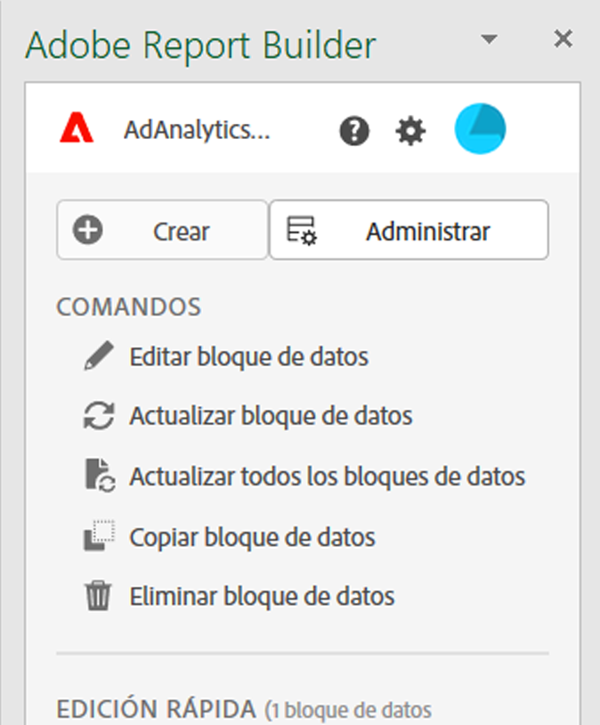

# Hub de Report Builder

El concentrador de Report Builder es el panel derecho que se muestra en el libro de Excel cuando se selecciona  **[!UICONTROL Report Builder]** en la barra de cinta de Excel.

Utilice Report Builder Hub para crear, actualizar, eliminar y administrar bloques de datos.

El concentrador de Report Builder contiene los botones  **[!UICONTROL Create]**,  **[!UICONTROL Manage]** y  **[!UICONTROL Schedule]**, el panel **[!UICONTROL Commands]** y el panel **[!UICONTROL Quick edit]**.

{zoomable="yes"}

Select

*  **[!UICONTROL Crear]** para [crear nuevos bloques de datos](create-a-data-block.md).
*  **[!UICONTROL Administrar]** para [administrar bloques de datos existentes](manage-reportbuilder.md).
*  **[!UICONTROL Programar]** para [administrar programaciones para enviar el libro por correo electrónico](schedule-reportbuilder.md).

## Panel Comandos

Utilice el panel **[!UICONTROL Comandos]** para obtener acceso a comandos compatibles con las celdas seleccionadas o con una acción anterior.

| Comandos | Disponible cuando... | Finalidad |
|------|------------------|--------|
|  **[!UICONTROL Editar bloque de datos]** | El rango de celdas o celdas seleccionados forman parte de un solo bloque de datos. | Se utiliza para editar un bloque de datos. |
|  **[!UICONTROL Actualizar bloque de datos]** | La selección contiene al menos un bloque de datos. El comando actualiza solo los bloques de datos de la selección. | Utilice para actualizar uno o más bloques de datos. |
|  **[!UICONTROL Actualizar todos los bloques de datos]** | El libro contiene uno o más bloques de datos. | Se utiliza para actualizar todos los bloques de datos del libro |
|  **[!UICONTROL Enviar libro]** | El libro contiene uno o más bloques de datos. | Se utiliza para enviar el libro como un archivo por correo electrónico. |
|  **[!UICONTROL Copiar bloque de datos]** | La celda o el rango de celdas seleccionado forma parte de uno o más bloques de datos. | Se utiliza para copiar un bloque de datos. |
|  **[!UICONTROL Cortar bloque de datos]** | La celda o el rango de celdas seleccionado forma parte de uno o más bloques de datos. | Usar para cortar un bloque de datos. |
|  **[!UICONTROL Eliminar bloque de datos]** | El rango de celdas o celdas seleccionados forman parte de un solo bloque de datos. | Usar para eliminar un bloque de datos |

## Panel de edición rápida

Al seleccionar uno o más bloques de datos en una hoja de cálculo, Report Builder muestra el panel **[!UICONTROL Edición rápida]**. Puede usar el panel **[!UICONTROL Edición rápida]** para cambiar parámetros en uno o más bloques de datos al mismo tiempo.

Los cambios que realice al usar las secciones **[!UICONTROL Edición rápida]** se aplican a todos los bloques de datos seleccionados.

### Vistas de datos

Los bloques de datos extraen datos de una vista seleccionada. Si se seleccionan varios bloques de datos en una hoja de cálculo y no se extraen datos de la misma vista, el vínculo **Vistas de datos** muestra **[!UICONTROL _Múltiples_]**.

Al cambiar la vista de datos, todos los bloques de datos de la selección adoptan la nueva vista de datos. Los componentes del bloque de datos coinciden con la nueva vista de datos en función del ID. Si no se encuentra un componente en un bloque de datos, el componente se quita y se reemplaza por **[!UICONTROL Valor no válido]** o se muestra  para el componente específico.

Para cambiar la vista de datos, selecciona una nueva vista de datos en el menú desplegable **[!UICONTROL Vista de datos]**.

### Intervalo de fechas

**Intervalo de fechas** muestra el intervalo de fechas para los bloques de datos seleccionados. Si se seleccionan varios bloques de datos con varios intervalos de fechas, el vínculo **[!UICONTROL Intervalo de fechas]** muestra **[!UICONTROL _Múltiple_]**.

### Segmentos

El vínculo **Segmentos** muestra una lista resumida de los segmentos utilizados por los bloques de datos seleccionados. Si se seleccionan varios bloques de datos con varios segmentos aplicados, el vínculo **Segmentos** muestra **[!UICONTROL _Varios_]**.

>[!MORELIKETHIS]
>
>[Seleccionar vistas de datos](select-data-view.md)
>&#x200B;>[Seleccione un intervalo de fecha](select-date-range.md)
>&#x200B;>[Trabajar con filtros](work-with-filters.md)
>
