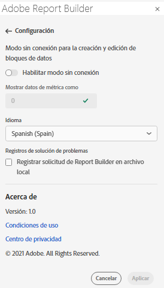
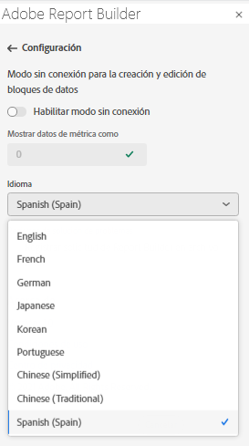

# Configuración de Report Builder

Utilice la variable **Configuración** para configurar los ajustes de nivel de aplicación, como el idioma mostrado por la IU o si se va a trabajar o no en modo sin conexión. La configuración se aplica inmediatamente y se establece para todas las sesiones futuras hasta que se cambia.

Para cambiar la configuración de Report Builder

1. Haga clic en el icono **Configuración**.

1. Realice cambios en el modo Activar sin conexión, seleccione un idioma o habilite la configuración del registro de resolución de problemas.

1. Haga clic en **Aplicar**.

   

## Modo sin conexión

Al crear y editar un bloque de datos en modo sin conexión, no se recuperan los datos. En su lugar, se utilizan datos de simulación para que se pueda crear y editar rápidamente un bloque de datos sin esperar a que se ejecute la solicitud. Cuando vuelva a estar en línea, el comando *Actualizar el bloque de datos* o *Actualizar todos los bloques de datos* actualiza los bloques de datos que ha creado con datos reales.

Para activar el modo sin conexión

1. Haga clic en el icono **Configuración**.

1. Seleccione **Habilitar el modo sin conexión**.

1. Introduzca un entero positivo en el campo **Mostrar datos de métricas como**.

1. Haga clic en **Aplicar**.

## Idioma

Puede elegir el idioma de la IU de Report Builder. Todos los idiomas de Adobe Analytics admitidos están disponibles.

Para seleccionar el idioma utilizado en la IU de Report Builder

1. Haga clic en Configuración.

1. Seleccione un idioma en el menú desplegable **Idioma**.

   

1. Haga clic en **Aplicar.**

## Resolución de problemas

Utilice la configuración Resolución de problemas para registrar todos los datos de cliente/servidor en un archivo local. Utilice esta opción para resolver los tickets de asistencia.

Para activar la opción Resolución de problemas, seleccione **Registrar la solicitud del Report Builder en un archivo local**.
