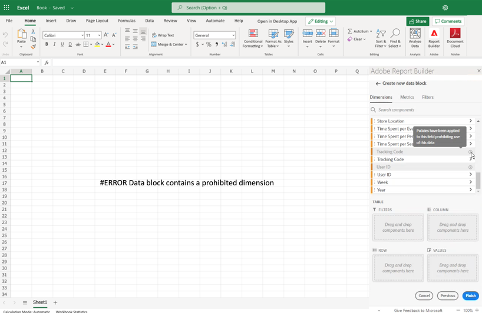

# Etiquetas restringidas en Report Builder

En general, la configuración relacionada con la gobernanza de datos en Customer Journey Analytics se hereda de Experience Platform. La integración entre Customer Journey Analytics y Gobernanza de datos de Experience Platform permite el etiquetado de datos confidenciales de Customer Journey Analytics y la aplicación de políticas de privacidad.

Las etiquetas de privacidad y las políticas creadas en conjuntos de datos consumidos por Experience Platform se pueden ver en el flujo de trabajo de vistas de datos de Customer Journey Analytics. Estas etiquetas detienen o advierten a los usuarios que crean métricas y dimensiones a partir de campos confidenciales. Para obtener información acerca de los conjuntos de datos, consulte [Información general sobre conjuntos de datos](https://experienceleague.adobe.com/en/docs/experience-platform/catalog/datasets/overview)

Además, cuando se exportan datos desde Customer Journey Analytics (mediante la creación de informes, la exportación, la API, etc.), se añaden advertencias o etiquetas para notificar a los usuarios de que un informe contiene información confidencial que debe tratarse de una manera específica.

Esta integración le permite administrar el cumplimiento de normas. Los administradores de datos de su organización pueden establecer políticas para restringir el uso. Como resultado, los usuarios de Customer Journey Analytics pueden emplear los datos con mayor seguridad, sabiendo que cumplen con las políticas definidas por los administradores de datos.

Para obtener más información, consulte [Customer Journey Analytics y gobernanza de datos](https://experienceleague.adobe.com/en/docs/analytics-platform/using/cja-privacy/privacy-overview)

## Ver datos restringidos

En Customer Journey Analytics aparecen dos políticas definidas por Adobe que afectan a la creación de informes, a la descarga y al uso compartido:

* Aplicación de la directiva de Analytics
* Aplicación de la directiva de descarga

Los componentes sujetos a estas directivas aparecen atenuados y no tienen un icono . Cuando pasa el ratón sobre el icono de información, se muestra una nota para indicar lo siguiente: **[!UICONTROL Se han aplicado directivas a este campo que prohíben el uso de estos datos]**.

Para obtener más información, consulte [Etiquetas y directivas](https://experienceleague.adobe.com/en/docs/analytics-platform/using/cja-dataviews/data-governance).

{zoomable="yes"}

## Actualizar informes que contienen datos restringidos

En los casos en los que un usuario ha creado un informe de Report Builder con elementos de datos que se restrinjan posteriormente, cuando se actualiza el informe, se muestra un mensaje de error.

{width="100%" zoomable="yes"}
