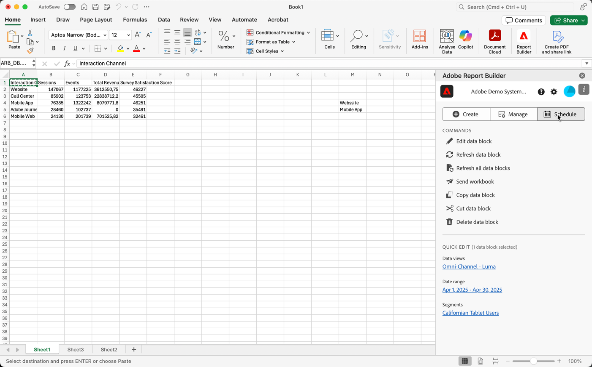

# Programar libros compartiéndolos por correo electrónico

Una vez guardado el libro y completado el análisis, puede compartirlo con otros miembros de su equipo mediante la función de programación. La función de programación permite crear una programación que actualice automáticamente los datos del libro. Y envía por correo electrónico el archivo del libro de Excel como archivo adjunto a la audiencia especificada en una fecha y hora específicas. La configuración de una programación proporciona a los destinatarios actualizaciones regulares automáticamente. También puede utilizar la función de programación para enviar el libro una vez sin programar actualizaciones automáticas.

Puede crear varias programaciones para un solo libro. Por ejemplo, se crean dos programaciones para enviar un libro de trabajo al equipo diariamente y al administrador una vez a la semana.

La función de programación también permite configurar la protección con contraseña de un libro y editar los libros programados anteriormente.

>[!BEGINSHADEBOX]

Vea  [Programar libros](https://experienceleague.adobe.com/en/docs/customer-journey-analytics-learn/tutorials/exporting/report-builder/schedule-cja-workbooks-using-report-builder){target="_blank"} para ver un vídeo de demostración.

>[!ENDSHADEBOX]

## Programar un libro

Para programar un libro:

1. Seleccione **[!UICONTROL Programar]** en Report Builder hub para crear una programación de modo que pueda distribuir automáticamente un archivo de Excel de libro (.xlsx) a un individuo o grupo.

   {zoomable="yes"}

1. Seleccione **[!UICONTROL Programar libro]** o  para crear un nuevo libro programado.

   {zoomable="yes"}

   El panel de programación muestra información predefinida sobre el libro, como el nombre del libro y la última fecha de modificación del libro.

### Archivo

En la sección **[!UICONTROL Archivo]**, proporciona detalles del tipo de archivo, el nombre y una contraseña para proteger el archivo.

{zoomable="yes"}

1. Use  para seleccionar el libro actual, si no está seleccionado.

1. (Opcional) Escriba un **[!UICONTROL nombre de archivo]**.

   El nombre de archivo predeterminado del libro es el nombre del libro, pero puede cambiarlo si lo desea.

1. Seleccione un **[!UICONTROL tipo de archivo]**.

   * **[!UICONTROL Excel]**
   * **[!UICONTROL PDF]**
   * **[!UICONTROL CSV]**

   Cuando seleccione **[!UICONTROL CSV]**, tenga en cuenta que el libro programado se enviará como archivo adjunto zip. Algunas administraciones de correo electrónico corporativas pueden bloquear el correo electrónico con archivos adjuntos zip. Verá una advertencia en consecuencia.

1. (Opcional) Seleccione **[!UICONTROL Adjuntar marca temporal al nombre del archivo]**.

   Puede adjuntar una marca temporal al nombre del archivo para identificar la fecha en que se actualizó el libro. Una marca de tiempo es útil para ver qué versión de un libro se envió en una fecha específica. Al seleccionarlo, puede elegir entre:

   * **[!UICONTROL Formato de fecha ISO]**, que hace que `YYYY-MM-DD` se anexe al nombre de archivo.
   * **[!UICONTROL Formato de fecha ISO + marca de hora]**, lo que hace que `YYYY-MM-DD_HH-MM-SS` se anexe al nombre de archivo.

<!-- Does no longer seem to be an option? 
1. (Optional) Select **.zip compression** to compress the file and set up password protection on the file.

    When you make this selection, you're prompted to enter a password to open the file. This is helpful if you have concerns about data security and you want to password protect the workbook. Protecting the file with a password requires you to select **.zip compression**. The password must be at least 8 characters and contain a number and a special character.

    {zoomable="yes"}{width="55%"}
-->

1. Escriba una contraseña en **[!UICONTROL Proteger el libro con contraseña]**. Una contraseña válida requiere al menos 8 caracteres, un número y un carácter especial. Seleccione  para mostrar la contraseña y  para ocultarla (valor predeterminado).

### Correo electrónico

En la sección **[!UICONTROL Correo electrónico]**, debe proporcionar los destinatarios, el asunto y la descripción del correo electrónico.

{zoomable="yes"}

1. Introduzca los **Destinatarios**. Puede introducir el nombre de una persona reconocida en su organización. O bien, puede introducir una dirección de correo electrónico de una persona que esté fuera de su organización.

1. Introduzca el **Asunto** del correo electrónico y una descripción para sus destinatarios. El asunto adopta como valor predeterminado el nombre de archivo del libro, pero puede modificarlo si es necesario. Puede agregar detalles en la sección de descripción.

1. Si lo desea, puede escribir una descripción en el área de texto **[!UICONTROL Descripción]**.

### Programación

En la sección **[!UICONTROL Programar]**, puede definir la programación para enviar los correos electrónicos con el libro de trabajo a los destinatarios.

{zoomable="yes"}

1. Seleccione **[!UICONTROL Mostrar opciones de horario]** para definir una programación.

1. Escriba una fecha de inicio en **[!UICONTROL A partir del]**. Como alternativa, seleccione  para elegir una fecha de inicio del calendario.

1. Escriba una fecha de finalización en **[!UICONTROL Que termine el]**. Como alternativa, seleccione  para elegir una fecha de finalización del calendario.

1. Seleccione una **[!UICONTROL frecuencia]**. Según la frecuencia seleccionada, tiene opciones adicionales. Consulte la tabla siguiente.

   | Frecuencia | Opciones |
   |---|---|
   | **[!UICONTROL Enviar por hora]** | Escriba un valor para **[!UICONTROL Enviar cada número de horas]**. |
   | **[!UICONTROL Enviar diariamente]** | Seleccione una **[!UICONTROL Frecuencia diaria]**: **[!UICONTROL Enviar todos los días]**, **[!UICONTROL Enviar todos los días de la semana]** o **[!UICONTROL Frecuencia personalizada]**. Si selecciona **[!UICONTROL Frecuencia personalizada]**, escriba un valor para **[!UICONTROL Enviar cada número de días]**. |
   | **[!UICONTROL Enviar semanalmente]** | Escriba un valor para **[!UICONTROL Enviar cada número de semanas]**. Y selecciona **[!UICONTROL Día de la semana]**. |
   | **[!UICONTROL Enviar mensualmente por día de la semana]** | Seleccione un **[!UICONTROL Día de la semana]** y una **[!UICONTROL Semana del mes]**. |
   | **[!UICONTROL Enviar mensualmente por día del mes]** | Seleccione un valor de **[!UICONTROL Enviar en este día del mes]**. |
   | **[!UICONTROL Enviar anualmente por día del mes]** | Seleccione un **[!UICONTROL Día de la semana]**, una **[!UICONTROL Semana del mes]** y un **[!UICONTROL Mes del año]**. |
   | **[!UICONTROL Enviar anualmente por fecha específica]** | Seleccione un **[!UICONTROL Mes del año]** y elija un valor entre **[!UICONTROL Enviar en este día del mes]**. |

### Enviar

Para enviar el libro:

* Si no ha definido una programación con **[!UICONTROL Mostrar opciones de programación]**, seleccione **[!UICONTROL Enviar ahora]** para enviar el libro por correo electrónico inmediatamente.
* Si ha definido una programación con **[!UICONTROL Mostrar opciones de programación]**, seleccione **[!UICONTROL Enviar según lo programado]** para enviar el libro por correo electrónico según la programación que haya definido.

En ambos casos, verá un mensaje de confirmación en la parte inferior de Report Builder hub.

Para cancelar el envío del libro, seleccione **[!UICONTROL Cancelar]**.

## Administrar libros de trabajo programados

Para obtener información acerca de la administración de libros que ya están programados, vea [Administrar libros programados](/help/report-builder/manage-schedules-reportbuilder.md).

