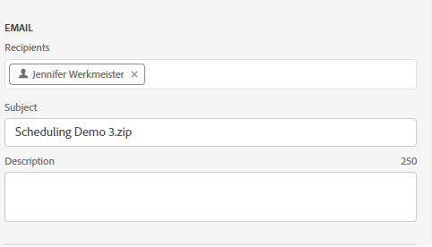

# Programar libros

Después de guardar el libro y completar el análisis, puede compartir fácilmente el libro con otros integrantes del equipo mediante la función de programación. La función Programación permite crear una programación que actualice automáticamente los datos del libro y envíe el archivo .xlsx del libro de Excel como datos adjuntos a la audiencia especificada en una fecha y hora específicas. La configuración de una programación proporciona a los destinatarios actualizaciones regulares de forma automática. También puede utilizar la función de programación para enviar el libro una vez sin programar actualizaciones automáticas.

Puede crear varias programaciones para un solo libro de trabajo. Por ejemplo, puede enviar un libro de trabajo a su equipo diariamente y enviarlo al administrador una vez a la semana creando dos programas diferentes.

La función Programación también permite configurar la protección mediante contraseña para un libro y editar los libros programados previamente.

>[!VIDEO](https://video.tv.adobe.com/v/3413079/?quality=12&learn=on)

## Programar un libro

Utilice el botón Programar tarea del centro de Report Builder para crear rápidamente una programación de modo que pueda distribuir automáticamente un archivo de Excel de libro de trabajo (.xlsx) a un individuo o a un grupo.

1. Haga clic en el botón Programar en el centro del Report Builder.

   {width="55%"}

1. Haga clic en Programar libro o en el botón de signo más en la parte superior izquierda para crear un nuevo libro programado.

   {width="55%"}

   El panel de programación muestra información predefinida sobre el libro, como el nombre del libro y la última fecha de modificación del libro.

   {width="55%"}

1. (Opcional) Introduzca un nombre de archivo.

   El nombre de archivo del libro es el nombre predeterminado del libro, pero puede cambiarlo si lo desea. Si envía el mismo libro a varias audiencias y desea ponerle un nombre un poco más descriptivo para una audiencia determinada, puede cambiar el nombre.

1. (Opcional) Seleccione **Anexar marca de hora al nombre del archivo**.

   Puede anexar una marca de tiempo al nombre del archivo para identificar la fecha en que se actualizó el libro. Esto resulta útil para ver rápidamente qué versión de un libro se envió en una fecha específica. La variable **Vista previa del nombre de archivo** muestra cómo aparecerá el nombre del archivo del libro en el correo electrónico cuando se distribuya el libro. El formato de la marca de tiempo es AAAA-MM-DD.

1. (Opcional) Seleccione **Compresión .zip** para comprimir el archivo y configurar la protección de contraseña en el archivo.

   Cuando realice esta selección, se le pedirá que introduzca una contraseña para abrir el archivo. Esto resulta útil si le preocupa la seguridad de los datos y desea proteger el libro con contraseña. La protección del archivo con una contraseña requiere que seleccione **Compresión .zip**. La contraseña debe tener al menos 8 caracteres y contener un número y un carácter especial.

   {width="55%"}

1. Entrar **Destinatarios**. Puede introducir el nombre de una persona reconocida en su organización o una dirección de correo electrónico de una persona dentro o fuera de la organización.

1. Introduzca la variable **Asunto** del correo electrónico y una descripción para sus destinatarios. El asunto toma como valor predeterminado el nombre de archivo del libro, pero puede modificarlo si es necesario. Puede añadir detalles en la sección de descripción.

   {width="55%"}

1. Configure las opciones de programación para establecer la fecha y la hora en que desea que el libro se envíe por correo electrónico a los destinatarios.

   Elija los intervalos de fecha y hora de inicio y fin. Esta puede ser la fecha de hoy o una fecha futura.

   Elija la **Frecuencia** en el menú desplegable. Puede establecer que la frecuencia sea horaria, diaria, semanal, mensual o anual en un día específico. Por ejemplo, puede configurar una programación para enviar el libro de trabajo el primer domingo por la noche del mes de modo que los destinatarios tengan el correo electrónico en su bandeja de entrada el lunes por la mañana.

   {width="55%"}

1. Después de configurar la programación, haga clic en **Enviar según lo programado**.

   {width="55%"}

   Verá un brindis de confirmación en la parte inferior del concentrador de Report Builder y el libro programado se muestra en la pestaña Libros .

   {width="55%"}

## Enviar el libro solo una vez

También puede enviar el libro solo una vez.

1. Desmarcar **Mostrar opciones de programación**

   {width="40%"}

1. Haga clic en **Enviar ahora**.

## Ver y editar libros programados

Puede ver y administrar todos los libros programados en un lugar en la ficha Libros .

1. En la sección Programación del centro de Report Builder, haga clic en la pestaña Libros . Utilice esta vista para ver una lista de todos los libros programados.

1. Seleccione un libro. Se muestran varias herramientas que permiten editar el libro de trabajo, cambiar la programación, pausar y reiniciar la programación o eliminar la programación.

   {width="55%"}

* (Opcional) Haga clic en el icono de lápiz para editar la programación del libro de trabajo.

* (Opcional) Haga clic en el icono de reloj para ver el historial de cada tarea programada.

* (Opcional) Haga clic en el icono de pausa para pausar y reiniciar la programación de distribución. Esto resulta útil si necesita modificar el libro antes de enviarlo. Vuelva a hacer clic en el icono de pausa cuando desee reiniciar la distribución.

* (Opcional) Haga clic en la papelera para eliminar la programación.

## Revisar el estado de las tareas programadas

La vista de historial permite revisar el estado de cada tarea programada. Hay una fila independiente que documenta el cambio de estado para cada tarea programada. En el ejemplo que se muestra a continuación, la variable *Nuevo programa por hora* se inició el 5 de enero a las 3:04 pm. A las 3:05 p.m. se actualizó correctamente y se envió a los destinatarios. El libro siguiente, *Libro de trabajo incorrecto*, se ha producido un error durante el proceso de actualización. Si un libro no se ha podido enviar, la pestaña del historial le ayuda a solucionar problemas al mostrar en qué parte del proceso se produjo el error. En este caso, es probable que se deba a algún error de bloque de datos, tal vez a un componente que falta, que evitó que el libro se actualizara correctamente.

Una marca de verificación verde indica que el libro se envió correctamente. Un signo de exclamación en un triángulo rojo indica que se ha producido un error.

Puede elegir qué columnas mostrar en la pestaña historial haciendo clic en el icono de configuración de columnas a la derecha de la barra de búsqueda.

{width="55%"}

Puede filtrar el historial para ver solo el de un solo libro programado. Para ello, vaya a la pestaña libros, seleccione el libro y haga clic en el icono de historial.

También puede ver el historial de un libro específico desde la pestaña Libros . En la ficha Libros, seleccione el libro y, a continuación, haga clic en el icono de historial.

{width="55%"}

El filtro de libro aparece en la parte superior del historial. Para volver a ver el historial de todas las tareas programadas, haga clic en la x junto al filtro.

{width="55%"}

