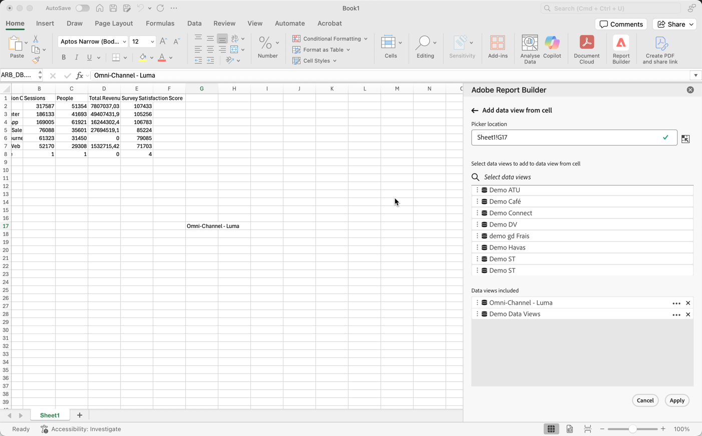
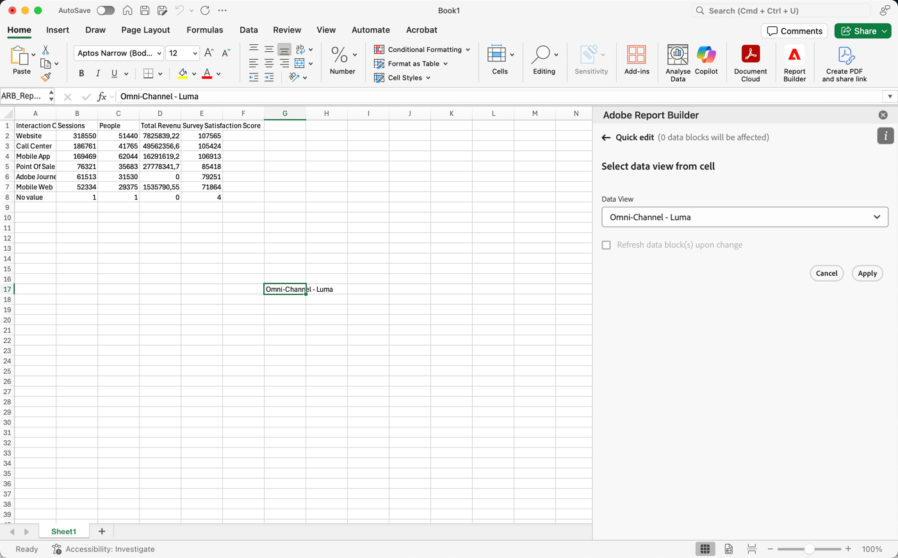

# Seleccione una vista de datos

Puede seleccionar una vista de datos del menú desplegable o seleccionar una vista de datos de una celda y actualizar automáticamente el bloque de datos con una nueva vista de datos.

## Seleccionar vista de datos de una celda

Al seleccionar una vista de datos de una celda, es más fácil actualizar los bloques de datos con distintas vistas de datos. En lugar de crear informes completamente nuevos con bloques de datos independientes, puede actualizar los bloques de datos con una vista de datos seleccionada de una celda.

Seleccionar una vista de datos de una celda es útil cuando tiene lo siguiente:

* Varias vistas de datos que son similares o idénticas entre sí en estructura.
* Formatos de bloque de datos complicados que incluyen componentes y diseños personalizados.

Para seleccionar una vista de datos de una celda, primero genere un bloque de datos y asigne varias vistas de datos a una celda fuera del bloque de datos. A continuación, utilice la vista de datos **[!UICONTROL de la celda]** para actualizar los bloques de datos de diferentes vistas de datos.

1. Cree un bloque de datos. Para obtener información sobre cómo crear un bloque de datos, consulte [Crear un bloque de datos](/help/report-builder/create-a-data-block.md).

1. Seleccione  en **[!UICONTROL Vistas de datos]**.

1. Seleccione una celda con  fuera del bloque de datos.

1. Agregue una o más vistas de datos de **[!UICONTROL Seleccione las vistas de datos que desee agregar a la vista de datos de la celda]** arrastrando y soltando. También puede seleccionar una vista de datos para agregarla a la lista **[!UICONTROL Vistas de datos incluidas]**.

   * Puede usar  **[!UICONTROL _Seleccionar vistas de datos_]** para buscar vistas de datos.
   * Use  para abrir un menú contextual y poder mover las vistas de datos hacia arriba o hacia abajo en la lista **[!UICONTROL Vistas de datos incluidas]**.
   * Use  para eliminar una vista de datos de la lista **[!UICONTROL Vistas de datos incluidas]**.

   {zoomable="yes"}

1. Seleccione **[!UICONTROL Aplicar]** para aplicar las vistas de datos seleccionadas a la celda seleccionada.

## Cambiar la vista de datos de una celda

1. Seleccione la ubicación de la celda de vista de datos en la hoja.
1. En Report Builder Hub, seleccione el vínculo **[!UICONTROL Vistas de datos de la celda]** en **[!UICONTROL Edición rápida]**.
1. Seleccione una vista de datos del menú desplegable **[!UICONTROL Vista de datos]**.

   {zoomable="yes"}
1. Opcional, seleccionar **[!UICONTROL Actualizar bloque(s) de datos al cambiar]**.

1. Seleccione **[!UICONTROL Aplicar]**. Report Builder actualiza el bloque de datos en función de la vista de datos seleccionada.
