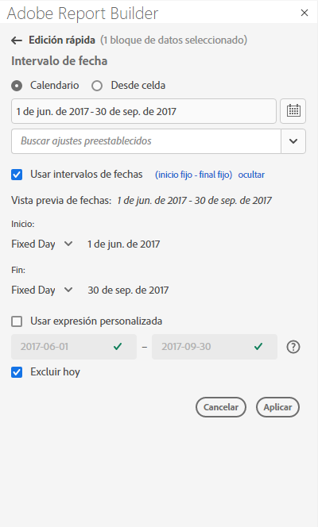
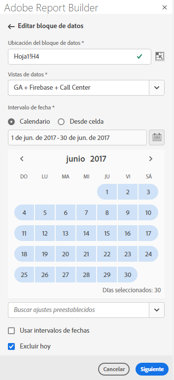
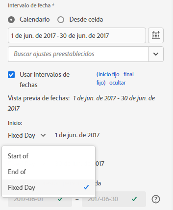
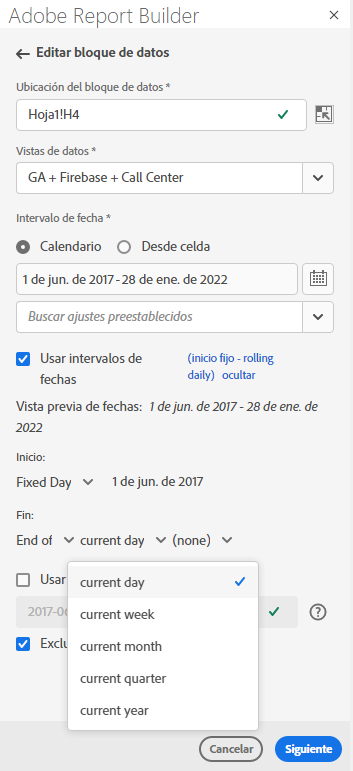
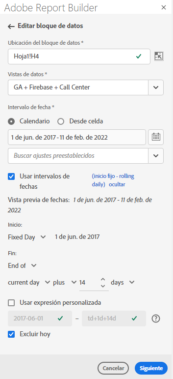
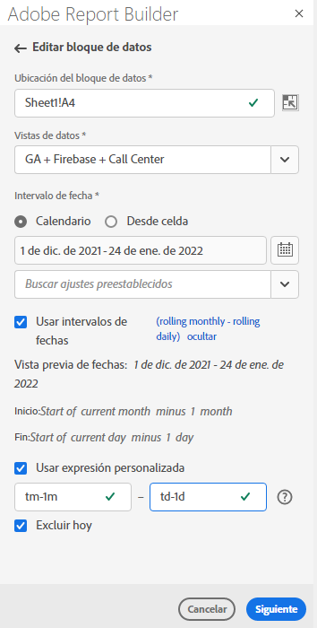
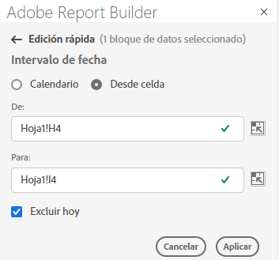

# Seleccionar un intervalo de fechas

Para cambiar el intervalo de fechas de un bloque de datos existente, seleccione Editar un bloque de datos o utilice el panel EDITAR RÁPIDO .

Utilice las siguientes opciones para cambiar el intervalo de fechas de un bloque de datos.

**Calendario**

El calendario le permite crear fechas estáticas o móviles mediante las siguientes opciones:

- Campo de intervalo de fechas
- Calendario
- Menú desplegable Ajuste preestablecido
- Modo de fecha móvil
- Personalizar expresiones


**Desde celda**

La opción De celda permite hacer referencia a las fechas introducidas en las celdas de la hoja de cálculo.

Tiene la opción de excluir hoy en cualquier intervalo de fechas seleccionado.



## Usar el calendario

Cuando se utiliza **Calendar**, el campo de intervalo de fechas muestra el intervalo de fechas actual para la solicitud de bloque de datos. Puede introducir fechas directamente en el campo de intervalo de fechas o utilizar una opción de selección de intervalo de datos.

### Campo de intervalo de fechas

Introducir fechas directamente en el campo de intervalo de fechas

1. Haga clic en el campo de intervalo de fechas situado junto al icono de calendario.

1. Introduzca las fechas de inicio y finalización del intervalo de fechas.

### Calendario

Para seleccionar fechas utilizando el calendario

1. Haga clic en el icono de calendario para mostrar un calendario mensual.

1. Haga clic en una fecha de inicio.

1. Haga clic en una fecha de finalización.

Para definir un intervalo de fechas al revés, haga clic primero en la fecha de finalización y, a continuación, haga clic en la fecha de inicio.



### Menú desplegable de Ajustes preestablecidos

El menú desplegable preestablecido incluye un conjunto estándar de intervalos de fechas preestablecidos y componentes de intervalo de fechas para una vista de datos que haya guardado o una vista de datos que se haya compartido con usted.

### Fechas móviles

La opción fechas móviles permite seleccionar un intervalo de fechas mediante fechas móviles.

1. Seleccione **Usar fechas móviles**.

1. Seleccione una expresión móvil para la fecha de inicio o de finalización.

   

   **Inicio de** : permite seleccionar el comienzo de un día, una semana, un mes, un trimestre o un año.

   **Fin de** : le permite seleccionar el final de un día, una semana, un mes, un trimestre o un año.

   **Día**  fijo: permite corregir una fecha de inicio o de finalización mientras la otra fecha está móvil.

1. Elija día, semana, mes, trimestre o año como período móvil.

   

1. Agregue o reste días, semanas, meses, trimestres o años a partir de la fecha móvil.

   

1. Haga clic en Next para definir el intervalo de datos.

   Utilice la vista previa de fecha para confirmar que el intervalo de fechas resultante es el intervalo deseado.

### Expresiones personalizadas

La opción de expresión personalizada permite cambiar el intervalo de fechas creando una expresión personalizada o puede introducir una fórmula aritmética.

1. Seleccione **Usar fechas móviles**.

1. Seleccione **Usar expresión personalizada**.

   Al seleccionar la opción **Use custom expression**, se desactivan los controles estándar de intervalo de fechas móviles.

   

1. Introduzca una expresión personalizada.

   Para obtener una lista de muestra de expresiones personalizadas, consulte **Expresiones de fecha**.

1. Utilice la vista previa de fecha para comprobar que el intervalo de fechas resultante es el intervalo deseado.

#### Crear una expresión personalizada

1. Introduzca una **Date reference**.

1. Agregue **Operadores de fecha** para mover la fecha al pasado o al futuro.

Puede introducir una expresión de fecha personalizada que incluya varios operadores, como ```tm-11m-1d```.

#### Referencias de fechas

En la tabla siguiente se muestran ejemplos de referencia de fechas.

| Referencia de fecha | Tipo | Descripción |
|----------------|--------------|----------------------------|
| 1/1/10 | Fecha estática | Introducido en formato de fecha ISO |
| td | Fecha móvil | Inicio del día actual |
| tw | Fecha móvil | Inicio de la semana actual |
| tm | Fecha móvil | Inicio del mes actual |
| tq | Fecha móvil | Inicio del trimestre actual |
| ty | Fecha móvil | Inicio del año actual |

#### Operadores de fecha

En la tabla siguiente se muestran ejemplos de operadores de fecha.

| Operadores de fechas | Unidad | Descripción |
|----------------|---------|--------------------|
| +6d | Día | Agregar 6 días a la referencia de fecha |
| +1w | Semana | Agregar una semana completa a la referencia de fecha |
| -2 m | Mes | Reste 2 meses completos a la fecha de referencia |
| -4q | Trimestre | Reste 4 trimestres a la referencia de fecha |
| -1y | Año | Reste un año a la fecha de referencia |

#### Expresiones de fecha

En la tabla siguiente se muestran ejemplos de expresiones de fecha.

| Expresión de fecha | Significado |
|-----------------|--------------------------------------|
| td-1w | Primer día de la semana pasada |
| tm-1d | Último día del mes anterior |
| td-52w | El mismo día, hace 52 semanas |
| tm-11m-1d | Último día del mismo mes del año pasado |
| &quot;2020-09-06&quot; | 9 de septiembre de 2020 |

## Intervalo de fechas de la celda

El intervalo de fechas se puede especificar en celdas de hojas de cálculo. Utilice la opción **Intervalo de fechas de la celda** para elegir la fecha de inicio y finalización del bloque de datos de las celdas seleccionadas. Cuando selecciona la opción **From cell**, el panel muestra los campos **From** y **To** donde puede introducir una ubicación de celda.



## Excluir hoy

Elija la opción **Excluir hoy** para excluir hoy de un intervalo de fechas seleccionado. Si elige incluir hoy, es posible que se estén extrayendo datos incompletos para hoy.

Cuando se selecciona, la opción **Excluir hoy** excluye el día actual de todos los modos de intervalo de fechas, incluidos el calendario, las fechas móviles o las expresiones personalizadas.

## Intervalos de fechas válidos

La siguiente lista describe formatos de intervalo de fechas válidos.

- Las fechas de inicio y finalización deben tener el siguiente formato: AAAA-MM-DD

- La fecha de inicio debe ser anterior o igual a la fecha de finalización. Ambas fechas se pueden configurar en el futuro.

- Al utilizar fechas móviles, la fecha de inicio debe ser hoy o en el pasado. Debe estar en el pasado si **Exclude today** está marcado.

- Puede crear un intervalo de fechas estático definido para el futuro. Por ejemplo: es posible que necesite establecer una fecha futura para el inicio de una campaña de marketing la semana que viene. Esta opción crea una monitorización de libro para una campaña con antelación.

## Cambio del intervalo de fechas

Puede editar el intervalo de fechas de un bloque de datos existente seleccionando Editar bloque de datos en el panel COMANDOS o seleccionando el vínculo Intervalo de fechas en el panel EDITAR RÁPIDO .

**Editar bloque de datos** : permite editar varios parámetros de bloque de datos, incluido el intervalo de fechas, para un único bloque de datos.

**Edición rápida: Intervalo de fechas** : permite editar el intervalo de fechas de uno o más bloques de datos.

Para editar el intervalo de fechas desde el panel EDICIÓN RÁPIDA

1. Seleccionar celdas dentro de uno o más bloques de datos de una hoja de cálculo.

1. Haga clic en el vínculo **Intervalo de fechas** en el panel EDITAR RÁPIDO .

1. Seleccione el intervalo de fechas utilizando cualquiera de las opciones de selección de fechas.

1. Haga clic en **Aplicar**.


El Report Builder aplica el nuevo intervalo de fechas a todos los bloques de datos de la selección.
