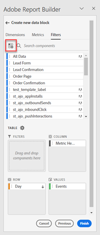

# Trabajo con filtros en Report Builder

Puede aplicar Filtros cuando cree un nuevo bloque de datos o cuando seleccione la opción **Editar bloque de datos** del panel COMANDOS.

## Aplicación de filtros a un bloque de datos

Para aplicar un filtro a todo el bloque de datos, haga doble clic en un filtro o arrastre y suelte los filtros de la lista de componentes en la sección Filtros de la Tabla.

## Aplicación de filtros a métricas individuales

Para aplicar filtros a métricas individuales, arrastre y suelte un filtro en una métrica de la tabla. También puede hacer clic en el botón **...** a la derecha de una métrica en el panel Tabla y, a continuación, seleccionar **Métrica de filtro**. Para ver los filtros aplicados, pase el ratón sobre una métrica o selecciónela en el panel Tabla. Las métricas con filtros aplicados muestran un icono de filtro.

## Filtros de edición rápida

Puede utilizar el panel de edición rápida para añadir, quitar o reemplazar los filtros para bloques de datos existentes.

Cuando se selecciona un rango de celdas en la hoja de cálculo, la variable **Filtros** en el panel Edición rápida muestra una lista resumida de los filtros utilizados por los bloques de datos de esa selección.

Edición de filtros mediante el panel Edición rápida

1. Seleccione un rango de celdas de uno o varios bloques de datos.

   

1. Haga clic en el vínculo Filtros para iniciar el panel Edición rápida - Filtros.

   

### Agregado o eliminación de un filtro

Puede añadir o quitar filtros utilizando las opciones Agregar o Quitar.

1. Seleccione la pestaña **Agregar/eliminar** en el panel Edición rápida - Filtros.

   Todos los filtros aplicados a los bloques de datos seleccionados se muestran en el panel Edición rápida - Filtros. Los filtros aplicados a todos los bloques de datos de la selección se enumeran en el encabezado **Se aplica a todos los bloques de datos seleccionados**. Los filtros aplicados a algunos bloques de datos, pero no a todos, se enumeran en el encabezado **Se aplica a uno o más bloques de datos seleccionados**.

   Cuando hay varios filtros presentes en los bloques de datos seleccionados, puede buscar filtros específicos mediante el campo de búsqueda **Añadir filtro**.

   

1. Añadir filtros seleccionándolos en el menú desplegable **Añadir filtro**.

   La lista de filtros en los que se puede buscar incluye todos los filtros accesibles para las vistas de datos que están presentes en uno o más de los bloques de datos seleccionados, así como todos los filtros disponibles globalmente en la organización.

   Al añadir un filtro, se aplica el filtro a todos los bloques de datos de la selección.

1. Para quitar filtros, haga clic en el icono Eliminar **x** a la derecha de los filtros de la lista **Filtros aplicados**.

1. Haga clic en **Aplicar** para guardar los cambios y volver al panel central.

   Report Builder muestra un mensaje para confirmar los cambios del filtro aplicado.

### Reemplazo de un filtro

Puede reemplazar un filtro existente por otro para cambiar la forma en que se filtran los datos.

1. Seleccione la pestaña **Reemplazar** en el panel Edición rápida - Filtros.

   

1. Utilice el campo de búsqueda **Lista de búsqueda** para localizar filtros específicos.

1. Elija uno o varios filtros que desee reemplazar.

1. Busque uno o varios filtros en el campo Reemplazar con.

   Al seleccionar un filtro, se añade a la lista **Reemplazar con**...

   

1. Haga clic en **Aplicar**.

   Report Builder actualiza la lista de filtros para reflejar el reemplazo.

### Definición de filtros de bloque de datos desde celda

Los bloques de datos pueden hacer referencia a filtros desde una celda. Varios bloques de datos pueden hacer referencia a la misma celda para filtros, lo que le permite cambiar fácilmente de filtro para varios bloques de datos a la vez.

Para aplicar filtros desde una celda

1. Vaya al paso 2 en el proceso de creación o edición del bloque de datos. Ver [Crear un bloque de datos](./create-a-data-block.md).
1. Haga clic en la ficha **Filtros** para definir los filtros.
1. Haga clic en **Crear filtro desde la celda**.

   

1. Seleccione la celda cuyos bloques de datos deben hacer referencia a un filtro.

1. Añada la opción de filtros que desee añadir a la celda haciendo doble clic en el filtro o arrastrándolo y soltándolo en la sección Filtros incluidos.

   Nota: Solo se puede seleccionar una opción para la celda determinada al mismo tiempo.

   

1. Haga clic en **Aplicar** para crear la celda de referencia.

1. En la pestaña **Filters**, agregue el filtro de celda de referencia recién creado al bloque de datos.

   

1. Haga clic en **Finalizar**.

   Ahora otros bloques de datos pueden hacer referencia a esta celda en sus filtros. Para aplicar la celda de referencia como filtro a otros bloques de datos, simplemente añada la referencia de celda a sus filtros desde la pestaña filtros.

#### Utilice la celda de referencia para cambiar los filtros del bloque de datos

1. Seleccione la celda de referencia en la hoja de cálculo.

1. Haga clic en el vínculo bajo **Filtros de celda** en el menú Edición rápida.

   

1. Seleccione el filtro en el menú desplegable.

   

1. Haga clic en **Aplicar**.
