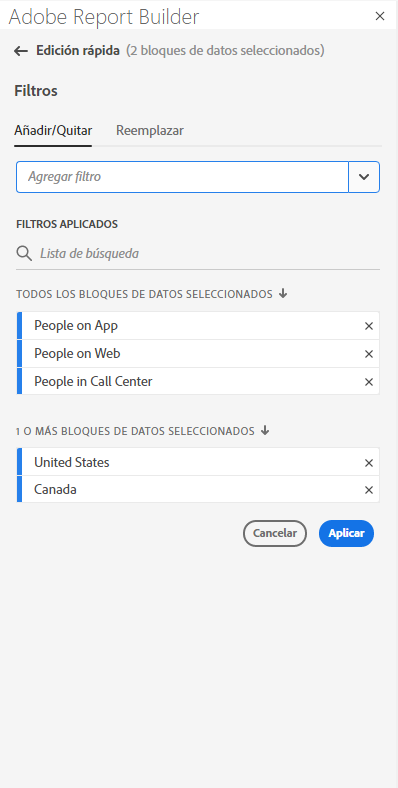

# Trabajar con filtros en el Report Builder

Puede aplicar Filtros al crear un nuevo bloque de datos o al seleccionar la opción **Editar bloque de datos** en el panel COMANDOS.

## Aplicar filtros a un bloque de datos

Para aplicar un filtro a todo el bloque de datos, haga doble clic en un filtro o arrastre y suelte los filtros de la lista de componentes en la sección Filtros de la Tabla.

## Aplicar filtros a métricas individuales

Para aplicar filtros a métricas individuales, arrastre y suelte un filtro en una métrica de la tabla. También puede hacer clic en **...El icono** a la derecha de una métrica en el panel Tabla y, a continuación, seleccione **Filtrar métrica**. Para ver los filtros aplicados, pase el ratón sobre una métrica o selecciónela en el panel Tabla. Las métricas con filtros aplicados muestran un icono de filtro.

<!--  -->

## Filtros de edición rápida

Puede utilizar el panel de edición rápida para agregar, quitar o reemplazar filtros para bloques de datos existentes.

Cuando se selecciona un rango de celdas en la hoja de cálculo, el vínculo **Filters** del panel de edición rápida muestra una lista resumida de los filtros utilizados por los bloques de datos de esa selección.

Edición de filtros mediante el panel de edición rápida

1. Seleccione un rango de celdas de uno o varios bloques de datos.

   

1. Haga clic en el vínculo Filtros para iniciar el panel Edición rápida: Filtros .

   

### Agregar o quitar un filtro

Puede agregar o quitar filtros utilizando las opciones Agregar o Quitar .

1. Seleccione la pestaña **Add/Remove** en el panel Quick edit-filters .

   Todos los filtros aplicados a los bloques de datos seleccionados se muestran en el panel Filtros de edición rápida . Los filtros aplicados a todos los bloques de datos de la selección se enumeran en el encabezado **Aplicado a todos los bloques de datos seleccionados**. Los filtros aplicados a algunos bloques de datos, pero no a todos, se enumeran en el encabezado **Aplicado a 1 o más bloques de datos seleccionados**.

   Cuando hay varios filtros presentes en los bloques de datos seleccionados, puede buscar filtros específicos mediante el campo de búsqueda **Añadir filtro**.

   

1. Añada filtros seleccionando filtros en el menú desplegable **Add filter**.

   La lista de filtros en los que se pueden buscar incluye todos los filtros accesibles para las vistas de datos que están presentes en uno o más de los bloques de datos seleccionados, así como todos los filtros disponibles globalmente en la organización.

   Al añadir un filtro, se aplica el filtro a todos los bloques de datos de la selección.

1. Para eliminar filtros, haga clic en el icono de eliminación **x** a la derecha de los filtros en la lista **Filtros aplicados**.

1. Haga clic en **Aplicar** para guardar los cambios y volver al panel del concentrador.

   El Report Builder muestra un mensaje para confirmar los cambios del filtro aplicado.

### Reemplazar un filtro

Puede reemplazar un filtro existente por otro para cambiar la forma en que se filtran los datos.

1. Seleccione la pestaña **Replace** en el panel Filtros de edición rápida .

   

1. Utilice el campo de búsqueda **Search list** para localizar filtros específicos.

1. Elija uno o varios filtros que desee reemplazar.

1. Busque uno o varios filtros en el campo Reemplazar con .

   Al seleccionar un filtro, se agrega a la lista **Replace with**...

   

1. Haga clic en **Aplicar**.

   Report Builder actualiza la lista de filtros para reflejar el reemplazo.
