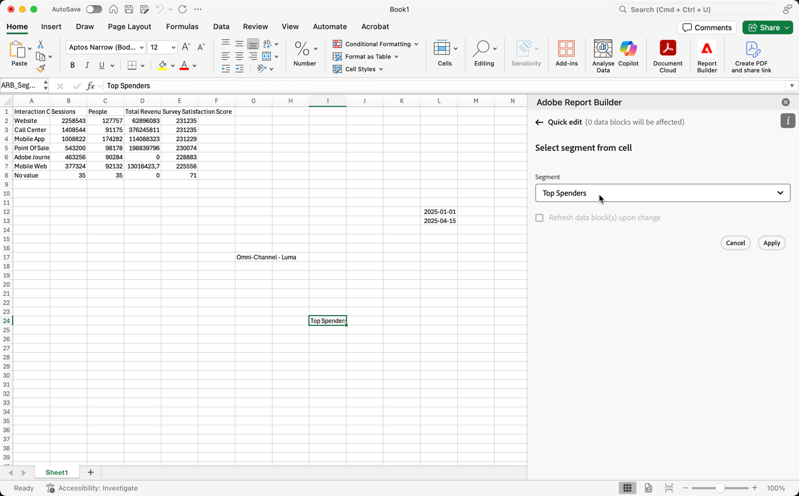

# Trabajar con segmentos

Puede aplicar segmentos cuando cree un nuevo bloque de datos o cuando seleccione **[!UICONTROL Editar bloque de datos]** en el panel **[!UICONTROL Comandos]**.

## Aplicación de segmentos a un bloque de datos

Para aplicar un segmento a todo el bloque de datos, seleccione un segmento o arrastre y suelte segmentos de la lista de componentes en la sección de segmentos de la Tabla.

## Aplicación de filtros a métricas individuales

Para aplicar filtros mediante segmentos a métricas individuales:

* Arrastre y suelte uno o más segmentos de **[!UICONTROL Segmentos]** en una métrica de la tabla.

* Alternativamente:

   1. Seleccione  para una métrica específica en el panel **[!UICONTROL Tabla]** y, a continuación, seleccione **[!UICONTROL Métrica de filtro]**.

      La pestaña {zoomable="yes"}

   1. Seleccione uno o más segmentos del menú desplegable **[!UICONTROL Segmentos]**. Los segmentos se agregan a la lista **[!UICONTROL Segmentos aplicados]**.

      
   1. Seleccione  para quitar un segmento de la lista **[!UICONTROL Segmento aplicado]**. O bien, seleccione **[!UICONTROL Borrar todo]** para eliminar todos los segmentos de la lista **[!UICONTROL Segmento aplicado]**.
   1. Seleccione **[!UICONTROL Aplicar]**.

Para ver los filtros aplicados, pase el puntero por encima de una métrica o selecciónela en el panel Tabla. Las métricas con segmentos aplicados muestran un icono de segmento.

## Edición rápida de segmentos

Puede usar el panel **[!UICONTROL Edición rápida]** para agregar, quitar o reemplazar segmentos para bloques de datos existentes.

Cuando selecciona un rango de celdas en la hoja de cálculo, el vínculo **[!UICONTROL Segmentos]** del panel **[!UICONTROL Edición rápida]** muestra una lista resumida de los segmentos utilizados por los bloques de datos de esa selección.

Para editar segmentos con el panel **[!UICONTROL Edición rápida]**:

1. Seleccione un rango de celdas de uno o varios bloques de datos.

1. Seleccione el vínculo **[!UICONTROL Segmentos]** para iniciar el panel **[!UICONTROL Edición rápida]** **[!UICONTROL Segmentos]**.

### Añadir o quitar segmentos

Puede añadir o quitar segmentos mediante las opciones Añadir/Quitar.

1. Seleccione la ficha **[!UICONTROL Agregar/Quitar]** en el panel **[!UICONTROL Edición rápida]** **[!UICONTROL Segmentos]**.

   1. Seleccione uno o más segmentos del menú desplegable **[!UICONTROL Segmentos]**. Los segmentos se agregan a la lista **[!UICONTROL Segmentos aplicados]**.
   1. Seleccione  para quitar un segmento de la lista **[!UICONTROL Segmento aplicado]**.
   1. Seleccione **[!UICONTROL Aplicar]**.

Report Builder muestra un mensaje para confirmar los cambios del segmento aplicado.

### Reemplazar segmentos

Puede reemplazar un segmento existente por otro para cambiar la forma en que se segmentan los datos.

1. Seleccione la ficha **[!UICONTROL Reemplazar]** en el panel **[!UICONTROL Edición rápida]** **[!UICONTROL Segmentos]**.

1. Utilice el campo de búsqueda **Lista de búsqueda** para localizar segmentos específicos.

1. Seleccione uno o varios segmentos que desee reemplazar.

1. Busque uno o más segmentos en el menú desplegable Reemplazar con para agregar el segmento a la lista **[!UICONTROL Reemplazar con]**.

1. Seleccione **[!UICONTROL Aplicar]**.

Report Builder actualiza la lista de segmentos para reflejar el reemplazo.

## Definir segmentos de bloque de datos de la celda

Los bloques de datos pueden hacer referencia a segmentos desde una celda. Varios bloques de datos pueden hacer referencia a la misma celda para segmentos, lo que le permite cambiar fácilmente entre varios bloques de datos a la vez.

Para aplicar segmentos desde una celda:

1. [Cree un nuevo bloque de datos](create-a-data-block.md#create-a-data-block) o edite un bloque de datos existente.
1. Seleccione la ficha **[!UICONTROL Segmentos]** para definir segmentos.
1. Seleccione .

   {zoomable="yes"}

1. Seleccione la celda desde la que desea que los bloques de datos hagan referencia a un segmento.

1. Haga doble clic para añadir un segmento a la celda. También puede arrastrar y soltar uno o más segmentos en la sección **[!UICONTROL Segmentos incluidos]**.

1. Seleccione **[!UICONTROL Aplicar]** para crear la celda de referencia.

1. En la pestaña **Segmentos**, agregue el segmento de celda de referencia recién creado al bloque de datos.

   {zoomable="yes"}

1. Seleccione **[!UICONTROL Finalizar]**.

Para aplicar la celda de referencia como un segmento a otros bloques de datos, use la referencia de celda como uno de los segmentos de la lista **[!UICONTROL Segmentos]** en la ficha **[!UICONTROL Tabla]**.

### Uso de una celda de referencia para cambiar los segmentos del bloque de datos

1. Seleccione la celda de referencia en la hoja de cálculo.

1. Seleccione el vínculo en **[!UICONTROL Segmentos de la celda]** en el menú **[!UICONTROL Edición rápida]**.

   {zoomable="yes"}

1. Seleccione el segmento en el menú desplegable.

1. Seleccione **[!UICONTROL Aplicar]**.
