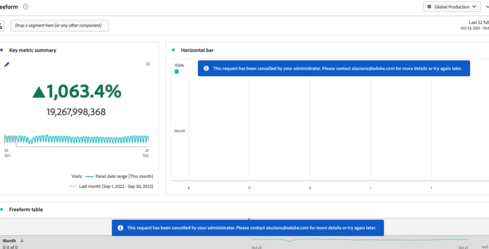

# Cancelar solicitudes de creación de informes en el Administrador de actividades de creación de informes

{{release-limited-testing}}

El [!UICONTROL Administrador de actividades de informes] permite a los administradores diagnosticar y cancelar rápidamente las solicitudes de creación de informes a fin de corregir los problemas de capacidad de creación de informes durante las horas de mayor actividad en la creación de informes.

Tenga en cuenta lo siguiente al cancelar las solicitudes de creación de informes:

* Puede cancelar solicitudes específicas, cancelar todas las solicitudes de un usuario específico o cancelar todas las solicitudes relacionadas con un proyecto específico.

* Al cancelar las solicitudes, también puede optar por restringir las solicitudes posteriores durante un período de tiempo determinado.

* No puede cancelar una solicitud si [!UICONTROL **Usuario**] de una solicitud se muestra como [!UICONTROL **No reconocido**]. Cuando esto sucede, significa que el usuario se encuentra en una empresa de inicio de sesión en la que no tiene permisos administrativos.

Para obtener más información sobre el Administrador de actividades de creación de informes, incluidas las ventajas clave y los requisitos de permisos, consulte [Información general del Administrador de actividades de creación de informes](/help/reporting-activity-manager/reporting-activity-overview.md).

## Cancelar solicitudes específicas

Puede cancelar solicitudes individuales que consuman una gran cantidad de capacidad de creación de informes.

1. En Customer Journey Analytics, vaya a **[!UICONTROL Herramientas]** > **[!UICONTROL Administrador de actividades de informes]**.

1. Seleccione la conexión en la que desea cancelar las solicitudes de creación de informes. <!--double-check this step-->

   Para obtener más información sobre los datos disponibles en esta página, consulte [Ver la actividad de creación de informes en el Administrador de actividades de informes](/help/reporting-activity-manager/reporting-activity.md).

1. Seleccione el [!UICONTROL **Solicitudes**] y, a continuación, seleccione una o varias solicitudes.

   <!-- add screenshot -->

1. Seleccionar [!UICONTROL **Cancelar solicitudes**].

   El [!UICONTROL **Cancelar _x_ solicitudes de informe**] aparece el cuadro de diálogo.

1. El campo Cancelación muestra el mensaje que se muestra a los usuarios cuando se cancelan sus solicitudes. Se proporciona un mensaje predeterminado. Puede actualizar el mensaje predeterminado para proporcionar detalles adicionales.

1. (Opcional) Para restringir solicitudes futuras durante un período de tiempo determinado, habilite la opción para [!UICONTROL **Restringir solicitudes posteriores**] y, a continuación, elija entre las siguientes opciones:

   | Opción | Función |
   |---------|----------|
   | [!UICONTROL **Usuario y proyecto**] | Los usuarios asociados con las solicitudes seleccionadas no podrán ejecutar solicitudes de informes en los proyectos asociados de forma temporal. |
   | [!UICONTROL **Usuario**] | A los usuarios asociados a las solicitudes seleccionadas se les restringirá temporalmente la realización de solicitudes de creación de informes. |
   | [!UICONTROL **Proyecto**] | Los proyectos asociados a las solicitudes seleccionadas quedarán temporalmente restringidos de todas las solicitudes de creación de informes. |
   | [!UICONTROL **Restringido para**] | Elija cuánto tiempo se restringirán las solicitudes. Puede elegir 1 minuto (predeterminado), 5 minutos, 10 minutos, 15 minutos o 30 minutos. <!-- double-check this -->
Una restricción no se puede eliminar antes de que se haya establecido.
 |

   {style="table-layout:auto"}

1. Seleccionar [!UICONTROL **Continuar con la cancelación**].

   Se muestra una notificación en Analysis Workspace que informa a los usuarios de que se ha cancelado la solicitud. Para obtener más información sobre cómo aparece esto en Analysis Workspace, consulte [Experiencia cuando los usuarios acceden a un informe cancelado](#experience-when-users-access-a-cancelled-report).

## Cancelar solicitudes de usuario

Puede cancelar todas las solicitudes que estén asociadas con uno o más usuarios.

1. En Customer Journey Analytics, vaya a **[!UICONTROL Herramientas]** > **[!UICONTROL Administrador de actividades de informes]**.

1. Seleccione la conexión en la que desea cancelar las solicitudes de creación de informes. <!--double-check this step-->

   Para obtener más información sobre los datos disponibles en esta página, consulte [Ver la actividad de creación de informes en el Administrador de actividades de informes](/help/reporting-activity-manager/reporting-activity.md).

1. Seleccione el [!UICONTROL **Usuarios**] y, a continuación, seleccione uno o varios usuarios.

   <!-- add screenshot -->

1. Seleccionar [!UICONTROL **Cancelar solicitudes**].

   El [!UICONTROL **Cancelar _x_ solicitudes de informes de usuarios x**] aparece el cuadro de diálogo.

1. El campo Cancelación muestra el mensaje que se muestra a los usuarios cuando se cancelan sus solicitudes. Se proporciona un mensaje predeterminado. Puede actualizar el mensaje predeterminado para proporcionar detalles adicionales.

1. (Opcional) Para restringir solicitudes futuras durante un período de tiempo determinado, habilite la opción para [!UICONTROL **Restringir solicitudes posteriores**] y, a continuación, elija entre las siguientes opciones:

   | Opción | Función |
   |---------|----------|
   | [!UICONTROL **Usuario y proyecto**] | Los usuarios seleccionados no podrán realizar solicitudes de informes para los proyectos asociados de forma temporal. |
   | [!UICONTROL **Usuario**] | Los usuarios seleccionados no podrán realizar ninguna solicitud de creación de informes de forma temporal. |
   | [!UICONTROL **Proyecto**] | Los proyectos asociados con los usuarios seleccionados estarán restringidos de cualquier solicitud de creación de informes realizada por cualquier usuario. |
   | [!UICONTROL **Restringido para**] | Elija cuánto tiempo se restringirán las solicitudes. Puede elegir 1 minuto (predeterminado), 5 minutos, 10 minutos, 15 minutos o 30 minutos. <!--double-check this--> 
Una restricción no se puede eliminar antes de que se haya establecido.
 |

   {style="table-layout:auto"}

1. Seleccionar [!UICONTROL **Continuar con la cancelación**].

   Se muestra una notificación en Analysis Workspace que informa a los usuarios de que se ha cancelado la solicitud. Para obtener más información sobre cómo aparece esto en Analysis Workspace, consulte [Experiencia cuando los usuarios acceden a un informe cancelado](#experience-when-users-access-a-cancelled-report).

## Cancelar solicitudes por proyecto

Puede cancelar todas las solicitudes que estén asociadas con uno o más proyectos.

1. En Customer Journey Analytics, vaya a **[!UICONTROL Herramientas]** > **[!UICONTROL Administrador de actividades de informes]**.

1. Seleccione la conexión en la que desea cancelar las solicitudes de creación de informes. <!--double-check this step-->

   Para obtener más información sobre los datos disponibles en esta página, consulte [Ver la actividad de creación de informes en el Administrador de actividades de informes](/help/reporting-activity-manager/reporting-activity.md).

1. Seleccione el [!UICONTROL **Proyectos**] y, a continuación, seleccione uno o varios proyectos.

   <!-- add screenshot -->

1. Seleccionar [!UICONTROL **Cancelar solicitudes**].

   El [!UICONTROL **Cancelar _x_ solicitudes de informes de x proyectos**] aparece el cuadro de diálogo.

1. El campo Cancelación muestra el mensaje que se muestra a los usuarios cuando se cancelan sus solicitudes. Se proporciona un mensaje predeterminado. Puede actualizar el mensaje predeterminado para proporcionar detalles adicionales.

1. (Opcional) Para restringir solicitudes futuras durante un período de tiempo determinado, habilite la opción para [!UICONTROL **Restringir solicitudes posteriores**] y, a continuación, elija entre las siguientes opciones:

   | Opción | Función |
   |---------|----------|
   | [!UICONTROL **Usuario y proyecto**] | Los proyectos seleccionados se restringirán temporalmente de cualquier solicitud de creación de informes realizada por los usuarios asociados. |
   | [!UICONTROL **Usuario**] | Los usuarios asociados con los proyectos seleccionados no podrán realizar solicitudes de informes. |
   | [!UICONTROL **Proyecto**] | Los proyectos seleccionados se restringirán temporalmente de cualquier solicitud de creación de informes realizada por cualquier usuario. |
   | [!UICONTROL **Restringido para**] | Elija cuánto tiempo se restringirán las solicitudes. Puede elegir 1 minuto (predeterminado), 5 minutos, 10 minutos, 15 minutos o 30 minutos. <!--double-check this--> 
Una restricción no se puede eliminar antes de que se haya establecido.
 |

   {style="table-layout:auto"}

1. Seleccionar [!UICONTROL **Continuar con la cancelación**].

   Se muestra una notificación en Analysis Workspace que informa a los usuarios de que se ha cancelado la solicitud. Para obtener más información sobre cómo aparece esto en Analysis Workspace, consulte [Experiencia cuando los usuarios acceden a un informe cancelado](#experience-when-users-access-a-cancelled-report).

## Experiencia cuando los usuarios acceden a un informe cancelado

En Analysis Workspace, los usuarios ven el siguiente mensaje cuando intentan acceder a un informe cancelado por un administrador:

