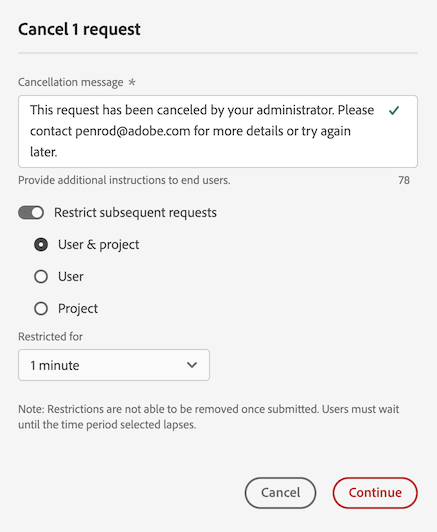

# Cancelación de solicitudes de creación de informes en el Administrador de actividades de creación de informes

El [!UICONTROL Administrador de actividades de creación de informes] permite a los administradores diagnosticar y cancelar rápidamente las solicitudes de creación de informes con el fin de corregir los problemas de capacidad de creación de informes durante las horas de mayor actividad en la creación de informes.

A la hora de cancelar solicitudes de creación de informes, tenga en cuenta lo siguiente:

* Puede cancelar solicitudes específicas, cancelar todas las solicitudes de un usuario específico o cancelar todas las solicitudes relacionadas con un proyecto específico.

* Cuando cancele las solicitudes, también puede optar por restringir las solicitudes posteriores durante un período de tiempo determinado.

  Cuando restringe una solicitud posterior, la acción se registra en el [Registro de auditoría](/help/privacy/audit-log.md) con el nombre de acción EMBARGO.

* No puede cancelar una solicitud si la columna [!UICONTROL **Usuario**] de una solicitud se muestra como [!UICONTROL **No reconocida**]. Cuando esto sucede, significa que el usuario se encuentra en una compañía para iniciar sesión en la que no tiene permisos administrativos.

Para obtener más información sobre el Administrador de actividades de creación de informes, incluidas las ventajas clave y los requisitos de permisos, consulte [Información general sobre el Administrador de actividades de creación de informes](/help/reporting-activity-manager/reporting-activity-overview.md).

## Cancelación de solicitudes específicas

Puede cancelar solicitudes individuales que consuman una gran cantidad de capacidad de creación de informes. Al cancelar una solicitud, puede optar por restringirla aún más durante un período de tiempo determinado.

1. En Customer Journey Analytics, vaya a **[!UICONTROL Herramientas]** > **[!UICONTROL Administrador de actividades de creación de informes]**.

1. Seleccione la conexión en la que desea cancelar las solicitudes de creación de informes. <!--double-check this step-->

   Para obtener más información sobre los datos disponibles en esta página, consulte [Ver la actividad de informes en el Administrador de actividades de creación de informes](/help/reporting-activity-manager/reporting-activity.md).

1. Seleccione la pestaña [!UICONTROL **Solicitudes**] y, a continuación, seleccione una o varias solicitudes.

   <!-- add screenshot -->

1. Seleccione [!UICONTROL **Cancelar solicitudes**].

   Aparece el cuadro de diálogo [!UICONTROL **Cancelar _x_ solicitudes de informe**].

1. El campo Cancelación muestra el mensaje que se muestra a los usuarios cuando se cancelan sus solicitudes. Se proporciona un mensaje predeterminado. Puede actualizar el mensaje predeterminado para proporcionar detalles adicionales.

1. (Opcional) Para restringir solicitudes futuras durante un período de tiempo determinado:

   1. Habilite la opción para [!UICONTROL **Restringir las solicitudes posteriores**].

      

   1. Elija entre las siguientes opciones:

      | Opción | Función |
      |---------|----------|
      | [!UICONTROL **Usuario y proyecto**] | Los usuarios asociados a las solicitudes seleccionadas tendrán restringida temporalmente la ejecución de solicitudes de creación de informes para los proyectos asociados. |
      | [!UICONTROL **Usuario**] | A los usuarios asociados a las solicitudes seleccionadas se les restringirá temporalmente la realización de solicitudes de creación de informes. |
      | [!UICONTROL **Proyecto**] | Los proyectos asociados a las solicitudes seleccionadas quedarán temporalmente restringidos de todas las solicitudes de creación de informes. |
      | [!UICONTROL **Restringido para**] | Elija cuánto tiempo se restringirán las solicitudes. Puede elegir 1 minuto (valor predeterminado), 5 minutos, 10 minutos, 15 minutos o 30 minutos. <!-- double-check this -->
Una restricción no se puede quitar antes de que se haya establecido.
 |

      {style="table-layout:auto"}

1. Seleccione [!UICONTROL **Continuar con la cancelación**].

   Se muestra una notificación en Analysis Workspace que informa a los usuarios de que se ha cancelado la solicitud. Para obtener más información sobre cómo aparece esto en Analysis Workspace, consulte [Experiencia cuando los usuarios acceden a un informe cancelado](#experience-when-users-access-a-cancelled-report).

## Cancelación de solicitudes por el usuario

Puede cancelar todas las solicitudes que estén asociadas con uno o más usuarios. Al cancelar las solicitudes asociadas a un usuario, puede optar por restringir aún más las solicitudes de ese usuario durante un período de tiempo determinado.

1. En Customer Journey Analytics, vaya a **[!UICONTROL Herramientas]** > **[!UICONTROL Administrador de actividades de creación de informes]**.

1. Seleccione la conexión en la que desea cancelar las solicitudes de creación de informes. <!--double-check this step-->

   Para obtener más información sobre los datos disponibles en esta página, consulte [Ver la actividad de informes en el Administrador de actividades de creación de informes](/help/reporting-activity-manager/reporting-activity.md).

1. Seleccione la pestaña [!UICONTROL **Usuarios**] y, a continuación, seleccione uno o varios usuarios.

   <!-- add screenshot -->

1. Seleccione [!UICONTROL **Cancelar solicitudes**].

   Se muestra el cuadro de diálogo [!UICONTROL **Cancelar solicitudes de informe _x_ de x usuarios**].

1. El campo Cancelación muestra el mensaje que se muestra a los usuarios cuando se cancelan sus solicitudes. Se proporciona un mensaje predeterminado. Puede actualizar el mensaje predeterminado para proporcionar detalles adicionales.

1. (Opcional) Para restringir solicitudes futuras durante un período de tiempo determinado:

   1. Habilite la opción para [!UICONTROL **Restringir solicitudes subsiguientes**]

      

   1. Elija entre las siguientes opciones:

      | Opción | Función |
      |---------|----------|
      | [!UICONTROL **Usuario y proyecto**] | Se restringirá temporalmente a los usuarios seleccionados la posibilidad de realizar solicitudes de creación de informes para los proyectos asociados. 
Se trata de la opción menos restrictiva.
 |
      | [!UICONTROL **Usuario**] | Se restringirá temporalmente a los usuarios seleccionados la posibilidad de solicitar la creación de informes. |
      | [!UICONTROL **Proyecto**] | Los proyectos asociados a los usuarios seleccionados estarán restringidos a cualquier solicitud de creación de informes realizada por cualquier usuario. |
      | [!UICONTROL **Restringido para**] | Elija cuánto tiempo se restringirán las solicitudes. Puede elegir 1 minuto (valor predeterminado), 5 minutos, 10 minutos, 15 minutos o 30 minutos. <!--double-check this--> 
Una restricción no se puede quitar antes de que se haya establecido.
 |

      {style="table-layout:auto"}

1. Seleccione [!UICONTROL **Continuar con la cancelación**].

   Se muestra una notificación en Analysis Workspace que informa a los usuarios de que se ha cancelado la solicitud. Para obtener más información sobre cómo aparece esto en Analysis Workspace, consulte [Experiencia cuando los usuarios acceden a un informe cancelado](#experience-when-users-access-a-cancelled-report).

## Cancelar solicitudes por proyecto

Puede cancelar todas las solicitudes que estén asociadas con uno o más proyectos. Al cancelar las solicitudes asociadas a un proyecto, puede optar por restringir aún más las solicitudes asociadas a ese proyecto durante un período de tiempo determinado.

1. En Customer Journey Analytics, vaya a **[!UICONTROL Herramientas]** > **[!UICONTROL Administrador de actividades de creación de informes]**.

1. Seleccione la conexión en la que desea cancelar las solicitudes de creación de informes. <!--double-check this step-->

   Para obtener más información sobre los datos disponibles en esta página, consulte [Ver la actividad de creación de informes en el Administrador de actividades de creación de informes](/help/reporting-activity-manager/reporting-activity.md).

1. Seleccione la pestaña [!UICONTROL **Proyectos**] y, a continuación, seleccione uno o varios proyectos.

   <!-- add screenshot -->

1. Seleccione [!UICONTROL **todas las solicitudes**].

   Se muestra el cuadro de diálogo [!UICONTROL **Cancelar solicitudes de informe _x_ de x proyectos**].

1. El campo Cancelación muestra el mensaje que se muestra a los usuarios cuando se cancelan sus solicitudes. Se proporciona un mensaje predeterminado. Puede actualizar el mensaje predeterminado para proporcionar detalles adicionales.

1. (Opcional) Para restringir solicitudes futuras durante un período de tiempo determinado:

   1. Habilite la opción para [!UICONTROL **Restringir solicitudes subsiguientes**].

      

   1. Elija entre las siguientes opciones:

      | Opción | Función |
      |---------|----------|
      | [!UICONTROL **Usuario y proyecto**] | Los proyectos seleccionados quedarán temporalmente excluidos de cualquier solicitud de creación de informes realizada por los usuarios asociados.
Se trata de la opción menos restrictiva.
 |
      | [!UICONTROL **Usuario**] | Se restringirá a los usuarios asociados a los proyectos seleccionados la posibilidad de solicitar la creación de informes. |
      | [!UICONTROL **Proyecto**] | Los proyectos seleccionados quedarán temporalmente excluidos de cualquier solicitud de creación de informes realizada por cualquier usuario. |
      | [!UICONTROL **Restringido para**] | Elija cuánto tiempo se restringirán las solicitudes. Puede elegir 1 minuto (valor predeterminado), 5 minutos, 10 minutos, 15 minutos o 30 minutos. <!--double-check this--> 
Una restricción no se puede quitar antes de que se haya establecido.
 |

      {style="table-layout:auto"}

1. Seleccione [!UICONTROL **Continuar con la cancelación**].

   Se muestra una notificación en Analysis Workspace que informa a los usuarios de que se ha cancelado la solicitud. Para obtener más información sobre cómo aparece esto en Analysis Workspace, consulte [Experiencia cuando los usuarios acceden a un informe cancelado](#experience-when-users-access-a-cancelled-report).

## Cancelación de solicitudes por la aplicación

Puede cancelar todas las solicitudes que están asociadas a una o varias aplicaciones. Cuando cancele las solicitudes asociadas a una aplicación, puede optar por restringir aún más las solicitudes asociadas a esa aplicación durante un período de tiempo determinado.

Entre estas mejoras se incluyen las siguientes:

* IU de Analysis Workspace
* Proyectos programados de Workspace
* Report Builder
* IU del generador: Segmento, Métricas calculadas, Anotaciones, Públicos, etc.
* Llamadas de API desde la API 2.0
* Alertas
* Exportación de tabla completa
* Vínculos para compartir con cualquiera
* Análisis guiado
* Cualquier otra aplicación que consulte el motor de informes de Analytics.

Para cancelar las solicitudes por la aplicación:

1. En Customer Journey Analytics, vaya a **[!UICONTROL Herramientas]** > **[!UICONTROL Administrador de actividades de creación de informes]**.

1. Seleccione la conexión en la que desea cancelar las solicitudes de creación de informes. <!--double-check this step-->

   Para obtener más información sobre los datos disponibles en esta página, consulte [Ver la actividad de creación de informes en el Administrador de actividades de creación de informes](/help/reporting-activity-manager/reporting-activity.md).

1. Seleccione la pestaña [!UICONTROL **Aplicaciones**] y, a continuación, seleccione una o varias aplicaciones.

   <!-- add screenshot -->

1. Seleccione [!UICONTROL **Cancelar solicitudes**].

   Se muestra el cuadro de diálogo [!UICONTROL **Cancelar solicitudes de informe _x_ de x proyectos**].

1. El campo Cancelación muestra el mensaje que se muestra a los usuarios cuando se cancelan sus solicitudes. Se proporciona un mensaje predeterminado. Puede actualizar el mensaje predeterminado para proporcionar detalles adicionales.

1. (Opcional) Para restringir solicitudes futuras durante un período de tiempo determinado:

   1. Habilite la opción para [!UICONTROL **Restringir las solicitudes posteriores**].

      

   1. Elija entre las siguientes opciones:

      | Opción | Función |
      |---------|----------|
      | [!UICONTROL **Usuario y proyecto**] | Las aplicaciones seleccionadas quedarán temporalmente excluidas de cualquier solicitud de creación de informes realizada por los usuarios y proyectos asociados.
Se trata de la opción menos restrictiva.
 |
      | [!UICONTROL **Usuario**] | Se restringirá a los usuarios asociados a las aplicaciones seleccionadas la posibilidad de solicitar la creación de informes. |
      | [!UICONTROL **Proyecto**] | Se restringirá a los proyectos asociados a las aplicaciones seleccionadas cualquier solicitud de creación de informes realizada por cualquier usuario. |
      | [!UICONTROL **Restringido para**] | Elija cuánto tiempo se restringirán las solicitudes. Puede elegir 1 minuto (valor predeterminado), 5 minutos, 10 minutos, 15 minutos o 30 minutos. <!--double-check this--> 
Una restricción no se puede quitar antes de que se haya establecido.
 |

      {style="table-layout:auto"}

1. Seleccione [!UICONTROL **Continuar con la cancelación**].

   Se muestra una notificación en la aplicación (como en Analysis Workspace) que informa a los usuarios de que la solicitud se ha cancelado. Para obtener más información sobre cómo aparece esto en Analysis Workspace, consulte [Experiencia cuando los usuarios acceden a un informe cancelado](#experience-when-users-access-a-cancelled-report).

## Experiencia cuando los usuarios acceden a un informe cancelado

En Analysis Workspace, los usuarios ven los siguientes mensajes cuando intentan acceder a un informe o una visualización que está afectado por una cancelación:

### Mensaje sobre el proyecto

Cuando los usuarios intentan acceder a un proyecto que está afectado por una cancelación, ven un mensaje que les informa de que el informe está restringido temporalmente:

### Mensaje sobre la visualización

Cuando los usuarios intentan acceder a una visualización que está afectada por una cancelación, ven un mensaje que les informa de que el procesamiento de datos del informe está restringido temporalmente:

