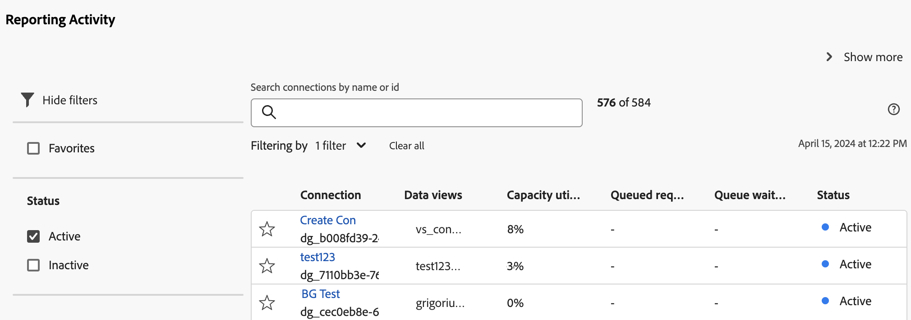

# Visualización de la actividad de creación de informes {#view-reporting-activity}

El [!UICONTROL Administrador de actividades de creación de informes] permite a los administradores diagnosticar y corregir rápidamente los problemas de capacidad de creación de informes durante las horas de mayor actividad de creación de informes.

Para obtener más información sobre el Administrador de actividades de creación de informes, incluidas las ventajas clave y los requisitos de los permisos, consulte [Información general sobre el Administrador de actividades de creación de informes](/help/reporting-activity-manager/reporting-activity-overview.md).

## Para todas las conexiones {#view-all-report-suites}

<!-- markdownlint-disable MD034 -->

>[!CONTEXTUALHELP]
>id="cja_tools_reportingactivitymanager_connections"
>title="Conexiones"
>abstract="Esta tabla muestra las conexiones para las que tiene derechos para administrar la actividad de creación de informes. La información sobre cada conexión está disponible en cada columna de la tabla."

<!-- markdownlint-enable MD034 -->

<!-- markdownlint-disable MD034 -->

>[!CONTEXTUALHELP]
>id="tools_reportingactivitymanager_connections"
>title="Conexiones"
>abstract="Esta tabla muestra las conexiones para las que tiene derechos para administrar la actividad de creación de informes. La información sobre cada conexión está disponible en cada columna de la tabla."

<!-- markdownlint-enable MD034 -->

1. En Customer Journey Analytics, vaya a **[!UICONTROL Herramientas]** > **[!UICONTROL Administrador de actividades de creación de informes]**.

   Se muestra una lista de las conexiones base habilitadas.

   

1. Para ver el número total de solicitudes de informes para todas las conexiones de su organización, expanda [!UICONTROL **Mostrar más**] para ver el gráfico [!UICONTROL **Solicitudes de informes mensuales**].

   Puede ver el número de solicitudes de informes dentro de su organización para el mes actual y el mes anterior.

   

1. (Opcional) Puede buscar o filtrar la lista de conexiones:

   * Utilice el campo de búsqueda para buscar una conexión específica. Empiece a escribir el nombre o ID de la conexión y la lista de actualizaciones de las conexiones se actualizará a medida que escriba.

   * Seleccione  para expandir la lista de opciones de filtro. Puede filtrar por [!UICONTROL **Favoritos**] o [!UICONTROL **Estado**].

     Para marcar una conexión como favorita, seleccione el icono de estrella a la izquierda del nombre de la conexión.

     <!-- (does this option still exist?) 1. (Optional) Select **[!UICONTROL Refresh]** at the top-right to refresh the data. -->

1. Visualice la información de utilización sobre cada conexión. Los datos que se muestran en la tabla representan la actividad de creación de informes de la conexión en el momento en que se cargó la página por última vez.

   Las columnas disponibles son las siguientes:

   | Elemento de la IU | Descripción |
   | --- | --- |
   | **[!UICONTROL Conexión]** | La conexión cuya actividad de creación de informes está monitorizando. |
   | **[!UICONTROL Vistas de datos]** | Muestra todas las vistas de datos que utilizan la conexión. La configuración de vistas de datos puede añadir complejidad a las solicitudes de creación de informes. |
   | **[!UICONTROL Utilización de la capacidad]** | El porcentaje de la capacidad de creación de informes de la conexión que se está utilizando, en tiempo real. 
**Nota** Una capacidad de uso del 100 % no significa necesariamente que se deban cancelar inmediatamente las solicitudes de creación de informes. Una capacidad de uso del 100 % puede ser saludable si el tiempo medio de espera es razonable. Por otro lado, una capacidad de uso del 100 % podría indicar un problema si el número de solicitudes en cola también aumenta.
 |
   | **[!UICONTROL Solicitudes en cola]** | El número de solicitudes en espera de ser procesadas. <!-- ??? --> |
   | **[!UICONTROL Tiempo de espera en cola]** | El tiempo medio de espera antes de que las solicitudes empiecen a procesarse. <!-- ???? --> |
   | **[!UICONTROL Estado]** | Los posibles estados son: <ul><li>[!UICONTROL **Activo**] (azul): los informes se han ejecutado en la conexión durante las 2 últimas horas. Los datos que se muestran en la tabla representan la capacidad de creación de informes de la conexión en el momento en que se cargó la página por última vez.</li><li>[!UICONTROL **Inactivo**] (gris): no se ha ejecutado ningún informe en la conexión durante las 2 últimas horas, por lo que no se muestran datos para la conexión.</li></ul> |

   {style="table-layout:auto"}

## Para una sola conexión

1. En Customer Journey Analytics, seleccione [!UICONTROL **Herramientas**] > [!UICONTROL **Administrador de actividades de creación de informes**].

1. Seleccione el título vinculado de la conexión cuyos detalles desea ver.

   Se muestran los datos de la actividad de creación de informes de la conexión seleccionada.

1. (Opcional) Cuando una conexión se carga por primera vez en el Administrador de actividades de creación de informes, los datos mostrados representan las métricas de utilización actuales. Para ver las métricas actualizadas después de la carga inicial, seleccione el botón [!UICONTROL **Actualizar**] para actualizar manualmente la página.

   <!-- Need to update this screenshot:  -->

1. Utilice los gráficos y la tabla disponibles para conocer la actividad de creación de informes en la conexión.

   * [Visualización de gráficos](#view-graphs)

   * [Visualización de la tabla](#view-table)

### Visualización de gráficos

Los siguientes gráficos están disponibles para ayudarle a conocer mejor la actividad que se produce en la conexión.

Si los gráficos no están visibles, seleccione el botón [!UICONTROL **Mostrar gráficos**].

#### Gráfico de utilización {#utilization}

El gráfico de utilización muestra la utilización de la creación de informes de un grupo de informes seleccionado durante las 2 últimas horas.

Pase el puntero por encima del gráfico para ver los momentos específicos en los que el porcentaje de capacidad de uso fue mayor durante ese minuto.

* **Eje X**: la capacidad de uso de creación de informes durante las últimas 2 horas.
* **Eje Y**: el porcentaje de capacidad de uso de informes, por minuto.

  

#### Gráfico de usuarios distintos

El gráfico de usuarios distintos muestra la actividad de creación de informes de un grupo de informes seleccionado durante las últimas 2 horas.

Pase el puntero por encima del gráfico para ver los momentos específicos en los que la cantidad máxima de usuarios fue mayor durante ese minuto.

* **Eje X**: la actividad de creación de informes durante el último lapso de tiempo de 2 horas.
* **Eje Y**: el número de usuarios que han realizado solicitudes de informes, por minuto.

  

#### Gráfico de solicitudes

El gráfico Solicitudes muestra el número de solicitudes procesadas y en cola para la conexión seleccionada durante las 2 últimas horas.

Pase el puntero por encima del gráfico para ver los momentos específicos en los que el número de solicitudes fue mayor durante ese minuto.

* **Eje X**: el número de solicitudes procesadas y en cola durante el último lapso de tiempo de 2 horas.
* **Eje Y**: el número de solicitudes procesadas (en verde) y solicitudes en cola (en púrpura), por minuto.

  

#### Gráfico de puesta en cola

El gráfico de puesta en cola muestra el tiempo medio de espera en la cola (en segundos) para las solicitudes de creación de informes de la conexión seleccionada durante las 2 últimas horas.

Pase el puntero por encima del gráfico para ver los momentos específicos en los que el tiempo medio de espera máximo fue mayor durante ese minuto.

* **Eje X**: el tiempo medio de espera en cola para las solicitudes de informes durante el último lapso de tiempo de 2 horas.
* **Eje Y**: el tiempo medio de espera (en segundos).

  

### Visualización de la tabla {#view-table}

Cuando visualice la tabla, tenga en cuenta lo siguiente:

* Puede elegir ver los datos eligiendo cualquiera de las siguientes pestañas en la parte superior de la tabla de datos: [!UICONTROL **Solicitud**], [!UICONTROL **Usuario**], [!UICONTROL **Proyecto**] o [!UICONTROL **Aplicación**].

* Puede buscar o filtrar la lista de conexiones:

   * Utilice el campo de búsqueda para buscar una conexión específica. Empiece a escribir el nombre o ID de la conexión y la lista de actualizaciones de las conexiones se actualizará a medida que escriba.

   * Seleccione el icono [!UICONTROL **Filtro**]  para expandir la lista de opciones de filtro. Puede filtrar por [!UICONTROL **Estado**], [!UICONTROL **Complejidad**], [!UICONTROL **Aplicación**], [!UICONTROL **Usuario**] o [!UICONTROL **Proyecto**].

   * Puede seleccionar [!UICONTROL **Ocultar gráficos**] para mostrar solamente la tabla.

#### Vista de los datos por solicitud

Cuando selecciona la pestaña [!UICONTROL **Solicitud**], las siguientes columnas están disponibles en la tabla:

| Columna | Descripción |
| --- | --- |
| [!UICONTROL **ID de solicitud**] | Un ID único que se puede utilizar para solucionar problemas. Para copiar el identificador, seleccione la solicitud y luego seleccione la opción [!UICONTROL **Copiar ID de solicitud**]. |
| [!UICONTROL **Tiempo de ejecución**] | Cuánto tiempo lleva ejecutándose la consulta. |
| [!UICONTROL **Hora de inicio**] | Cuando la solicitud comenzó a procesarse (según la hora local del administrador). |
| [!UICONTROL **Tiempo de espera**] | El tiempo que la consulta ha estado esperando antes de procesarse. El valor suele ser &quot;0&quot; cuando hay suficiente capacidad. |
| [!UICONTROL **Aplicación**] | Las aplicaciones compatibles con el [!UICONTROL Administrador de actividades de creación de informes] son: <ul><li>IU de Analysis Workspace</li><li>Proyectos programados de Workspace</li><li>Report Builder</li><li>Interfaces de usuario de Builder: Segmento, Métricas calculadas, Anotaciones, Públicos, etc.</li><li>Llamadas de API desde la API 2.0</li><li>Alertas<li>Exportación de tabla completa</li><li>Vínculos para compartir con cualquiera</li><li>Análisis guiado</li><li>Cualquier otra aplicación que consulte el motor de informes de Analytics.</li></li></ul>
**Nota:** Si el valor de esta columna es [!UICONTROL **Desconocido**], significa que los metadatos de la solicitud no están disponibles para el usuario.
 |
| [!UICONTROL **Usuario**] | El usuario que ha iniciado la consulta. 
**Nota:** Si el valor de esta columna es [!UICONTROL **Desconocido**], significa que los metadatos de la solicitud no están disponibles para el usuario.
 |
| [!UICONTROL **Proyecto**] | Nombres de proyectos de Workspace guardados, ID de informes de la API, etc. (Los metadatos pueden variar entre distintas aplicaciones).
**Nota:** Si el valor de esta columna es [!UICONTROL **Desconocido**], significa que el proyecto no se ha guardado o que los metadatos de la solicitud no están disponibles para el usuario.
 |
| [!UICONTROL **Estado**] | Indicadores de estado: <ul><li>**Ejecución**: la solicitud está siendo procesada en este momento.</li><li>**Pendiente**: la solicitud está esperando a procesarse.</li></ul> |
| [!UICONTROL **Complejidad**] | No todas las solicitudes requieren la misma cantidad de tiempo para procesarse. La complejidad de la solicitud puede ayudar a tener una idea general sobre el tiempo necesario para procesar la solicitud. 
Entre los posibles valores están:
 <ul><li>[!UICONTROL **Bajo**]</li><li>[!UICONTROL **Medio**]</li><li>[!UICONTROL **Alto**]</li></ul>Este valor se ve influido por los valores de las siguientes columnas:<ul><li>[!UICONTROL **Límites mensuales**]</li><li>[!UICONTROL **Columnas**]</li><li>[!UICONTROL **Segmentos**]</li></ul> |
| [!UICONTROL **Límites mensuales**] | El número de meses que se incluyen en una solicitud. Más límites mensuales aumenta la complejidad de la solicitud. |
| [!UICONTROL **Columnas**] | El número de métricas y desgloses de la solicitud. Más columnas aumenta la complejidad de la solicitud. |
| [!UICONTROL **Segmentos**] | El número de segmentos aplicados a la solicitud. Más segmentos aumenta la complejidad de la solicitud. |

{style="table-layout:auto"}

#### Vista de los datos por usuario

Al seleccionar la pestaña [!UICONTROL **Usuario**], las siguientes columnas están disponibles en la tabla:

| Columna | Descripción |
| --- | --- |
| [!UICONTROL **Usuario**] | El usuario que ha iniciado la consulta. Si el valor de esta columna es [!UICONTROL **No reconocido**], significa que el usuario se encuentra en una compañía de inicio de sesión en la que no tiene permisos administrativos. |
| [!UICONTROL **Número de solicitudes**] | Número de solicitudes iniciadas por el usuario. |
| [!UICONTROL **Número de proyectos**] | El número de proyectos asociados al usuario. <!-- ??? --> |
| [!UICONTROL **Aplicación**] | Las aplicaciones compatibles con el [!UICONTROL Administrador de actividades de creación de informes] son: <ul><li>IU de Analysis Workspace</li><li>Proyectos programados de Workspace</li><li>Report Builder</li><li>Interfaces de usuario de Builder: Segmento, Métricas calculadas, Anotaciones, Públicos, etc.</li><li>Llamadas de API desde la API 2.0</li><li>Alertas<li>Exportación de tabla completa</li><li>Vínculos para compartir con cualquiera</li><li>Análisis guiado</li><li>Cualquier otra aplicación que consulte el motor de informes de Analytics.</li></li></ul> |
| [!UICONTROL **Complejidad media**] | La complejidad media de las solicitudes iniciadas por el usuario. 
No todas las solicitudes requieren la misma cantidad de tiempo para procesarse. La complejidad de la solicitud puede ayudar a tener una idea general sobre el tiempo necesario para procesar la solicitud.

El valor de esta columna se basa en una puntuación que viene determinada por los valores de las columnas siguientes:
<ul><li>[!UICONTROL **Límites mensuales medios**]</li><li>[!UICONTROL **Columnas medias**]</li><li>[!UICONTROL **Segmentos medios**]</li></ul> |
| [!UICONTROL **Límites mensuales medios**] | El número medio de meses que se incluyen en las solicitudes. Más límites mensuales aumenta la complejidad de la solicitud. |
| [!UICONTROL **Columnas medias**] | El número medio de métricas y desgloses en las solicitudes incluidas. Más columnas aumenta la complejidad de la solicitud. |
| [!UICONTROL **Segmentos medios**] | El número medio de segmentos aplicados a las solicitudes incluidas. Más segmentos aumenta la complejidad de la solicitud. |

{style="table-layout:auto"}

#### Vista de los datos por proyecto

Al seleccionar la pestaña [!UICONTROL **Proyecto**], las siguientes columnas están disponibles en la tabla:

| Columna | Descripción |
| --- | --- |
| [!UICONTROL **Proyecto**] | El proyecto en el que se han iniciado las solicitudes. |
| [!UICONTROL **Número de solicitudes**] | El número de solicitudes asociadas al proyecto. |
| [!UICONTROL **Número de usuarios**] | El número de usuarios asociados al proyecto. <!-- ??? --> |
| [!UICONTROL **Aplicación**] | Las aplicaciones compatibles con el [!UICONTROL Administrador de actividades de creación de informes] son: <ul><li>IU de Analysis Workspace</li><li>Proyectos programados de Workspace</li><li>Report Builder</li><li>Interfaces de usuario de Builder: Segmento, Métricas calculadas, Anotaciones, Públicos, etc.</li><li>Llamadas de API desde la API 2.0</li><li>Alertas<li>Exportación de tabla completa</li><li>Vínculos para compartir con cualquiera</li><li>Análisis guiado</li><li>Cualquier otra aplicación que consulte el motor de informes de Analytics.</li></li></ul> |
| [!UICONTROL **Complejidad media**] | La complejidad media de las solicitudes incluidas en el proyecto. 
No todas las solicitudes requieren la misma cantidad de tiempo para procesarse. La complejidad de la solicitud puede ayudar a tener una idea general sobre el tiempo necesario para procesar la solicitud.

El valor de esta columna se basa en una puntuación que viene determinada por los valores de las columnas siguientes:
<ul><li>[!UICONTROL **Límites mensuales medios**]</li><li>[!UICONTROL **Columnas medias**]</li><li>[!UICONTROL **Segmentos medios**]</li></ul> |
| [!UICONTROL **Límites mensuales medios**] | El número medio de meses que se incluyen en las solicitudes. Más límites mensuales aumenta la complejidad de la solicitud. |
| [!UICONTROL **Columnas medias**] | El número medio de métricas y desgloses en las solicitudes incluidas. Más columnas aumenta la complejidad de la solicitud. |
| [!UICONTROL **Segmentos medios**] | El número medio de segmentos aplicados a las solicitudes incluidas. Más segmentos aumenta la complejidad de la solicitud. |

{style="table-layout:auto"}

#### Vista de datos por aplicación

Al seleccionar la pestaña [!UICONTROL **Aplicación**], las siguientes columnas están disponibles en la tabla:

| Columna | Descripción |
| --- | --- |
| [!UICONTROL **Aplicación**] | La aplicación donde se han iniciado las solicitudes. |
| [!UICONTROL **Número de solicitudes**] | El número de solicitudes asociadas a la aplicación. |
| [!UICONTROL **Número de usuarios**] | El número de usuarios asociados a la aplicación. <!--???--> |
| [!UICONTROL **Número de proyectos**] | El número de proyectos asociados a la aplicación. <!--???--> |
| [!UICONTROL **Complejidad media**] | La complejidad media de las solicitudes asociadas a la aplicación. 
No todas las solicitudes requieren la misma cantidad de tiempo para procesarse. La complejidad de la solicitud puede ayudar a tener una idea general sobre el tiempo necesario para procesar la solicitud.

El valor de esta columna se basa en una puntuación que viene determinada por los valores de las columnas siguientes:
El valor de esta columna se basa en una puntuación que viene determinada por los valores de las columnas siguientes:<ul><li>[!UICONTROL **Límites mensuales medios**]</li><li>[!UICONTROL **Columnas medias**]</li><li>[!UICONTROL **Segmentos medios**]</li></ul> |
| [!UICONTROL **Límites mensuales medios**] | El número medio de meses que se incluyen en las solicitudes. Más límites mensuales aumenta la complejidad de la solicitud. |
| [!UICONTROL **Columnas medias**] | El número medio de métricas y desgloses en las solicitudes incluidas. Más columnas aumenta la complejidad de la solicitud. |
| [!UICONTROL **Segmentos medios**] | El número medio de segmentos aplicados a las solicitudes incluidas. Más segmentos aumenta la complejidad de la solicitud. |

{style="table-layout:auto"}

<!-- 

## Frequently asked questions {#faq}

| Question | Answer |
| --- | --- |
| | |

{style="table-layout:auto"}

-->
