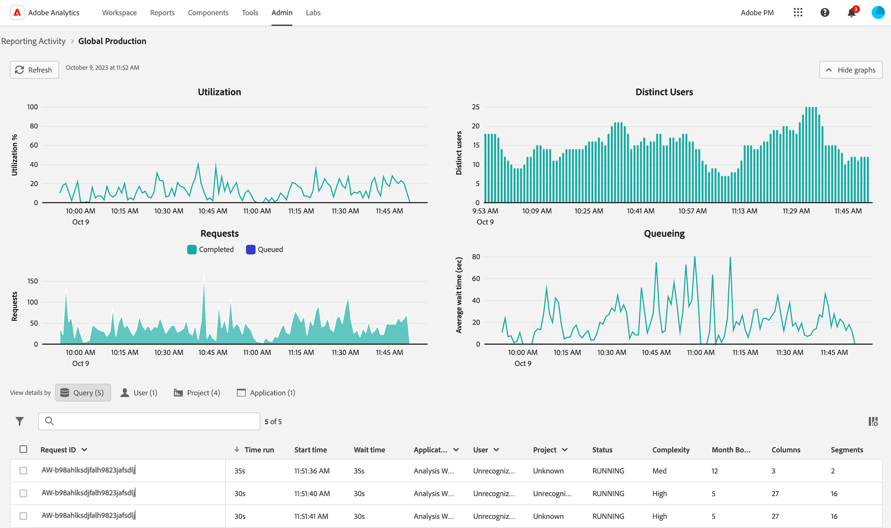

# Ver la actividad de creación de informes en el Administrador de actividades de informes

El [!UICONTROL Administrador de actividades de creación de informes] permite a los administradores diagnosticar y corregir rápidamente los problemas de capacidad de creación de informes durante las horas de mayor actividad en la creación de informes.

Para obtener más información sobre el Administrador de actividades de creación de informes, incluidas las ventajas clave y los requisitos de permisos, consulte [Información general sobre el Administrador de actividades de creación de informes](/help/reporting-activity-manager/reporting-activity-overview.md).

## Ver actividad de creación de informes para todas las conexiones {#view-all-report-suites}

1. En Customer Journey Analytics, vaya a **[!UICONTROL Herramientas]** > **[!UICONTROL Administrador de actividades de creación de informes]**.

   Se muestra una lista de las conexiones base habilitadas.

   

1. Para ver el número total de solicitudes de informes para todas las conexiones de su organización, expanda [!UICONTROL **Mostrar más**] para ver el gráfico [!UICONTROL **Solicitudes de informes mensuales**].

   Puede ver el número de solicitudes de informes dentro de su organización para el mes actual y el mes anterior.

   

1. (Opcional) Puede buscar o filtrar la lista de conexiones:

   * Utilice el campo de búsqueda para buscar una conexión específica. Empiece a escribir el nombre o ID de la conexión y la lista de conexiones se actualizará a medida que escriba.

   * Seleccione el icono [!UICONTROL **Filter**]  para expandir la lista de opciones de filtro. Puede filtrar por [!UICONTROL **Favoritos**] o [!UICONTROL **Estado**].

     Para marcar una conexión como favorita, seleccione el icono de estrella a la izquierda del nombre de la conexión.

     <!-- (does this option still exist?) 1. (Optional) Select **[!UICONTROL Refresh]** at the top-right to refresh the data. -->

1. Ver información de utilización de cada conexión. Los datos que se muestran en la tabla representan la actividad de creación de informes de la conexión en el momento en que se cargó la página por última vez.

   Las columnas disponibles son las siguientes:

   | Elemento de la IU | Descripción |
   | --- | --- |
   | **[!UICONTROL Conexión]** | La conexión cuya actividad de creación de informes está monitorizando. |
   | **[!UICONTROL Vistas de datos]** | Muestra todas las vistas de datos que utilizan la conexión. La configuración de vistas de datos puede añadir complejidad a las solicitudes de creación de informes. |
   | **[!UICONTROL Utilización de la capacidad]** | El porcentaje de la capacidad de creación de informes de la conexión que se está utilizando en tiempo real. 
**Nota** Una capacidad de uso del 100% no indica necesariamente que se deban cancelar inmediatamente las solicitudes de informes. La capacidad de uso del 100% puede ser saludable si el tiempo de espera promedio es razonable. Por otro lado, una capacidad de uso del 100 % podría sugerir un problema si el número de solicitudes en cola también aumenta.
 |
   | **[!UICONTROL Solicitudes en cola]** | El número de solicitudes en espera de ser procesadas. <!-- ??? --> |
   | **[!UICONTROL Tiempo de espera de cola]** | Tiempo de espera promedio antes de que las solicitudes empiecen a procesarse. <!-- ???? --> |
   | **[!UICONTROL Estado]** | Los estados posibles son: <ul><li>[!UICONTROL **Activo**] (azul): los informes se han ejecutado en la conexión en las últimas 2 horas. Los datos que se muestran en la tabla representan la capacidad de creación de informes de la conexión en el momento en que se cargó la página por última vez.</li><li>[!UICONTROL **Inactivo**] (gris): no se ha ejecutado ningún informe en la conexión en las últimas 2 horas, por lo que no se muestran datos para la conexión.</li></ul> |

   {style="table-layout:auto"}

## Ver la actividad de creación de informes de una sola conexión

1. En Customer Journey Analytics, seleccione [!UICONTROL **Herramientas**] > [!UICONTROL **Administrador de actividades de creación de informes**].

1. Seleccione el título vinculado de la conexión cuyos detalles desea ver.

   Se muestran los datos de la actividad de creación de informes de la conexión seleccionada.

1. (Opcional) Cuando una conexión se carga por primera vez en el Administrador de actividades de creación de informes, los datos mostrados representan las métricas de utilización actuales. Para ver las métricas actualizadas después de la carga inicial, seleccione el botón [!UICONTROL **Actualizar**] para actualizar manualmente la página.

   <!-- Need to update this screenshot:  -->

1. Utilice los gráficos y la tabla disponibles para comprender la actividad de creación de informes en la conexión.

   * [Visualización de gráficos](#view-graphs)

   * [Ver tabla](#view-table)

### Visualización de gráficos

Los siguientes gráficos están disponibles para ayudarle a comprender mejor la actividad que se produce en la conexión.

Si los gráficos no están visibles, selecciona el botón [!UICONTROL **Mostrar gráficos**].

#### Gráfico de utilización {#utilization}

El gráfico Utilización muestra la utilización de los informes para la conexión seleccionada en las últimas 2 horas.

Pase el ratón sobre el gráfico para ver los puntos en el tiempo en los que el porcentaje de capacidad de uso fue mayor para ese minuto.

* **Eje X**: La capacidad de uso de creación de informes durante las últimas 2 horas.
* **Eje Y**: El porcentaje de capacidad de uso de informes, por minuto.

  

#### Gráfico de usuarios distintos

El gráfico Usuarios distintos muestra la actividad de creación de informes de la conexión seleccionada durante las últimas 2 horas.

Pase el ratón sobre el gráfico para ver los puntos en el tiempo en los que la cantidad máxima de usuarios fue mayor durante ese minuto.

* **Eje X**: La actividad de creación de informes durante el último lapso de tiempo de 2 horas.
* **Eje Y**: El número de usuarios que han hecho solicitudes de informes, por minuto.

  

#### Gráfico de solicitudes

El gráfico Solicitudes muestra el número de solicitudes procesadas y en cola para la conexión seleccionada durante las últimas 2 horas.

Pase el ratón sobre el gráfico para ver los puntos en el tiempo en los que la cantidad máxima de solicitudes fue mayor en ese minuto.

* **Eje X**: El número de solicitudes procesadas y en cola durante el último lapso de tiempo de 2 horas.
* **Eje Y**: El número de solicitudes procesadas (en verde) y solicitudes en cola (en púrpura), por minuto.

  

#### Gráfico de colas

El gráfico En cola muestra el tiempo medio de espera de cola (en segundos) para las solicitudes de informes de la conexión seleccionada durante las últimas 2 horas.

Pase el ratón sobre el gráfico para ver los puntos en el tiempo en los que el tiempo de espera promedio máximo fue mayor para ese minuto.

* **Eje X**: El tiempo promedio de espera en cola para solicitudes de informes durante el último lapso de tiempo de 2 horas.
* **Eje Y**: El tiempo de espera promedio (en segundos).

  

### Ver tabla {#view-table}

Al ver la tabla, tenga en cuenta lo siguiente:

* Puede elegir ver los datos eligiendo cualquiera de las siguientes pestañas en la parte superior de la tabla de datos: [!UICONTROL **Solicitud**], [!UICONTROL **Usuario**], [!UICONTROL **Proyecto**] o [!UICONTROL **Aplicación**].

* Puede buscar o filtrar la lista de conexiones:

   * Utilice el campo de búsqueda para buscar una conexión específica. Empiece a escribir el nombre o ID de la conexión y la lista de conexiones se actualizará a medida que escriba.

   * Seleccione el icono [!UICONTROL **Filter**]  para expandir la lista de opciones de filtro. Puede filtrar por [!UICONTROL **Estado**], [!UICONTROL **Complejidad**], [!UICONTROL **Aplicación**], [!UICONTROL **Usuario**] o [!UICONTROL **Proyecto**].

   * Puede seleccionar [!UICONTROL **Ocultar gráficos**] para mostrar solamente la tabla.

#### Vista de datos por solicitud

Al seleccionar la ficha [!UICONTROL **Solicitud**], las siguientes columnas están disponibles en la tabla:

| Columna | Descripción |
| --- | --- |
| [!UICONTROL **ID de solicitud**] | Un ID único que se puede utilizar para solucionar problemas. Para copiar el identificador, seleccione la solicitud y luego seleccione la opción [!UICONTROL **Copiar identificadores de solicitud**]. |
| [!UICONTROL **Tiempo de ejecución**] | Cuánto tiempo lleva ejecutándose la solicitud. |
| [!UICONTROL **Hora de inicio**] | Cuando la solicitud comenzó a procesarse (según la hora local del administrador). |
| [!UICONTROL **Tiempo de espera**] | El tiempo que la solicitud ha estado esperando antes de procesarse. Este valor suele estar en &quot;0&quot; cuando hay suficiente capacidad. |
| [!UICONTROL **Aplicación**] | Las aplicaciones compatibles con el [!UICONTROL Administrador de actividades de creación de informes] son: <ul><li>IU de Analysis Workspace</li><li>Proyectos programados de Workspace</li><li>Report Builder</li><li>IU del generador: Segmento, Métricas calculadas, Anotaciones, Audiencias, etc.</li><li>Llamadas de API desde la API 2.0</li><li>Alertas<li>Exportación de tablas completas</li><li>Compartir vínculos con cualquiera</li><li>Análisis guiado</li><li>Cualquier otra aplicación que consulte el motor de informes de Analytics.</li></li></ul>
**Nota:** Si el valor de esta columna es [!UICONTROL **Desconocido**], significa que los metadatos de la solicitud no están disponibles para el usuario.
 |
| [!UICONTROL **Usuario**] | El usuario que inició la solicitud. 
**Nota:** Si el valor de esta columna es [!UICONTROL **Desconocido**], significa que los metadatos de la solicitud no están disponibles para el usuario.
 |
| [!UICONTROL **Proyecto**] | Nombres de proyectos de Workspace guardados, ID de informes de API, etc. (Los metadatos pueden variar entre distintas aplicaciones).
**Nota:** Si el valor de esta columna es [!UICONTROL **Desconocido**], significa que el proyecto no se ha guardado o que los metadatos de la solicitud no están disponibles para el usuario.
 |
| [!UICONTROL **Estado**] | Indicadores de estado: <ul><li>**Ejecución**: la solicitud está siendo procesada en este momento.</li><li>**Pendiente**: la solicitud está esperando a procesarse.</li></ul> |
| [!UICONTROL **Complejidad**] | No todas las solicitudes requieren la misma cantidad de tiempo para procesarse. La complejidad de la solicitud puede ayudar a proporcionar una idea general sobre el tiempo necesario para procesar la solicitud. 
Entre los posibles valores están:
 <ul><li>[!UICONTROL **Baja**]</li><li>[!UICONTROL **Medium**]</li><li>[!UICONTROL **Alta**]</li></ul>Este valor se ve influido por los valores de las siguientes columnas:<ul><li>[!UICONTROL **Límites de mes**]</li><li>[!UICONTROL **Columnas**]</li><li>[!UICONTROL **Segmentos**]</li></ul> |
| [!UICONTROL **Límites de mes**] | El número de meses que se incluyen en una solicitud. Más límites de mes aumentan la complejidad de la solicitud. |
| [!UICONTROL **Columnas**] | El número de métricas y desgloses de la solicitud. Más columnas aumenta la complejidad de la solicitud. |
| [!UICONTROL **Segmentos**] | El número de segmentos aplicados a la solicitud. Más segmentos aumenta la complejidad de la solicitud. |

{style="table-layout:auto"}

#### Vista de datos por usuario

Al seleccionar la ficha [!UICONTROL **Usuario**], las siguientes columnas están disponibles en la tabla:

| Columna | Descripción |
| --- | --- |
| [!UICONTROL **Usuario**] | El usuario que inició la solicitud. Si el valor de esta columna es [!UICONTROL **No reconocido**], significa que el usuario se encuentra en una compañía de inicio de sesión en la que no tiene permisos administrativos. |
| [!UICONTROL **Número de solicitudes**] | Número de solicitudes iniciadas por el usuario. |
| [!UICONTROL **Número de proyectos**] | El número de proyectos asociados con el usuario. <!-- ??? --> |
| [!UICONTROL **Aplicación**] | Las aplicaciones compatibles con el [!UICONTROL Administrador de actividades de creación de informes] son: <ul><li>IU de Analysis Workspace</li><li>Proyectos programados de Workspace</li><li>Report Builder</li><li>IU del generador: Segmento, Métricas calculadas, Anotaciones, Audiencias, etc.</li><li>Llamadas de API desde la API 2.0</li><li>Alertas<li>Exportación de tablas completas</li><li>Compartir vínculos con cualquiera</li><li>Análisis guiado</li><li>Cualquier otra aplicación que consulte el motor de informes de Analytics.</li></li></ul> |
| [!UICONTROL **Complejidad promedio**] | Complejidad promedio de las solicitudes iniciadas por el usuario. 
No todas las solicitudes requieren la misma cantidad de tiempo para procesarse. La complejidad de la solicitud puede ayudar a proporcionar una idea general sobre el tiempo necesario para procesar la solicitud.

El valor de esta columna se basa en una puntuación que viene determinada por los valores de las columnas siguientes:
<ul><li>[!UICONTROL **Límites mensuales medios**]</li><li>[!UICONTROL **Columnas promedio**]</li><li>[!UICONTROL **Segmentos promedios**]</li></ul> |
| [!UICONTROL **Límites mensuales medios**] | Promedio de meses que se incluyen en las solicitudes. Más límites de mes aumentan la complejidad de la solicitud. |
| [!UICONTROL **Columnas promedio**] | Número promedio de métricas y desgloses en las solicitudes incluidas. Más columnas aumenta la complejidad de la solicitud. |
| [!UICONTROL **Segmentos promedios**] | El número promedio de segmentos aplicados a las solicitudes incluidas. Más segmentos aumenta la complejidad de la solicitud. |

{style="table-layout:auto"}

#### Vista de datos por proyecto

Al seleccionar la ficha [!UICONTROL **Proyecto**], las siguientes columnas están disponibles en la tabla:

| Columna | Descripción |
| --- | --- |
| [!UICONTROL **Proyecto**] | Proyecto en el que se iniciaron las solicitudes. |
| [!UICONTROL **Número de solicitudes**] | El número de solicitudes asociadas con el proyecto. |
| [!UICONTROL **Cantidad de usuarios**] | El número de usuarios asociados con el proyecto. <!-- ??? --> |
| [!UICONTROL **Aplicación**] | Las aplicaciones compatibles con el [!UICONTROL Administrador de actividades de creación de informes] son: <ul><li>IU de Analysis Workspace</li><li>Proyectos programados de Workspace</li><li>Report Builder</li><li>IU del generador: Segmento, Métricas calculadas, Anotaciones, Audiencias, etc.</li><li>Llamadas de API desde la API 2.0</li><li>Alertas<li>Exportación de tablas completas</li><li>Compartir vínculos con cualquiera</li><li>Análisis guiado</li><li>Cualquier otra aplicación que consulte el motor de informes de Analytics.</li></li></ul> |
| [!UICONTROL **Complejidad promedio**] | Complejidad media de las solicitudes incluidas en el proyecto. 
No todas las solicitudes requieren la misma cantidad de tiempo para procesarse. La complejidad de la solicitud puede ayudar a proporcionar una idea general sobre el tiempo necesario para procesar la solicitud.

El valor de esta columna se basa en una puntuación que viene determinada por los valores de las columnas siguientes:
<ul><li>[!UICONTROL **Límites mensuales medios**]</li><li>[!UICONTROL **Columnas promedio**]</li><li>[!UICONTROL **Segmentos promedios**]</li></ul> |
| [!UICONTROL **Límites mensuales medios**] | Promedio de meses que se incluyen en las solicitudes. Más límites de mes aumentan la complejidad de la solicitud. |
| [!UICONTROL **Columnas promedio**] | Número promedio de métricas y desgloses en las solicitudes incluidas. Más columnas aumenta la complejidad de la solicitud. |
| [!UICONTROL **Segmentos promedios**] | El número promedio de segmentos aplicados a las solicitudes incluidas. Más segmentos aumenta la complejidad de la solicitud. |

{style="table-layout:auto"}

#### Vista de datos por aplicación

Al seleccionar la ficha [!UICONTROL **Aplicación**], las siguientes columnas están disponibles en la tabla:

| Columna | Descripción |
| --- | --- |
| [!UICONTROL **Aplicación**] | La aplicación donde se iniciaron las solicitudes. |
| [!UICONTROL **Número de solicitudes**] | El número de solicitudes asociadas con la aplicación. |
| [!UICONTROL **Cantidad de usuarios**] | El número de usuarios asociados con la aplicación. <!--???--> |
| [!UICONTROL **Número de proyectos**] | El número de proyectos asociados con la aplicación. <!--???--> |
| [!UICONTROL **Complejidad promedio**] | Complejidad promedio de las solicitudes asociadas con la aplicación. 
No todas las solicitudes requieren la misma cantidad de tiempo para procesarse. La complejidad de la solicitud puede ayudar a proporcionar una idea general sobre el tiempo necesario para procesar la solicitud.

El valor de esta columna se basa en una puntuación que viene determinada por los valores de las columnas siguientes:
El valor de esta columna se basa en una puntuación que viene determinada por los valores de las columnas siguientes:<ul><li>[!UICONTROL **Límites mensuales medios**]</li><li>[!UICONTROL **Columnas promedio**]</li><li>[!UICONTROL **Segmentos promedios**]</li></ul> |
| [!UICONTROL **Límites mensuales medios**] | Promedio de meses que se incluyen en las solicitudes. Más límites de mes aumentan la complejidad de la solicitud. |
| [!UICONTROL **Columnas promedio**] | Número promedio de métricas y desgloses en las solicitudes incluidas. Más columnas aumenta la complejidad de la solicitud. |
| [!UICONTROL **Segmentos promedios**] | El número promedio de segmentos aplicados a las solicitudes incluidas. Más segmentos aumenta la complejidad de la solicitud. |

{style="table-layout:auto"}

<!-- 

## Frequently asked questions {#faq}

| Question | Answer |
| --- | --- |
| | |

{style="table-layout:auto"}

-->
