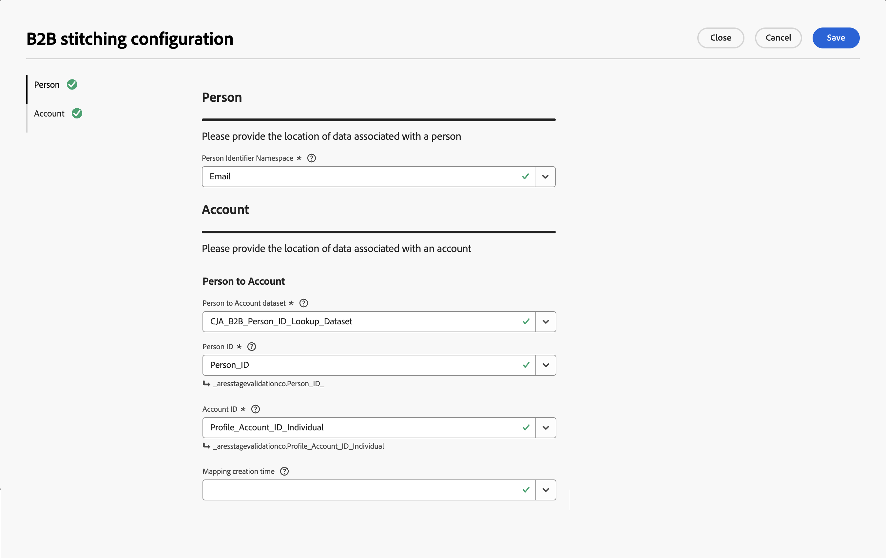

# Vinculación de cuentas B2B

La vinculación de cuentas B2B enriquece los conjuntos de datos de evento con las identidades de cuenta y permite un análisis completo del recorrido completo del cliente en Customer Journey Analytics. Cuando los eventos carecen de un ID de cuenta, que Customer Journey Analytics B2B edition requiere para la ingesta, la vinculación de cuentas deriva y agrega esa información automáticamente mediante un [conjunto de datos de asignación de persona a cuenta](#prerequisites) que usted proporcione.

Sin la vinculación de cuentas, los eventos que no contengan un ID de cuenta se perderán durante la ingesta. La vinculación de cuentas resuelve esta limitación buscando la cuenta asociada con la persona en cada evento y añadiendo el ID de cuenta tanto cuando se incorpora el evento como de forma retroactiva.

>[!NOTE]
>
>La vinculación de cuentas B2B requiere que tenga derecho a [Customer Journey Analytics B2B edition](/help/getting-started/cja-b2b-edition.md) en su entorno para poder configurar la funcionalidad.

La vinculación de cuentas realiza las siguientes operaciones en los conjuntos de datos:

* **Elevar identidad de persona**: el ID de persona de cada evento se eleva al área de nombres de identidad configurada mediante el gráfico de identidades.
* **Agregar identidades de cuenta que faltan**: Para los eventos que contienen un ID de persona, la asignación de persona a cuenta [3&rbrace; se usa para derivar y agregar la identidad de la cuenta. &#x200B;](#prerequisites)Cualquier identidad de cuenta en el propio evento se utiliza como método de reserva.

## Cómo funciona la vinculación de cuentas B2B

Para ilustrar cómo funciona la vinculación de cuentas B2B, se utiliza el conjunto de datos que se muestra a continuación como punto de partida.

### Conjunto de datos de evento base

En Customer Journey Analytics B2B edition, los eventos sin ID de cuenta en este conjunto de datos de evento de ejemplo no vinculado se omiten y no se incorporan ().

| Acción | Marca de tiempo | ID persistente | ID de cuenta | ID de persona | Tipo de evento |
|:---:|--:|--|---|---|---|
|  | 1/3/25 | 1234 | Adobe | matt@adobe.com | Page view |
|  | 1/3/25 | 5678 |  | | |
|  | 3/4/25 | 9012 | Ubiquidad | cory@sky.com |  |
|  | 3/7/25 | 4321 | Cielo | emily@sky.com | Centro de llamadas |
|  | 5/5/25 | 6106 | | carmen@adobe.com |  |
|  | 6/1/25 | 8989 | Ubiquidad | cassidy@ubiquity.com | |
|  | 6/2/25 | 1111 |  | | |

La vinculación de cuentas B2B evita que los eventos se ignoren y no se ingieran mediante las siguientes operaciones:

* [Elevar identidades de personas](#elevate-person-identities).
* [Agregar identidades de cuenta faltantes](#add-missing-account-identitiers).

### Elevar identidades de persona

+++ Detalles

Para admitir la vinculación de cuentas B2B, debe proporcionar un conjunto de datos de asignación persona a cuenta. Por ejemplo:

| ID de CRM | ID de cuenta |
|---|---|
| 12hsd123 | Adobe |
| f82jsd32 | Cielo |
| hg2023m2 | Cielo |
| b978bbw9 | Ubiquidad |
| fs453ghi | Adobe |

Ese conjunto de datos de asignación de persona a cuenta se eleva mediante la vinculación basada en gráficos. Por ejemplo, proporciona un correo electrónico como el área de nombres que debe utilizar. El resultado es un conjunto de datos de asignación de persona a cuenta actualizado con ID de persona elevados.

| ID de CRM | ID de persona elevado | ID de cuenta |
|---|---|---|
| 12hsd123 | matt@adobe.com | Adobe |
| f82jsd32 | emily@sky.com | Cielo |
| hg2023m2 | cory@sky.com | Cielo |
| b978bbw9 | cassidy@ubiquity.com | Ubiquidad |
| fs453ghi | carmen@adobe.com | Adobe |

La vinculación basada en gráficos también se utiliza para elevar los ID de persona en el conjunto de datos de evento de experiencia. Por ejemplo, vea el valor actualizado de **emily@adobe.com**.

| Marca de tiempo | ID persistente | ID de cuenta original | ID de persona original | ID de persona elevado |
|--|--|---|---|---|
| 1/3/25 | 1234 | Adobe | matt@adobe.com | matt@adobe.com |
| 1/3/25 | 5678 |  | | **emily@adobe.com** |
| 3/4/25 | 9012 | Ubiquidad | cory@sky.com | cory@sky.com |
| 3/7/25 | 4321 | Cielo | emily@sky.com | emily@sky.com |
| 5/5/25 | 6106 | | carmen@adobe.com | carmen@adobe.com |
| 6/1/25 | 8989 | Ubiquidad | cassidy@ubiquity.com | cassidy@ubiquity.com |
| 6/2/25 | 1111 |  | 111 | 111 |

+++

### Añadir los identificadores de cuenta faltantes

+++ Detalles

El conjunto de datos persona a cuenta se utiliza una vez más para elevar los ID de cuenta en el conjunto de datos de evento de experiencia. Por ejemplo, vea el valor agregado **Sky** para emily@sky.com y **Adobe** para carmen@adobe.com. Y el valor actualizado **Sky** (de Ubiquity) para cory@sky.com.

| Marca de tiempo | ID persistente | ID de cuenta original | ID de persona original | ID de cuenta elevado | ID de persona elevado |
|---|---|---|---|---|---|
| 1/3/25 | 1234 | Adobe | matt@adobe.com | Adobe | matt@adobe.com |
| 1/3/25 | 5678 | | | **Cielo** | **emily@sky.com** |
| 3/4/25 | 9012 | Ubiquidad | cory@sky.com | **Cielo** | cory@sky.com |
| 3/7/25 | 4321 | Cielo | emily@sky.com | Cielo | emily@sky.com |
| 5/5/25 | 6106 | | carmen@adobe.com | **Adobe** | carmen@adobe.com |
| 6/1/25 | 8989 | Ubiquidad | cassidy@ubiquity.com | Ubiquidad | cassidy@ubiquity.com |
| 6/2/25 | 1111 |  | 1111 |  | 1111 |

+++

### Resultado

Este ejemplo muestra cómo la vinculación de cuentas B2B actualiza los datos del evento de experiencia con identificadores de persona que falta e identificadores de cuenta incorrectos y que faltan, en función del conjunto de datos de asignación de persona a cuenta que ha proporcionado como entrada.

## Requisitos previos

Antes de habilitar la vinculación de cuentas B2B, prepare los siguientes conjuntos de datos en Adobe Experience Platform:

| Conjunto de datos | Requerido | Descripción |
|---|---|---|
| **conjunto de datos persona a cuenta** | Requerido | Un conjunto de datos de búsqueda (registro, serie no temporal) que contiene como mínimo un ID de persona (con área de nombres) y un ID de cuenta. Estos ID se utilizan para derivar el mapa de relación persona a cuenta. |

>[!IMPORTANT]
>
>El campo de ID de persona en el conjunto de datos **[!UICONTROL persona a cuenta]** debe marcarse como identidad en el esquema.

## Habilitar vinculación de cuentas {#enable-account-stitching}

Primero debe habilitar y configurar la vinculación de cuentas B2B en el nivel de conexión. Cuando la vinculación de cuentas B2B se configura para una conexión, puede activar la vinculación de cuentas en conjuntos de datos de evento individuales dentro de esa conexión.

### Configuración de vinculación B2B {#configure-b2b-stitching-settings}

>[!CONTEXTUALHELP]
>id="connection_b2b_stitching_open_configuration"
>title="Configuración de vinculación de cuentas B2B"
>abstract="Seleccione **[!UICONTROL Abrir configuración de vinculación B2B]** para configurar la vinculación de cuentas B2B. Si la conexión aún no se ha guardado, la configuración se etiquetará con **[!UICONTROL _Cambios no guardados_]**."

>[!CONTEXTUALHELP]
>id="connection_b2b_stitching_person_identifier_namespace"
>title="Espacio de nombres de identificador de persona"
>abstract="Seleccione el área de nombres de identidad de la persona más relevante para la creación de informes. Por ejemplo, Correo electrónico. Cualquier conjunto de datos de evento con la vinculación de **[!UICONTROL persona a cuenta]** habilitada tiene el ID de persona elevado a este área de nombres de identificador de persona."

>[!CONTEXTUALHELP]
>id="connection_b2b_stitching_person_to_account_dataset"
>title="Conjunto de datos de persona a cuenta"
>abstract="Seleccione el conjunto de datos de búsqueda que asigna los ID de persona a los ID de cuenta."

>[!CONTEXTUALHELP]
>id="connection_b2b_stitching_person"
>title="ID de persona"
>abstract="Seleccione el campo del conjunto de datos que contiene los ID de persona. El área de nombres de este campo puede ser diferente o ser la misma que el área de nombres del identificador de persona seleccionado. Si difieren, las dos áreas de nombres deben vincularse en el gráfico de identidades."

>[!CONTEXTUALHELP]
>id="connection_b2b_stitching_account"
>title="ID de cuenta"
>abstract="Seleccione el campo del conjunto de datos que contiene los valores del identificador único de cuenta. La información del identificador de cuenta estará disponible en las filas de cualquier conjunto de datos de evento con la vinculación de **[!UICONTROL persona a cuenta]** habilitada."

>[!CONTEXTUALHELP]
>id="connection_b2b_stitching_start_time"
>title="Hora de inicio"
>abstract="Seleccione un campo de marca de tiempo que indique cuándo se activó la relación persona a cuenta."

>[!CONTEXTUALHELP]
>id="connection_b2b_stitching_mapping_creation_time"
>title="Hora de creación de asignaciones"
>abstract="De forma opcional, seleccione el campo que representa la fecha y la hora en que se creó la asignación de persona a cuenta. Útil para situaciones en las que una persona cambia de cuenta varias veces con el paso del tiempo."

1. En Customer Journey Analytics, vaya a **[!UICONTROL Conexiones]** y [cree una nueva conexión](/help/connections/create-connection.md#create-a-connection) o [edite una conexión existente](/help/connections/create-connection.md#edit-a-connection).

1. En **[!UICONTROL Configuración de conexión]**, establezca **[!UICONTROL ID principal]** en  **[!UICONTROL Cuenta]**.

1. Asegúrese de seleccionar los **[!UICONTROL contenedores opcionales]** que desea utilizar en su conexión B2B. No puede modificar la selección de estos contenedores una vez que ha guardado una configuración de vinculación B2B.

1. Seleccione **[!UICONTROL Abrir configuración de vinculación B2B]**.

   

   >[!NOTE]
   >
   >Una configuración de vinculación B2B previamente configurada para una conexión no guardada se indica con **[!UICONTROL _Cambios no guardados_]**. No puede modificar **[!UICONTROL contenedores opcionales]** para una configuración de vinculación B2B previamente configurada.

1. En el cuadro de diálogo **[!UICONTROL Configuración de vinculación B2B]**:

   

   1. Configurar la sección **[!UICONTROL Persona]**:

      * Seleccione un **[!UICONTROL Área de nombres de identificador de persona]**, por ejemplo **[!UICONTROL Correo electrónico]**, al que desee elevar cualquier ID de persona. Este campo es obligatorio.

   1. Configure la sección **[!UICONTROL Cuenta]** debajo de **[!UICONTROL Persona a cuenta]**.

      | Campo | Requerido | Descripción |
      |---|:---:|---|
      | **[!UICONTROL Conjunto de datos de persona a cuenta]** |  | Seleccione la búsqueda (registro o conjunto de datos de series no temporales) que asigna personas a las cuentas. |
      | **[!UICONTROL ID de la persona]** |  | Seleccione el campo del conjunto de datos que contiene el ID de persona. Ese campo debe marcarse como identidad y no puede ser el mismo que el campo **[!UICONTROL ID de cuenta]** o que el campo **[!UICONTROL Hora de inicio]**. |
      | **[!UICONTROL ID de cuenta]** |  | Seleccione el campo del conjunto de datos que contiene el ID de cuenta. Ese campo no puede ser el mismo que el campo **[!UICONTROL ID de persona]** o que el campo **[!UICONTROL Hora de inicio]**. |
      | **Hora de creación de la asignación** | | De forma opcional, seleccione el campo que representa la fecha y la hora en que se creó la asignación de persona a cuenta. Útil para situaciones en las que una persona cambia de cuenta varias veces con el paso del tiempo.  **Ejemplo** (cuando el campo **update_date** está seleccionado):<table><thead><tr><th>update_date</th><th>persona</th><th>account</th></tr></thead><tbody><tr><td>20260401</td><td>a@b.com</td><td>Apple</td></tr><tr><td>20260501</td><td>a@b.com</td><td>Adobe</td></tr></tbody></table><ul><li>Para todos los eventos con una marca de tiempo en el campo **[!UICONTROL update_date]** antes del 1 de mayo de 2026: a@b.com está asignado a Apple.</li><li>Para todos los eventos con una marca de tiempo en el campo **[!UICONTROL update_date]** el o después del 1 de mayo de 2026: a@b.com está asignado a Adobe.</li></ul>Cuando no se especifica ningún tiempo de asignación, se utiliza la primera cuenta lexicográfica. Este mismo algoritmo también se usa cuando dos nombres de cuenta diferentes tienen exactamente el mismo valor **[!UICONTROL update_date]** y se especifica una hora de creación de asignación. |

      >[!NOTE]
      >
      >Si se produce un error al cargar las opciones del campo, los menús desplegables aparecen vacíos y aparece un indicador de error debajo de cada campo afectado. Compruebe el esquema del conjunto de datos e inténtelo de nuevo.

   1. Seleccione **[!UICONTROL Guardar]** para cerrar el cuadro de diálogo **[!UICONTROL Configuración de vinculación B2B]** y volver a la configuración de conexión.

   1. El indicador **[!UICONTROL _Cambios no guardados_]** aparece junto al botón **Abrir configuración de vinculación B2B** hasta que [guarde](#save) la conexión.

### Habilitar vinculación B2B en conjuntos de datos de evento

>[!CONTEXTUALHELP]
>id="connection_b2b_stitching_enable_person_to_account"
>title="Habilitar vinculación de persona a cuenta"
>abstract="Si se habilita, este conjunto de datos utiliza la vinculación de persona a cuenta B2B. Los valores de **[!UICONTROL ID de persona]** se elevarán a los del **[!UICONTROL área de nombres de identificador de persona]** configurado y, a continuación, se utilizarán para buscar el ID de cuenta en función del conjunto de datos persona a cuenta. Si está deshabilitado, este conjunto de datos no utiliza la vinculación de persona a cuenta B2B y tendrá que seleccionar un **[!UICONTROL ID de cuenta]** necesario en su lugar."
>additional-url="https://experienceleague.adobe.com/en/docs/analytics-platform/using/stitching/b2b-account-stitching#configure-b2b-stitching-settings" text="Configuración de vinculación B2B"

Después de configurar la vinculación B2B en el nivel de conexión, debe habilitar la vinculación de cuentas B2B individualmente para cada conjunto de datos de evento que desee vincular.

1. En Configuración de conexión, seleccione **[!UICONTROL Agregar conjuntos de datos]** o abra la configuración de un conjunto de datos de evento existente. Consulte [Agregar conjuntos de datos](/help/connections/create-connection.md#add-datasets) o [Editar un conjunto de datos](/help/connections/create-connection.md#edit-a-dataset) para obtener más información.

1. Para el conjunto de datos de evento específico para el que desea configurar la vinculación de cuenta B2B, active **[!UICONTROL Habilitar la vinculación de persona a cuenta]**.

>[!BEGINTABS]

>[!TAB Activado]

Cuando **[!UICONTROL Habilitar la vinculación de persona a cuenta]** es **el**, ha configurado la vinculación de cuenta B2B para el conjunto de datos.

* Se requiere la configuración de un ID de persona. Ese ID de persona se usa para buscar el ID de cuenta en función del [conjunto de datos persona a cuenta](#prerequisites).
* La configuración de un ID de cuenta es opcional.

>[!TAB Desactivado]

Cuando **[!UICONTROL Habilitar la vinculación de persona a cuenta]** está **desactivado**, *no* ha configurado la vinculación de cuenta B2B para el conjunto de datos.

* Se requiere la configuración de un ID de cuenta.
* La configuración de un ID de persona es opcional.

>[!ENDTABS]

### Guardar

Una vez que haya configurado la configuración de vinculación B2B y haya terminado de agregar o editar conjuntos de datos, seleccione **[!UICONTROL Guardar]** para guardar la conexión.

>[!IMPORTANT]
>
>Una vez guardada una conexión, la configuración de vinculación B2B se vuelve inmutable. Para ver la configuración después de guardar, selecciona **Abrir configuración de vinculación B2B**. Todos los campos aparecen en estado de solo lectura. Además, si el conjunto de datos usado para la asignación de [persona a cuenta](#prerequisites) se elimina en Experience Platform, se eliminará esta conexión.

## Programación de actualización de datos

La vinculación de cuentas deriva el mapa de identidad de su [conjunto de datos persona a cuenta](#prerequisites) diariamente y utiliza esta información para actualizar los conjuntos de datos habilitados para vincular a corto y largo plazo en la siguiente programación:

| Reproducción | Frecuencia | Ventana Datos |
|---|---|---|
| A corto plazo | Semanal | Últimos 7 días |
| A largo plazo | Mensual | Últimos 3 meses (paquete Prime) Últimos 6 meses (paquete Ultimate) |

## Privacidad e higiene de los datos

La vinculación de cuentas respeta las solicitudes estándar de privacidad e higiene para las identidades de la persona, de acuerdo con el comportamiento de vinculación B2C. Si posteriormente se elimina un ID de persona mediante una solicitud de privacidad o higiene, se invierte la vinculación asociada realizada mediante el gráfico de identidad.

Las entidades B2B como cuentas, ID de cuenta e ID de cuenta globales añadidas a eventos mediante la vinculación no se eliminan durante las solicitudes de privacidad o higiene. Estos valores no contienen información personal, por lo que no existe ninguna obligación legal de eliminarlos.

>[!MORELIKETHIS]
>
>* [Información general sobre la vinculación](overview.md)
>* [Configurar una conexión para B2B](../connections/create-connection.md)
>* [Preguntas frecuentes sobre la vinculación](faq.md)

