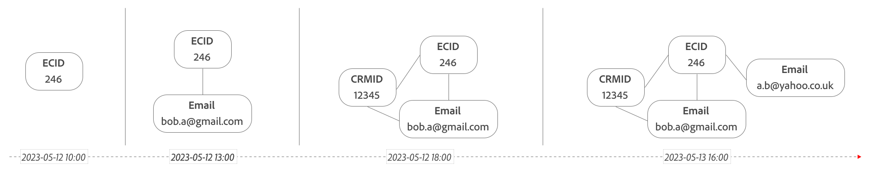
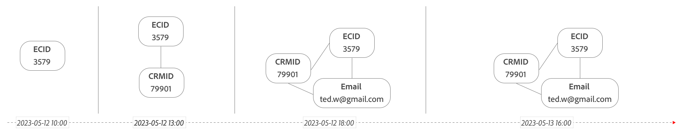

# Vinculación basada en gráficos

En la vinculación basada en gráficos, se especifica un conjunto de datos de evento, así como el ID persistente (cookie) y el área de nombres del ID transitorio (ID de persona) para ese conjunto de datos. La vinculación basada en gráficos crea una nueva columna para el ID vinculado en el nuevo conjunto de datos vinculado. Y, a continuación, utiliza el ID persistente para consultar el gráfico de identidades desde el servicio de identidad de Experience Platform, utilizando el área de nombres especificada para actualizar el ID vinculado.

## IdentityMap

La vinculación basada en gráficos admite el uso del grupo de campos [`identityMap` ](https://experienceleague.adobe.com/en/docs/experience-platform/xdm/schema/composition#identity) en los siguientes casos:

- Uso de la identidad principal en el espacio de nombres `identityMap` para definir el persistentID:
   - Si se encuentran varias identidades principales en diferentes áreas de nombres, las identidades de las áreas de nombres se ordenan lexigráficamente y se selecciona la primera identidad.
   - Si se encuentran varias identidades principales en un solo área de nombres, se selecciona la primera identidad principal lexicográfica disponible.

  En el ejemplo siguiente, las áreas de nombres e identidades generan una lista de identidades principales ordenada y, finalmente, la identidad seleccionada.

  <table style="table-layout:auto">
     <tr>
       <th>Espacios de nombres</th>
       <th>Lista de identidades</th>
     </tr>
     <tr>
       <td>ECID</td>
       <td><pre lang="json"><code>[ &nbsp;&nbsp;{"id": "ecid-3"}, &nbsp;&nbsp;{"id": "ecid-2", "primary": true}, &nbsp;&nbsp;{"id": "ecid-1", "primary": true} &nbsp;]</code></pre></td>
     </tr>
     <tr>
       <td>CCID</td>
       <td><pre lang="json"><code>[ &nbsp;&nbsp;{"id": "ccid-1"}, &nbsp;&nbsp;{"id": "ccid-2", "primary": true} ]</code></pre></td>
     </tr>
   </table>

  <table style="table-layout:auto">
    <tr>
      <th>Lista de identidades ordenadas</th>
      <th>Identidad seleccionada</th>
    </tr>
    <tr>
      <td><pre lang="json"><code>PrimaryIdentities [ &nbsp;&nbsp;{"id": "ccid-2", "namespace": "CCID"}, &nbsp;&nbsp;{"id": "ecid-1", "namespace": "ECID"}, &nbsp;&nbsp;{"id": "ecid-2", "namespace": "ECID"} ] NonPrimaryIdentities [ &nbsp;&nbsp;{"id": "ccid-1", "namespace": "CCID"}, &nbsp;&nbsp;{"id": "ecid-3", "namespace": "ECID"} ]</code></pre></td>
      <td><pre lang="json"><code>"id": "ccid-2", "namespace": "CCID"</code></pre></td>
    </tr>
  </table>

- Uso del espacio de nombres `identityMap` para definir el persistentID:
   - Si se encuentran varios valores para persisttentID en un área de nombres `identityMap`, se utiliza la primera identidad lexicográfica disponible.

  En el ejemplo siguiente, las áreas de nombres e identidades generan una lista de identidades ordenada para el área de nombres (ECID) seleccionada y, finalmente, la identidad seleccionada.

  <table style="table-layout:auto">
     <tr>
       <th>Espacios de nombres</th>
       <th>Lista de identidades</th>
     </tr>
     <tr>
       <td>ECID</td>
       <td><pre lang="json"><code>[ &nbsp;&nbsp;{"id": "ecid-3"}, &nbsp;&nbsp;{"id": "ecid-2", "primary": true}, &nbsp;&nbsp;{"id": "ecid-1", "primary": true} ]</code></pre></td>
     </tr>
     <tr>
       <td>CCID</td>
       <td><pre lang="json"><code>[ &nbsp;&nbsp;{"id": "ccid-1"}, &nbsp;&nbsp;{"id": "ccid-2", "primary": true} ]</code></pre></td>
     </tr>
   </table>

  <table style="table-layout:auto">
    <tr>
      <th>Lista de identidades ordenadas</th>
      <th>Identidad seleccionada</th>
    </tr>
    <tr>
      <td><pre lang="json"><code>[ &nbsp;&nbsp;"id": "ecid-1", &nbsp;&nbsp;"id": "ecid-2", &nbsp;&nbsp;"id": "ecid-3" ]</code></pre></td>
      <td><pre lang="json"><code>"id": "ecid-1", "namespace": "ECID"</code></pre></td>
    </tr>
  </table>

## Funcionamiento de la vinculación basada en gráficos

La vinculación realiza un mínimo de dos pasadas de datos en un conjunto de datos determinado.

- **Vinculación en tiempo real**: intenta vincular cada visita (evento) conforme se va produciendo, utilizando el ID persistente para buscar el ID transitorio del área de nombres seleccionada consultando el gráfico de identidades. Si el ID transitorio está disponible desde la búsqueda, este ID transitorio se vincula inmediatamente.

- **Reproducir vinculación**: *reproduce* datos basados en identidades actualizadas del gráfico de identidades. En esta fase es en la que las visitas de dispositivos anteriormente desconocidos (ID persistentes) se vinculan a medida que el gráfico de identidad ha resuelto la identidad de un área de nombres. La reproducción está determinada por dos parámetros: **frequency** y **lookback window**. Adobe ofrece las siguientes combinaciones de estos parámetros:
   - **Retrospectiva diaria en una frecuencia diaria**: Los datos se reproducen todos los días con una ventana retrospectiva de 24 horas. Esta opción ofrece la ventaja de que las repeticiones son mucho más frecuentes, pero los visitantes no autenticados deben autenticarse el mismo día que visitan el sitio.
   - **Retrospectiva semanal de una frecuencia semanal**: los datos se reproducen una vez a la semana con una ventana retrospectiva semanal (consulte [opciones](#options)). Esta opción ofrece la ventaja de que ofrece a las sesiones no autenticadas mucho más tiempo para autenticarse. Sin embargo, los datos no enlazados con menos de una semana de antigüedad no se vuelven a procesar hasta la siguiente reproducción semanal.
   - **Retrospectiva quincenal con una frecuencia semanal**: Los datos se reproducen una vez por semana con una ventana retrospectiva quincenal (consulte [opciones](#options)). Esta opción ofrece la ventaja de que ofrece a las sesiones no autenticadas mucho más tiempo para autenticarse. Sin embargo, los datos no enlazados con menos de dos semanas de antigüedad no se vuelven a procesar hasta la siguiente reproducción semanal.
   - **Retrospectiva mensual de una frecuencia semanal**: los datos se reproducen cada semana con una ventana retrospectiva mensual (consulte [opciones](#options)). Esta opción ofrece la ventaja de que ofrece a las sesiones no autenticadas mucho más tiempo para autenticarse. Sin embargo, los datos no enlazados con menos de un mes de antigüedad no se vuelven a procesar hasta la siguiente reproducción semanal.

- **Privacidad**: cuando se reciben solicitudes relacionadas con la privacidad, además de quitar la identidad solicitada del conjunto de datos de origen, se debe deshacer cualquier vinculación de esa identidad entre eventos no autenticados. Además, la identidad debe eliminarse del gráfico de identidad para evitar una vinculación futura basada en gráficos para esa identidad específica.

  >[!IMPORTANT]
  >
  >El proceso de desvinculación, como parte de las solicitudes de privacidad, cambia a principios de 2025. El proceso actual de desvinculación revincula los eventos con la última versión de identidades conocidas. Esta reasignación de eventos a otra identidad podría tener consecuencias legales indeseables. Para solucionar estos problemas, a partir de 2025, el nuevo proceso de desvinculación actualiza los eventos que están sujetos a la solicitud de privacidad con el ID persistente.
  > 

Los datos que están más allá de la ventana retrospectiva no se reproducen. Un visitante debe autenticarse dentro de una ventana retrospectiva determinada para que una visita no autenticada y una visita autenticada se identifiquen juntas. Una vez que se reconoce un dispositivo, se vincula en vivo a partir de ese momento.

Considere los dos gráficos de identidad siguientes para el ID persistente `246` y `3579`, cómo se actualizan estos gráficos de identidad con el paso del tiempo y cómo afectan estas actualizaciones a los pasos de la vinculación basada en gráficos.

Puede ver un gráfico de identidad a lo largo del tiempo para un perfil específico mediante el [Visor de gráficos de identidad](https://experienceleague.adobe.com/en/docs/experience-platform/identity/features/identity-graph-viewer). Consulte también [Lógica de vinculación del servicio de identidad](https://experienceleague.adobe.com/en/docs/experience-platform/identity/features/identity-linking-logic) para comprender mejor la lógica utilizada al vincular identidades.

### Paso 1: Vinculación en tiempo real

La vinculación en tiempo real intenta vincular cada evento, tras la recopilación, con la información conocida en ese momento del gráfico de identidad.

+++ Detalles

| | Fecha | Id. persistente `ECID` | Espacio de nombres  `Email`  | ID con título (después de la unión en directo) |
|--:|---|---|---|---|
| 1 | 2023-05-12 11:00 | `246` | `246`  *sin definir* | `246` |
| 2 | 2023-05-12 14:00 | `246` | `246`  `bob.a@gmail.com` | `bob.a@gmail.com` |
| 3 | 2023-05-12 15:00 | `246` | `246`  `bob.a@gmail.com` | `bob.a@gmail.com` |
| 4 | 2023-05-12 17:00 | `3579` | `3579`  *sin definir* | `3579` |
| 5 | 2023-05-12 19:00 | `3579` | `3579`  `ted.w@gmail.com` | `ted.w@gmail.com` |
| 6 | 2023-05-13 15:00 | `246` | `246`  `bob.a@gmail.com` | `bob.a@gmail.com` |
| 7 | 2023-05-13 16:30 | `246` | `246`  `a.b@yahoo.co.uk` `246`  `bob.ab@gmail.com` | `a.b@yahoo.co.uk` |

{style="table-layout:auto"}

Puede ver cómo se resuelve el ID vinculado para cada evento. En función del tiempo, el ID persistente y la búsqueda del gráfico de identidad para el área de nombres especificada (al mismo tiempo).
Cuando la búsqueda responde a más de un ID vinculado (como en el caso del evento 7), se selecciona el primer ID lexicográfico devuelto por el gráfico de identidad (`a.b@yahoo.co.uk` en el ejemplo).

+++

### Paso 2: Reproducción de la vinculación

A intervalos regulares (en función de la ventana retrospectiva seleccionada), la vinculación de reproducción vuelve a calcular los datos históricos en función de la versión más reciente del gráfico de identidad, en el momento del intervalo.

+++ Detalles

Con una vinculación de reproducción a las 16:30 del 2023-05-13, con una configuración de ventana retrospectiva de 24 horas, algunos eventos de la muestra se vuelven a vincular (indicado por ).

| | Fecha | Id. persistente `ECID` | Espacio de nombres  `Email`  | Id. con título   (después de la unión activa) | Id. vinculado   (después de la reproducción 24 horas) |
|---|---|---|---|---|---|
| 2 | 2023-05-12 14:00 | `246` | `246`  `bob.a@gmail.com` | `bob.a@gmail.com` | `bob.a@gmail.com` |
| 3 | 2023-05-12 15:00 | `246` | `246`  `bob.a@gmail.com` | `bob.a@gmail.com` | `bob.a@gmail.com` |
|  4 | 2023-05-12 17:00 | `3579` | `3579`  `ted.w@gmail.com` | `3579` | `ted.w@gmail.com` |
|  5 | 2023-05-12 19:00 | `3579` | `3579`  `ted.w@gmail.com` | `ted.w@gmail.com` | `ted.w@gmail.com` |
|  6 | 2023-05-13 15:00 | `246` | `246`  `a.b@yahoo.co.uk` | `bob.a@gmail.com` | `a.b@yahoo.co.uk` |
|  7 | 2023-05-13 16:30 | `246` | `246`  `a.b@yahoo.co.uk` `246`  `bob.ab@gmail.com` | `a.b@yahoo.co.uk` | `a.b@yahoo.co.uk` |

{style="table-layout:auto"}

Con la vinculación de reproducción a las 16:30 del 2023-05-13, con una configuración de ventana retrospectiva de 7 días, todos los eventos de la muestra se vuelven a vincular.

| | Fecha | Id. persistente `ECID` | Espacio de nombres  `Email`  | Id. con título   (después de la unión activa) | ID vinculado   (después de la reproducción 7 días) |
|---|---|---|---|---|---|
|  1 | 2023-05-12 11:00 | `246` | `246`  *sin definir* | `246` | `a.b@yahoo.co.uk` |
|  2 | 2023-05-12 14:00 | `246` | `246`  `bob.a@gmail.com` | `bob.a@gmail.com` | `a.b@yahoo.co.uk` |
|  3 | 2023-05-12 15:00 | `246` | `246`  `bob.a@gmail.com` | `bob.a@gmail.com` | `a.b@yahoo.co.uk` |
|  4 | 2023-05-12 17:00 | `3579` | `3579`  `ted.w@gmail.com` | `3579` | `ted.w@gmail.com` |
|  5 | 2023-05-12 19:00 | `3579` | `3579`  `ted.w@gmail.com` | `ted.w@gmail.com` | `ted.w@gmail.com` |
|  6 | 2023-05-13 15:00 | `246` | `246`  `a.b@yahoo.co.uk` | `bob.a@gmail.com` | `a.b@yahoo.co.uk` |
|  7 | 2023-05-13 16:30 | `246` | `246`  `a.b@yahoo.co.uk` `246`  `bob.ab@gmail.com` | `a.b@yahoo.co.uk` | `a.b@yahoo.co.uk` |

{style="table-layout:auto"}

+++

### Paso 3: Solicitud de privacidad

Cuando recibe una solicitud de privacidad, la ID vinculada se elimina en todos los registros del sujeto del usuario de la solicitud de privacidad.

+++ Detalles

La siguiente tabla representa los mismos datos que los que hemos visto anteriormente, pero muestra el efecto que una solicitud de privacidad (por ejemplo, las 18:00 del 13-05-2023) tiene en los eventos de ejemplo.

| | Fecha | Id. persistente `ECID` | Espacio de nombres  `Email`  | ID vinculado (después de la solicitud de privacidad) |
|--:|---|---|---|---|
|  1 | 2023-05-12 11:00 | `246` | `246`  `a.b@yahoo.co.uk` | `246` |
|  2 | 2023-05-12 14:00 | `246` | `246`  `a.b@yahoo.co.uk` | `246` |
|  3 | 2023-05-12 15:00 | `246` | `246`  `a.b@yahoo.co.uk` | `246` |
|  4 | 2023-05-12 17:00 | `3579` | `3579`  `ted.w@gmail.com` | `3579` |
|  5 | 2023-05-12 19:00 | `3579` | `3579`  `ted.w@gmail.com` | `3579` |
|  6 | 2023-05-13 15:00 | `246` | `246`  `a.b@yahoo.co.uk` | `246` |
|  7 | 2023-05-13 16:30 | `246` | `246`  `a.b@yahoo.co.uk` `246`  `bob.ab@gmail.com` | `246` |

{style="table-layout:auto"}

+++

## Requisitos previos

Los siguientes requisitos previos se aplican específicamente a la vinculación basada en gráficos:

- El conjunto de datos de evento de Adobe Experience Platform al que desea aplicar la vinculación debe tener una columna que identifique a un visitante en cada fila, la **ID persistente**. Por ejemplo, un ID de visitante generado por una biblioteca AppMeasurement de Adobe Analytics o un ECID generado por el servicio de identidad de Experience Platform.
- El identificador persistente también debe estar [definido como identidad](https://experienceleague.adobe.com/es/docs/experience-platform/xdm/ui/fields/identity) en el esquema.
- El gráfico de identidades del servicio de identidad de Experience Platform debe tener un área de nombres (por ejemplo `Email` o `Phone`) que desee usar durante la vinculación para resolver el **identificador transitorio**. Consulte [Servicio de identidad de Experience Platform](https://experienceleague.adobe.com/es/docs/experience-platform/identity/home) para obtener más información.

>[!NOTE]
>
>No necesita **not** una licencia de Real-time Customer Data Platform para la vinculación basada en gráficos. El paquete **Prime** o superior de Customer Journey Analytics incluye los derechos necesarios del servicio de identidad de Experience Platform.

## Limitaciones

Las siguientes limitaciones se aplican específicamente a la vinculación basada en gráficos:

- Las marcas de tiempo no se tienen en cuenta al consultar el ID transitorio mediante el área de nombres especificada. Por lo tanto, es posible que un ID persistente se vincule con un ID transitorio de un registro que tenga una marca de tiempo anterior.
- En escenarios de dispositivos compartidos, donde el área de nombres del gráfico contiene varias identidades, se utiliza la primera identidad lexicográfica. Si los límites y prioridades del área de nombres se configuran como parte de la publicación de reglas de vinculación de gráficos, se utiliza la última identidad del usuario autenticado. Consulte [Dispositivos compartidos](/help/use-cases/stitching/shared-devices.md) para obtener más información.
- Hay un límite estricto de tres meses para rellenar identidades en el gráfico de identidades. Para rellenar el gráfico de identidades, debe utilizar identidades de relleno en caso de que no utilice una aplicación de Experience Platform, como Real-time Customer Data Platform.
- Se aplican las [protecciones del servicio de identidad](https://experienceleague.adobe.com/en/docs/experience-platform/identity/guardrails). Vea, por ejemplo, los [límites estáticos](https://experienceleague.adobe.com/en/docs/experience-platform/identity/guardrails#static-limits) siguientes:
   - Número máximo de identidades en un gráfico: 50.
   - Número máximo de vínculos a una identidad para una sola ingesta por lotes: 50.
   - Número máximo de identidades en un registro XDM para la ingesta de gráficos: 20.
   - Cantidad mínima de identidades en un registro XDM para la ingesta de gráficos: 2.
