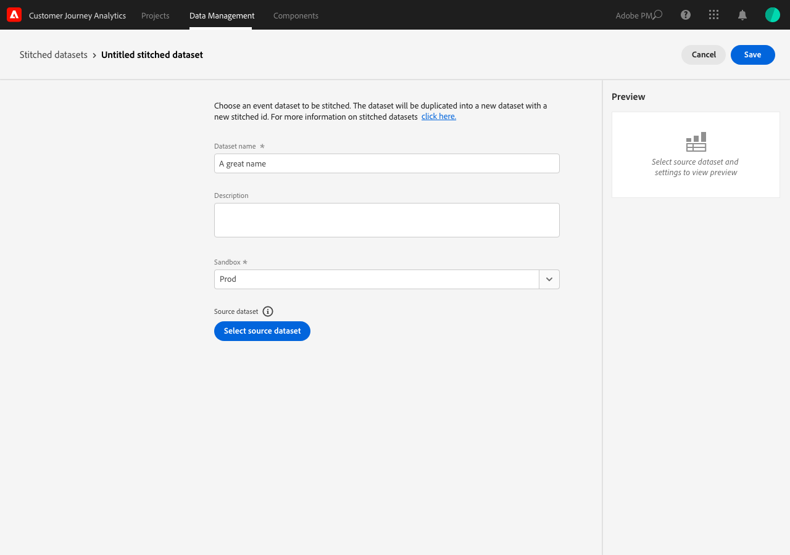
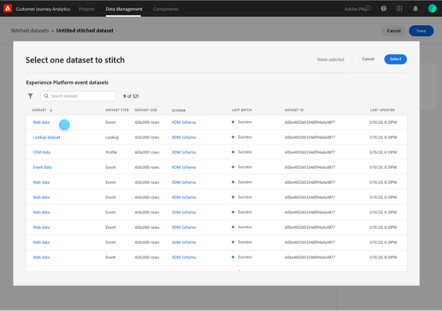
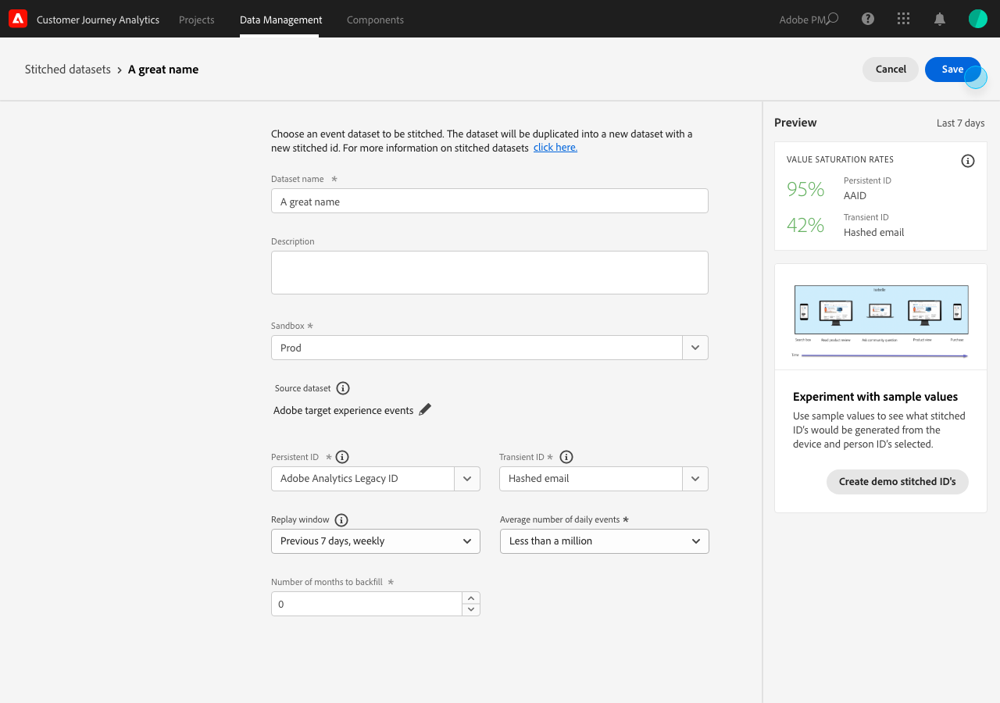
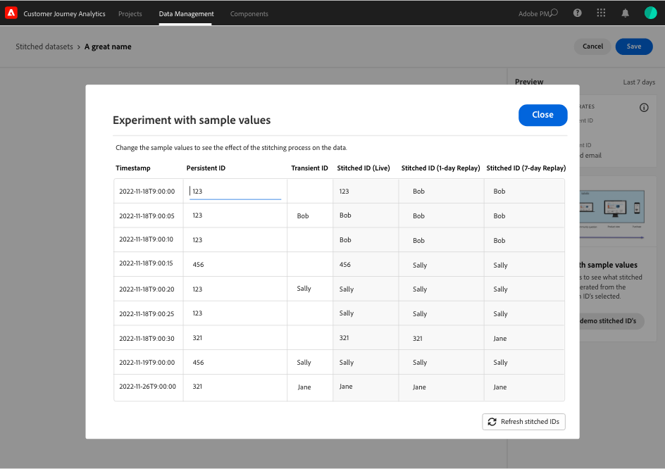
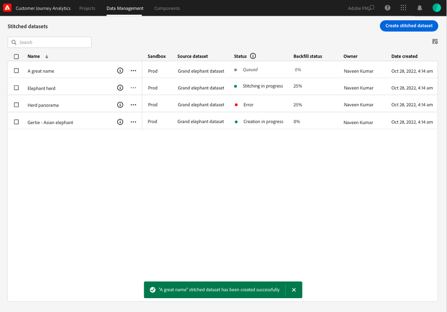
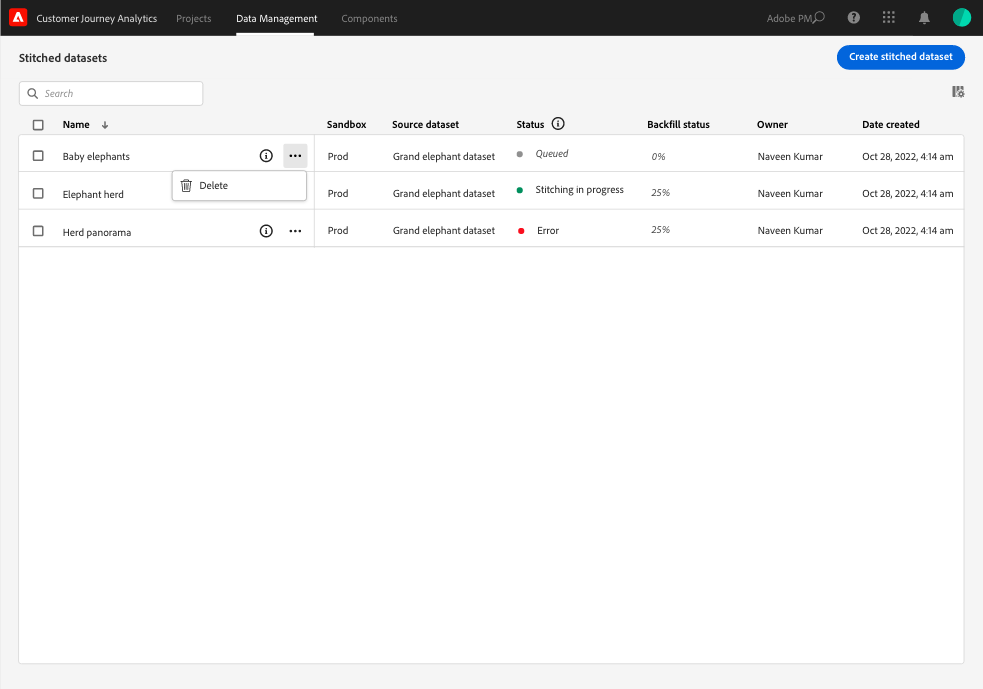

# Creación y administración de conjuntos de datos identificados

{{select-package}}

La vinculación permite a los administradores vincular identidades en conjuntos de datos disponibles en el Customer Journey Analytics. La vinculación de conjuntos de datos aumenta la precisión de la representación de un perfil, lo que en última instancia resulta en un mejor análisis e informes.

El proceso de vinculación le permite definir un **ID persistente** existente en un conjunto de datos. Luego vincule ese identificador persistente para una ventana de reproducción especificada (diaria, semanal) con el **ID transitorio** (persona o identificador autenticado) más preciso disponible para ese conjunto de datos. Algunos ejemplos de identificadores transitorios son correo electrónico, número de teléfono, ID de CRM u otras identidades almacenadas en el gráfico. Consulte [Información general](overview.md) para obtener más información sobre la vinculación.

## Crear

Para iniciar la vinculación, debe crear uno o varios conjuntos de datos vinculados. Para crear un conjunto de datos vinculado:

1. Seleccione **[!UICONTROL ** Vinculación **]** de **[!UICONTROL **&#x200B; Administración de datos &#x200B;**]** en la barra superior.

2. En la pantalla [!UICONTROL Conjuntos de datos vinculados], seleccione **[!UICONTROL **&#x200B; Crear conjunto de datos vinculado &#x200B;**]**.

   Se le mostrará un cuadro de diálogo en el que se explican sus responsabilidades.

3. Seleccione **[!UICONTROL **&#x200B; Continuar &#x200B;**]** si acepta estas responsabilidades.

   >[!NOTE]
   >
   >    Si selecciona **[!UICONTROL **&#x200B; Cancelar &#x200B;**]**, no podrá crear un conjunto de datos enlazado.

4. En la pantalla [!UICONTROL Conjuntos de datos enlazados > Conjunto de datos enlazados sin título]:

   1. Definir un **[!UICONTROL ** nombre de conjunto de datos **]** y (opcional) **[!UICONTROL **&#x200B; Descripción &#x200B;**]**,

   2. Seleccione la zona protegida de la lista **[!UICONTROL **&#x200B; Zona protegida &#x200B;**]** donde se almacena el conjunto de datos de evento.

      

   3. Seleccione el botón **[!UICONTROL **&#x200B; Seleccionar conjunto de datos de origen &#x200B;**]**.

      En la ventana emergente [!UICONTROL Seleccionar un conjunto de datos para unir]:

      

      - Seleccione un conjunto de datos y seleccione **[!UICONTROL **&#x200B; Seleccionar &#x200B;**]** para continuar.

   4. Seleccione un identificador persistente de la lista **[!UICONTROL **&#x200B; ID persistente &#x200B;**]**.

   5. Seleccione un identificador transitorio de la lista **[!UICONTROL **&#x200B; ID transitorio &#x200B;**]**.

      Verá que aparece un panel de vista previa para calcular las tasas de saturación (cantidad de veces que hay un valor para cada uno de los identificadores especificados a lo largo del número de eventos) durante los últimos siete días. Cuando termina de calcular, el panel visualiza con colores si se cumplen las condiciones mínimas de vinculación (verde) o no (rojo).

      

      Las condiciones mínimas son:

      - saturación de identificador persistente: tasa >= 95 %

      - saturación de identificador transitorio: tasa >= 5 %

        Si se cumplen las condiciones mínimas, puede experimentar con valores de muestra.

      - Seleccione **[!UICONTROL **&#x200B; Crear ID vinculado de demostración &#x200B;**]**.

        En el cuadro de diálogo [!UICONTROL Experimento con valores de muestra], se muestra una tabla con un valor de muestra para [!UICONTROL timestamp], [!UICONTROL ID persistente], [!UICONTROL ID transitorio], [!UICONTROL ID con título (activo)], [!UICONTROL ID con título (reproducción de 1 día)] y [!UICONTROL ID con título (reproducción de 7 días)].

        ¡    
            
            1. Escriba un valor para el **[!UICONTROL **ID persistente**]**.
            
            2. Seleccione **[!UICONTROL **Actualizar los ID vinculados**]** para ver el efecto del proceso de vinculación en los datos del conjunto de datos.
            
            3. Seleccione **[!UICONTROL **Close**]** cuando haya terminado de experimentar con valores de muestra.
        

        Vuelva a la pantalla [!UICONTROL Conjuntos de datos enlazados > _Nombre del conjunto de datos_]:

   6. Seleccione una opción para la frecuencia y el período de restauración de datos históricos en la lista **[!UICONTROL **&#x200B; Ventana de reproducción &#x200B;**]**.

      Puede seleccionar entre el valor predeterminado **[!UICONTROL ** Día anterior, diario **]** o **[!UICONTROL **&#x200B; Días anteriores, semanales &#x200B;**]**.

   7. Seleccione un valor de la lista **[!UICONTROL **&#x200B; Cantidad promedio de eventos diarios &#x200B;**]**.

   8. Escriba un valor (entre `0` y `12`) en **[!UICONTROL **&#x200B; Número de meses para rellenar &#x200B;**]**.

   9. Seleccione **[!UICONTROL **&#x200B; Guardar &#x200B;**]** para guardar el conjunto de datos vinculado e iniciar la vinculación.

## Ver estado

Puede ver el estado de la vinculación en la lista [!UICONTROL Conjuntos de datos vinculados].

- Seleccione **[!UICONTROL ** Vinculación **]** de **[!UICONTROL **&#x200B; Administración de datos &#x200B;**]** en la barra superior.

  Verá una lista de conjuntos de datos enlazados, cada uno identificado con [!UICONTROL espacio aislado], [!UICONTROL conjunto de datos de Source], [!UICONTROL Estado], [!UICONTROL Estado de relleno], [!UICONTROL Propietario] y [!UICONTROL Fecha de creación].

  

  Los valores posibles de [!UICONTROL Status] son:

  | Valor | Explicación |
  |-----|-----|
  | **[!UICONTROL **&#x200B; En cola &#x200B;**]** | La solicitud se recibe y se procesa pronto. |
  | **[!UICONTROL **&#x200B; Creación &#x200B;**]** en curso | Los recursos y el conjunto de datos recién enlazado están en creación. |
  | **[!UICONTROL **&#x200B; Configuración en curso &#x200B;**]** | Existen los recursos y el conjunto de datos vinculado y la vinculación está en curso |
  | **[!UICONTROL **&#x200B; Error &#x200B;**] **&#x200B; | Hay un problema con la vinculación. Tal vez se cambió un esquema entre el conjunto de datos de origen y el conjunto de datos vinculado, el volumen diario es demasiado grande o... (_**&#x200B;necesita más información aquí...**_) |

  >[!INFO]
  >
  >    Cada vez que cambia el estado, se envía una notificación con el mensaje **[!UICONTROL **&#x200B; El conjunto de datos vinculado _nombre del conjunto de datos_ ha cambiado al estado _nombre del estado _**]**.

  El [!UICONTROL estado de relleno] puede tener los siguientes valores: 0%, 25%, 50%, 75% o 100%.

  Puede seleccionar el icono de información para mostrar una ventana emergente con más detalles sobre el conjunto de datos vinculado seleccionado.

## Eliminar

>[!NOTE]
>
>Solo puede eliminar conjuntos de datos que tengan el estado [!UICONTROL Configuración en curso], [!UICONTROL Error] o [!UICONTROL En cola].

Para eliminar un solo conjunto de datos vinculado:

- Seleccione **[!UICONTROL **...**]** para el conjunto de datos enlazado y seleccione **[!UICONTROL **&#x200B; Eliminar &#x200B;**]** del menú.

  

Para eliminar varios datos vinculados:

- Seleccione varios conjuntos de datos enlazados mediante la casilla de verificación al principio de cada conjunto de datos enumerado.

- Seleccione **[!UICONTROL **...**]** de uno de los conjuntos de datos enlazados seleccionados y seleccione **[!UICONTROL **&#x200B; Eliminar &#x200B;**]** del menú.
