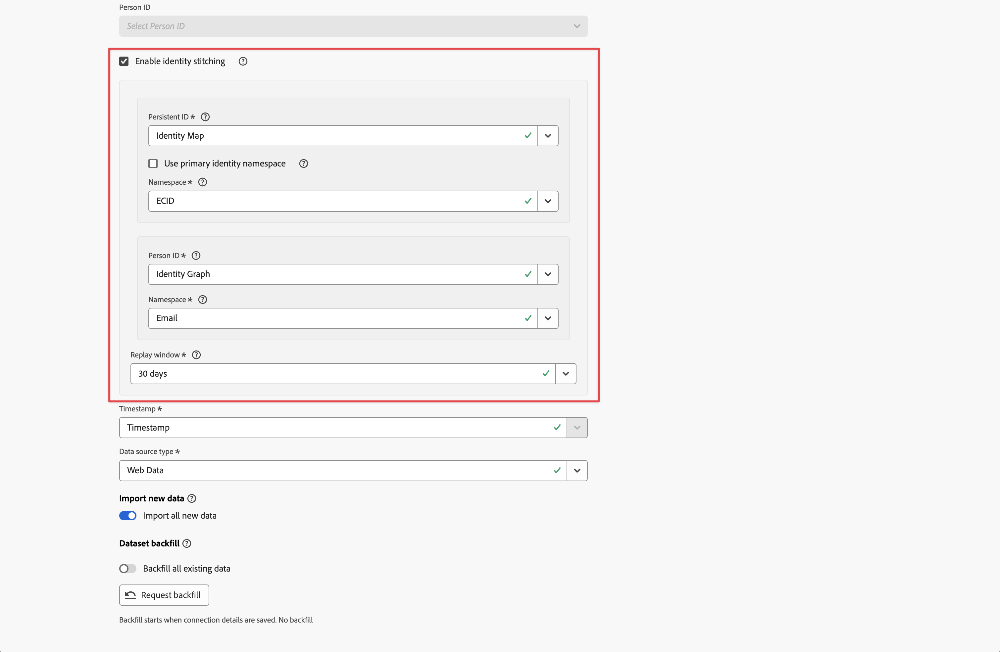

# Habilitación de la vinculación

Puede habilitar la vinculación en uno o varios conjuntos de datos de evento que haya configurado como parte de la conexión. El paquete de Customer Journey Analytics con licencia determina el número de conjuntos de datos de evento que puede habilitar para la vinculación

Habilita la vinculación como parte de [configuración del conjunto de datos](/help/connections/create-connection.md#dataset-settings) para un conjunto de datos de evento al [crear una conexión](/help/connections/create-connection.md) o al [editar una conexión](/help/connections/manage-connections.md#edit-a-connection).

## Requisitos previos

Debe comprobar y cumplir los requisitos previos del método de vinculación que especifique: [vinculación basada en el campo](fbs.md#prerequisites) o [vinculación basada en gráficos](gbs.md#prerequisites).


## Comprobaciones previas

Si cumple los requisitos previos, es posible que desee realizar algunas comprobaciones previas de los datos del conjunto de datos de evento antes de habilitar la vinculación de identidad:

* Si va a utilizar campos de esquema XDM para un ID o ID de persona persistentes, asegúrese de que las identidades se marquen correctamente en el esquema del conjunto de datos de evento. [Consulte Información general del área de nombres de identidad](https://experienceleague.adobe.com/es/docs/experience-platform/identity/features/namespaces).
* Compruebe la cobertura de identidad tanto para el ID persistente como para el ID de persona:

   * **ID persistente**

     Consulte 7 días de datos en los que el campo de ID persistente no sea nulo y divida por una consulta de 7 días de datos para todos los eventos del conjunto de datos. Este porcentaje debe ser superior al 95 %.

     Ejemplo de una consulta que puede utilizar para la verificación:

     ```sql
     SELECT
       COUNT(*) AS total_events,
       COUNT({PERSISTENT_ID_FIELD}) AS events_with_persistentid,
       ROUND(COUNT({PERSISTENT_ID_FIELD}) / COUNT(*), 2) AS percent_with_persistentid_not_null
     FROM 
       {DATASET_TABLE_NAME}
     WHERE
       TO_TIMESTAMP(timestamp, '{FORMAT_STRING}') >= TIMESTAMP '{START_DATE}'
       AND TO_TIMESTAMP(timestamp, 'FORMAT_STRING') < TIMESTAMP '{END_DATE}';
     ```

     Donde:

      * `{PERSISTENT_ID_FIELD}` es el campo para el identificador persistente. Por ejemplo: `identityMap.ecid[0]`.
      * `{DATASET_TABLE_NAME}` es el nombre de tabla para el conjunto de datos de evento.
      * `{FORMAT_STRING}` es la cadena de formato para el campo de marca de tiempo. Por ejemplo: `MM/DD/YY HH12:MI AM`.
      * `{START_DATE} ` es la fecha de inicio. Por ejemplo: `2024-01-01 00:00:00`.
      * `{END_DATE}` es la fecha de finalización en formato estándar. Por ejemplo: `2024-01-08 00:00:00`.


   * **ID de la persona**
      * Para la vinculación basada en gráficos, asegúrese de que el gráfico de identidades contenga fragmentos que vinculen valores de ID desde el área de nombres de ID persistente y el área de nombres de ID de persona que haya elegido. Puede ejecutar una prueba en el [visor de gráficos de identidad de Experience Platform](https://experienceleague.adobe.com/en/docs/experience-platform/identity/features/identity-graph-viewer){target="_blank"} y consultar el gráfico en función de algunos valores de ID persistentes de prueba. Compruebe si estos valores de ID persistentes están vinculados a valores de ID de persona en el gráfico.
      * Para la vinculación basada en el campo, consulte 7 días de datos en los que el campo de ID de persona no sea nulo y divida los datos por una consulta de 7 días para todos los eventos del conjunto de datos. Este porcentaje debería ser idealmente superior al 5 %.

        Ejemplo de una consulta que puede utilizar para la verificación:

        ```sql
        SELECT
          COUNT(*) AS total_events,
          COUNT({PERSON_ID_FIELD}) AS events_with_personid,
          ROUND(COUNT({PERSON_ID_FIELD}) / COUNT(*), 2) AS percent_with_personid_not_null
        FROM 
          {DATASET_TABLE_NAME}
        WHERE
          TO_TIMESTAMP(timestamp, '{FORMAT_STRING}') >= TIMESTAMP '{START_DATE}'
          AND TO_TIMESTAMP(timestamp, 'FORMAT_STRING') < TIMESTAMP '{END_DATE}';
        ```

        Donde:

         * `{PERSON_ID_FIELD}` es el campo para el ID de persona. Por ejemplo: `identityMap.crmId[0]`.
         * `{DATASET_TABLE_NAME}` es el nombre de tabla para el conjunto de datos de evento.
         * `{FORMAT_STRING}` es la cadena de formato para el campo de marca de tiempo. Por ejemplo: `MM/DD/YY HH12:MI AM`.
         * `{START_DATE}` es la fecha de inicio. Por ejemplo: `2024-01-01 00:00:00`.
         * `{END_DATE}` es la fecha de finalización en formato estándar. Por ejemplo: `2024-01-08 00:00:00`.


## Habilitación de la vinculación de identidad

Para habilitar la vinculación, en la sección del conjunto de datos de evento del cuadro de diálogo **[!UICONTROL Agregar conjuntos de datos]** o **[!UICONTROL Editar conjunto de datos]**:



1. Seleccione **[!UICONTROL Habilitar vinculación de identidad]**.

   Si habilita o deshabilita la vinculación para un conjunto de datos de evento guardado en la conexión, el cuadro de diálogo **[!UICONTROL Cambiar ID de persona]** mostrará las implicaciones de un cambio del ID de persona. Seleccione **[!UICONTROL Continuar]** para continuar.

   El cuadro de diálogo **[!UICONTROL Habilitar vinculación de identidad]** resume las consecuencias de vincular identidades. Seleccione **[!UICONTROL Continuar]** para continuar.

1. Seleccione un ID persistente del menú desplegable **[!UICONTROL ID persistente]**.

   Si selecciona **[!UICONTROL mapa de identidad]** para el ID persistente, debe seleccionar un área de nombres Tiene dos opciones:

   * Habilitar **[!UICONTROL Usar el área de nombres de identidad principal]** para usar el área de nombres de identidad principal.
   * Seleccione un área de nombres del menú desplegable **[!UICONTROL Área de nombres]**.

1. Seleccione un ID de persona en el menú desplegable **[!UICONTROL ID de persona]**.

   Si selecciona **[!UICONTROL mapa de identidad]** para el ID de persona, debe seleccionar un área de nombres. Tiene dos opciones:

   * Habilitar **[!UICONTROL Usar el área de nombres de identidad principal]** para usar el área de nombres de identidad principal.
   * Seleccione un área de nombres del menú desplegable **[!UICONTROL Área de nombres]**.


   Si selecciona **[!UICONTROL Gráfico de identidad]** para el ID de persona (para usar [vinculación basada en gráficos](/help/stitching/gbs.md)), debe seleccionar un área de nombres.

   >[!NOTE]
   >
   >Asegúrese de que tiene derecho a utilizar el gráfico de identidad.
   >

   Antes de eso, se muestra el cuadro de diálogo **[!UICONTROL Cambiar al gráfico de identidad]** para asegurarse de que ha finalizado la configuración del gráfico de identidad para el conjunto de datos como parte de los [requisitos previos basados en gráficos](/help/stitching/gbs.md#prerequisites) antes de usar el gráfico de identidad para la vinculación. Seleccione **[!UICONTROL Continuar]** para continuar.

   * Seleccione un área de nombres del menú desplegable **[!UICONTROL Área de nombres]**.


1. Seleccione una ventana de reproducción del menú desplegable **[!UICONTROL Ventana de reproducción]**. Las opciones disponibles dependen del paquete de Customer Journey Analytics al que esté autorizado.

Una vez guardada una conexión, el proceso de vinculación de conjuntos de datos habilitados para la vinculación se inicia cuando se inicia la ingesta de datos para estos conjuntos de datos.

>[!CAUTION]
>
>Para los conjuntos de datos que están habilitados para la vinculación en la interfaz Conexiones, el estado del relleno se indica de forma inmediata e incorrecta como  **[!UICONTROL _x _rellenos completados]**para el número de rellenos completados. Utilice otras formas de comprobar si los datos del conjunto de datos vinculado están rellenados.
>


## Limitaciones

Además de las [limitaciones de vinculación basadas en el campo](/help/stitching/fbs.md#limitations) y las [limitaciones de vinculación basadas en gráficos](/help/stitching/gbs.md#limitations), se aplican las siguientes limitaciones al habilitar la vinculación en la interfaz Conexiones:

* Solo puede vincular un conjunto de datos de evento una vez como parte de una sola conexión. No puede definir el mismo conjunto de datos de evento más de una vez y utilizar una configuración de vinculación independiente para cada instancia. Si desea aplicar diferentes configuraciones de vinculación en el mismo conjunto de datos, utilice una conexión independiente para cada configuración.


## Migración

La configuración habilitada en la interfaz Conexiones puede coexistir sin problemas con la vinculación basada en solicitudes.

Por ejemplo, tiene conjuntos de datos enlazados basados en la web en el lago de datos como resultado de solicitudes de vinculación anteriores o actuales. Puede agregar datos vinculados de un conjunto de datos del centro de llamadas mediante la interfaz Conexiones para combinar esos datos con los datos basados en web.

Finalmente, Adobe migrará los conjuntos de datos enlazados basados en solicitudes a la nueva experiencia de vinculación en conexiones.
