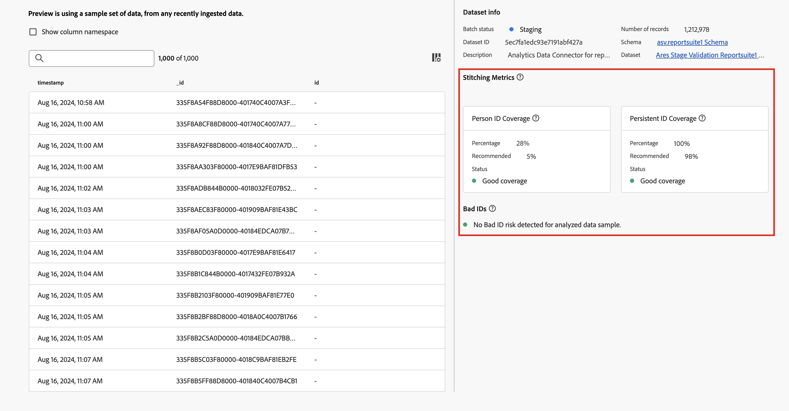

# Habilitación de la vinculación

Puede habilitar la vinculación en uno o varios conjuntos de datos de evento que haya configurado como parte de la conexión. El paquete de Customer Journey Analytics con licencia determina el número de conjuntos de datos de evento que puede habilitar para la vinculación.

Habilita la vinculación como parte de [configuración del conjunto de datos](/help/connections/create-connection.md#dataset-settings) para un conjunto de datos de evento al [crear una conexión](/help/connections/create-connection.md) o al [editar una conexión](/help/connections/manage-connections.md#edit-a-connection).

## Requisitos previos

Debe comprobar y cumplir los requisitos previos del método de vinculación que especifique: [vinculación basada en el campo](fbs.md#prerequisites) o [vinculación basada en gráficos](gbs.md#prerequisites).

## Comprobaciones previas

Si cumple los requisitos previos, es posible que desee realizar algunas comprobaciones previas de los datos del conjunto de datos de evento antes de habilitar la vinculación de identidad:

* Si va a usar el esquema [Experience Data Model (XDM)](https://experienceleague.adobe.com/es/docs/experience-platform/xdm/home) campos para el ID persistente o el ID de persona, asegúrese de que las identidades se marquen correctamente en el esquema para el conjunto de datos de evento. [Consulte Información general del área de nombres de identidad](https://experienceleague.adobe.com/es/docs/experience-platform/identity/features/namespaces).
* Compruebe la cobertura de identidad tanto para el ID persistente como para el ID de persona:

   * **[!UICONTROL ID persistente]**

     Consulte 7 días de datos en los que el campo de ID persistente no sea nulo y divida por una consulta de 7 días de datos para todos los eventos del conjunto de datos. Este porcentaje debe ser superior al 95 %.

     Ejemplo de una consulta que puede utilizar para la verificación:

     ```sql
     SELECT
       COUNT(*) AS total_events,
       COUNT({PERSISTENT_ID_FIELD}) AS events_with_persistentid,
       ROUND(COUNT({PERSISTENT_ID_FIELD}) / COUNT(*), 2) AS percent_with_persistentid_not_null
     FROM 
       {DATASET_TABLE_NAME}
     WHERE
       TO_TIMESTAMP(timestamp, '{FORMAT_STRING}') >= TIMESTAMP '{START_DATE}'
       AND TO_TIMESTAMP(timestamp, 'FORMAT_STRING') < TIMESTAMP '{END_DATE}';
     ```

     Donde:

      * `{PERSISTENT_ID_FIELD}` es el campo para el identificador persistente. Por ejemplo: `identityMap.ecid[0]`.
      * `{DATASET_TABLE_NAME}` es el nombre de tabla para el conjunto de datos de evento.
      * `{FORMAT_STRING}` es la cadena de formato para el campo de marca de tiempo. Por ejemplo: `MM/DD/YY HH12:MI AM`.
      * `{START_DATE}` es la fecha de inicio. Por ejemplo: `2024-01-01 00:00:00`.
      * `{END_DATE}` es la fecha de finalización en formato estándar. Por ejemplo: `2024-01-08 00:00:00`.


   * **[!UICONTROL ID de la persona]**
      * Para la vinculación basada en gráficos, asegúrese de que el gráfico de identidades contenga fragmentos que vinculen valores de ID desde el área de nombres de ID persistente y el área de nombres de ID de persona que haya elegido. Puede ejecutar una prueba en el [visor de gráficos de identidad de Experience Platform](https://experienceleague.adobe.com/es/docs/experience-platform/identity/features/identity-graph-viewer){target="_blank"} y consultar el gráfico en función de algunos valores de ID persistentes de ejemplo. Compruebe si estos valores de ID persistentes están vinculados a valores de ID de persona en el gráfico.
      * Para la vinculación basada en el campo, consulte 7 días de datos en los que el campo de ID de persona no sea nulo y divida los datos por una consulta de 7 días para todos los eventos del conjunto de datos. Este porcentaje debería ser idealmente superior al 5 %.

        Ejemplo de una consulta que puede utilizar para la verificación:

        ```sql
        SELECT
          COUNT(*) AS total_events,
          COUNT({PERSON_ID_FIELD}) AS events_with_personid,
          ROUND(COUNT({PERSON_ID_FIELD}) / COUNT(*), 2) AS percent_with_personid_not_null
        FROM 
          {DATASET_TABLE_NAME}
        WHERE
          TO_TIMESTAMP(timestamp, '{FORMAT_STRING}') >= TIMESTAMP '{START_DATE}'
          AND TO_TIMESTAMP(timestamp, 'FORMAT_STRING') < TIMESTAMP '{END_DATE}';
        ```

        Donde:

         * `{PERSON_ID_FIELD}` es el campo para el ID de persona. Por ejemplo: `identityMap.crmId[0]`.
         * `{DATASET_TABLE_NAME}` es el nombre de tabla para el conjunto de datos de evento.
         * `{FORMAT_STRING}` es la cadena de formato para el campo de marca de tiempo. Por ejemplo: `MM/DD/YY HH12:MI AM`.
         * `{START_DATE}` es la fecha de inicio. Por ejemplo: `2024-01-01 00:00:00`.
         * `{END_DATE}` es la fecha de finalización en formato estándar. Por ejemplo: `2024-01-08 00:00:00`.


## Habilitación de la vinculación de identidad {#enable-identity-stitching}

Puede habilitar la vinculación de identidad al [agregar](/help/connections/create-connection.md#add-datasets) o [editar](/help/connections/create-connection.md#edit-a-dataset) un conjunto de datos de evento en una conexión basada en persona. La vinculación de identidad no está disponible para conexiones basadas en cuentas.

>[!CONTEXTUALHELP]
>id="connection_changeto_identitygraph"
>title="Cambio en el gráfico de identidad"
>abstract="Asegúrese de haber terminado la configuración del gráfico de identidad antes de utilizarlo para la vinculación."
>additional-url="https://experienceleague.adobe.com/es/docs/analytics-platform/using/stitching/gbs" text="Vinculación basada en gráficos"

>[!CONTEXTUALHELP]
>id="connection_stitching_personid"
>title="ID de persona"
>abstract="Seleccione un ID de persona (el identificador único de una persona) entre las identidades disponibles. Si su licencia incluye vinculación basada en gráficos y desea utilizar ese método de vinculación, seleccione **[!UICONTROL Gráfico de identidad]**."

>[!CONTEXTUALHELP]
>id="connection_stitchingmetrics"
>title="Vinculación de métricas"
>abstract="La vinculación de métricas se calcula mediante un conjunto de datos de muestra con marcas de tiempo de evento de los últimos 7 días.<br>Este conjunto de datos de ejemplo suele diferir de los datos de ejemplo utilizados en la tabla **[!UICONTROL Preview]**."

>[!CONTEXTUALHELP]
>id="connection_stitchingmetrics_gbs_personidcoverage"
>title="Cobertura de ID de persona"
>abstract="La cobertura del ID de persona seleccionado que se utiliza para la identificación durante el proceso de identificación (reproducción y emisión).<br/>Para obtener los mejores resultados de vinculación, debe haber una relación (ID persistente, ID de persona) en el gráfico de identidades para cada ID persistente."

>[!CONTEXTUALHELP]
>id="connection_stitchingmetrics_fbs_personidcoverage"
>title="Cobertura de ID de persona"
>abstract="La cobertura del ID de persona seleccionado que se utiliza para la identificación durante el proceso de identificación (reproducción y emisión).<br/>Para obtener los mejores resultados de vinculación, el ID de persona (información de usuario) debe enviarse al menos en un evento por cada ID persistente (información de dispositivo)."

>[!CONTEXTUALHELP]
>id="connection_stitchingmetrics_persistentidcoverage"
>title="Cobertura de ID persistente"
>abstract="Este valor se utiliza para la identificación durante el proceso de vinculación (activo y de reproducción), en caso de que no se pueda detectar un valor de ID de persona. <br/>Los eventos sin ID persistente ni ID de persona se perderán de los datos. Para obtener los mejores resultados de vinculación, debe haber un ID persistente en todos los eventos."


>[!CONTEXTUALHELP]
>id="connection_stitchingmetrics_badids"
>title="ID incorrectos"
>abstract="Los ID incorrectos son valores de ID que afectan gravemente a los datos de informes."
>additional-url="https://experienceleague.adobe.com/es/docs/analytics-platform/using/technotes/badids" text="ID incorrectos"


### Configuración del conjunto de datos

Para habilitar la vinculación, en la sección del conjunto de datos de evento **[!UICONTROL Configuración de conjuntos de datos]** del cuadro de diálogo **[!UICONTROL Agregar conjuntos de datos]** o **[!UICONTROL Editar conjunto de datos]**.


1. Seleccione **[!UICONTROL Habilitar vinculación de identidad]**.

   Si habilita o deshabilita la vinculación para un conjunto de datos de evento guardado en la conexión, el cuadro de diálogo **[!UICONTROL Cambiar ID de persona]** mostrará las implicaciones de un cambio del ID de persona. Seleccione **[!UICONTROL Continuar]** para continuar.

   El cuadro de diálogo **[!UICONTROL Habilitar vinculación de identidad]** resume las consecuencias de vincular identidades. Seleccione **[!UICONTROL Continuar]** para continuar.

1. Seleccione un ID persistente del menú desplegable **[!UICONTROL ID persistente]**.

   Si selecciona **[!UICONTROL mapa de identidad]** para el identificador persistente, seleccione un área de nombres. Tiene dos opciones:

   * Seleccione **[!UICONTROL Usar el área de nombres de identidad principal]** para usar el área de nombres de identidad principal.
   * Seleccione un área de nombres del menú desplegable **[!UICONTROL Área de nombres]**.

1. Seleccione un ID de persona en el menú desplegable **[!UICONTROL ID de persona]**.

   Si selecciona **[!UICONTROL mapa de identidad]** para el ID de persona, seleccione un área de nombres. Tiene dos opciones:

   * Seleccione **[!UICONTROL Usar el área de nombres de identidad principal]** para usar el área de nombres de identidad principal.
   * Seleccione un área de nombres del menú desplegable **[!UICONTROL Área de nombres]**.

   Si selecciona **[!UICONTROL Gráfico de identidad]** para el ID de persona (para usar [vinculación basada en gráficos](/help/stitching/gbs.md)), debe seleccionar un área de nombres.

   >[!NOTE]
   >
   >Asegúrese de que tiene derecho a utilizar el gráfico de identidad.
   >

   Antes de eso, se muestra el cuadro de diálogo **[!UICONTROL Cambiar al gráfico de identidad]** para asegurarse de que ha finalizado la configuración del gráfico de identidad para el conjunto de datos. Esta configuración forma parte de los [requisitos previos basados en gráficos](/help/stitching/gbs.md#prerequisites) para que pueda usar el gráfico de identidad para la vinculación. Seleccione **[!UICONTROL Continuar]** para continuar.

   * Seleccione un área de nombres del menú desplegable **[!UICONTROL Área de nombres]**.

1. Seleccione una ventana de reproducción del menú desplegable **[!UICONTROL Ventana de reproducción]**. Las opciones disponibles dependen del paquete de Customer Journey Analytics al que esté autorizado.

1. Seleccione **[!UICONTROL Siguiente]** para ver una vista previa del conjunto de datos de evento sujeto a la vinculación.


### Vista previa de los conjuntos de datos

Además de la interfaz estándar de **[!UICONTROL vista previa de conjuntos de datos]**, al [agregar](/help/connections/create-connection.md#add-datasets) o [editar](/help/connections/create-connection.md#edit-a-dataset) conjuntos de datos en una conexión basada en personas, hay dos paneles de información adicionales disponibles.



#### Vinculación de métricas

>[!AVAILABILITY]
>
>La vinculación de métricas no está disponible para la vinculación basada en gráficos.
>

**[!UICONTROL Las métricas de vinculación]** se calculan usando un conjunto de datos de muestra con marcas de tiempo de evento de los últimos 7 días. Este conjunto de datos de ejemplo suele diferir de los datos de ejemplo utilizados en la tabla **[!UICONTROL Preview]**. La vinculación de métricas proporciona detalles para lo siguiente:

* **[!UICONTROL Cobertura de ID de persona]**: La cobertura del ID de persona seleccionado utilizado para la identificación durante el proceso de vinculación (activo y de reproducción).
   * Para obtener los mejores resultados de vinculación basada en el campo, se debe enviar un ID de persona (información de usuario) con al menos un evento para cada ID persistente (información de dispositivo).
   * Para obtener los mejores resultados de vinculación basada en gráficos, debe haber una relación (ID persistente, ID de persona) en el gráfico de identidad para cada ID persistente.

  La cobertura del ID de persona se muestra como porcentaje y se compara con lo que se recomienda en una configuración de desarrollo estable o de producción. Cuanto mayor sea este valor de cobertura, mejores serán los resultados de vinculación con el ID de persona seleccionado.

* **[!UICONTROL Cobertura de ID persistente]**: este valor se usa para la identificación durante el proceso de vinculación (en vivo y en reproducción), en caso de que no se pueda detectar un valor de ID de persona. Los eventos sin ID persistente ni ID de persona se pierden de los datos. Para obtener los mejores resultados de vinculación, debe haber un ID persistente en todos los eventos.

  La cobertura de ID persistente se muestra como porcentaje y se compara con el mínimo recomendado en una configuración de desarrollo estable o de producción.

#### ID incorrectos

>[!AVAILABILITY]
>
>Los ID incorrectos no están disponibles para la vinculación basada en gráficos.
>

>[!INFO]
>
>Los ID incorrectos también se denominan BAVID en la interfaz de Customer Journey Analytics.
> 

En Customer Journey Analytics, un ID incorrecto es un identificador:

* con un valor de ID específico que se origina a partir de un ID persistente o un campo de ID de persona en conjuntos de datos habilitados para la vinculación, **y**
* está en más de un millón (1.000.000) de eventos en los datos de conexión, en un mes.

Cuando un valor de ID se marca como un ID incorrecto, los eventos futuros que contengan ese valor de ID se descartarán de los datos de conexión y no se mostrarán en los informes.

Ejemplos de casos de uso de ID incorrectos:

* Tiene valores personalizados o de marcador de posición en el campo ID de persona (por ejemplo, `undefined`). Estos valores también pueden afectar la [calidad de los datos de vinculación y creación de informes](/help/stitching/faq.md#undefined-person-id-values).
* En una configuración de vinculación basada en el campo, si varias personas comparten un dispositivo y el número total de transiciones entre usuarios supera las 50 000. En esta situación, el proceso de vinculación se detiene para utilizar la información de ID de persona para ese dispositivo y solo utiliza la información de ID persistente en su lugar. Por lo tanto, todos los eventos de conjuntos de datos de ese dispositivo se envían a los datos de conexión con la identidad de ID persistente, con una alta probabilidad de causar una situación de ID incorrectos.


>[!NOTE]
>Las **[!UICONTROL métricas de vinculación]**, incluidas las **[!UICONTROL ID incorrectas]**, se calculan en función de un conjunto limitado de datos. Para identificar la presencia de ID incorrectos para un conjunto de datos que planea usar para la vinculación, consulte la [nota técnica sobre ID incorrectos](/help/technotes/badids.md).
>


### Guardar

Una vez guardada una conexión, el proceso de vinculación para vincular conjuntos de datos habilitados se inicia en cuanto se inicia la ingesta de datos para estos conjuntos de datos.

>[!CAUTION]
>
>Para los conjuntos de datos que están habilitados para la vinculación en la interfaz Conexiones, el estado del relleno se indica de forma inmediata e incorrecta como  **[!UICONTROL _x _rellenos completados]**&#x200B;para el número de rellenos completados. Utilice otras formas de comprobar si los datos del conjunto de datos vinculado están rellenados.
>


## Limitaciones

Además de las [limitaciones de vinculación basadas en el campo](/help/stitching/fbs.md#limitations) y las [limitaciones de vinculación basadas en gráficos](/help/stitching/gbs.md#limitations), se aplican las siguientes limitaciones al habilitar la vinculación en la interfaz Conexiones:

* Solo puede vincular un conjunto de datos de evento una vez como parte de una sola conexión. No puede definir el mismo conjunto de datos de evento más de una vez y utilizar una configuración de vinculación independiente para cada instancia. Si desea aplicar diferentes configuraciones de vinculación en el mismo conjunto de datos, utilice una conexión independiente para cada configuración.


## Migración

La configuración habilitada en la interfaz Conexiones puede coexistir sin problemas con la vinculación basada en solicitudes.

Por ejemplo, tiene conjuntos de datos enlazados basados en la web en el lago de datos como resultado de solicitudes de vinculación anteriores o actuales. Puede agregar datos vinculados de un conjunto de datos del centro de llamadas mediante la interfaz Conexiones para combinar esos datos con los datos basados en web.

Finalmente, Adobe migrará los conjuntos de datos enlazados basados en solicitudes a la nueva experiencia de vinculación en conexiones.
