# Validar vinculación

El objetivo de [vincular la identidad](/help/stitching/overview.md) (o simplemente, vincular) es elevar la idoneidad de un conjunto de datos de evento para el análisis en canales múltiples. Esta elevación se logra cuando todas las filas de datos del conjunto de datos contienen el orden de identidad más alto deseado que está disponible. Esta elevación le permite:

* Crear informes centrados en la persona, sin excluir a las personas anónimas.
* Conecte varios dispositivos a una sola persona.
* Conectar a una persona a través de canales.

Este artículo describe métodos de análisis para medir la elevación en uno o más conjuntos de datos enlazados recién creados y proporcionar confianza en que la vinculación ofrece estos beneficios.

Los métodos de análisis implican [configuraciones del componente de vista de datos](/help/data-views/component-settings/overview.md) a las que suelen tener acceso los administradores. Los métodos también requieren analistas, que trabajan en un proyecto de Analysis Workspace, para crear métricas calculadas y visualizaciones.

Aunque estos métodos de análisis se pueden utilizar tanto para la vinculación basada en el campo como en la basada en gráficos, es posible que algunos elementos no estén presentes en el conjunto de datos, especialmente en un escenario de vinculación basada en gráficos. Estos elementos que faltan pueden dificultar el cálculo del alza directamente en Analysis Workspace.

>[!NOTE]
>
>La vinculación (validación) de uno o más conjuntos de datos contribuye en última instancia a un mejor análisis y perspectivas. Sin embargo, este artículo no analiza el valor general de una configuración de Customer Journey Analytics que tiene todos los conjuntos de datos de Experience Platform alineados con el mismo área de nombres de identidad. Y que todos estos conjuntos de datos están muy bien unidos para realizar análisis en todo un recorrido de clientes.

## Requisitos previos de vista de datos

Para el plan de medición de validación de vinculación, debe asegurarse de que tiene todas las dimensiones y métricas necesarias del conjunto de datos vinculado definidas en una vista de datos. Debe comprobar que los campos `stitchedID.id` y `stitchedId.namespace.code` se agregan como dimensiones. Aunque el conjunto de datos vinculado es una copia exacta del conjunto de datos original, el proceso de vinculación agrega estas dos nuevas columnas al conjunto de datos:

* Use `stitchedID.namespace.code` para definir una dimensión de **[!UICONTROL espacio de nombres vinculado]**. Esta dimensión contiene el área de nombres de la identidad a la que se elevó la fila, por ejemplo `Email`, `Phone`. O el área de nombres al que se reserva el proceso de vinculación, como `ECID`.
  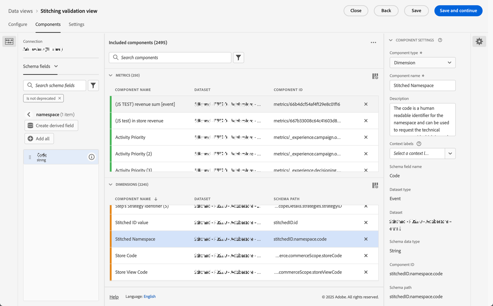

* Use `stitchedID.id` para definir una dimensión de **[!UICONTROL ID vinculado]**. Esta dimensión contiene el valor sin procesar de la identidad. Por ejemplo: correo electrónico con hash, teléfono con hash, ECID. Este valor se usa con **[!UICONTROL espacio de nombres vinculado]**.
  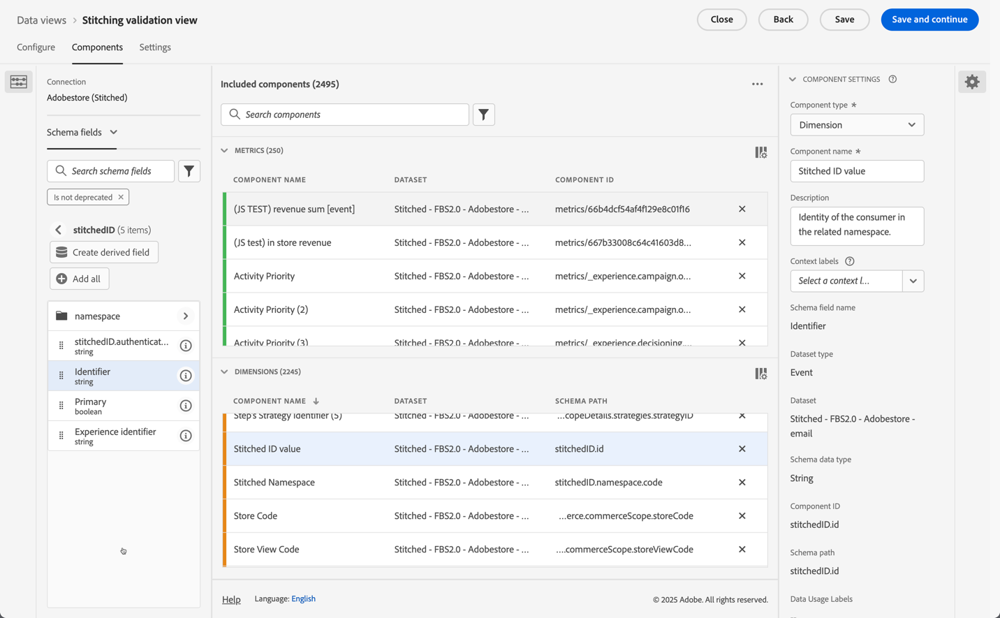

Además, debe agregar dos métricas de vinculación basadas en la presencia de valores en una dimensión.

1. Utilice el campo que contiene el ID de persona del conjunto de datos vinculado para configurar una métrica que defina si se establece un ID de persona. Añada este ID de persona aunque utilice la vinculación basada en gráficos, ya que el ID de persona ayuda a establecer una línea de base. Si el ID de persona no está contenido en el conjunto de datos, la línea de base es del 0 %.

   En el ejemplo siguiente, `personalEmail.address` sirve como identidad y se usa para crear la métrica **[!UICONTROL _Email set]**.
   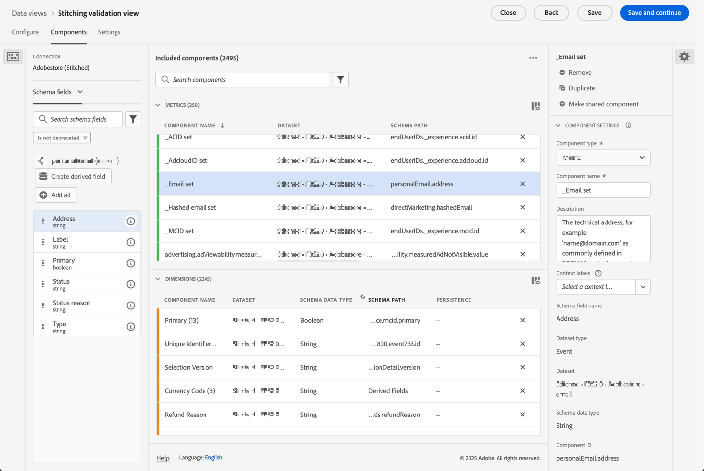

1. Utilice el campo `stitchedID.namespae.code` para crear una dimensión del área de nombres **[!UICONTROL Email stitched]**. Asegúrese de especificar [Incluir valores de exclusión en la configuración del componente](/help/data-views/component-settings/include-exclude-values.md), de modo que sólo tenga en cuenta los valores del área de nombres a la que intenta elevar filas de datos.
   1. Seleccione **[!UICONTROL Establecer valores de inclusión/exclusión]**.
   1. Seleccione **[!UICONTROL Si se cumplen todos los criterios]** como **[!UICONTROL Coincidencia]**.
   1. Especifique **[!UICONTROL Es igual que]** `email` como **[!UICONTROL criterio]** para seleccionar eventos que se han elevado al espacio de nombres de correo electrónico.

   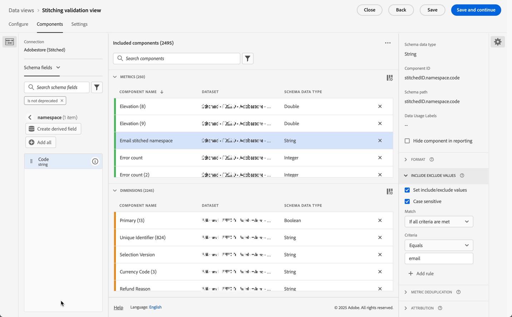

## Dimensiones vinculadas

Con ambas dimensiones agregadas a la vista de datos, use [tablas de forma libre](/help/analysis-workspace/visualizations/freeform-table/freeform-table.md) en Analysis Workspace para comprobar los datos que tiene cada dimensión.

En la tabla **[!UICONTROL Stitched Namespace dimension**], normalmente verá dos filas para cada conjunto de datos. Una fila que representa cuándo tuvo que utilizar el proceso de vinculación el método de reserva (ECID). La otra fila muestra los eventos asociados con el área de nombres de identidad deseada (correo electrónico).

Para la tabla **[!UICONTROL Stitched ID dimension**], verá los valores sin procesar que provienen de los eventos. En esta tabla, verá que los valores oscilan entre el ID persistente y el ID de persona deseado.

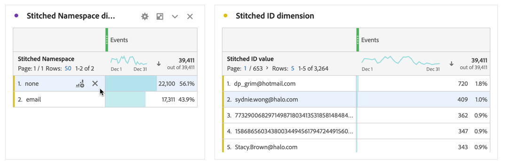

## Informes centrados en el dispositivo o en la persona

Al crear una conexión, debe definir qué campo o identidad se utiliza para el ID de persona. Por ejemplo, en un conjunto de datos web, si elige un ID de dispositivo como ID de persona, crea informes centrados en el dispositivo y pierde la capacidad de unir estos datos con otros canales sin conexión. Si selecciona un campo o una identidad en canales múltiples, por ejemplo, un correo electrónico, perderá los eventos no autenticados. Para comprender este impacto, debe averiguar qué parte del tráfico no está autenticado y qué parte del tráfico está autenticado.

1. Crear una métrica calculada **[!UICONTROL Eventos no autenticados en total]**. Defina la regla en el generador de reglas como se muestra a continuación:
   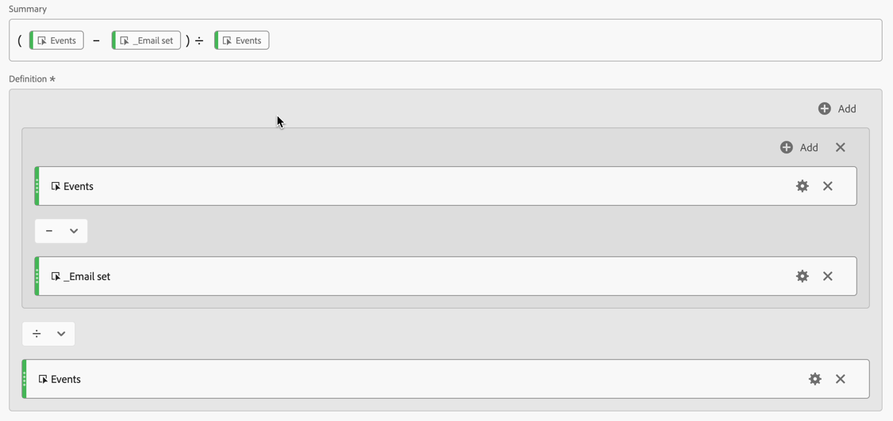

1. Cree una métrica calculada **[!UICONTROL tasa de autenticación de correo electrónico]**, basada en la métrica **[!UICONTROL _Correo electrónico establecido]** que definió anteriormente. Defina la regla en el generador de reglas como se muestra a continuación:
   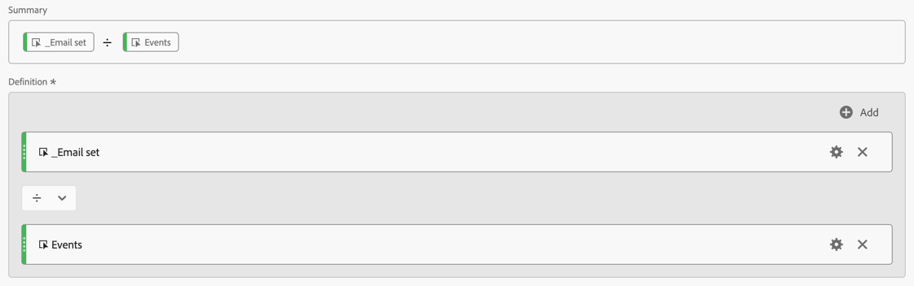

1. Utilice la métrica calculada **[!UICONTROL Eventos no autenticados sobre el total]**, junto con la métrica calculada **[!UICONTROL Tasa de autenticación de correo electrónico]**, para crear una visualización [Anillo](/help/analysis-workspace/visualizations/donut.md). La visualización muestra el número de eventos en el conjunto de datos que no están autenticados y que están autenticados.

   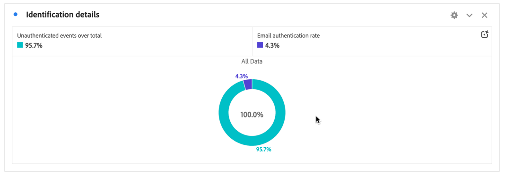

## Vinculación de tasas de identificación

Desea medir el rendimiento de identificación antes y después de la vinculación. Para ello, cree tres métricas calculadas adicionales:

1. Una métrica calculada de **[!UICONTROL tasa de autenticación vinculada]** que calcula el número de eventos donde el área de nombres vinculada está configurada con la identidad deseada sobre el número total de eventos. Al configurar la vista de datos, creó una métrica de **[!UICONTROL área de nombres vinculada por correo electrónico]** que incluía un filtro para contar solo cuando un evento tiene un área de nombres configurada como correo electrónico. La métrica calculada utiliza esta métrica **[!UICONTROL Área de nombres vinculada por correo electrónico]** para proporcionar una indicación del porcentaje de datos que tiene la identidad deseada.
   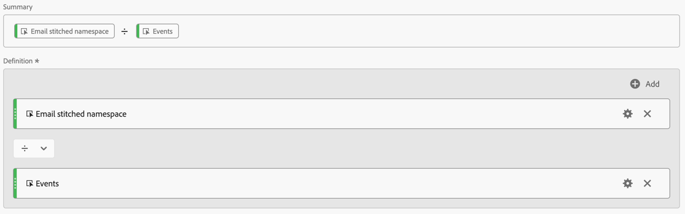

1. Una métrica calculada de **[!UICONTROL aumento porcentual]** que calcula el cambio de porcentaje sin procesar entre la tasa de identificación actual y la unida.
   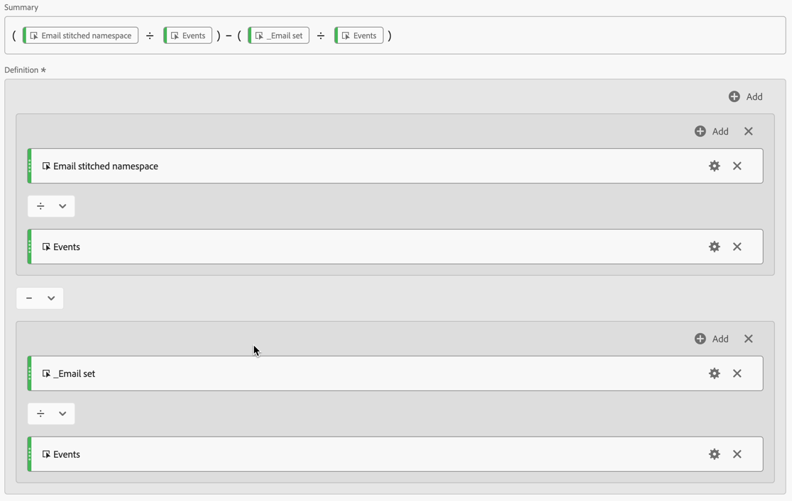

1. Una métrica calculada de **[!UICONTROL Lift]** que calcula el alza entre la tasa de identificación actual y la tasa de identificación vinculada.
   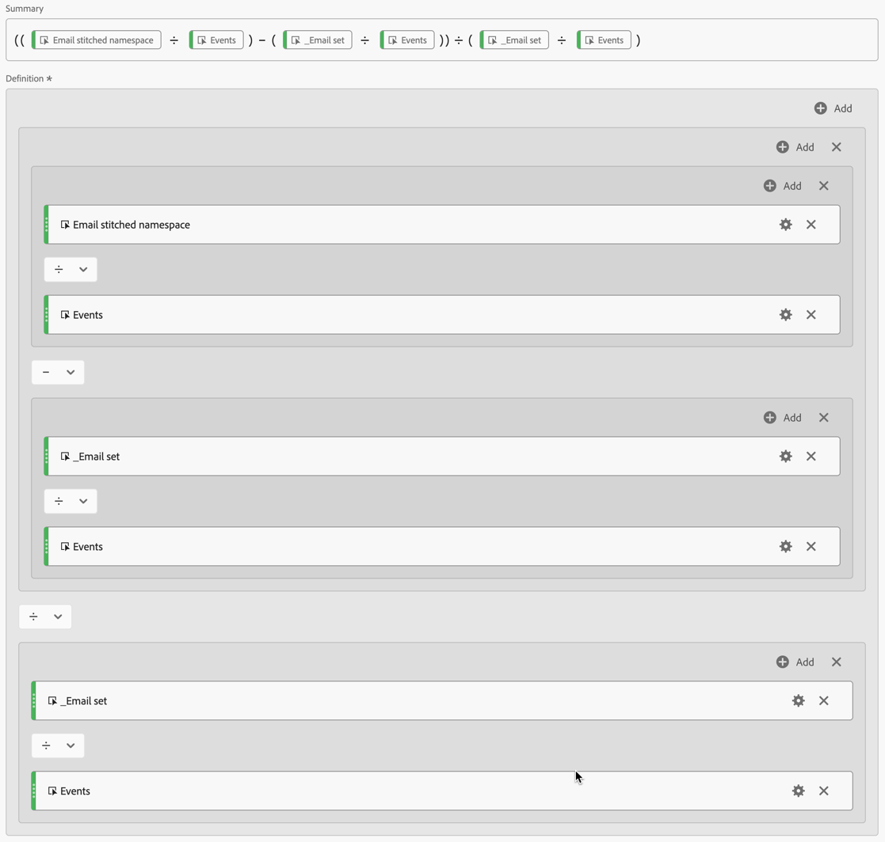

## Conclusión

Si combina todos los datos en una tabla de forma libre de Analysis Workspace, puede empezar a ver el impacto y el valor que proporciona la vinculación, incluidos los siguientes:

* Tasa de autenticación actual: la línea de base del número de eventos que ya tenían el ID de persona correcto sobre el número total de eventos.
* Tasa de autenticación vinculada: el nuevo número de eventos que tienen el ID de persona correcto sobre el número total de eventos.
* Aumento porcentual: el aumento porcentual sin procesar desde la tasa de autenticación vinculada menos la tasa de autenticación actual de línea de base.
* Alza: el cambio porcentual con respecto a la tasa de autenticación actual de línea base.

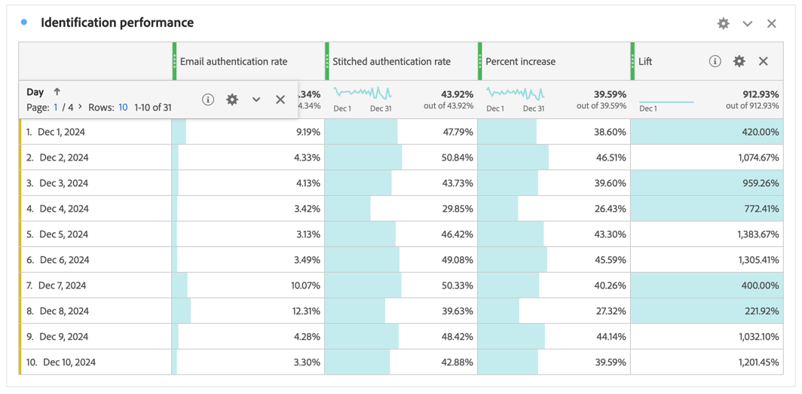

La conclusión clave de este artículo es que este tipo de validación y análisis de vinculación le permite:

* Proporcione una vista personalizada completa de la eficacia de la autenticación comparando las tasas actuales frente a las vinculadas.
* Habilite la medición clara de la mejora mediante incrementos porcentuales y métricas de alza.
* Ayude a identificar el verdadero impacto de la implementación de la vinculación en la autenticación de usuarios.
* Cree una forma estandarizada de comunicar el rendimiento de autenticación entre equipos.
* Permite tomar decisiones basadas en datos acerca de la estrategia de autenticación y la optimización.

Estas métricas, en conjunto, proporcionan a las partes interesadas una imagen completa de cómo la vinculación de Customer Journey Analytics afecta a las tasas de éxito de autenticación y al rendimiento general de identificación de personas.

