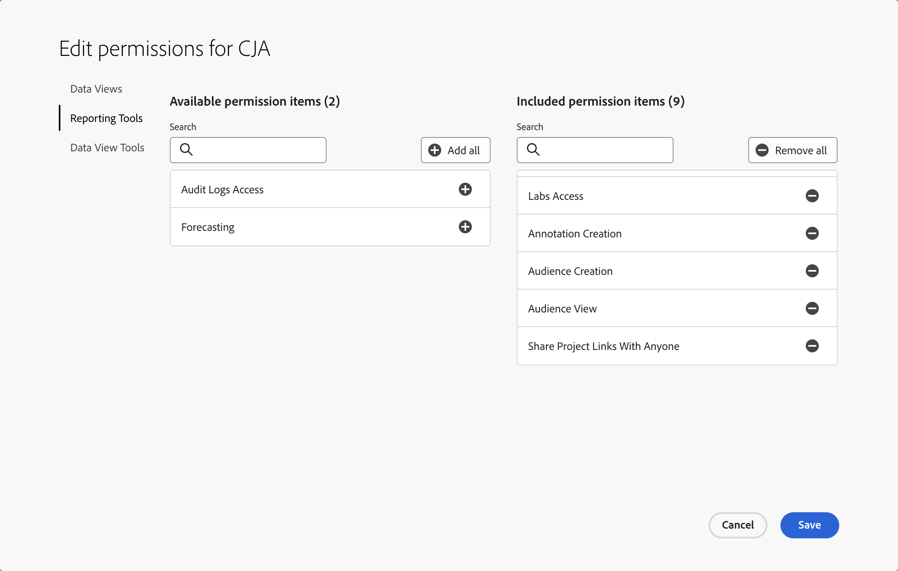

# Control de acceso

Customer Journey Analytics se rige por tres niveles de acceso o funciones: función de administrador de productos, función de administrador de perfiles de producto y acceso de nivel de usuario. En este tema se explican estas funciones con más detalle.

Además, este artículo analiza formas más granulares de limitar el acceso, como la depuración de Workspace y nivel de fila, así como el control de acceso de nivel de valor.

## Control de acceso basado en roles

Están disponibles los siguientes niveles de control de acceso basados en funciones.

### Función de administrador de productos

De forma predeterminada, los usuarios a los que se asigna la función de administrador de productos tienen los permisos necesarios para realizar la mayoría de las tareas en Customer Journey Analytics. Sin embargo, algunas tareas requieren permisos adicionales.

Para agregar un usuario como administrador de productos:

1. Vaya a [Admin Console](https://adminconsole.adobe.com/enterprise/).

1. Seleccione la pestaña [!UICONTROL **Customer Journey Analytics**] > [!UICONTROL **Administradores**] > [!UICONTROL **Agregar administrador**].

   A los usuarios que agregó se les han concedido los [permisos predeterminados del administrador de productos](#product-admin-default-permissions). También puede concederles [permisos adicionales](#product-admin-additional-permissions) si es necesario.

#### Permisos predeterminados del administrador del producto

Los administradores de productos tienen permisos para completar la mayoría de las tareas de Customer Journey Analytics.

A los administradores de productos se les otorgan los permisos necesarios para realizar las siguientes tareas de forma predeterminada:

* Actualizar y eliminar proyectos, segmentos, métricas calculadas, audiencias, anotaciones o segmentos creados por otros usuarios
* Compartir proyectos de Workspace con todos los usuarios
* Administrar la actividad de generación de informes en [Administrador de actividades de generación de informes](/help/reporting-activity-manager/reporting-activity-overview.md)
* [Exportar tablas completas](/help/analysis-workspace/export/export-cloud.md) desde Analysis Workspace

#### Permisos adicionales del administrador de productos

Además de agregarse como administrador de productos en el **Perfil de productos de Customer Journey Analytics** en [Admin Console](https://adminconsole.adobe.com/enterprise/), se necesitan permisos adicionales para completar las siguientes tareas en Customer Journey Analytics:

* Crear, actualizar y eliminar [vistas de datos](/help/data-views/data-views.md).
* Crear, actualizar y eliminar [conexiones](/help/connections/overview.md)

  Para realizar esta tarea, los usuarios deben formar parte de un **perfil de producto de Experience Platform** que proporcione los siguientes permisos:

  | Categoría | Permiso | Descripción |
  |---|---|---|
  | [!UICONTROL Zonas protegidas] | [!UICONTROL Al menos uno] | Acceso a zonas protegidas relevantes para conexiones. |
  | [!UICONTROL Modelado de datos] | [!UICONTROL Ver esquemas] | Acceso de solo lectura a esquemas y recursos relacionados. |
  | [!UICONTROL Modelado de datos] | [!UICONTROL Administrar esquemas] | Acceso para leer, crear, editar y eliminar esquemas y recursos relacionados. |
  | [!UICONTROL Administración de datos] | [!UICONTROL Ver conjuntos de datos de vistas] | Acceso de solo lectura para conjuntos de datos y esquemas. |
  | [!UICONTROL Identity Management] | [!UICONTROL Ver espacios de nombres de identidad] | Acceso de solo lectura para espacios de nombres de identidad. |

  Para obtener más información sobre los permisos de Experience Platform, consulte [Administrar permisos para un perfil de producto](https://experienceleague.adobe.com/en/docs/experience-platform/access-control/ui/permissions).

* Si Journey Optimizer está integrado con Customer Journey Analytics y existen conexiones de Journey Optimizer, también deben agregarse permisos de Recorrido para acceder a Conexiones:

  | Categoría | Permiso | Descripción |
  |---|---|---|
  | [!UICONTROL Recorridos] | [!UICONTROL Ver eventos, fuentes de datos y acciones de Recorridos] | Acceso de solo lectura a eventos de recorrido, acciones personalizadas de recorrido y fuentes de datos de recorrido. |
  | [!UICONTROL Recorridos] | [!UICONTROL Administrar eventos, fuentes de datos y acciones de Recorrido] | Leer, crear, editar y eliminar eventos, fuentes o acciones. |
  | [!UICONTROL Recorridos] | [!UICONTROL Ver Recorridos] | Acceso de solo lectura a recorrido. |
  | [!UICONTROL Recorridos] | [!UICONTROL Administrar Recorridos] | Leer, crear, editar y eliminar recorridos. |

* Exportar conjuntos de datos a [destinos](https://experienceleague.adobe.com/es/docs/experience-platform/destinations/ui/activate/export-datasets)

  Para realizar esta tarea, los usuarios deben formar parte de un **perfil de producto de Experience Platform** que proporcione los siguientes permisos:

  | Categoría | Permiso | Descripción |
  |---|---|---|
  | [!UICONTROL Destinos] | [!UICONTROL Administrar destinos] | Acceso para leer, crear y eliminar conexiones y cuentas de destino. |
  | [!UICONTROL Destinos] | [!UICONTROL Activar destinos] | Permitir a los usuarios activar segmentos en destinos existentes. Habilita el paso de asignación en el flujo de trabajo de activación. Este permiso también requiere que se conceda el permiso Ver destinos al usuario que desea activar los datos en los destinos. |

  Para obtener más información sobre los permisos de Experience Platform, consulte [Administrar permisos para un perfil de producto](https://experienceleague.adobe.com/en/docs/experience-platform/access-control/ui/permissions).

* Usar la [extensión de BI](../data-views/bi-extension.md)

  Para que los usuarios utilicen la extensión de BI, un administrador de productos

   * debe asegurarse de que los permisos de Experience Platform para el usuario incluyan una función que tenga el recurso del servicio de consultas con las opciones Administrar consultas y Administrar integración del servicio de consultas. Para obtener más información sobre los permisos de Experience Platform, consulte [Administrar permisos para un perfil de producto](https://experienceleague.adobe.com/en/docs/experience-platform/access-control/ui/permissions).

     | Categoría | Permiso | Descripción |
     |---|---|---|
     | [!UICONTROL Servicio de consultas] | [!UICONTROL Administrar consultas] | Acceso para leer, crear, editar y eliminar consultas SQL estructuradas para datos de Platform. |
     | [!UICONTROL Servicio de consultas] | [!UICONTROL Administrar integración del servicio de consultas] | Acceso para crear, actualizar y eliminar credenciales que no caducan para el acceso al servicio de consultas. |

   * debe garantizar los permisos de Customer Journey Analytics adecuados para el usuario:
      * permiso para acceder a las vistas de datos relevantes. Ver [!UICONTROL Vistas de datos] en [acceso de nivel de usuario](#user-level-access).
      * para acceder a la extensión de Customer Journey Analytics BI. Ver [!UICONTROL Herramientas de vista de datos] en [acceso de nivel de usuario](#user-level-access).

### Función de administrador de perfil de producto

Un perfil de producto es un conjunto de permisos. Los administradores de productos crean perfiles de producto y pueden asignar administradores de perfil de producto para administrar uno o varios perfiles de producto. Un administrador de perfil de producto puede hacer lo siguiente:

* Administrar los perfiles de producto asignados. Como añadir o eliminar usuarios o grupos de usuarios y modificar los permisos de los perfiles de producto.

* En Customer Journey Analytics, edite las vistas de datos que forman parte de un perfil de producto asignado. Los administradores de perfil de producto no pueden crear nuevas vistas de datos.

### Acceso de nivel de usuario

En la tabla siguiente se describen los principales permisos de acceso para las distintas funciones de Customer Journey Analytics que puede configurar para los usuarios relevantes. Puede administrar diferentes niveles de acceso de usuarios a través de perfiles de producto. Un perfil de producto combina una serie de permisos que puede asignar a usuarios individuales o grupos de usuarios.

La ficha **[!UICONTROL Permisos]** forma parte de cada perfil de producto en [Admin Console](https://adminconsole.adobe.com/enterprise/).

| Categoría | Permiso | Descripción |
| --- | --- | ---|
| [!UICONTROL Vistas de datos] | *nombre de vista de datos* | Si cambia **[!UICONTROL Inclusión automática]** a **[!UICONTROL Activado]**, los usuarios que forman parte de este perfil de producto pueden ver todas las vistas de datos existentes y creadas recientemente. Si esta configuración está **[!UICONTROL Desactivada]**, puede seleccionar las vistas de datos específicas a las que los usuarios tienen acceso. |
| [!UICONTROL Herramientas de informes] | [!UICONTROL Acceso a Analysis Workspace] | Permitir que los usuarios tengan acceso a [Analysis Workspace](/help/analysis-workspace/home.md). |
| [!UICONTROL Herramientas de informes] | [!UICONTROL Acceso guiado a análisis] | Permitir que los usuarios tengan acceso a [Análisis guiado](/help/guided-analysis/overview.md). |
| [!UICONTROL Herramientas de informes] | [!UICONTROL Creación de métricas calculadas] | Permitir que los usuarios creen [métricas calculadas](/help/components/calc-metrics/calc-metr-overview.md). Los usuarios solo pueden etiquetar, compartir, eliminar, cambiar el nombre, aprobar o desaprobar las métricas calculadas que hayan creado o las métricas calculadas compartidas con ellos. |
| [!UICONTROL Herramientas de informes] | [!UICONTROL Creación de segmentos] | Permitir que los usuarios creen [segmentos](/help/components/segments/seg-overview.md). Los usuarios solo pueden etiquetar, compartir, eliminar, cambiar el nombre, aprobar o desaprobar los segmentos que creen o los segmentos compartidos con ellos. |
| [!UICONTROL Herramientas de informes] | [!UICONTROL Acceso a Labs] | Permita que los usuarios tengan acceso a la ficha [Labs](/help/labs/labs.md) en Customer Journey Analytics. |
| [!UICONTROL Herramientas de informes] | [!UICONTROL Creación de anotaciones] | Permitir que los usuarios creen [anotaciones](/help/components/annotations/overview.md). Los usuarios solo pueden etiquetar, compartir, eliminar y cambiar el nombre de las anotaciones que creen o de las anotaciones compartidas con ellos. |
| [!UICONTROL Herramientas de informes] | [!UICONTROL Visualización de públicos] | Permitir que los usuarios vean [audiencias](/help/components/audiences/audiences-overview.md). |
| [!UICONTROL Herramientas de informes] | [!UICONTROL Creación de públicos] | Permitir que los usuarios creen [audiencias](/help/components/audiences/audiences-overview.md). Requiere [Administrar segmentos](https://experienceleague.adobe.com/es/docs/experience-platform/access-control/home) en Adobe Experience Platform. |
| [!UICONTROL Herramientas de informes] | [!UICONTROL Contar historias de datos] | Permitir que los usuarios [generen presentaciones de diapositivas basadas en proyectos de Workspace.](/help/analysis-workspace/curate-share/generate-slides.md) |
| [!UICONTROL Herramientas de informes] | [!UICONTROL Acceso a registros de auditoría] | Aplicar la comprobación de permisos en la [API](https://developer.adobe.com/cja-apis/docs/endpoints/auditlogs/) y la interfaz de usuario de registros de auditoría. |
| [!UICONTROL Herramientas de informes] | [!UICONTROL Compartir Vínculos De Proyecto Con Cualquiera] | Permitir que los usuarios [compartan proyectos con cualquiera.](https://experienceleague.adobe.com/en/docs/analytics-platform/using/cja-workspace/curate-share/share-projects) |
| [!UICONTROL Herramientas de informes] | [!UICONTROL Previsión] | Permitir que los usuarios accedan a la función [Previsión](../analysis-workspace/c-forecast/forecasting.md) en Analysis Workspace |
| [!UICONTROL Herramientas de informes] | [!UICONTROL Asistente de IA: conocimiento del producto] | Permita que los usuarios tengan acceso al [Asistente de IA](../ai-assistant.md) para obtener información sobre el producto. |
| [!UICONTROL Herramientas de informes] | [!UICONTROL Pies de ilustración inteligentes] | Permitir que los usuarios tengan acceso a [subtítulos inteligentes](/help/analysis-workspace/visualizations/intelligent-captions.md). |
| [!UICONTROL Herramientas de vista de datos] | [!UICONTROL Exportación de tabla completa] | Permitir que los usuarios [exporten tablas completas a la nube](/help/analysis-workspace/export/export-cloud.md). |
| [!UICONTROL Herramientas de vista de datos] | [!UICONTROL Extensión de CJA BI] | Permitir que los usuarios usen la [extensión BI](../data-views/bi-extension.md). |

{style="table-layout:auto"}

## Depuración del proyecto de Workspace

Se puede utilizar otro nivel de control de acceso en el nivel de creación de informes del Workspace. Puede limitar el acceso a componentes específicos para determinados usuarios. Para obtener más información sobre cómo limitar componentes (dimensiones, métricas, segmentos e intervalos de fechas) en el nivel de proyecto de Workspace y cómo se vincula la depuración a las vistas de datos, consulte [Depuración de proyectos](/help/analysis-workspace/curate-share/curate.md).

## Conceder acceso a métricas o dimensiones individuales

No se puede otorgar ni rechazar permisos a métricas o dimensiones individuales en Customer Journey Analytics como se puede hacer en la versión tradicional de Adobe Analytics. Las métricas y dimensiones se pueden modificar en [vistas de datos](/help/data-views/data-views.md) y, por lo tanto, están sujetas a cambios en Customer Journey Analytics. Si se cambian, también de forma retroactiva, la creación de informes se verá modificada.

## Casos de uso

Estos son algunos casos de uso que ilustran cómo se puede utilizar el control de acceso en escenarios reales.

### Acceso de terceros

Puede proporcionar acceso de administración de perfil de producto a un líder de equipo de un tercero en el que trabaje su compañía. Este administrador puede añadir usuarios del equipo de la empresa a este perfil de producto. Este administrador de perfil de producto puede proporcionar acceso a vistas de datos específicas y agregar otros usuarios dentro del tercero a este perfil de producto. El administrador de perfiles de producto puede modificar las vistas de datos para adaptarlas a los requisitos del equipo de terceros.

### Control de acceso de nivel de fila

Desea que los usuarios tengan acceso a los datos de un solo día. Así se limita el acceso a esas filas específicas:

1. Cree un segmento en [!UICONTROL Configuración] de una vista de datos específica, donde [!UICONTROL Día] es igual a la fecha en la que desea que tengan acceso a los datos. Consulte [Crear vista de datos](/help/data-views/create-dataview.md#settings-filters) para obtener más información.
1. Guarde la vista de datos, que aplica el segmento a la parte de datos de los conjuntos de datos de la conexión subyacente. Las filas que no se ajusten a la definición del segmento se excluyen automáticamente de la vista de datos y no están disponibles para Analysis Workspace al utilizar esta vista de datos.
1. Cree un nuevo [perfil de producto](#product-profile-admin-role) en Admin Console, agregue usuarios al perfil de producto e incluya solamente esta vista de datos específica en el perfil de producto.

### Control de acceso de nivel de valor

Los usuarios que tienen acceso a una vista de datos solo pueden trabajar con las métricas y dimensiones que el administrador ha incluido en esta vista de datos. Los administradores pueden usar la configuración del componente [Incluir/Excluir funcionalidad](/help/data-views/component-settings/include-exclude-values.md) o [Agrupar valores](../data-views/component-settings/value-bucketing.md) en una vista de datos para excluir o agregar ciertos valores de dimensión de una vista de datos.

Por ejemplo: crea una métrica llamada *Hipertensión* en una vista de datos a partir de un componente que contiene datos de pacientes individuales del conjunto de datos. La agrupación de valores se utiliza para proporcionar acceso únicamente a los valores agrupados, de modo que los usuarios de los datos no vean los datos de pacientes individuales.
