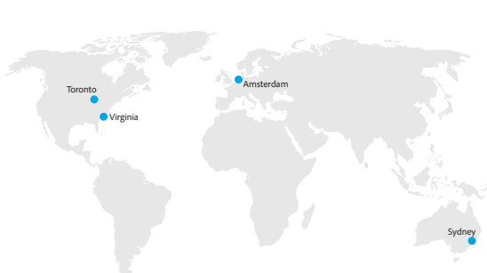

# ubicaciones de alojamiento de Customer Journey Analytics

Adobe Customer Journey Analytics está alojado en centros de datos empresariales de proveedores de servicios de nube pública de Norteamérica (Virginia, Ontario, Canadá), Europa (Países Bajos) y APAC (Australia).

Una vez aprovisionados, los clientes designan la región en la que residirán sus datos de Adobe Experience Platform. Los datos introducidos en CJA desde el lago de datos de Experience Platform se almacenarán en la misma región.

