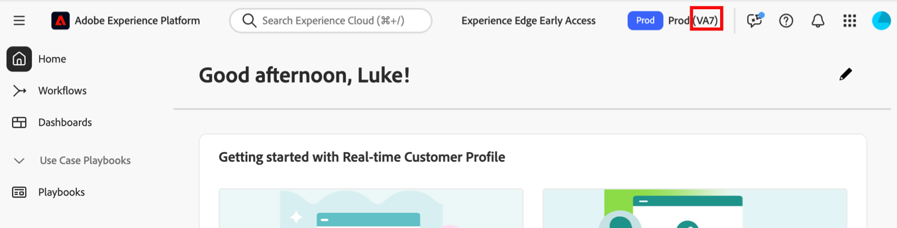

# Ubicaciones de alojamiento de Customer Journey Analytics

Adobe Customer Journey Analytics está alojado en centros de datos de clase empresarial de proveedores de servicios de nube pública de Norteamérica, Europa y APAC.

Una vez aprovisionados, los clientes designan la región en la que residirán sus datos de Adobe Experience Platform. Los datos introducidos en Customer Journey Analytics desde el lago de datos de Adobe Experience Platform se almacenarán en la misma región.

Consulte [Recopilación de datos regionales](https://experienceleague.adobe.com/es/docs/core-services/interface/data-collection/rdc) en la documentación de Adobe Experience Cloud para obtener más información.

## Ver el centro de datos donde se almacenan los datos

>[!NOTE]
>
>No es posible mover datos de un centro de datos a otro.

Para ver en qué centro de datos se almacenan los datos:

1. Inicia sesión en [Adobe Experience Cloud](https://experience.adobe.com).

1. Seleccione **[!UICONTROL Experience Platform]** del conmutador de aplicaciones  en la parte superior derecha de la interfaz.

1. El código de región del centro de datos asignado se muestra en la parte superior derecha de Experience Platform.

   

1. Utilice la siguiente tabla para comprender a qué área geográfica está asociado el código de región:

   | Código de región Adobe | Proveedor de nube | Región geográfica |
   |-------------------|-------|-------------------------------------------|
   | VA7 | Azure | EE.UU. (predeterminado) |
   | VA6 | AWS | EE. UU. (bajo petición) |
   | NLD2 | Azure | Países Bajos, Ámsterdam |
   | CAN2 | Azure | Canadá Central, Toronto |
   | AUS5 | Azure | Australia, Sídney |
   | GBR9 | Azure | Reino Unido, Londres |
   | IND2 | Azure | India |
   | CHE2 | Azure | Suiza |

