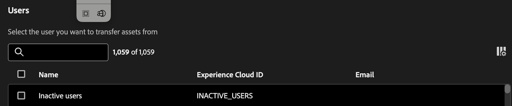

# Transferir recursos

La herramienta de transferencia de recursos permite transferir la propiedad de los recursos a otros usuarios. Assets puede incluir componentes como proyectos, segmentos, intervalos de fechas, métricas calculadas, anotaciones, alertas y proyectos programados.

Assets suelen estar vinculados a un propietario individual y, en algunos casos, como los segmentos y las métricas calculadas, los administradores no pueden editarlos ni compartirlos. Cuando los usuarios abandonan la organización o se modifica su función, puede ser necesario transferir la propiedad de estos activos a otros usuarios para garantizar la continuidad y el acceso adecuado.

## Permisos

La transferencia de recursos requiere el permiso de administrador de productos para Customer Journey Analytics.

## Transferir recursos

1. En CJA, vaya a **[!UICONTROL Herramientas]** > **[!UICONTROL Transferencia de recursos]**.

   

1. En el cuadro de diálogo **[!UICONTROL Usuarios]**, busque y seleccione el usuario desde el que desea transferir recursos.

   >[!IMPORTANT]
   >
   >Solo puede realizar una transferencia individual, de un usuario a otro. No se admiten transferencias &quot;uno a varios&quot; o &quot;varios a uno&quot;.

1. Después de seleccionar un usuario, la opción Transferir recursos aparece en la parte inferior de la pantalla.

   

1. Haga clic en **[!UICONTROL Transferir recursos]**.

1. En la pantalla **[!UICONTROL Transferir recursos]**, seleccione primero el destinatario al que desea transferir los recursos.

1. Ahora, revise las carpetas de cada componente en la navegación izquierda para seleccionar componentes individuales o todos los recursos de una carpeta que desea transferir.

   >[!NOTE]
   >
   >La transferencia de recursos de un administrador a un no administrador no actualiza el destinatario a un administrador.

   >[!NOTE]
   >
   >    Al transferir recursos que hacen referencia a otros componentes (por ejemplo, proyectos que hacen referencia a otros segmentos y métricas calculadas), los componentes que no sean propiedad del propietario actual del proyecto solo se compartirán con el destinatario. La propiedad de todos los demás componentes se transferirá al destinatario.

1. Para seleccionar _todos_ los recursos de una carpeta, marque la casilla junto a **[!UICONTROL Nombre]** en la parte superior de la tabla.

   

1. Haga clic en **[!UICONTROL Transferir]** en la parte superior derecha después de haber realizado todas las selecciones.

1. Haga clic en **[!UICONTROL Confirmar]** cuando aparezca el mensaje de confirmación.

   >[!IMPORTANT]
   >
   >No cierre la pantalla durante la transferencia para evitar el aborto del proceso. Esto garantiza una experiencia de transferencia sin problemas.

## Transferir resultados

Hay tres posibles resultados para una transferencia:

- **Éxito de transferencia**: &quot;Assets se transfirió correctamente&quot;.

- **Éxito parcial**: &quot;Algunos recursos se transfirieron correctamente&quot;.

- **Error de transferencia**: &quot;No se pudieron transferir los recursos. Inténtelo de nuevo&quot;.

### Posibles causas de un error de transferencia de recursos

- Servicios dependientes que producen errores: la transferencia de recursos interactúa con un servicio diferente para cada tipo de componente (por ejemplo, problemas de red, problemas de servicio descendente), por lo que podría provocar un error parcial o completo o errores intermitentes.

- Componente que falta o transferido por otro administrador: un componente fue eliminado por otro usuario o transferido por otro administrador a otra persona mientras el trabajo de transferencia de recursos aún estaba en curso.

- El cuerpo de la API POST no se rellena correctamente: es posible que un componente no se envíe en el cuerpo de la API POST cuando se seleccionan varios tipos de componentes.

- El usuario no existe: el usuario se eliminó a mitad de la transferencia o no es válido por otro motivo. Si el usuario no es válido antes de que se inicie la transferencia, la herramienta lo detectará y no procesará el trabajo. Si el usuario se eliminaba a mitad de la transferencia, esto podría provocar errores parciales.

- Error de conexión/red: la conexión termina a mitad de la transferencia. Cualquier lote de trabajos de transferencia que ya se haya transmitido al servidor seguirá procesándose hasta su finalización, pero el usuario no verá el mensaje de resultado de la transferencia con un resumen de lo que ha tenido éxito y lo que ha fallado.

- La pestaña del explorador se cerró a mitad de la transferencia: en el caso de transferencias muy grandes, si la pestaña del explorador está cerrada o se sale de la página a mitad de la transferencia, solo las solicitudes de red realizadas antes de que se cierre la pestaña o se navegue por la página transferirán los recursos correctamente. Si el usuario vuelve a la página, no recibirá el mensaje de estado de respuesta que indica qué recursos se transfirieron y cuáles no.

## Transferencia de recursos durante la actualización de Adobe Analytics a Customer Journey Analytics

Uno de los principales casos de uso de la transferencia de recursos es durante la actualización de Adobe Analytics a Customer Journey Analytics.

La característica [Migración de componentes](https://experienceleague.adobe.com/es/docs/analytics/admin/admin-tools/component-migration/component-migration) de Adobe Analytics le permite migrar proyectos de propiedad del administrador a otros administradores. Todos los componentes que componen estos proyectos se vuelven a crear en Customer Journey Analytics y el administrador de destinatarios es propietario de todos esos componentes, independientemente de quién los haya creado.

Posteriormente, esta herramienta de transferencia de recursos permite a los administradores reasignar componentes a sus propietarios legítimos, tanto si son administradores como si no.

>[!IMPORTANT]
>
>Aunque puede transferir componentes con esta herramienta, usted como administrador debe asegurarse de que el destinatario tenga acceso a las vistas de datos necesarias para ver o utilizar estos componentes. Puede ver y asignar permisos en [Admin Console](https://helpx.adobe.com/es/enterprise/using/admin-console.html).

## Exportar a CSV

La opción **[!UICONTROL Exportar a CSV]** solo permite a los administradores descargar una lista de usuarios mostrados en un archivo .csv. No les permite exportar una lista de recursos transferidos a un archivo .csv.

## Usuarios inactivos

Todos los usuarios eliminados anteriormente aparecen en la entrada &quot;Usuarios inactivos&quot;, junto con todos sus componentes huérfanos. Estos componentes se pueden transferir a un nuevo destinatario. Esta función estará disponible en enero.

Se muestran 

